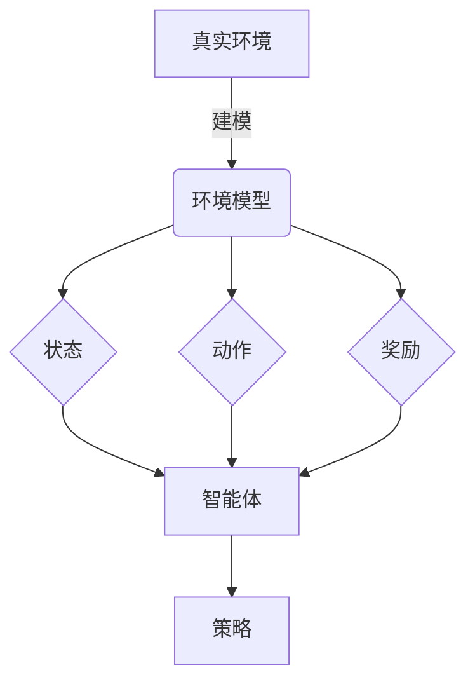
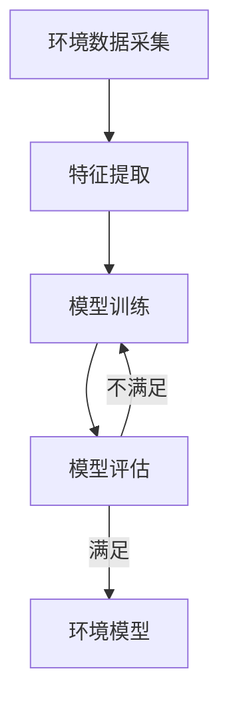

好的,我会按照您的要求,以"强化学习Reinforcement Learning环境建模与仿真技术探讨"为主题,撰写一篇专业的技术博客文章。文章将遵循您提供的约束条件和内容结构,确保逻辑清晰、内容深入、实例详细,并给出核心概念原理和算法流程的Mermaid流程图。现在,让我们正式开始:

# 强化学习Reinforcement Learning环境建模与仿真技术探讨

## 1. 背景介绍

### 1.1 问题的由来

在人工智能领域,强化学习(Reinforcement Learning,RL)作为一种重要的机器学习范式,近年来受到了广泛关注和研究。与监督学习和无监督学习不同,强化学习的目标是让智能体(Agent)通过与环境(Environment)的交互,自主学习如何在特定环境中获取最大化的长期回报。

然而,在实际应用中,构建真实环境并让智能体与之交互往往是一个巨大的挑战。真实环境通常是复杂的、动态的、存在不确定性,并且可能涉及高昂的成本和安全风险。因此,如何高效、准确地对环境进行建模和仿真,成为了强化学习研究的一个关键问题。

### 1.2 研究现状  

目前,已有多种环境建模和仿真方法应用于强化学习,包括基于规则的模型、基于数据的模型、基于物理的模型等。其中,基于物理的模型通过模拟真实世界的物理定律,能够生成高度真实的环境数据,被广泛应用于机器人控制、自动驾驶等领域。但这类模型的建立和计算通常比较复杂,对计算资源的需求也较高。

另一方面,基于数据的模型则利用真实环境中收集的大量数据,通过机器学习算法对环境进行建模。这种方法的优点是可以捕捉环境的复杂性,但需要大量的真实数据作为支撑,并且模型的泛化能力可能受到限制。

### 1.3 研究意义

高质量的环境建模和仿真技术,对于强化学习算法的研究和应用都具有重要意义:

1. 降低真实环境交互的成本和风险
2. 提高训练效率,加速算法收敛
3. 支持算法的可解释性和可调试性
4. 促进强化学习在更多领域的应用

因此,探索高效、准确的环境建模与仿真方法,将为强化学习的发展提供有力支撑。

### 1.4 本文结构

本文将全面探讨强化学习环境建模与仿真的相关技术,包括:

1. 核心概念与联系
2. 核心算法原理与具体步骤  
3. 数学模型与公式推导
4. 实际代码实现与案例分析
5. 应用场景与未来趋势
6. 常见问题解答

接下来,我们将逐一深入探讨上述内容。

## 2. 核心概念与联系

在深入环境建模与仿真技术之前,我们先回顾一下强化学习的核心概念,并探讨它们与环境建模的内在联系。

强化学习可以形式化为一个马尔可夫决策过程(Markov Decision Process, MDP),由以下几个核心要素组成:

- **环境(Environment)**: 智能体所处的外部世界,通常被建模为一个马尔可夫过程。
- **状态(State)**: 描述环境当前的具体情况。
- **动作(Action)**: 智能体可以在当前状态下采取的行为选择。
- **奖励(Reward)**: 环境给予智能体的反馈信号,指导智能体朝着正确方向学习。
- **策略(Policy)**: 智能体在每个状态下选择行为的策略,是强化学习算法需要学习优化的目标。

环境建模与仿真的目的,就是要构建一个与真实环境足够接近的虚拟环境模型,使得智能体可以在其中与环境交互,获取状态、执行动作并收集奖励信号,从而学习出一个优秀的策略。

环境模型的质量对强化学习算法的性能有着重大影响。一个高质量的环境模型应当具备以下特性:

- **真实性(Realism)**: 能够很好地模拟真实环境的物理规律和动态变化。
- **高效性(Efficiency)**: 具有较高的计算效率,支持大规模并行模拟。
- **可配置性(Configurability)**: 允许灵活配置各种环境参数和场景。
- **可解释性(Interpretability)**: 模型内部状态和机理对人类可解释。

接下来,我们将介绍构建高质量环境模型的核心算法原理和数学基础。

## 3. 核心算法原理与具体操作步骤

### 3.1 算法原理概述

构建强化学习环境模型的核心算法思路,可以概括为以下几个关键步骤:

1. **环境数据采集**: 从真实环境中收集状态、动作、奖励等相关数据。
2. **特征提取**: 从原始数据中提取对环境建模有意义的特征。
3. **模型训练**: 使用机器学习算法(如深度神经网络)对环境模型进行训练。
4. **模型评估**: 在保留的测试数据集上评估模型的准确性和泛化能力。
5. **模型优化**: 根据评估结果对模型进行优化,重复训练直至满足要求。

该算法流程可以用下面的Mermaid流程图直观展示:

在上述流程中,数据采集、特征工程和模型训练是环节是最为关键的。我们将在后续章节中详细阐述相关的算法细节和数学原理。

### 3.2 算法步骤详解  

#### 3.2.1 环境数据采集

高质量的环境数据是训练准确模型的基础。数据采集可以通过以下几种方式:

1. **真实环境交互**:让智能体与真实环境交互,记录状态、动作、奖励等数据。这种方式可以获取最真实的数据,但成本较高,存在一定风险。

2. **仿真环境交互**:构建一个简化的仿真环境模型,让智能体在其中交互采集数据。这种方式成本较低,但模型质量有限。

3. **数据增强**:通过对已有数据进行变换(如噪声添加、数据增广等)来扩充数据集。

4. **领域专家标注**:邀请领域专家人工标注环境数据,以弥补自动采集的不足。

在实践中,通常需要综合运用上述多种方式,获取足够多样化的高质量数据。

#### 3.2.2 特征提取

从原始环境数据中提取对建模任务有意义的特征,是提高模型质量的关键步骤。常用的特征提取方法包括:

1. **手工特征工程**:根据领域知识,人工设计和选择特征。
2. **自动特征学习**:使用深度学习模型(如自编码器)自动从数据中学习特征表示。
3. **特征选择**:从海量候选特征中选择出对建模任务最有意义的一部分特征。

特征提取的好坏直接影响了模型的表现,需要结合具体问题的特点选择合适的方法。

#### 3.2.3 模型训练

环境模型的训练可以建立在各种机器学习模型之上,如高斯过程、决策树、支持向量机等传统模型,也可以使用深度神经网络等新兴模型。

以深度神经网络为例,常用的网络结构包括:

- **前馈神经网络(FNN)**: 对于简单的建模任务,FNN可以作为基线模型。
- **循环神经网络(RNN)**: 对于需要建模时序数据的任务,RNN是一种有效选择。
- **卷积神经网络(CNN)**: 如果环境数据包含图像等结构化数据,CNN可以提取有用的特征。
- **生成对抗网络(GAN)**: GAN可用于生成逼真的模拟环境数据,增强模型的泛化能力。

模型训练的目标是最小化模型在训练数据上的损失函数(如均方误差),并防止过拟合。常用的训练技术包括正则化、dropout、数据增广等。

#### 3.2.4 模型评估

模型评估的目的是检验模型在未见过的测试数据上的泛化能力,并发现模型的优缺点。常用的评估指标包括:

- **数据分布一致性**: 测试模型生成的数据与真实数据的统计分布是否一致。
- **奖励模拟精度**: 模型生成的奖励信号与真实奖励的偏差。
- **动态模拟精度**: 模型模拟的状态转移轨迹与真实轨迹的偏差。
- **计算效率**: 模型的计算效率是否满足实时性要求。

根据评估结果,我们可以发现模型的不足,并针对性地对模型进行优化,如架构调整、损失函数改进、超参数调整等。

### 3.3 算法优缺点

上述环境建模算法的主要优点包括:

- 通用性强,可应用于各种环境建模任务。
- 利用机器学习技术自动从数据中提取特征,减轻人工工作。
- 模型可以持续优化,以获得更高的精度和泛化能力。

但同时也存在一些缺点和挑战:

- 需要大量高质量的环境数据作为支撑,数据采集成本较高。
- 模型训练过程计算开销大,对硬件资源要求较高。
- 生成的模型是一个黑盒,可解释性较差。
- 难以对模型的泛化能力做理论保证。

### 3.4 算法应用领域

基于机器学习的环境建模与仿真技术在诸多领域都有广泛应用,包括但不限于:

- **机器人控制**: 通过模拟各种环境,训练机器人在复杂场景下的控制策略。
- **自动驾驶**: 构建高精度的道路和交通环境模型,用于测试自动驾驶算法。
- **智能制造**: 模拟工厂车间环境,优化生产流程和调度策略。
- **金融分析**: 对金融市场的复杂动态进行建模和模拟,支持量化投资决策。
- **医疗健康**: 模拟人体生理环境,用于药物分子设计和临床试验。
- **智能游戏**: 构建逼真的游戏环境,提升游戏AI的表现。

## 4. 数学模型和公式详细讲解与举例说明

在上一节中,我们介绍了环境建模算法的原理和步骤。本节将重点阐述算法中使用的数学模型和公式,并结合具体案例进行讲解。

### 4.1 数学模型构建

#### 4.1.1 马尔可夫决策过程(MDP)

强化学习环境通常被建模为一个马尔可夫决策过程(MDP),它是一个离散时间的随机控制过程,由以下要素组成:

- 状态集合 $\mathcal{S}$
- 动作集合 $\mathcal{A}$  
- 转移概率 $\mathcal{P}_{ss'}^a = \mathbb{P}(s_{t+1}=s'|s_t=s, a_t=a)$
- 奖励函数 $\mathcal{R}_s^a = \mathbb{E}[r_{t+1}|s_t=s, a_t=a]$
- 折扣因子 $\gamma \in [0, 1)$

其中,状态转移概率 $\mathcal{P}_{ss'}^a$ 表示在状态 $s$ 下执行动作 $a$ 后,转移到状态 $s'$ 的概率。奖励函数 $\mathcal{R}_s^a$ 表示在状态 $s$ 下执行动作 $a$ 后获得的期望奖励。折扣因子 $\gamma$ 用于权衡即时奖励和长期奖励的重要性。

在MDP中,智能体