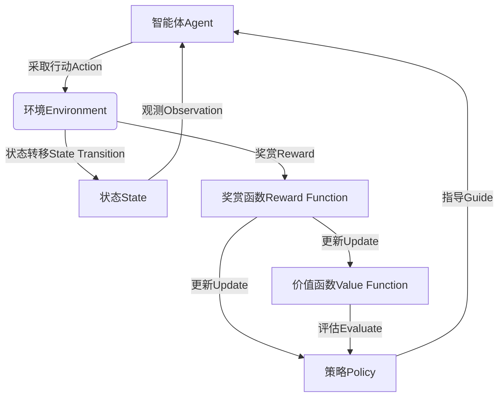

# 强化学习Reinforcement Learning算法的验证与测试

## 1. 背景介绍

### 1.1 问题的由来

在人工智能领域中,强化学习(Reinforcement Learning,RL)是一种基于奖赏或惩罚的机器学习范式,旨在让智能体(Agent)通过与环境(Environment)的交互来学习如何采取最优策略,以最大化其累积奖赏。强化学习算法已被广泛应用于机器人控制、游戏AI、自动驾驶、智能调度等诸多领域。然而,由于强化学习系统的复杂性和不确定性,对其算法进行验证和测试是一项具有挑战性的任务。

### 1.2 研究现状  

目前,强化学习算法的验证和测试主要集中在以下几个方面:

1. **模拟环境测试**: 通过构建模拟环境来评估算法性能,例如使用OpenAI Gym等标准化测试环境。
2. **案例研究**: 在特定应用场景下,对算法进行实证性的案例研究和分析。
3. **形式化验证**: 使用数学证明和形式化方法来验证算法的正确性和收敛性。
4. **测试工具**: 开发专门的测试框架和工具来自动化测试过程。

然而,由于强化学习系统的复杂性和不确定性,现有的验证和测试方法仍然存在一些局限性,例如难以涵盖所有可能的情况、测试成本高昂、缺乏标准化的测试框架等。

### 1.3 研究意义

对强化学习算法进行有效的验证和测试,对于确保算法的可靠性、安全性和可解释性至关重要。这不仅有助于提高算法的性能和鲁棒性,还能够增强人们对算法的信任度,促进其在关键应用领域的部署和应用。此外,系统化的验证和测试方法也将有助于算法的优化和改进,推动强化学习理论和实践的发展。

### 1.4 本文结构

本文将全面探讨强化学习算法的验证与测试方法。首先介绍强化学习的核心概念和算法原理,然后详细阐述验证和测试的关键步骤、数学模型和公式推导。接下来,通过实际项目案例和代码实现,展示如何进行算法验证和测试。最后,总结当前的挑战和未来的发展趋势,并提供相关资源推荐。

## 2. 核心概念与联系

强化学习是一种基于奖赏或惩罚的机器学习范式,其核心概念包括:

1. **智能体(Agent)**: 在环境中采取行动并获得奖赏或惩罚的主体。
2. **环境(Environment)**: 智能体所处的状态空间,包括状态转移和奖赏函数。
3. **状态(State)**: 描述环境当前状态的一组观测值。
4. **行动(Action)**: 智能体在当前状态下可采取的操作。
5. **奖赏(Reward)**: 智能体采取行动后,环境给予的正面或负面反馈。
6. **策略(Policy)**: 智能体在每个状态下选择行动的规则或概率分布。
7. **价值函数(Value Function)**: 评估状态或状态-行动对的长期累积奖赏。
8. **Q-函数(Q-Function)**: 评估在特定状态下采取特定行动的长期累积奖赏。

这些概念之间存在着密切的联系,构成了强化学习的基本框架。智能体通过与环境交互,根据获得的奖赏更新策略和价值函数,最终学习到最优策略。



## 3. 核心算法原理 & 具体操作步骤

### 3.1 算法原理概述

强化学习算法的核心思想是通过试错和奖惩机制,让智能体逐步优化其策略,以获得最大化的长期累积奖赏。主要算法包括:

1. **价值迭代(Value Iteration)**: 基于贝尔曼方程,通过迭代更新状态价值函数,从而得到最优策略。
2. **策略迭代(Policy Iteration)**: 交替执行策略评估和策略改进,直至收敛到最优策略。
3. **Q-Learning**: 基于时序差分(Temporal Difference,TD)学习,直接学习Q-函数,无需模型即可找到最优策略。
4. **深度Q网络(Deep Q-Network,DQN)**: 将Q-Learning与深度神经网络相结合,处理高维观测空间。
5. **策略梯度(Policy Gradient)**: 通过梯度上升,直接优化策略函数的参数,适用于连续动作空间。

### 3.2 算法步骤详解

以Q-Learning算法为例,其核心步骤如下:

1. 初始化Q-函数,通常使用随机值或常数值。
2. 对于每个时间步:
    a. 根据当前状态$s_t$和Q-函数,选择行动$a_t$。
    b. 执行选择的行动,观测下一状态$s_{t+1}$和奖赏$r_{t+1}$。
    c. 更新Q-函数:
$$Q(s_t,a_t) \leftarrow Q(s_t,a_t) + \alpha \left[ r_{t+1} + \gamma \max_a Q(s_{t+1},a) - Q(s_t,a_t) \right]$$
其中,$\alpha$是学习率,$\gamma$是折现因子。

3. 重复步骤2,直至Q-函数收敛。

在实际应用中,通常采用$\epsilon$-贪婪策略进行行动选择,以实现探索和利用的平衡。此外,还可以引入经验回放(Experience Replay)和目标网络(Target Network)等技术来提高算法的稳定性和收敛速度。

### 3.3 算法优缺点

Q-Learning算法的优点包括:

- 无需事先了解环境的转移概率模型,可以通过在线学习获取最优策略。
- 算法相对简单,易于实现和理解。
- 具有较强的收敛性和鲁棒性。

缺点包括:

- 在高维状态空间和连续动作空间中,Q-函数的表示和更新会变得非常困难。
- 存在过度估计(Overestimation)问题,可能导致不稳定性和发散。
- 对于部分环境,收敛速度较慢。

### 3.4 算法应用领域

强化学习算法已被广泛应用于多个领域,包括但不限于:

- **机器人控制**: 训练机器人完成各种任务,如机械臂控制、移动机器人导航等。
- **游戏AI**: 训练智能体在各种游戏环境中学习最优策略,如国际象棋、围棋、视频游戏等。
- **自动驾驶**: 训练自动驾驶系统在复杂的交通环境中安全行驶。
- **智能调度**: 优化资源调度和决策,如网络流量控制、能源管理等。
- **自然语言处理**: 对话系统、机器翻译等任务。
- **推荐系统**: 根据用户行为学习最优推荐策略。

## 4. 数学模型和公式 & 详细讲解 & 举例说明

### 4.1 数学模型构建

强化学习问题通常被建模为马尔可夫决策过程(Markov Decision Process,MDP),由一个五元组$\langle \mathcal{S}, \mathcal{A}, \mathcal{P}, \mathcal{R}, \gamma \rangle$表示:

- $\mathcal{S}$是状态集合,表示环境的所有可能状态。
- $\mathcal{A}$是行动集合,表示智能体在每个状态下可采取的行动。
- $\mathcal{P}$是状态转移概率函数,定义为$\mathcal{P}_{ss'}^a = \mathbb{P}[S_{t+1}=s'|S_t=s,A_t=a]$,表示在状态$s$下采取行动$a$后,转移到状态$s'$的概率。
- $\mathcal{R}$是奖赏函数,定义为$\mathcal{R}_s^a = \mathbb{E}[R_{t+1}|S_t=s,A_t=a]$,表示在状态$s$下采取行动$a$后,期望获得的即时奖赏。
- $\gamma \in [0,1)$是折现因子,用于权衡即时奖赏和未来奖赏的重要性。

目标是找到一个策略$\pi: \mathcal{S} \rightarrow \mathcal{A}$,使得在该策略下,智能体能获得最大化的期望累积折现奖赏:

$$J(\pi) = \mathbb{E}_\pi \left[ \sum_{t=0}^\infty \gamma^t R_{t+1} \right]$$

其中,$\mathbb{E}_\pi$表示在策略$\pi$下的期望值。

### 4.2 公式推导过程

在Q-Learning算法中,我们定义Q-函数$Q^\pi(s,a)$为在状态$s$下采取行动$a$,之后遵循策略$\pi$所能获得的期望累积折现奖赏:

$$Q^\pi(s,a) = \mathbb{E}_\pi \left[ \sum_{k=0}^\infty \gamma^k R_{t+k+1} | S_t=s, A_t=a \right]$$

根据贝尔曼方程,Q-函数满足以下递推关系:

$$Q^\pi(s,a) = \mathcal{R}_s^a + \gamma \sum_{s' \in \mathcal{S}} \mathcal{P}_{ss'}^a \sum_{a' \in \mathcal{A}} \pi(a'|s')Q^\pi(s',a')$$

其中,$\pi(a'|s')$表示在状态$s'$下选择行动$a'$的概率。

我们定义最优Q-函数为:

$$Q^*(s,a) = \max_\pi Q^\pi(s,a)$$

对应的最优策略$\pi^*$满足:

$$\pi^*(s) = \arg\max_a Q^*(s,a)$$

通过一系列数学推导,可以得到Q-Learning算法的更新规则:

$$Q(s_t,a_t) \leftarrow Q(s_t,a_t) + \alpha \left[ r_{t+1} + \gamma \max_a Q(s_{t+1},a) - Q(s_t,a_t) \right]$$

其中,$\alpha$是学习率,用于控制更新步长。

### 4.3 案例分析与讲解

考虑一个简单的网格世界(Gridworld)环境,智能体需要从起点移动到终点。每个格子可能存在障碍物或陷阱,智能体需要学习如何避开它们,并找到最短路径到达终点。

我们可以使用Q-Learning算法来训练智能体。首先,定义状态$s$为智能体在网格中的位置,行动$a$为上下左右四个方向的移动。奖赏函数$\mathcal{R}$设置为:到达终点获得+1的奖赏,陷入陷阱获得-1的惩罚,其他情况奖赏为0。

在训练过程中,智能体会不断探索网格世界,根据获得的奖赏更新Q-函数。随着时间推移,Q-函数会逐渐收敛,智能体就能够学习到从起点到终点的最优路径。

我们可以通过可视化Q-函数的变化过程,直观地观察智能体的学习过程。下图展示了在一个简单的4x4网格世界中,Q-函数在不同训练步骤下的变化情况:

```mermaid
graph TD
    subgraph "Step 0"
    s0_0(0.0)
    s0_1(0.0)
    s0_2(0.0)
    s0_3(0.0)
    s0_4(0.0)
    s0_5(0.0)
    s0_6(0.0)
    s0_7(0.0)
    s0_8(0.0)
    s0_9(0.0)
    s0_10(0.0)
    s0_11(0.0)
    s0_12(0.0)
    s0_13(0.0)
    s0_14(0.0)
    s0_15(0.0)
    end

    subgraph "Step 100"
    s100_0(0.1)
    s100_1(0.2)
    s100_2(0.3)
    s100_3(0.4)
    s100_4(