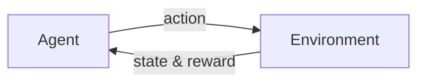

# 强化学习：从经典强化学习理解强化学习

关键词：强化学习、马尔可夫决策过程、动态规划、时间差分学习、蒙特卡洛方法、深度强化学习

## 1. 背景介绍
### 1.1  问题的由来
强化学习(Reinforcement Learning, RL)是人工智能领域的一个重要分支,它研究如何让智能体(agent)通过与环境的交互来学习最优策略,以获得最大的累积奖励。与监督学习和非监督学习不同,强化学习不需要预先准备好标注数据,而是通过探索与利用(exploration and exploitation)的平衡,不断试错和优化,逐步找到最优策略。

强化学习的思想最早可以追溯到20世纪50年代,当时心理学家斯金纳提出了操作性条件反射理论,认为生物体的行为是由环境中的刺激和反馈所塑造的。后来,贝尔曼提出了动态规划的思想,为强化学习的发展奠定了重要的数学基础。

### 1.2  研究现状
近年来,随着深度学习的兴起,深度强化学习(Deep Reinforcement Learning, DRL)取得了长足的进展。2013年,DeepMind公司的研究人员提出了深度Q网络(Deep Q-Network, DQN),成功地将深度学习与Q学习结合,在Atari游戏中达到了超越人类的水平。此后,各种DRL算法如雨后春笋般涌现,如DDPG、A3C、PPO、SAC等,极大地推动了强化学习的发展。

如今,强化学习已经在许多领域得到了广泛应用,如游戏AI、机器人控制、自动驾驶、推荐系统、智能电网等。谷歌DeepMind、OpenAI、百度、腾讯等科技巨头和学术机构都在大力投入强化学习的研究。可以预见,未来强化学习将在人工智能的发展中扮演越来越重要的角色。

### 1.3  研究意义
强化学习之所以受到广泛关注,是因为它为智能体的自主学习和决策提供了一种通用的框架。传统的机器学习方法大多需要人工准备大量标注数据,而现实世界中很多问题是很难获得标注数据的。强化学习能够让智能体直接与环境交互,从反馈中学习,因此更接近人类和动物的学习方式,具有更广阔的应用前景。

此外,强化学习理论与心理学、神经科学等学科有着密切的联系,对于理解人脑的学习和决策机制也有重要意义。一些研究表明,人脑中的多巴胺能神经元可能起到了类似强化学习中奖励信号的作用。

### 1.4  本文结构
本文将从经典强化学习入手,系统地介绍强化学习的基本概念、核心算法、数学模型,以及代码实践。全文分为以下几个部分：

- 第2部分介绍强化学习的核心概念,包括智能体、环境、状态、动作、策略、奖励等,以及它们之间的关系。
- 第3部分介绍几种经典的强化学习算法,包括动态规划、蒙特卡洛方法、时间差分学习等,并分析它们的原理和优缺点。
- 第4部分介绍强化学习的数学模型——马尔可夫决策过程(Markov Decision Process, MDP),推导贝尔曼方程,并举例说明。
- 第5部分通过一个简单的迷宫问题,演示如何用Python实现几种经典的表格型强化学习算法。
- 第6部分讨论强化学习的一些实际应用场景,展望未来的发展方向。
- 第7部分推荐一些学习强化学习的资源,包括教材、课程、论文、开源项目等。
- 第8部分总结全文,讨论强化学习未来的机遇与挑战。

## 2. 核心概念与联系

强化学习中有几个核心概念：智能体(agent)、环境(environment)、状态(state)、动作(action)、策略(policy)和奖励(reward)。

- 智能体：强化学习的主体,根据观察到的状态采取动作,通过与环境的交互来学习最优策略。
- 环境：智能体所处的世界,接收智能体的动作,并反馈新的状态和奖励。
- 状态：环境在某个时刻的表征,是智能体做出决策的依据。马尔可夫性是指下一个状态只取决于当前状态和动作。
- 动作：智能体根据策略在某个状态下采取的行为,会影响到下一个状态和奖励。 
- 策略：将状态映射为动作的函数,决定了智能体的行为模式。最优策略能获得最大的期望累积奖励。
- 奖励：环境对智能体动作的即时反馈,引导智能体学习最优策略。累积奖励是优化的目标。

下图展示了强化学习中智能体与环境交互的示意图：



强化学习的目标就是找到一个最优策略 $\pi^*$,使得从任意状态 $s$ 出发,采取该策略能获得最大的期望累积奖励：

$$\pi^* = \arg\max_{\pi} \mathbb{E}_{\pi}[\sum_{t=0}^{\infty} \gamma^t r_t | s_0=s] $$

其中 $\gamma \in [0,1]$ 是折扣因子,用于平衡即时奖励和长期奖励。

## 3. 核心算法原理 & 具体操作步骤

强化学习有三大类经典算法：动态规划(Dynamic Programming)、蒙特卡洛方法(Monte Carlo Methods)和时间差分学习(Temporal Difference Learning)。

### 3.1  算法原理概述

- 动态规划：基于MDP模型,通过迭代贝尔曼方程来计算最优价值函数和最优策略,包括策略迭代和价值迭代两种方法。
- 蒙特卡洛方法：通过采样完整的状态-动作序列来估计价值函数,然后基于价值函数改进策略,不需要MDP模型。
- 时间差分学习：结合了动态规划和蒙特卡洛方法的思想,通过bootstrap的方式更新价值函数,常见的算法有Sarsa、Q-learning等。

### 3.2  算法步骤详解

以Q-learning为例,其算法步骤如下：

1. 初始化Q表 $Q(s,a)$,对所有状态-动作对赋予初始值(通常为0)。
2. 重复以下步骤直到收敛或达到最大训练轮数：
   1) 根据 $\epsilon$-greedy 策略选择动作 $a_t$,即以 $\epsilon$ 的概率随机选择动作,否则选择 $Q(s_t,a)$ 最大的动作。
   2) 执行动作 $a_t$,观察奖励 $r_{t+1}$ 和下一个状态 $s_{t+1}$。 
   3) 更新Q表：
      $$Q(s_t,a_t) \leftarrow Q(s_t,a_t) + \alpha [r_{t+1} + \gamma \max_a Q(s_{t+1},a) - Q(s_t,a_t)]$$
      其中 $\alpha \in (0,1]$ 是学习率, $\gamma \in [0,1]$ 是折扣因子。
   4) $s_t \leftarrow s_{t+1}$
3. 输出最优策略 $\pi^*(s) = \arg\max_a Q(s,a)$。

### 3.3  算法优缺点

- 动态规划：
  - 优点：在MDP已知的情况下能够计算出最优策略,且收敛性有理论保证。
  - 缺点：需要知道完整的MDP模型,状态和动作空间过大时计算代价高。
- 蒙特卡洛方法：
  - 优点：不需要MDP模型,通过采样序列来估计价值函数,容易实现。
  - 缺点：方差较大,需要完整的序列,只适用于情节式任务。
- 时间差分学习：
  - 优点：在线学习,可以从不完整序列中bootstrap,效率较高。
  - 缺点：可能不会收敛到最优策略,对步长、探索率等参数敏感。

### 3.4  算法应用领域

- 动态规划：背景板问题、资源分配问题等。
- 蒙特卡洛方法：棋类游戏、机器人控制等。
- 时间差分学习：多臂老虎机问题、Atari游戏、自动驾驶等。

## 4. 数学模型和公式 & 详细讲解 & 举例说明

强化学习的理论基础是马尔可夫决策过程(Markov Decision Process, MDP)。MDP由一个五元组 $\langle \mathcal{S}, \mathcal{A}, \mathcal{P}, \mathcal{R}, \gamma \rangle$ 定义：

- $\mathcal{S}$ 是有限的状态集合。
- $\mathcal{A}$ 是有限的动作集合。
- $\mathcal{P}$ 是状态转移概率矩阵,其中 $\mathcal{P}_{ss'}^a = P[S_{t+1}=s'|S_t=s, A_t=a]$ 表示在状态 $s$ 下执行动作 $a$ 后转移到状态 $s'$ 的概率。
- $\mathcal{R}$ 是奖励函数,其中 $\mathcal{R}_s^a = \mathbb{E}[R_{t+1}|S_t=s, A_t=a]$ 表示在状态 $s$ 下执行动作 $a$ 后获得的期望即时奖励。
- $\gamma \in [0,1]$ 是折扣因子,用于平衡即时奖励和长期奖励。

### 4.1  数学模型构建

在MDP中,我们关心两个价值函数：状态价值函数 $V^{\pi}(s)$ 和动作价值函数 $Q^{\pi}(s,a)$。

状态价值函数 $V^{\pi}(s)$ 表示从状态 $s$ 开始,遵循策略 $\pi$ 能获得的期望累积奖励：

$$V^{\pi}(s) = \mathbb{E}_{\pi}[\sum_{k=0}^{\infty} \gamma^k R_{t+k+1} | S_t=s]$$

动作价值函数 $Q^{\pi}(s,a)$ 表示在状态 $s$ 下执行动作 $a$,然后遵循策略 $\pi$ 能获得的期望累积奖励：

$$Q^{\pi}(s,a) = \mathbb{E}_{\pi}[\sum_{k=0}^{\infty} \gamma^k R_{t+k+1} | S_t=s, A_t=a]$$

最优状态价值函数 $V^*(s)$ 和最优动作价值函数 $Q^*(s,a)$ 分别定义为在所有可能的策略中能达到的最大期望累积奖励：

$$V^*(s) = \max_{\pi} V^{\pi}(s)$$

$$Q^*(s,a) = \max_{\pi} Q^{\pi}(s,a)$$

### 4.2  公式推导过程

贝尔曼方程是动态规划的核心,它描述了价值函数的递归关系。对于任意策略 $\pi$,状态价值函数满足：

$$V^{\pi}(s) = \sum_{a \in \mathcal{A}} \pi(a|s) \sum_{s' \in \mathcal{S}} \mathcal{P}_{ss'}^a [R_s^a + \gamma V^{\pi}(s')]$$

动作价值函数满足：

$$Q^{\pi}(s,a) = \sum_{s' \in \mathcal{S}} \mathcal{P}_{ss'}^a [R_s^a + \gamma \sum_{a' \in \mathcal{A}} \pi(a'|s') Q^{\pi}(s',a')]$$

最优价值函数满足贝尔曼最优方程：

$$V^*(s) = \max_{a \in \mathcal{A}} \sum_{s' \in \mathcal{S}} \mathcal{P}_{ss'}^a [R_s^a + \gamma V^*(s')]$$

$$Q^*(s,a) = \sum_{s' \in \mathcal{S}} \mathcal{P}_{ss'}^a [R_s^a + \gamma \max_{a' \in \mathcal{A}} Q^*(s',a')]$$

### 4.3  案例分析与讲解

考虑一个简单的网格世界问题,如下图所示：

```
+-------+
|   |   |
+-------+
|   | G |
+-------+
```

其中 `G` 表示目标状态,执行任意动作