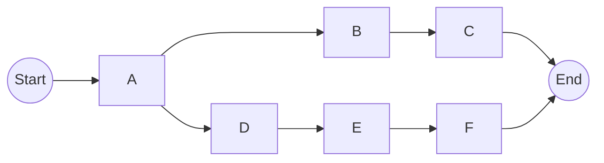

# 强化学习：优化算法的使用

## 1. 背景介绍

### 1.1 问题的由来

在当今快节奏的世界中,优化问题无处不在。无论是网络路由、资源调度、投资组合管理,还是机器人控制,都需要寻找最优解决方案。传统的优化算法虽然在特定场景下表现良好,但往往受限于问题的复杂性、动态性和不确定性。强化学习(Reinforcement Learning)作为一种全新的优化范式,凭借其模型自由、在线学习和自适应能力,为解决复杂优化问题提供了新的思路。

### 1.2 研究现状  

近年来,强化学习在优化领域取得了令人瞩目的成就。从DeepMind的AlphaGo战胜人类顶尖棋手,到OpenAI的机器人手臂展现出超乎想象的操控能力,强化学习已经深深扎根于各个领域。与此同时,新的算法不断涌现,如深度Q网络(Deep Q-Network)、策略梯度(Policy Gradient)、Actor-Critic等,极大拓展了强化学习的应用范围。

### 1.3 研究意义

强化学习为优化问题提供了一种全新的解决思路,打破了传统算法的局限性。它可以在复杂动态环境中自主学习,不断优化决策,从而获得近乎最优的解。这种自适应能力使其在资源调度、智能控制、组合优化等领域大放异彩。本文将深入探讨强化学习在优化算法中的应用,阐释其核心原理、关键算法和实践案例,为读者提供全面的理解和实践指导。

### 1.4 本文结构

本文共分为8个部分:第2部分介绍强化学习的核心概念和与其他机器学习范式的联系;第3部分详细阐述强化学习优化算法的原理和具体步骤;第4部分构建数学模型并推导公式,并通过案例分析加深理解;第5部分提供代码实例并解读关键实现;第6部分探讨强化学习在实际场景中的应用;第7部分推荐相关工具和学习资源;第8部分总结研究成果并展望未来发展趋势和挑战。

## 2. 核心概念与联系

强化学习是一种基于环境交互的机器学习范式,旨在通过试错和奖惩机制,学习获取最大累积奖励的策略。其核心要素包括:

1. **环境(Environment)**: 代理与之交互的外部世界,描述了系统的当前状态。

2. **状态(State)**: 环境的instantaneous表示,包含代理所需的全部信息。

3. **动作(Action)**: 代理在当前状态下可执行的操作。

4. **奖励(Reward)**: 环境对代理动作的反馈,指导代理朝着正确方向优化。

5. **策略(Policy)**: 代理在各状态下选择动作的规则或函数映射。

6. **价值函数(Value Function)**: 评估某一状态或状态-动作对的长期累积奖励。

强化学习与监督学习和无监督学习有着明显区别:

- 监督学习关注从标记数据中学习映射函数,而强化学习则是通过与环境的交互来学习。

- 无监督学习旨在从未标记数据中发现潜在模式,而强化学习则是为了获取最优策略以最大化长期奖励。

- 强化学习的反馈是延迟的、稀疏的、评分较低的奖励信号,而非准确的监督信号。

尽管如此,强化学习也与其他机器学习范式存在一些联系:

- 价值函数的估计可视为一个监督学习问题,即从(状态,奖励)对中学习价值函数。

- 策略的优化可借鉴无监督学习中的生成模型思想,通过最大化期望奖励来生成最优策略。

- 深度神经网络的引入使强化学习能够处理高维观测数据,实现端到端的策略学习。

总的来说,强化学习提供了一种全新的学习范式,将代理置于一个主动探索和持续优化的过程中,为解决复杂优化问题开辟了新的大门。

## 3. 核心算法原理与具体操作步骤

### 3.1 算法原理概述

强化学习优化算法的核心思想是通过与环境的持续交互,不断更新价值函数或策略,以获取最大化的长期累积奖励。根据是否需要构建环境的转移模型,算法可分为基于模型(Model-Based)和无模型(Model-Free)两大类。

无模型算法直接从环境交互中学习价值函数或策略,常见算法包括:

1. **Q-Learning**: 通过贝尔曼方程迭代更新状态-动作对的Q值,在离散状态空间中有效。

2. **Sarsa**: 在策略评估和策略提升交替进行,收敛于当前策略的最优Q函数。

3. **Deep Q-Network(DQN)**: 将Q函数用深度神经网络表示,可处理高维观测。

4. **Policy Gradient**: 通过策略梯度上升,直接优化参数化策略模型。

5. **Actor-Critic**: 结合价值函数评估和策略梯度优化的优点。

基于模型算法先从环境数据构建环境模型,再基于模型进行规划或强化学习,例如:

1. **Dyna**: 结合实际经验和模拟经验进行Q-Learning。

2. **AlphaZero**: 通过自我对弈构建模型,结合蒙特卡罗树搜索和深度神经网络。

### 3.2 算法步骤详解

以Q-Learning为例,其核心步骤如下:

1. **初始化**: 初始化Q表格,所有Q(s,a)值设为任意值(如0)。

2. **选择动作**: 根据当前状态s,使用$\epsilon$-贪婪策略选择动作a。

3. **执行动作**: 执行动作a,获得奖励r和新状态s'。

4. **更新Q值**:
   $$Q(s,a) \leftarrow Q(s,a) + \alpha[r + \gamma\max_{a'}Q(s',a') - Q(s,a)]$$
   其中$\alpha$为学习率,$\gamma$为折扣因子。

5. **迭代**: 重复步骤2-4,直至收敛或达到预设条件。

Q-Learning通过不断更新Q表格,最终使Q值收敛到最优Q函数,从而获得最优策略$\pi^*(s) = \arg\max_aQ^*(s,a)$。

### 3.3 算法优缺点

强化学习优化算法的主要优点包括:

1. **模型自由**: 无需事先了解环境的转移模型,可在线学习。

2. **高效探索**: 通过试错交互,高效探索最优解。

3. **自适应性强**: 可适应动态变化的环境,持续优化。

4. **通用性好**: 可应用于各种优化问题,如组合优化、控制等。

其主要缺点有:

1. **收敛慢**: 需要大量探索才能收敛,在大规模问题上效率低下。

2. **维数灾难**: 在高维状态/动作空间中,查表方法难以奏效。

3. **稀疏奖励**: 奖励信号稀疏,学习缓慢且容易陷入局部最优。

4. **样本效率低**: 需要大量交互数据才能有效学习。

5. **不稳定性**: 如DQN存在超参数敏感和不稳定收敛等问题。

### 3.4 算法应用领域

强化学习优化算法已在诸多领域展现出巨大潜力:

1. **游戏AI**: AlphaGo/Zero等在国际象棋、围棋等游戏中表现出色。

2. **机器人控制**: 用于机械臂控制、行走机器人等智能控制系统。

3. **资源调度**: 可优化网络路由、作业调度、资源分配等。

4. **智能系统**: 应用于自动驾驶决策、对话系统、推荐系统等。

5. **组合优化**: 解决旅行商问题、车辆路径规划等NP难题。

6. **金融投资**: 优化投资组合配置、自动交易策略等。

7. **工业控制**: 用于工厂调度、供应链管理等生产流程优化。

随着算法与应用场景的不断完善,强化学习必将在更多优化领域大放异彩。

## 4. 数学模型和公式详细讲解举例说明

### 4.1 数学模型构建

强化学习问题通常建模为马尔可夫决策过程(Markov Decision Process, MDP):

$$\langle \mathcal{S}, \mathcal{A}, \mathcal{P}, \mathcal{R}, \gamma \rangle$$

其中:
- $\mathcal{S}$为状态空间集合
- $\mathcal{A}$为动作空间集合 
- $\mathcal{P}$为状态转移概率$\mathcal{P}_{ss'}^a = \Pr(s_{t+1}=s'|s_t=s,a_t=a)$
- $\mathcal{R}$为奖励函数$\mathcal{R}_s^a = \mathbb{E}[r_{t+1}|s_t=s,a_t=a]$
- $\gamma \in [0,1)$为折扣因子,权衡即时奖励和长期奖励

目标是找到一个最优策略$\pi^*$,使得在任意初始状态s下,其期望累积折扣奖励最大:

$$\pi^* = \arg\max_\pi \mathbb{E}_\pi[\sum_{t=0}^\infty \gamma^t r_t|s_0=s]$$

### 4.2 公式推导过程

定义状态价值函数$V^\pi(s)$为在策略$\pi$下,从状态s开始执行后的期望累积奖励:

$$V^\pi(s) = \mathbb{E}_\pi[\sum_{t=0}^\infty \gamma^t r_t|s_0=s]$$

根据贝尔曼方程,可将其分解为即时奖励和折扣后的下一状态价值:

$$V^\pi(s) = \mathcal{R}_s^\pi + \gamma \sum_{s' \in \mathcal{S}} \mathcal{P}_{ss'}^\pi V^\pi(s')$$

其中$\mathcal{R}_s^\pi = \mathbb{E}_\pi[r_{t+1}|s_t=s]$为在状态s下执行$\pi$的期望即时奖励。

类似地,定义状态-动作价值函数(Q函数)$Q^\pi(s,a)$为在策略$\pi$下,从状态s执行动作a后的期望累积奖励:

$$Q^\pi(s,a) = \mathbb{E}_\pi[\sum_{t=0}^\infty \gamma^t r_t|s_0=s,a_0=a]$$

则有:

$$Q^\pi(s,a) = \mathcal{R}_s^a + \gamma \sum_{s' \in \mathcal{S}} \mathcal{P}_{ss'}^a \sum_{a' \in \mathcal{A}} \pi(a'|s')Q^\pi(s',a')$$

上式即为Q函数的贝尔曼方程,是许多强化学习算法的理论基础。

对于最优策略$\pi^*$,其对应的最优价值函数和最优Q函数分别为:

$$V^*(s) = \max_\pi V^\pi(s)$$
$$Q^*(s,a) = \max_\pi Q^\pi(s,a)$$

它们满足:

$$V^*(s) = \max_a Q^*(s,a)$$
$$Q^*(s,a) = \mathcal{R}_s^a + \gamma \sum_{s' \in \mathcal{S}} \mathcal{P}_{ss'}^a \max_{a'} Q^*(s',a')$$

上式给出了最优Q函数的贝尔曼最优方程,是Q-Learning等算法的理论依据。

### 4.3 案例分析与讲解

考虑一个简单的格子世界案例,如下所示:

其中:
- 状态S为起点,G为终点
- 动作包括上下左右四个方向移动
- 到达G时获得+1奖励,其余为0奖励
- 状态转移由动作确定,但存在10%的概率移动其他方向

我们将使用Q-Learning算法求解该问题。初始时,所有Q(s,a)值设为0。设定学习率$\alpha=0.1$,折扣因子$\gamma=1$,探索率$\epsilon=0.1$。

在训