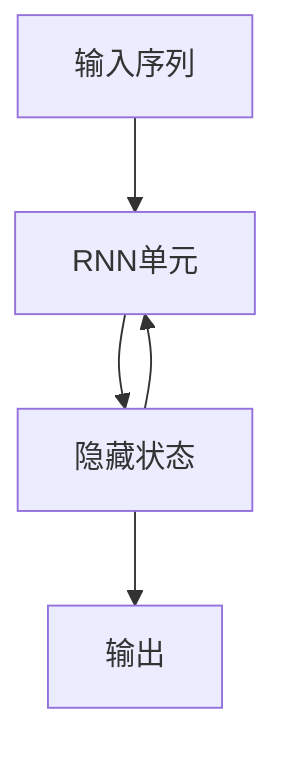

# 循环神经网络 (Recurrent Neural Network)

## 1. 背景介绍

### 1.1 问题的由来

在传统的神经网络模型中,如前馈神经网络(Feedforward Neural Network)、卷积神经网络(Convolutional Neural Network)等,输入数据被假设为独立同分布,彼此之间没有先后关系。然而,在自然语言处理、语音识别、时间序列预测等领域,输入数据通常呈现出强烈的时序相关性,即当前的输入与之前的输入是相关的。传统神经网络难以有效地处理这种序列数据。

为了解决这个问题,循环神经网络(Recurrent Neural Network, RNN)应运而生。与前馈神经网络不同,RNN在隐藏层中引入了循环连接,使得网络具有"记忆"能力,能够捕捉序列数据中的长期依赖关系,从而更好地处理序列数据。

### 1.2 研究现状

RNN自20世纪80年代提出以来,在自然语言处理、语音识别、时间序列预测等领域取得了广泛的应用。经典的RNN模型包括简单RNN(Simple RNN)、长短期记忆网络(Long Short-Term Memory, LSTM)和门控循环单元(Gated Recurrent Unit, GRU)等。

近年来,随着深度学习的兴起,RNN在各个领域的应用越来越广泛。例如,在自然语言处理领域,RNN被广泛应用于机器翻译、文本生成、情感分析等任务;在语音识别领域,RNN能够有效地建模语音的时序特征;在时间序列预测领域,RNN也展现出了优异的性能。

### 1.3 研究意义

RNN能够有效地处理序列数据,捕捉长期依赖关系,这使得它在许多领域具有广泛的应用前景。研究RNN不仅有助于提高相关任务的性能,还能够促进人工智能技术的发展,推动相关领域的进步。

此外,RNN的研究也为解决更加复杂的序列建模问题奠定了基础,如attention机制、transformer模型等,这些模型在自然语言处理、计算机视觉等领域取得了卓越的成就。

### 1.4 本文结构

本文将全面介绍循环神经网络(RNN)的相关知识。首先,我们将介绍RNN的核心概念和与其他神经网络模型的联系。接下来,详细阐述RNN的核心算法原理和具体操作步骤。然后,我们将构建RNN的数学模型,推导相关公式,并通过案例进行详细讲解。此外,本文还将提供RNN的项目实践,包括代码实例和详细解释。最后,我们将探讨RNN在实际应用中的场景,介绍相关工具和资源,总结RNN的发展趋势和面临的挑战。

## 2. 核心概念与联系

循环神经网络(Recurrent Neural Network, RNN)是一种特殊的人工神经网络,它在隐藏层中引入了循环连接,使得网络具有"记忆"能力,能够捕捉序列数据中的长期依赖关系。

RNN与传统的前馈神经网络(Feedforward Neural Network, FNN)和卷积神经网络(Convolutional Neural Network, CNN)的主要区别在于,RNN在处理序列数据时,不仅考虑当前的输入,还会结合之前的隐藏状态,从而能够捕捉序列数据中的时序信息。

RNN的核心思想是将序列数据按照时间步长展开,在每个时间步,网络会根据当前输入和上一时间步的隐藏状态,计算出当前时间步的隐藏状态和输出。这种循环的计算方式使得RNN能够捕捉序列数据中的长期依赖关系,从而更好地处理序列数据。

RNN的核心计算过程可以用以下公式表示:

$$
h_t = f_W(x_t, h_{t-1})
$$
$$
y_t = g_V(h_t)
$$

其中,$ h_t $表示时间步$ t $的隐藏状态,$ x_t $表示时间步$ t $的输入,$ h_{t-1} $表示前一时间步的隐藏状态,$ f_W $是计算隐藏状态的函数,$ g_V $是计算输出的函数。

RNN的核心优势在于能够处理任意长度的序列数据,并且能够捕捉序列数据中的长期依赖关系。然而,传统的RNN在处理长序列时容易出现梯度消失或梯度爆炸的问题,导致无法有效地捕捉长期依赖关系。为了解决这个问题,研究人员提出了长短期记忆网络(Long Short-Term Memory, LSTM)和门控循环单元(Gated Recurrent Unit, GRU)等改进版本。

LSTM和GRU通过引入门控机制,能够更好地捕捉长期依赖关系,并且能够有效地解决梯度消失或梯度爆炸的问题。这些改进版本的RNN在许多任务上取得了优异的性能,成为了序列建模的主流模型。

上图展示了RNN的基本工作原理。输入序列按照时间步长展开,在每个时间步,RNN单元根据当前输入和上一时间步的隐藏状态,计算出当前时间步的隐藏状态和输出。隐藏状态会被传递到下一时间步,从而捕捉序列数据中的长期依赖关系。

总的来说,RNN是一种能够有效处理序列数据的神经网络模型,它通过引入循环连接,使得网络具有"记忆"能力,能够捕捉序列数据中的长期依赖关系。RNN及其改进版本在自然语言处理、语音识别、时间序列预测等领域取得了广泛的应用。

## 3. 核心算法原理 & 具体操作步骤

### 3.1 算法原理概述

循环神经网络(Recurrent Neural Network, RNN)的核心算法原理是通过引入循环连接,使得网络在处理序列数据时,不仅考虑当前的输入,还会结合之前的隐藏状态,从而能够捕捉序列数据中的长期依赖关系。

RNN的核心计算过程可以概括为以下几个步骤:

1. 初始化隐藏状态$h_0$,通常将其设置为全零向量。
2. 在每个时间步$t$,根据当前输入$x_t$和上一时间步的隐藏状态$h_{t-1}$,计算当前时间步的隐藏状态$h_t$。
3. 根据当前时间步的隐藏状态$h_t$,计算当前时间步的输出$y_t$。
4. 将当前时间步的隐藏状态$h_t$传递到下一时间步,重复步骤2和步骤3,直到处理完整个序列。

这种循环的计算方式使得RNN能够捕捉序列数据中的长期依赖关系,从而更好地处理序列数据。

### 3.2 算法步骤详解

具体来说,RNN的算法步骤可以分为以下几个部分:

1. **初始化**

在开始处理序列数据之前,需要初始化RNN的隐藏状态$h_0$,通常将其设置为全零向量。

2. **前向传播**

对于序列数据$X = (x_1, x_2, \ldots, x_T)$,RNN的前向传播过程如下:

- 在时间步$t=1$,根据输入$x_1$和初始隐藏状态$h_0$,计算隐藏状态$h_1$和输出$y_1$:

$$
h_1 = f_W(x_1, h_0)
$$
$$
y_1 = g_V(h_1)
$$

其中,$f_W$是计算隐藏状态的函数,通常使用非线性激活函数,如tanh或ReLU;$g_V$是计算输出的函数,通常使用softmax或线性函数。

- 在时间步$t=2, 3, \ldots, T$,根据当前输入$x_t$和上一时间步的隐藏状态$h_{t-1}$,计算当前时间步的隐藏状态$h_t$和输出$y_t$:

$$
h_t = f_W(x_t, h_{t-1})
$$
$$
y_t = g_V(h_t)
$$

可以看出,RNN在每个时间步都会根据当前输入和上一时间步的隐藏状态,计算出当前时间步的隐藏状态和输出,从而捕捉序列数据中的长期依赖关系。

3. **反向传播**

在完成前向传播后,RNN需要通过反向传播算法来更新网络权重,从而最小化损失函数。反向传播的过程与传统的神经网络类似,只是需要考虑RNN的循环结构。

具体来说,反向传播的过程包括以下步骤:

- 计算输出层的损失函数,如交叉熵损失函数或均方误差损失函数。
- 根据损失函数,计算输出层的梯度。
- 利用反向传播算法,计算隐藏层的梯度,同时需要考虑循环连接带来的影响。
- 根据计算得到的梯度,更新网络权重。

需要注意的是,在处理长序列时,传统的RNN容易出现梯度消失或梯度爆炸的问题,导致无法有效地捕捉长期依赖关系。为了解决这个问题,研究人员提出了长短期记忆网络(Long Short-Term Memory, LSTM)和门控循环单元(Gated Recurrent Unit, GRU)等改进版本,它们通过引入门控机制,能够更好地捕捉长期依赖关系,并且能够有效地解决梯度消失或梯度爆炸的问题。

### 3.3 算法优缺点

**优点:**

1. **处理序列数据**:RNN能够有效地处理任意长度的序列数据,并且能够捕捉序列数据中的长期依赖关系,这使得它在自然语言处理、语音识别、时间序列预测等领域具有广泛的应用前景。

2. **灵活性**:RNN可以应用于多种任务,如序列生成、序列标注、序列预测等,具有很强的灵活性和通用性。

3. **端到端学习**:RNN能够直接从原始数据中学习特征表示,无需手工设计特征,实现了端到端的学习过程。

**缺点:**

1. **梯度消失/爆炸**:传统的RNN在处理长序列时容易出现梯度消失或梯度爆炸的问题,导致无法有效地捕捉长期依赖关系。虽然LSTM和GRU等改进版本能够一定程度上缓解这个问题,但是在处理极长序列时,依然存在一定的困难。

2. **无法并行计算**:由于RNN的循环结构,在处理序列数据时,每个时间步的计算都需要依赖于前一时间步的结果,因此无法实现并行计算,计算效率相对较低。

3. **缓存占用大**:在训练和推理过程中,RNN需要保存每个时间步的隐藏状态,这会导致缓存占用较大,对内存的需求较高。

### 3.4 算法应用领域

循环神经网络(RNN)及其改进版本(如LSTM和GRU)在以下领域具有广泛的应用:

1. **自然语言处理(Natural Language Processing, NLP)**:
   - 机器翻译
   - 文本生成
   - 情感分析
   - 问答系统
   - 语音识别

2. **时间序列预测(Time Series Forecasting)**:
   - 股票价格预测
   - 能源需求预测
   - 天气预报
   - 销售预测

3. **语音识别(Speech Recognition)**:
   - 自动语音识别系统
   - 语音转文本
   - 语音命令识别

4. **手写识别(Handwriting Recognition)**:
   - 手写字符识别
   - 手写数字识别
   - 手写公式识别

5. **视频分析(Video Analysis)**:
   - 视频描述生成
   - 视频分类
   - 视频标注

6. **机器人控制(Robot Control)**:
   - 机器人路径规划
   - 机器人动作预测
   - 机器人手臂控制

7. **生物信息学(Bioinformatics)**:
   - 蛋白质结构预测
   - DNA序列分析
   - 基因表达预测

总的来说