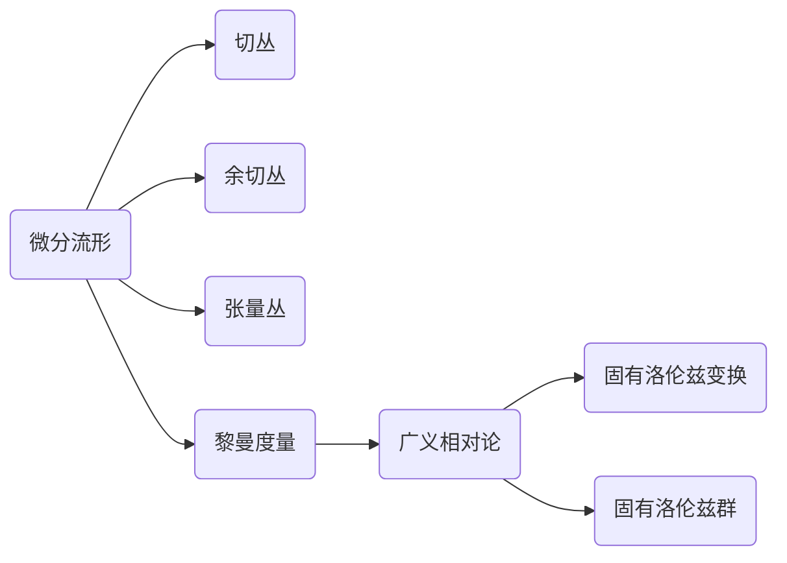

# 微分几何入门与广义相对论：固有洛伦兹变换和固有洛伦兹群

关键词：微分几何、广义相对论、固有洛伦兹变换、固有洛伦兹群、黎曼几何、时空流形

## 1. 背景介绍
### 1.1  问题的由来
微分几何作为数学的一个分支,在现代物理学尤其是广义相对论中有着极其重要的应用。爱因斯坦在创立广义相对论时,借助黎曼几何来描述时空的几何性质和引力场方程。其中,固有洛伦兹变换和固有洛伦狄兹群是广义相对论的重要数学基础。深入理解这些概念,对于掌握广义相对论的精髓至关重要。

### 1.2  研究现状
目前,国内外已有大量关于微分几何和广义相对论的专著和论文。但大多数资料要么过于抽象晦涩,要么只局限于某些具体问题的研究。系统性地介绍微分几何在广义相对论中的应用,并深入浅出地阐述固有洛伦兹变换和固有洛伦兹群等核心概念的资料还比较匮乏。

### 1.3  研究意义
微分几何和广义相对论都是现代科学的基石,对它们的深入研究和广泛应用将极大地推动物理学、天文学、宇宙学等领域的发展。同时,这些知识在工程技术领域也有着广泛应用,如 GPS 定位、惯性导航等。因此,普及微分几何和广义相对论的知识,让更多人能够理解并应用这些理论,具有重要意义。

### 1.4  本文结构
本文将分为以下几个部分:首先介绍微分几何和广义相对论的核心概念及其内在联系;然后重点阐述固有洛伦兹变换和固有洛伦兹群的数学原理,并给出具体的计算步骤;接着通过实例来说明如何应用这些理论进行计算和推导;最后总结全文,并展望微分几何和广义相对论的发展前景。

## 2. 核心概念与联系
要理解固有洛伦兹变换和固有洛伦兹群,首先需要掌握一些微分几何和广义相对论的基本概念。

微分几何的研究对象是微分流形,它是局部类似于欧氏空间 $\mathbb{R}^n$ 的空间。一个 $n$ 维微分流形是一个拓扑空间 $M$,且 $M$ 上存在一个微分结构,即一族局部同胚 $\varphi_\alpha:U_\alpha\to \mathbb{R}^n$ 的集合 $\{\varphi_\alpha\}$ 满足一定的相容性条件。这里 $\{U_\alpha\}$ 是 $M$ 的一个开覆盖。直观地说,微分流形就是曲线、曲面的高维推广。

在微分流形上,可以定义许多微分几何对象,如切丛、余切丛、张量丛、联络、黎曼度量等。黎曼度量 $g$ 是一个二阶对称张量场,它为流形上每一点的切空间提供了一个内积结构。黎曼度量使得我们能够在流形上测量长度、角度、体积等几何量。

广义相对论则将时空视为一个4维黎曼流形 $(M,g)$,其中 $g$ 是洛伦兹度规。与牛顿时空不同,广义相对论的时空是弯曲的,其曲率由爱因斯坦场方程决定:

$$R_{\mu\nu}-\frac{1}{2}g_{\mu\nu}R=\frac{8\pi G}{c^4}T_{\mu\nu}$$

这里 $R_{\mu\nu}$ 是黎奇张量,$R$ 是标量曲率,$T_{\mu\nu}$ 是能量动量张量,$G$ 是引力常数,$c$ 是光速。爱因斯坦方程表明,时空的几何性质由物质的分布和运动所决定。

在广义相对论中,固有洛伦兹变换和固有洛伦兹群是保持度规不变的变换。它们在狭义相对论和广义相对论中都起着重要作用。

## 3. 核心算法原理 & 具体操作步骤
### 3.1  算法原理概述
固有洛伦兹变换是在洛伦兹度规下保持不变的线性变换。设 $(M,g)$ 是一个洛伦兹流形,其中度规 $g$ 在局部坐标系 $(x^\mu)$ 下的表达式为:

$$g_{\mu\nu}=\mathrm{diag}(-1,1,1,1)$$

固有洛伦兹变换 $\Lambda$ 满足:

$$g_{\mu\nu}=\Lambda^\alpha_\mu \Lambda^\beta_\nu g_{\alpha\beta}$$

所有固有洛伦兹变换构成固有洛伦兹群 $\mathrm{SO}(1,3)$。

### 3.2  算法步骤详解
1) 设 $\Lambda$ 是一个固有洛伦兹变换,其矩阵形式为:

$$\Lambda=\begin{pmatrix} 
\Lambda^0_0 & \Lambda^0_1 & \Lambda^0_2 & \Lambda^0_3\\
\Lambda^1_0 & \Lambda^1_1 & \Lambda^1_2 & \Lambda^1_3\\
\Lambda^2_0 & \Lambda^2_1 & \Lambda^2_2 & \Lambda^2_3\\
\Lambda^3_0 & \Lambda^3_1 & \Lambda^3_2 & \Lambda^3_3
\end{pmatrix}$$

2) 将 $\Lambda$ 代入固有洛伦兹变换的定义式,得到一组方程:

$$\begin{aligned}
-1 &= -(\Lambda^0_0)^2+(\Lambda^0_1)^2+(\Lambda^0_2)^2+(\Lambda^0_3)^2 \\
0 &= -\Lambda^0_0\Lambda^1_0+\Lambda^0_1\Lambda^1_1+\Lambda^0_2\Lambda^1_2+\Lambda^0_3\Lambda^1_3 \\
&\vdots \\
1 &= (\Lambda^3_0)^2-(\Lambda^3_1)^2-(\Lambda^3_2)^2+(\Lambda^3_3)^2
\end{aligned}$$

3) 解上述方程组,可以得到 $\Lambda$ 的一般形式。例如,当 $\Lambda$ 表示一个沿 $x$ 方向的 boost 变换时,有:

$$\Lambda=\begin{pmatrix}
\gamma & -\gamma\beta & 0 & 0\\
-\gamma\beta & \gamma & 0 & 0\\
0 & 0 & 1 & 0\\
0 & 0 & 0 & 1
\end{pmatrix}$$

其中 $\beta=v/c$ 是速度参数,$\gamma=1/\sqrt{1-\beta^2}$ 是 Lorentz 因子。

4) 对于一般的固有洛伦兹变换,可以将其分解为 boost 和转动的复合。任意的 $\Lambda\in\mathrm{SO}(1,3)$ 可以写成:

$$\Lambda=R\cdot B$$

其中 $R$ 表示空间转动,$B$ 表示 boost 变换。

### 3.3  算法优缺点
固有洛伦兹变换的优点在于,它保持了时空区间不变,从而与狭义相对论和广义相对论的基本原理相一致。同时,固有洛伦兹群具有良好的数学性质,如封闭性、光滑性等,便于进行群论和表示论的分析。

但是,固有洛伦兹变换也存在一些局限性。它只描述了理想的惯性坐标系之间的变换关系,无法处理非惯性系和引力场的影响。此外,在量子领域,洛伦兹对称性可能被破缺,需要考虑更一般的变换群如 Poincaré 群。

### 3.4  算法应用领域 
固有洛伦兹变换在以下领域有重要应用:

- 狭义相对论:研究高速运动物体的时空变换规律
- 广义相对论:分析引力场方程的对称性和守恒律
- 量子场论:构建洛伦兹协变的场论方程
- 粒子物理:分类基本粒子及其相互作用
- 宇宙学:探索宇宙的大尺度结构和演化规律

## 4. 数学模型和公式 & 详细讲解 & 举例说明
### 4.1  数学模型构建
为了更好地理解固有洛伦兹变换,我们考虑闵可夫斯基时空 $\mathbb{R}^{1,3}$。它是一个4维实向量空间,配备了一个二次型:

$$Q(x)=-(x^0)^2+(x^1)^2+(x^2)^2+(x^3)^2$$

其中 $x=(x^0,x^1,x^2,x^3)$ 是 $\mathbb{R}^{1,3}$ 中的向量。

在物理中,通常采用自然单位制,令光速 $c=1$。此时,闵可夫斯基度规可以写成:

$$\eta_{\mu\nu}=\mathrm{diag}(-1,1,1,1)$$

两个事件 $x,y$ 之间的时空区间为:

$$\Delta s^2=(x-y)^\mu\eta_{\mu\nu}(x-y)^\nu$$

固有洛伦兹变换 $\Lambda$ 应满足:

$$\Delta s'^2=\Delta s^2 \quad \Longleftrightarrow \quad \eta_{\mu\nu}=\Lambda^\alpha_\mu \Lambda^\beta_\nu \eta_{\alpha\beta}$$

### 4.2  公式推导过程
下面我们推导固有洛伦兹变换的生成元。设 $\Lambda(s)$ 是固有洛伦兹群的一个一参子群,它在单位元 $I$ 附近的泰勒展开为:

$$\Lambda(s)=I+sX+O(s^2)$$

其中 $X$ 是一个常矩阵。将其代入固有洛伦兹变换的定义式,并利用 $\eta$ 的对称性,得到:

$$\eta_{\mu\nu}=\eta_{\mu\nu}+s(X_{\mu\alpha}\eta_{\alpha\nu}+X_{\nu\alpha}\eta_{\mu\alpha})+O(s^2)$$

比较 $s$ 的一次项系数,得到 $X$ 满足的条件:

$$X_{\mu\alpha}\eta_{\alpha\nu}+X_{\nu\alpha}\eta_{\mu\alpha}=0$$

或写成矩阵形式:

$$X^T\eta+\eta X=0$$

满足此条件的矩阵 $X$ 称为洛伦兹代数 $\mathfrak{so}(1,3)$ 的元素。可以验证,任意两个洛伦兹代数元的交换子 $[X,Y]=XY-YX$ 仍属于洛伦兹代数。因此,洛伦兹代数在李括号运算下构成一个李代数。

进一步可以证明,洛伦兹代数 $\mathfrak{so}(1,3)$ 的一组基为:

$$\begin{aligned}
J_1 &= \begin{pmatrix}0&0&0&0\\0&0&0&0\\0&0&0&-1\\0&0&1&0\end{pmatrix} &
J_2 &= \begin{pmatrix}0&0&0&0\\0&0&0&1\\0&0&0&0\\0&-1&0&0\end{pmatrix} \\
J_3 &= \begin{pmatrix}0&0&0&0\\0&0&-1&0\\0&1&0&0\\0&0&0&0\end{pmatrix} &
K_1 &= \begin{pmatrix}0&1&0&0\\1&0&0&0\\0&0&0&0\\0&0&0&0\end{pmatrix} \\
K_2 &= \begin{pmatrix}0&0&1&0\\0&0&0&0\\1&0&0&0\\0&0&0&0\end{pmatrix} &
K_3 &= \begin{pmatrix}0&0&0&1\\0&0&0&0\\0&0&0&0\\1&0&0&0\end{pmatrix}
\end{aligned}$$

其中 $J_i$ 生成空间转动,$K_i$ 生成 boost 变换。它们满足如下对易关系:

$$\begin{aligned}
[J_i,J_j] &= \epsilon_{ijk}J_k & [J_i,K_j] &= \epsilon_{ijk}K_k \\
[