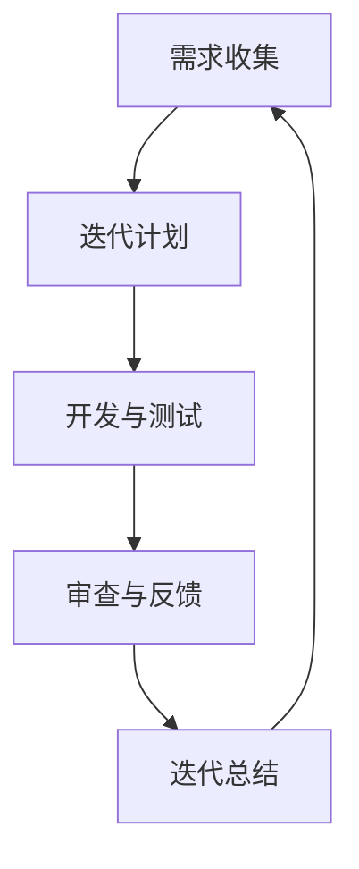

# 敏捷开发与快速迭代原理与代码实战案例讲解

作者：禅与计算机程序设计艺术 / Zen and the Art of Computer Programming

## 1. 背景介绍

### 1.1 问题的由来

在软件开发领域，快速变化的市场需求和技术进步对软件交付的速度和质量提出了更高的要求。传统的瀑布模型由于其在需求变更时的低适应性，逐渐无法满足快速发展的需求。敏捷开发（Agile Development）应运而生，它强调迭代、协作和快速响应变化。

### 1.2 研究现状

敏捷开发已经成为了软件开发的主流方法之一。各种敏捷实践，如Scrum、Kanban等，被广泛采用。同时，敏捷开发工具和平台也得到了快速发展。

### 1.3 研究意义

深入研究敏捷开发与快速迭代原理，有助于我们更好地理解和应用敏捷方法，提高软件开发的效率和质量。

### 1.4 本文结构

本文将首先介绍敏捷开发的核心概念和原理，然后通过代码实战案例讲解如何在实际项目中实现敏捷开发与快速迭代。

## 2. 核心概念与联系

敏捷开发的核心概念包括：

- **迭代（Iteration）**：将开发过程分解为一系列小型的、周期性的迭代，每个迭代完成部分功能。
- **增量（Incremental）**：在每次迭代中，交付可用的软件增量。
- **自组织（Self-organization）**：团队成员自主管理自己的工作和任务分配。
- **适应性（Adaptability）**：根据反馈和变化调整计划。

这些概念相互联系，共同构成了敏捷开发的核心理念。

## 3. 核心算法原理 & 具体操作步骤

### 3.1 算法原理概述

敏捷开发并没有统一的算法原理，而是基于一系列原则和实践。以下是一些关键原则：

- **客户至上（Customer Collaboration Over Contract Negotiation）**
- **响应变化胜于遵循计划（Responding to Change Over Following a Plan）**
- **个体和交互胜于流程和工具（Individuals and Interactions Over Processes and Tools）**
- **工作的软件胜于详尽的文档（Working Software Over Comprehensive Documentation）**
- **客户合作胜于合同谈判（Customer Collaboration Over Contract Negotiation）**

### 3.2 算法步骤详解

敏捷开发通常遵循以下步骤：

1. **需求收集（Requirements Gathering）**：与客户合作，收集和整理需求。
2. **迭代计划（Iteration Planning）**：确定迭代周期和待办事项。
3. **开发与测试（Development and Testing）**：开发人员编写代码，测试人员测试代码。
4. **审查与反馈（Review and Feedback）**：团队成员审查代码，收集反馈。
5. **迭代总结（Iteration Retrospective）**：总结迭代过程中的经验教训。

### 3.3 算法优缺点

#### 优点

- **快速响应变化**：敏捷开发能够快速响应市场需求的变化，提高产品的市场竞争力。
- **提高团队协作**：自组织原则有助于提高团队成员之间的沟通和协作。
- **持续改进**：迭代过程有助于不断优化和改进产品。

#### 缺点

- **项目管理难度大**：敏捷开发对项目经理的要求较高，需要具备较强的组织和协调能力。
- **文档管理困难**：敏捷开发强调快速迭代，可能导致文档更新不及时。

### 3.4 算法应用领域

敏捷开发适用于以下领域：

- **软件开发**
- **产品开发**
- **服务设计**
- **项目管理**

## 4. 数学模型和公式 & 详细讲解 & 举例说明

### 4.1 数学模型构建

敏捷开发并没有特定的数学模型，但它与项目管理中的Cockburn的敏捷模型有一定的联系。以下是一个简化的敏捷模型：



### 4.2 公式推导过程

敏捷开发没有复杂的公式推导过程，因为其主要关注的是实践和团队协作。

### 4.3 案例分析与讲解

假设一个软件开发项目分为四个迭代周期，每个迭代周期为2周。以下是一个简化的迭代计划：

| 迭代周期 | 待办事项 | 完成情况 |
| --- | --- | --- |
| 1 | 完成用户界面设计 | 完成 |
| 2 | 完成用户界面实现 | 进行中 |
| 3 | 完成核心功能实现 | 进行中 |
| 4 | 完成测试与部署 | 待定 |

在这个案例中，每个迭代周期都有明确的待办事项和完成情况，团队可以根据实际情况调整计划。

### 4.4 常见问题解答

#### 问题1：敏捷开发如何平衡需求变更和计划？

解答：敏捷开发通过迭代的方式，使团队能够快速响应需求变更。在迭代计划中，可以预留一定的空间来应对需求变更。

#### 问题2：敏捷开发如何保证产品质量？

解答：敏捷开发通过频繁的测试和反馈，确保产品质量。在迭代过程中，测试人员将定期审查代码，并提供反馈。

## 5. 项目实践：代码实例和详细解释说明

### 5.1 开发环境搭建

1. 安装Python 3.8及以上版本。
2. 安装Django框架：

```bash
pip install django
```

### 5.2 源代码详细实现

以下是一个简单的Django项目示例，实现了一个基本的用户注册和登录功能：

```python
# settings.py
INSTALLED_APPS = [
    'django.contrib.admin',
    'django.contrib.auth',
    'django.contrib.contenttypes',
    'django.contrib.sessions',
    'django.contrib.messages',
    'django.contrib.staticfiles',
    'myapp',
]

# myapp/models.py
from django.db import models

class User(models.Model):
    username = models.CharField(max_length=100)
    email = models.EmailField(unique=True)
    password = models.CharField(max_length=100)

# myapp/views.py
from django.shortcuts import render, redirect
from django.contrib.auth import authenticate, login

def register(request):
    if request.method == 'POST':
        username = request.POST['username']
        email = request.POST['email']
        password = request.POST['password']
        user = User.objects.create_user(username, email, password)
        login(request, user)
        return redirect('home')
    return render(request, 'register.html')

def login_view(request):
    if request.method == 'POST':
        username = request.POST['username']
        password = request.POST['password']
        user = authenticate(request, username=username, password=password)
        if user is not None:
            login(request, user)
            return redirect('home')
        else:
            return render(request, 'login.html', {'error': 'Invalid username or password'})
    return render(request, 'login.html')

# myapp/urls.py
from django.urls import path
from . import views

urlpatterns = [
    path('register/', views.register, name='register'),
    path('login/', views.login_view, name='login'),
]
```

### 5.3 代码解读与分析

在上述代码中，我们创建了一个Django项目，其中包含用户注册和登录功能。`User`模型用于存储用户信息，`register`视图处理用户注册请求，`login_view`视图处理用户登录请求。

### 5.4 运行结果展示

启动Django开发服务器：

```bash
python manage.py runserver
```

在浏览器中访问`http://127.0.0.1:8000/register/`和`http://127.0.0.1:8000/login/`，可以注册和登录用户。

## 6. 实际应用场景

### 6.1 软件开发

敏捷开发在软件开发领域得到了广泛应用，如Web开发、移动应用开发、桌面应用开发等。

### 6.2 产品开发

敏捷开发也适用于产品开发，如软件开发、硬件设计、服务设计等。

### 6.3 项目管理

敏捷开发可以用于项目管理，如软件项目、产品项目、市场项目等。

## 7. 工具和资源推荐

### 7.1 学习资源推荐

1. **《敏捷软件开发：原理、实践与模式》**：作者：Alistair Cockburn
2. **《敏捷精益软件开发：原理、实践与案例》**：作者：徐波

### 7.2 开发工具推荐

1. **Jira**：用于项目管理和任务跟踪。
2. **Trello**：用于任务管理和协作。
3. **Git**：用于版本控制和代码管理。

### 7.3 相关论文推荐

1. **"Agile Software Development: Principles, Patterns, and Practices"**：作者：Alistair Cockburn
2. **"Lean Software Development: An Agile Toolkit"**：作者：Mary and Tom Poppendieck

### 7.4 其他资源推荐

1. **Scrum.org**：[https://www.scrum.org/](https://www.scrum.org/)
2. **Agile Alliance**：[https://www.agilealliance.org/](https://www.agilealliance.org/)

## 8. 总结：未来发展趋势与挑战

### 8.1 研究成果总结

本文介绍了敏捷开发与快速迭代原理，并通过代码实战案例讲解了如何在实际项目中应用敏捷开发。

### 8.2 未来发展趋势

随着技术的不断发展，敏捷开发将会在以下方面得到进一步发展：

- **自动化测试**：通过自动化测试，提高代码质量和开发效率。
- **持续集成和持续部署（CI/CD）**：实现自动化构建、测试和部署，加快软件交付速度。
- **DevOps**：将开发和运维相结合，提高团队协作效率。

### 8.3 面临的挑战

敏捷开发在实际应用中仍面临以下挑战：

- **团队协作**：如何提高团队成员之间的沟通和协作效率。
- **流程管理**：如何制定合理的迭代计划和任务分配。
- **技术选型**：如何选择合适的技术栈和工具。

### 8.4 研究展望

未来，敏捷开发将与其他技术（如人工智能、大数据等）相结合，为软件开发带来更多可能性。同时，研究人员将继续探索和实践敏捷开发的新方法，以应对不断变化的需求和技术环境。

## 9. 附录：常见问题与解答

### 9.1 什么是敏捷开发？

敏捷开发是一种以人为核心、迭代、协作和响应变化的软件开发方法。

### 9.2 敏捷开发与瀑布模型有什么区别？

瀑布模型是一种线性、顺序的开发模型，而敏捷开发是一种迭代、协作的开发模型。敏捷开发更加灵活，能够快速响应需求变化。

### 9.3 如何实施敏捷开发？

实施敏捷开发需要遵循以下步骤：

1. 建立敏捷团队。
2. 确定迭代周期和待办事项。
3. 执行迭代计划。
4. 收集反馈和总结经验。

### 9.4 敏捷开发有哪些优点？

敏捷开发的优点包括：

- **快速响应变化**
- **提高团队协作**
- **持续改进**

### 9.5 敏捷开发有哪些缺点？

敏捷开发的缺点包括：

- **项目管理难度大**
- **文档管理困难**

通过本文的介绍，相信读者已经对敏捷开发与快速迭代原理有了深入的了解。在实际项目中，灵活运用敏捷开发方法，将有助于提高软件开发的效率和质量。