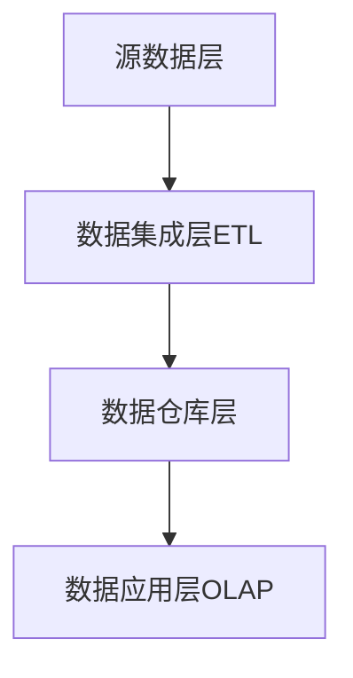
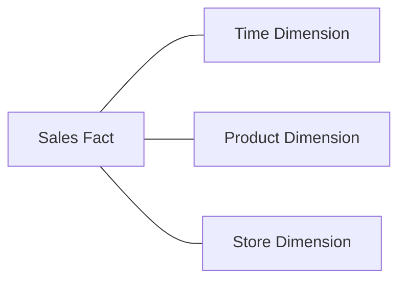

# 数据仓库 原理与代码实例讲解

关键词：数据仓库、ETL、维度建模、数据集成、OLAP

## 1. 背景介绍
### 1.1  问题的由来
在当今大数据时代,企业面临着海量数据的挑战。如何有效地存储、管理和分析这些数据,成为企业决策的关键。传统的操作型数据库(OLTP)已经无法满足复杂的分析需求,因此数据仓库应运而生。
### 1.2  研究现状
目前,数据仓库已经被广泛应用于各个行业,如零售、金融、电信等。著名的数据仓库架构有Inmon的企业数据仓库(EDW)和Kimball的维度建模。各大数据库厂商也推出了自己的数据仓库解决方案,如Oracle的Exadata、Teradata的IntelliFlex平台等。
### 1.3  研究意义  
深入研究数据仓库的原理和实现,对于企业数据治理和业务决策具有重要意义。通过数据仓库,可以集成企业内部各个系统的数据,提供一致的数据视图,支持灵活的多维分析。这将极大提升企业的数据分析能力和决策水平。
### 1.4  本文结构
本文将从数据仓库的核心概念出发,深入探讨其架构原理和关键技术。然后通过一个完整的代码实例,演示如何使用Python构建一个简单的数据仓库。最后,总结数据仓库的发展趋势和面临的挑战。

## 2. 核心概念与联系
数据仓库的核心概念包括:
- 主题导向(Subject Oriented):数据仓库按照业务主题组织数据,如客户、产品、订单等。
- 集成(Integrated):数据仓库集成了企业各个系统的数据,提供一致的数据视图。
- 非易失性(Non-Volatile):数据进入数据仓库后一般不会改变,保存历史快照。
- 时变性(Time Variant):数据仓库包含历史数据,支持跨时间的分析。

这些概念环环相扣,构成了数据仓库的基础。数据仓库通过ETL(抽取-转换-加载)过程,将源系统的数据按照主题进行集成,并保存历史快照,最终加载到数据仓库中以支持分析。

## 3. 核心架构原理 & 具体操作步骤
### 3.1 架构原理概述
数据仓库的典型架构由以下几个层次组成:



源数据层包括企业的各个业务系统,如ERP、CRM、SCM等。数据集成层负责将源系统的数据抽取、清洗、转换和加载到数据仓库。数据仓库层采用维度建模,将数据组织成事实表和维度表。数据应用层基于数据仓库,提供OLAP、数据挖掘等分析功能。

### 3.2 ETL步骤详解
ETL是数据仓库的核心流程,包括以下步骤:
1. 数据抽取(Extract):从源系统抽取所需数据。
2. 数据清洗(Cleanse):检查数据质量,剔除无效数据。
3. 数据转换(Transform):根据业务需求对数据进行转换,如计算派生字段、聚合等。
4. 数据加载(Load):将转换后的数据加载到数据仓库的目标表中。

ETL可以使用批处理或流处理的方式实现,常用的工具有Informatica PowerCenter、Talend、DataStage等。

### 3.3 维度建模
维度建模是数据仓库的核心建模方法,由事实表和维度表组成:
- 事实表(Fact Table):包含业务过程的度量值,如销售额、数量等。
- 维度表(Dimension Table):包含业务过程的描述信息,如时间、地点、产品等。

常见的维度建模有星型模型(Star Schema)和雪花模型(Snowflake Schema)。星型模型中维度表直接连接事实表,而雪花模型的维度表之间还存在层次关系。一般建议优先使用星型模型,以获得更好的查询性能。

### 3.4 应用领域
数据仓库广泛应用于以下领域:
- 企业报表和BI分析
- 客户细分和用户画像
- 销售预测和需求规划
- 风险管理和反欺诈
- 网站流量分析和推荐系统

通过数据仓库,企业可以全面了解业务现状,及时发现问题,优化业务流程,提高决策水平。

## 4. 数学模型和公式 & 详细讲解 & 举例说明
### 4.1  数学模型构建
数据仓库中常用的数学模型包括:
- 维度建模的ER图:描述事实表与维度表之间的关系。
- 聚合函数:如SUM、AVG、MAX、MIN等,用于计算度量值。
- 窗口函数:如RANK、DENSE_RANK、ROW_NUMBER等,用于分析排名、分组等。

以一个简单的销售数据仓库为例,我们可以建立如下的星型模型:



Sales Fact表包含销售额(Sales Amount)、销量(Sales Quantity)等度量值,Time、Product和Store Dimension表分别提供时间、产品和门店的描述信息。

### 4.2  公式推导过程
假设我们要计算每个产品的年度销售总额,可以使用以下SQL:

```sql
SELECT 
  p.ProductName,
  d.Year, 
  SUM(f.SalesAmount) AS TotalSales
FROM SalesFact f
JOIN TimeDimension d ON f.TimeKey = d.TimeKey
JOIN ProductDimension p ON f.ProductKey = p.ProductKey  
GROUP BY p.ProductName, d.Year
```

这里使用了`SUM`聚合函数计算销售总额,通过`GROUP BY`按照产品和年份进行分组。

### 4.3  案例分析与讲解
接下来我们分析一下手机产品的销售情况:

```sql
SELECT 
  d.Year,
  SUM(f.SalesAmount) AS MobileSales
FROM SalesFact f
JOIN TimeDimension d ON f.TimeKey = d.TimeKey
JOIN ProductDimension p ON f.ProductKey = p.ProductKey
WHERE p.Category = 'Mobile'  
GROUP BY d.Year
```

通过`WHERE`条件筛选出手机类别,再按年份汇总销售额。结果如下:

| Year | MobileSales |
|------|-------------|
| 2020 | 1,500,000   |
| 2021 | 1,800,000   |
| 2022 | 2,200,000   |

可以看出手机销售额逐年增长,2022年达到220万。我们还可以计算手机在总销售额中的占比:

```sql
SELECT
  d.Year,
  SUM(CASE WHEN p.Category = 'Mobile' THEN f.SalesAmount ELSE 0 END) / SUM(f.SalesAmount) AS MobileRatio
FROM SalesFact f
JOIN TimeDimension d ON f.TimeKey = d.TimeKey  
JOIN ProductDimension p ON f.ProductKey = p.ProductKey
GROUP BY d.Year
```

使用`CASE WHEN`对手机销售额进行条件求和,再除以总销售额得到占比。

### 4.4  常见问题解答
- 如何处理缓慢变化维度(SCD)?
可以在维度表中添加版本号或生效时间等字段,记录维度属性的历史变化。

- 如何实现增量加载?
可以在源表和目标表之间建立映射关系,只抽取新增或变更的数据。

- 如何保证数据质量?
在ETL过程中添加数据质量检查步骤,对关键字段设置约束,定期进行数据校验和监控。

## 5. 项目实践：代码实例和详细解释说明
下面我们使用Python实现一个简单的数据仓库Demo。
### 5.1  开发环境搭建
- Python 3.x
- Pandas: 数据处理库
- SQLite: 轻量级数据库

可以使用以下命令安装所需库:
```bash
pip install pandas sqlalchemy  
```

### 5.2  源代码详细实现
首先,我们准备一些源数据CSV文件:
- sales.csv: 销售记录
- products.csv: 产品信息
- stores.csv: 门店信息

然后,使用Pandas将CSV文件加载到内存:

```python
import pandas as pd

sales_df = pd.read_csv('sales.csv')
products_df = pd.read_csv('products.csv')
stores_df = pd.read_csv('stores.csv')
```

接着,对数据进行清洗和转换:

```python
# 去除空值记录
sales_df = sales_df.dropna() 

# 转换日期格式
sales_df['date'] = pd.to_datetime(sales_df['date'])

# 提取年份、月份
sales_df['year'] = sales_df['date'].dt.year
sales_df['month'] = sales_df['date'].dt.month
```

最后,将转换后的数据加载到SQLite数据库:

```python
from sqlalchemy import create_engine

engine = create_engine('sqlite:///sales_dw.db')

# 事实表
sales_df.to_sql('sales_fact', engine, index=False)

# 维度表 
products_df.to_sql('product_dim', engine, index=False)
stores_df.to_sql('store_dim', engine, index=False)
```

这样就完成了一个简单的ETL过程,数据被加载到了数据仓库表中。

### 5.3  代码解读与分析
上面的代码主要分为三个部分:
1. 数据加载:使用Pandas的`read_csv`函数从CSV文件读取数据。
2. 数据转换:使用Pandas的数据处理函数进行清洗和转换,如去除空值、转换日期格式、提取年月等。
3. 数据加载:使用SQLAlchemy创建数据库连接,将Pandas DataFrame写入数据库表。

Pandas提供了非常丰富的数据处理函数,可以方便地进行数据清洗和转换。SQLAlchemy是一个Python的ORM库,支持多种关系型数据库。

### 5.4  运行结果展示
我们可以使用SQL查询数据仓库表,验证数据加载的结果:

```sql
-- 查看事实表
SELECT * FROM sales_fact LIMIT 5;

-- 查看产品维度表
SELECT * FROM product_dim LIMIT 5;

-- 查看门店维度表 
SELECT * FROM store_dim LIMIT 5;
```

运行结果如下:

```
-- sales_fact
date        | product_id | store_id | amount 
------------|------------|----------|--------
2022-01-01  | P001       | S001     | 1000
2022-01-02  | P002       | S002     | 500  
2022-01-03  | P003       | S003     | 800
2022-01-04  | P001       | S001     | 1200
2022-01-05  | P002       | S002     | 600

-- product_dim  
product_id | product_name | category
-----------|--------------|----------
P001       | iPhone 13    | Mobile
P002       | MacBook Pro  | Laptop
P003       | iPad Air     | Tablet

-- store_dim
store_id | store_name | city
---------|------------|-------  
S001     | Apple Store| New York
S002     | Best Buy   | Los Angeles 
S003     | Walmart    | Chicago
```

可以看到,数据已经成功加载到了数据仓库表中,可以进行后续的OLAP分析。

## 6. 实际应用场景
数据仓库在企业的各个业务领域都有广泛应用,下面列举几个典型场景:
### 6.1 零售行业
- 客户细分:根据客户的购买历史、偏好等信息进行客户画像和细分,实现精准营销。
- 商品分析:分析商品的销售趋势、关联性、价格敏感度等,优化商品组合和定价策略。
- 库存管理:预测未来销量,优化库存水平,提高供应链效率。

### 6.2 金融行业
- 风险控制:建立用户信用评估模型,防范信用欺诈和违约风险。
- 交叉销售:分析客户的金融行为,挖掘交叉销售机会,提高客户价值。
- 反洗钱:通过行为分析和异常检测,识别可疑交易,遵守合规要求。

### 6.3 电信行业
- 客户流失预警:基于用户的通话、流量等行为数据,预测流失风险,及时开展挽留。
- 网络质量分析:分析网络KPI指标,定位质量问题,指导网络优化。
- 套餐推荐:根据用户的消费习惯,推荐合适的套餐和增值服务。  

### 6.4  未来应用展望
随着大数据和人工