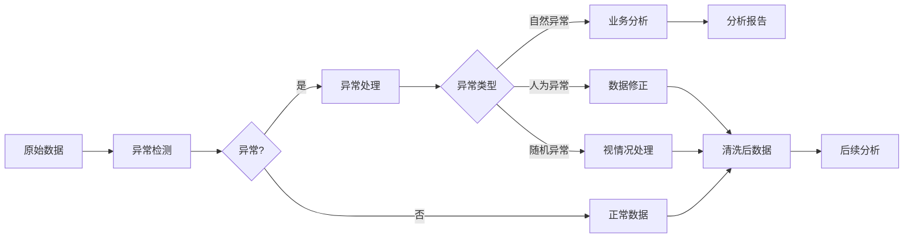

# 数据清洗：异常值检测与处理

作者：禅与计算机程序设计艺术 / Zen and the Art of Computer Programming

关键词：数据清洗、异常值检测、数据预处理、机器学习、统计学

## 1. 背景介绍
### 1.1 问题的由来
在大数据时代,海量的数据为各行各业带来了前所未有的机遇。然而,原始数据往往存在着不完整、不一致、有噪声等问题,其中异常值是最为常见和棘手的问题之一。异常值会严重影响数据分析和挖掘的结果,甚至导致错误的决策。因此,异常值检测与处理是数据预处理阶段的重要任务。

### 1.2 研究现状
目前,学术界和工业界已经提出了多种异常值检测与处理的方法。传统的统计学方法如3σ原则、箱线图等仍然在实践中发挥着重要作用。此外,一些机器学习算法如支持向量机(SVM)、孤立森林(Isolation Forest)、局部异常因子(LOF)等在异常检测领域取得了不错的效果。近年来,随着深度学习的发展,一些基于神经网络的异常检测方法也受到关注。

### 1.3 研究意义
异常值会给数据分析和决策带来极大的负面影响。例如,在信用评分中,如果异常值没有得到妥善处理,可能会高估或低估用户的信用风险。在工业生产中,设备的异常数据可能意味着故障的发生,需要及时发现和处理。可见,深入研究异常值检测与处理技术,对于提升数据质量、优化业务流程、辅助科学决策都具有重要意义。

### 1.4 本文结构
本文将重点探讨数据清洗中的异常值检测与处理问题。第2部分介绍异常值的定义和类型。第3部分重点讲解几种主流的异常检测算法。第4部分通过数学模型和案例分析异常值处理的策略。第5部分给出基于Python的异常值分析代码实例。第6部分讨论异常值分析在实际场景中的应用。第7部分推荐一些数据清洗的工具和学习资源。第8部分总结全文并展望未来的研究方向。

## 2. 核心概念与联系
异常值(Outlier)是指明显偏离其余数据的数据点。根据产生原因,异常值可分为以下三类:
1. 自然异常:数据本身存在的真实异常,具有重要的业务意义,需要重点关注。
2. 人为异常:由于人工录入、设备故障等原因产生的异常,需要修正或剔除。
3. 随机异常:由于偶然因素产生的异常,对分析影响不大,可以视情况处理。

异常值分析涉及的另一个概念是异常分数(Anomaly Score),它衡量一个数据点的异常程度。异常分数越高,表示该点越有可能是异常值。

下图展示了异常值分析的基本流程:



## 3. 核心算法原理 & 具体操作步骤
### 3.1 算法原理概述
异常值检测的常用算法可分为统计学方法和机器学习方法两大类。统计学方法依据数据的统计特性判别异常,如3σ原则、箱线图等。机器学习方法通过学习数据内在模式,构建异常分类模型,如一类支持向量机(One-Class SVM)、孤立森林等。

### 3.2 算法步骤详解
以下详细讲解两种典型的异常检测算法:

**3σ原则**
1. 计算数据的均值μ和标准差σ
2. 确定异常阈值k(常取3)
3. 判断每个数据点x是否满足|x - μ| > kσ
4. 若是,则判定为异常值

**孤立森林**
1. 随机选择特征和分割点,递归地对数据进行二分,直到每个数据点被孤立或达到最大树高
2. 在每棵树中,数据点的异常分数等于其被孤立的平均树高,树高越小代表越异常
3. 重复第1-2步,建立多棵孤立树,取平均异常分数
4. 根据异常分数大小判断异常值

### 3.3 算法优缺点
3σ原则简单直观,计算高效,但对非高斯分布和多维数据效果欠佳。孤立森林能够发现局部异常,对高维数据也能处理,但需要调参优化。实践中需要根据数据特点选择合适的算法。

### 3.4 算法应用领域
异常检测算法在工业、金融、医疗等领域有广泛应用,如设备故障诊断、欺诈检测、疾病筛查等。此外,它也是数据挖掘的重要预处理手段。

## 4. 数学模型和公式 & 详细讲解 & 举例说明
### 4.1 数学模型构建
异常检测可以形式化为下面的数学问题:

给定数据集 $X = \{x_1, x_2, ..., x_n\}$,找出一个异常分数函数 $f: X \rightarrow R$,使得异常点的分数显著高于正常点。

常见的异常分数模型有:

1. 高斯模型:假设数据服从高斯分布,异常分数等于数据点的马氏距离
$$f(x) = \sqrt{(x-\mu)^T\Sigma^{-1}(x-\mu)}$$

2. 距离模型:异常分数等于数据点与其k近邻的平均距离
$$f(x) = \frac{1}{k}\sum_{i=1}^k d(x, x_i)$$

3. 密度模型:异常分数等于数据点局部密度的倒数
$$f(x) = \frac{1}{\sum_{i=1}^n K(d(x,x_i))}$$

其中,$\mu$和$\Sigma$分别为数据的均值向量和协方差矩阵,$d(·)$为距离度量函数,$K(·)$为核函数。

### 4.2 公式推导过程
以高斯模型为例,推导异常分数公式:

假设 $x \sim N(\mu,\Sigma)$,其概率密度函数为:
$$p(x) = \frac{1}{(2\pi)^{p/2}|\Sigma|^{1/2}}exp(-\frac{1}{2}(x-\mu)^T\Sigma^{-1}(x-\mu))$$

取负对数得: 
$$-log p(x) = \frac{p}{2}log(2\pi) + \frac{1}{2}log|\Sigma| + \frac{1}{2}(x-\mu)^T\Sigma^{-1}(x-\mu)$$

舍去与$x$无关的常数项,得到异常分数:
$$f(x) = (x-\mu)^T\Sigma^{-1}(x-\mu)$$

取平方根得到马氏距离形式。

### 4.3 案例分析与讲解
考虑一个二维数据集,如下图所示:

```
(此处插入数据散点图,略)
```

图中绿点为正常数据,红点为异常值。我们分别用高斯模型和距离模型计算异常分数:

**高斯模型:**

首先估计均值和协方差矩阵:
$$\mu = (0.1, 0.2), \Sigma = \left[ \begin{matrix} 1 & 0.5 \\ 0.5 & 2 \end{matrix} \right]$$

然后计算红点(3,4)的异常分数:
$$f(x) = \sqrt{(x-\mu)^T\Sigma^{-1}(x-\mu)} = \sqrt{(3,4)\left[ \begin{matrix} 1.6 & -0.4 \\ -0.4 & 0.8 \end{matrix} \right]\left[ \begin{matrix} 2.9 \\ 3.8 \end{matrix} \right]} = 4.84$$

**距离模型:**

取$k=3$,计算红点与最近的3个绿点的平均欧氏距离:
$$f(x) = \frac{1}{3}(2.83 + 3.16 + 3.60) = 3.20$$

可以看出,两种模型都给出了较高的异常分数,成功检测出异常点。实际应用时可以根据异常分数分布设定阈值,划分异常点与正常点。

### 4.4 常见问题解答
**Q:** 异常检测算法如何选择距离度量和核函数?

**A:** 距离度量和核函数的选择需要考虑数据的分布特性。常用的距离度量有欧氏距离、曼哈顿距离、余弦相似度等。常用的核函数有高斯核、拉普拉斯核等。一般可以通过交叉验证来比较不同选择的效果。

**Q:** 如何评估异常检测算法的性能?

**A:** 主要考察算法对已知异常的检出率和误报率。可以用Precision、Recall、F1-score、ROC曲线和AUC等指标来评估。对于无监督异常检测,还可以用聚类性能指标如轮廓系数来评估。

**Q:** 对于高维数据,异常检测有哪些难点?

**A:** 高维数据异常检测的主要难点包括:维度灾难导致的距离失效、异常子空间难以发现、计算复杂度高等。常用的解决思路有:特征选择、子空间聚类、基于角度的异常度量等。

## 5. 项目实践：代码实例和详细解释说明
### 5.1 开发环境搭建
本项目使用Python 3.7,需要安装以下库:
- NumPy: 数值计算库
- Pandas: 数据分析库
- Matplotlib: 可视化库
- Scikit-learn: 机器学习库

可以用pip一键安装:
```
pip install numpy pandas matplotlib scikit-learn
```

### 5.2 源代码详细实现
下面给出基于3σ原则和孤立森林的异常值检测代码。

**3σ原则:**
```python
import numpy as np

def three_sigma(data, threshold=3):
    """3σ原则异常检测
    
    Args:
        data (numpy.ndarray): 输入数据
        threshold (float): 异常阈值
        
    Returns:
        outliers (numpy.ndarray): 异常值下标
    """
    m = np.mean(data) # 均值
    s = np.std(data)  # 标准差
    outliers = np.where(np.abs(data - m) > threshold*s)
    return outliers
```

**孤立森林:**
```python
from sklearn.ensemble import IsolationForest

def isolation_forest(data, n_estimators=100, contamination=0.1, random_state=0):
    """孤立森林异常检测
    
    Args:
        data (numpy.ndarray): 输入数据
        n_estimators (int): 树的数量
        contamination (float): 异常比例
        random_state (int): 随机种子
        
    Returns:
        outliers (numpy.ndarray): 异常值下标  
    """
    model = IsolationForest(n_estimators=n_estimators, 
                            contamination=contamination, 
                            random_state=random_state)
    model.fit(data)
    scores = model.decision_function(data)
    outliers = np.where(scores < 0)
    return outliers
```

### 5.3 代码解读与分析
3σ原则的实现非常简洁,首先计算数据的均值和标准差,然后判断每个数据点偏离均值的程度是否超过阈值(通常取3)。超过阈值的点即被判定为异常值,返回其下标。

孤立森林的实现基于Scikit-learn库。首先创建一个IsolationForest对象,指定树的数量、异常比例和随机种子等参数。然后用fit方法拟合数据,并用decision_function方法计算每个点的异常分数。分数为负的点被判定为异常值,返回其下标。

这两种方法分别代表了统计学和机器学习的思路,可以根据实际情况灵活选用。此外,还可以用Pandas的df.describe()方法粗略估计异常值,或者用Matplotlib绘制散点图、箱线图直观展示异常点。

### 5.4 运行结果展示
我们用上述代码对一个包含异常值的数据集进行测试:
```python
import pandas as pd

data = pd.read_csv('data.csv')
X