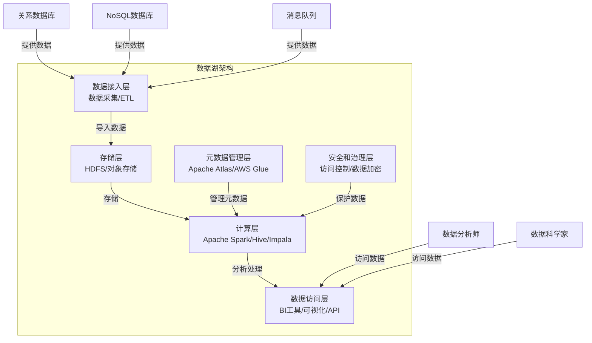

# 数据湖 原理与代码实例讲解

## 1. 背景介绍

### 1.1 问题的由来

在当今的数据时代,数据已经成为许多组织的关键资产。随着数据量的快速增长和多样化,传统的数据存储和处理方式面临着巨大的挑战。企业需要一种能够高效、可扩展地存储和处理大量结构化、半结构化和非结构化数据的解决方案。这就是数据湖(Data Lake)应运而生的背景。

### 1.2 研究现状

数据湖是一种新兴的大数据存储和处理架构,它提供了一种集中式的存储库,可以存储各种格式的数据,包括结构化数据(如关系数据库数据)、半结构化数据(如XML、JSON)和非结构化数据(如文本、图像、视频等)。与传统的数据仓库相比,数据湖具有更高的灵活性和可扩展性,可以支持更广泛的数据类型和用例。

目前,数据湖已经被越来越多的企业和组织采用,用于支持各种大数据应用,如数据分析、机器学习、人工智能等。一些知名公司如亚马逊、谷歌、微软等都在积极推广和应用数据湖技术。

### 1.3 研究意义

数据湖的引入为企业带来了诸多好处:

1. **数据集中存储**:数据湖提供了一个集中式的存储库,可以存储各种格式的数据,避免了数据孤岛的问题。

2. **灵活性和可扩展性**:数据湖可以轻松地存储和处理大量的数据,并且可以根据需求进行横向扩展。

3. **降低存储成本**:与传统数据仓库相比,数据湖可以利用廉价的对象存储,降低存储成本。

4. **支持多种数据处理模式**:数据湖可以支持批处理、流处理、交互式查询等多种数据处理模式,满足不同的业务需求。

5. **促进数据民主化**:数据湖可以让更多的用户(如数据分析师、数据科学家等)直接访问和处理原始数据,促进数据民主化。

因此,研究和掌握数据湖的原理和实践对于企业实现数据驱动的业务转型至关重要。

### 1.4 本文结构

本文将全面介绍数据湖的核心概念、原理、架构和实践。文章的主要内容包括:

1. 核心概念与联系
2. 核心算法原理和具体操作步骤
3. 数学模型和公式详细讲解及举例说明
4. 项目实践:代码实例和详细解释说明
5. 实际应用场景
6. 工具和资源推荐
7. 总结:未来发展趋势与挑战
8. 附录:常见问题与解答

## 2. 核心概念与联系

数据湖涉及了多个核心概念,这些概念相互关联,构成了数据湖的基础理论和架构。下面将详细介绍这些核心概念及其联系。

### 2.1 数据湖架构

数据湖架构通常包括以下几个主要组件:

1. **存储层**:用于存储各种格式的原始数据,通常采用分布式文件系统(如HDFS)或对象存储(如AWS S3)。

2. **计算层**:用于处理和分析存储在数据湖中的数据,常见的计算引擎包括Apache Spark、Apache Hive、Apache Impala等。

3. **元数据管理层**:用于管理和维护数据湖中数据的元数据(如数据模式、数据线age等),常用的工具包括Apache Atlas、AWS Glue等。

4. **安全和治理层**:用于确保数据湖中数据的安全性和合规性,包括访问控制、数据加密、数据审计等功能。

5. **数据接入层**:用于从各种数据源(如关系数据库、NoSQL数据库、消息队列等)向数据湖导入数据。

6. **数据访问层**:用于为不同类型的用户(如数据分析师、数据科学家等)提供访问和查询数据湖中数据的接口和工具。

这些组件协同工作,构成了一个完整的数据湖架构。下面是一个简化的数据湖架构示意图:



### 2.2 数据处理模式

数据湖支持多种数据处理模式,包括:

1. **批处理**:将大量数据作为一个批次进行处理,适用于离线分析、ETL等场景。常用的批处理引擎包括Apache Spark、Apache Hive等。

2. **流处理**:实时或近实时地处理持续到来的数据流,适用于实时分析、事件驱动应用等场景。常用的流处理引擎包括Apache Spark Streaming、Apache Flink等。

3. **交互式查询**:对数据湖中的数据进行即席查询和探索性分析,适用于数据可视化、自助分析等场景。常用的交互式查询引擎包括Apache Impala、Apache Drill等。

不同的数据处理模式适用于不同的业务场景,数据湖架构需要支持这些不同的处理模式,以满足各种数据处理需求。

### 2.3 数据格式

数据湖可以存储各种格式的数据,包括:

1. **结构化数据**:具有固定模式的数据,如关系数据库中的表格数据。

2. **半结构化数据**:数据具有一定的结构,但结构不太严格,如XML、JSON等。

3. **非结构化数据**:没有预定义的数据模式,如文本文件、图像、视频等。

数据湖通常采用面向文件的存储格式,如Parquet、ORC、Avro等,这些格式具有高效的压缩和列式存储特性,可以提高查询性能。

### 2.4 数据管理

在数据湖中,数据管理是一个重要的挑战。由于数据湖存储了大量的原始数据,因此需要有效的元数据管理、数据治理和数据生命周期管理机制,以确保数据的质量、安全性和合规性。常见的数据管理实践包括:

1. **元数据管理**:记录和维护数据的元数据信息,如数据模式、数据线age、数据质量等。

2. **数据治理**:制定数据标准、策略和流程,确保数据的一致性、准确性和完整性。

3. **数据生命周期管理**:管理数据的整个生命周期,包括数据采集、存储、处理、分发和归档等阶段。

4. **数据安全和合规**:实施访问控制、数据加密、数据审计等措施,确保数据的安全性和合规性。

有效的数据管理对于充分发挥数据湖的价值至关重要。

## 3. 核心算法原理与具体操作步骤

### 3.1 算法原理概述

数据湖涉及多种核心算法,这些算法支撑了数据湖的各种功能和特性。以下是一些常见的核心算法:

1. **数据压缩算法**:用于高效存储和传输数据,如Snappy、LZO、Zlib等。

2. **列式存储算法**:将数据按列存储,提高查询性能,如Parquet、ORC等。

3. **分布式计算算法**:用于在多个节点上并行处理数据,如MapReduce、Spark等。

4. **流处理算法**:用于实时或近实时处理数据流,如Spark Streaming、Flink等。

5. **元数据管理算法**:用于管理和维护数据的元数据信息,如Apache Atlas、AWS Glue等。

6. **数据安全算法**:用于保护数据的安全性和隐私性,如加密算法、访问控制算法等。

这些算法在数据湖的不同组件和功能中发挥着重要作用,为数据湖提供了高效、可扩展和安全的数据处理能力。

### 3.2 算法步骤详解

以下将以列式存储算法Parquet为例,详细介绍其核心原理和具体操作步骤。

Parquet是一种面向列的存储格式,它具有以下特点:

1. **高效压缩**:对数据进行高效压缩,减小存储空间。

2. **列式存储**:按列存储数据,提高查询性能。

3. **自描述**:包含元数据信息,描述数据的模式和结构。

4. **分区**:支持按列或行进行分区,提高查询效率。

Parquet的核心算法步骤如下:

1. **数据编码**:对每一列的数据进行编码,常用的编码方式包括字典编码、位图编码、RLE编码等。

2. **数据压缩**:对编码后的数据进行压缩,常用的压缩算法包括Snappy、Zlib等。

3. **列存储**:将压缩后的数据按列存储在Parquet文件中,每一列对应一个列组(Column Group)。

4. **元数据存储**:在Parquet文件中存储元数据信息,包括数据模式、编码方式、压缩算法等。

5. **分区存储**:根据需要,可以对数据进行分区存储,提高查询效率。

6. **查询处理**:在查询时,只需读取相关的列组,并进行解压缩和解码,即可获取所需的数据。

下面是一个示例,展示了如何使用Apache Spark读写Parquet文件:

```scala
// 读取Parquet文件
val df = spark.read.parquet("path/to/data.parquet")

// 对DataFrame进行查询和转换操作
val result = df.filter(...).select(...)

// 将结果写入Parquet文件
result.write.parquet("path/to/output.parquet")
```

在这个示例中,Apache Spark自动处理了Parquet文件的读写和查询操作,利用了列式存储和压缩等优化技术,提高了数据处理的效率。

### 3.3 算法优缺点

列式存储算法如Parquet具有以下优点:

1. **高效压缩**:通过列式存储和编码,可以实现高效的数据压缩,节省存储空间。

2. **查询性能优化**:只需读取相关的列,可以大幅提高查询性能,尤其是对于仅涉及部分列的查询。

3. **自描述**:包含元数据信息,方便数据管理和处理。

4. **分区支持**:支持按列或行进行分区,进一步提高查询效率。

但列式存储算法也存在一些缺点:

1. **写入性能**:由于需要进行编码和压缩,写入性能可能较差。

2. **更新困难**:列式存储格式不太适合频繁的数据更新操作。

3. **查询复杂度**:对于涉及多个列的复杂查询,性能优化可能不明显。

4. **元数据开销**:需要维护和管理元数据信息,带来一定的开销。

因此,在选择存储格式时,需要根据具体的应用场景和需求进行权衡。对于分析型工作负载,列式存储格式如Parquet是一个不错的选择;对于事务型工作负载,行式存储格式可能更加合适。

### 3.4 算法应用领域

列式存储算法广泛应用于以下领域:

1. **大数据分析**:在Hadoop生态系统中,Parquet是一种常用的存储格式,被广泛用于大数据分析场景。

2. **数据湖**:作为数据湖的核心存储格式之一,Parquet可以高效存储和查询数据湖中的各种数据。