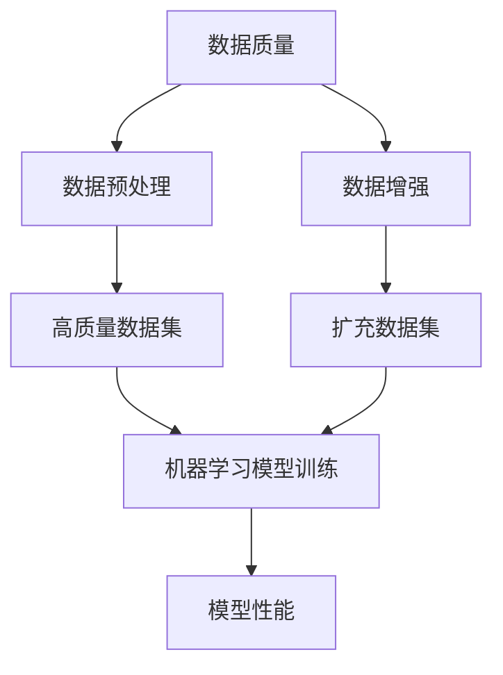

好的，我明白了您的要求。以下是根据您提供的标题和文章结构模板撰写的技术博客文章正文部分。

# 数据预处理与增强：提高模型性能的关键

## 1. 背景介绍

### 1.1 问题的由来

在机器学习和深度学习领域中,数据是训练模型的基础和关键。高质量的数据集可以帮助模型更好地学习并提高性能。然而,现实世界中的数据通常存在噪声、缺失值、不平衡等问题,这些问题会影响模型的训练效果。因此,数据预处理和数据增强技术应运而生,旨在清理和丰富原始数据,从而提高模型的性能和泛化能力。

### 1.2 研究现状 

数据预处理和数据增强技术已经成为机器学习和深度学习领域的重要研究方向。研究人员不断探索新的预处理和增强方法,以适应不同类型的数据和任务需求。常见的数据预处理技术包括标准化、编码、缺失值处理等,而数据增强技术则包括几何变换、混合数据、生成对抗网络(GAN)等。这些技术已经在计算机视觉、自然语言处理、语音识别等多个领域得到广泛应用。

### 1.3 研究意义

数据预处理和数据增强技术对于提高模型性能至关重要。高质量的数据可以帮助模型更好地捕捉数据中的模式和规律,从而提高模型的准确性和泛化能力。同时,数据增强技术还可以缓解数据不足的问题,为模型提供更多的训练样本。此外,合理的数据预处理和增强策略也有助于减少模型训练时间,提高计算效率。因此,研究和应用数据预处理与增强技术对于构建高性能的机器学习和深度学习模型具有重要意义。

### 1.4 本文结构

本文将全面介绍数据预处理和数据增强技术在机器学习和深度学习中的应用。首先,我们将介绍数据预处理和数据增强的核心概念和原理。接下来,详细讲解常见的数据预处理和增强算法,包括数学模型、公式推导和实现步骤。然后,我们将通过实际案例和代码示例,展示如何在实践中应用这些技术。最后,我们将探讨数据预处理和增强技术在不同领域的应用场景,并分析其未来发展趋势和挑战。

## 2. 核心概念与联系

在深入探讨数据预处理和数据增强技术之前,我们需要先了解一些核心概念及它们之间的联系。

如上图所示,数据质量是影响机器学习模型性能的关键因素。通过数据预处理技术,我们可以从原始数据中清理噪声、填补缺失值、处理不平衡等问题,从而获得高质量的数据集。高质量的数据集可以帮助机器学习模型更好地学习数据中的模式和规律,提高模型的性能。

另一方面,数据增强技术则通过对现有数据进行变换和扩充,生成新的训练样本,从而扩大数据集的规模。扩充后的数据集可以为机器学习模型提供更多的训练样本,缓解数据不足的问题,进一步提高模型的泛化能力和性能。

因此,数据预处理和数据增强技术是相辅相成的,共同为机器学习模型提供高质量和充足的训练数据,从而提高模型的性能和泛化能力。

## 3. 核心算法原理 & 具体操作步骤

### 3.1 算法原理概述

数据预处理和数据增强技术包含多种算法和方法,每种算法都有其特定的原理和应用场景。在这一节,我们将概述一些常见算法的核心原理。

**数据预处理算法**:
- **标准化(Normalization)**: 将数据缩放到特定范围内,使特征值具有相同的量级和尺度,避免某些特征对模型的影响过大或过小。
- **编码(Encoding)**: 将分类特征转换为数值特征,以便机器学习模型可以处理。常见的编码方法包括一热编码(One-Hot Encoding)和标签编码(Label Encoding)。
- **缺失值处理(Missing Value Imputation)**: 填补数据集中缺失的值,常见方法包括均值填充、中位数填充、K近邻填充等。
- **异常值处理(Outlier Detection and Handling)**: 检测和处理数据集中的异常值,避免异常值对模型产生负面影响。

**数据增强算法**:
- **几何变换(Geometric Transformations)**: 对图像数据进行平移、旋转、缩放等几何变换,生成新的训练样本。
- **颜色空间变换(Color Space Transformations)**: 改变图像的颜色空间,如从RGB转换到HSV或GRAY空间,增加数据多样性。
- **混合数据(Mixing Data)**: 将多个训练样本混合在一起,生成新的合成样本。常见方法包括mixup、cutmix等。
- **生成对抗网络(Generative Adversarial Networks, GANs)**: 使用生成模型生成新的合成数据,扩充训练集。

### 3.2 算法步骤详解

接下来,我们将详细介绍一些常见算法的具体实现步骤。

**标准化算法**:

标准化算法的目标是将数据缩放到特定范围内,使特征值具有相同的量级和尺度。常见的标准化方法包括最小-最大标准化(Min-Max Normalization)和Z-Score标准化(Z-Score Normalization)。

1. **最小-最大标准化**:
   - 步骤1:计算特征的最小值和最大值:$min(x)$和$max(x)$
   - 步骤2:对每个特征值进行缩放,使其落在指定范围内(通常是[0,1])
     $$x_{norm} = \frac{x - min(x)}{max(x) - min(x)}$$

2. **Z-Score标准化**:
   - 步骤1:计算特征的均值$\mu$和标准差$\sigma$
   - 步骤2:对每个特征值进行标准化
     $$x_{norm} = \frac{x - \mu}{\sigma}$$

经过标准化处理后,所有特征值将落在相同的量级范围内,避免某些特征对模型的影响过大或过小。

**一热编码算法**:

一热编码是将分类特征转换为数值特征的常用方法。对于每个分类特征,算法会创建一个新的二进制向量,其长度等于类别的数量。在该向量中,只有对应类别的位置为1,其他位置均为0。

例如,对于一个名为"颜色"的分类特征,其取值为"红色"、"绿色"和"蓝色"。经过一热编码后,我们将获得以下新的特征向量:

- 红色: [1, 0, 0]
- 绿色: [0, 1, 0]
- 蓝色: [0, 0, 1]

通过这种方式,分类特征被转换为数值特征,可以被机器学习模型直接处理。

**mixup数据增强算法**:

mixup是一种常见的数据增强算法,通过线性插值的方式将两个训练样本混合在一起,生成新的合成样本。具体步骤如下:

1. 从训练集中随机选择两个样本$(x_i, y_i)$和$(x_j, y_j)$
2. 生成一个随机权重$\lambda \in [0, 1]$
3. 构造新的合成样本:
   $$\tilde{x} = \lambda x_i + (1 - \lambda) x_j$$
   $$\tilde{y} = \lambda y_i + (1 - \lambda) y_j$$
4. 将合成样本$(\tilde{x}, \tilde{y})$添加到扩充后的训练集中

通过mixup算法,我们可以生成新的合成样本,扩充训练集的规模,提高模型的泛化能力。

### 3.3 算法优缺点

每种算法都有其优缺点,选择合适的算法需要根据具体的数据和任务需求。

**标准化算法**:
- 优点:消除特征量级不同带来的影响,提高模型收敛速度和性能。
- 缺点:对异常值敏感,可能会压缩数据的动态范围。

**一热编码算法**:
- 优点:简单易懂,可以将分类特征转换为数值特征,便于机器学习模型处理。
- 缺点:当类别数量较多时,会产生高维稀疏向量,增加计算开销。

**mixup数据增强算法**:
- 优点:可以有效扩充训练集规模,提高模型的泛化能力。
- 缺点:合成样本可能不符合真实数据的分布,对某些任务(如分类任务)的效果可能不佳。

### 3.4 算法应用领域

数据预处理和数据增强算法在多个领域都有广泛的应用,包括但不限于:

- **计算机视觉**: 图像分类、目标检测、语义分割等任务中,常使用几何变换、颜色空间变换等数据增强算法。
- **自然语言处理**: 文本分类、机器翻译等任务中,常使用词袋模型、TF-IDF等数据预处理算法。
- **语音识别**: 通过添加噪声、改变语速等方式进行数据增强,提高模型的鲁棒性。
- **推荐系统**: 对用户数据进行标准化、编码等预处理,提高推荐模型的准确性。

总的来说,数据预处理和数据增强技术可以应用于任何涉及机器学习和深度学习的领域,为模型提供高质量和充足的训练数据,从而提高模型的性能和泛化能力。

## 4. 数学模型和公式 & 详细讲解 & 举例说明

### 4.1 数学模型构建

在数据预处理和数据增强领域,我们常常需要构建数学模型来描述和解释相关算法的原理和过程。以下是一些常见的数学模型:

1. **高斯噪声模型**:
   
   高斯噪声模型常用于模拟数据中的噪声,它假设噪声服从均值为0、方差为$\sigma^2$的高斯分布:
   $$\epsilon \sim \mathcal{N}(0, \sigma^2)$$
   
   其中,噪声$\epsilon$的概率密度函数为:
   $$p(\epsilon) = \frac{1}{\sqrt{2\pi\sigma^2}}e^{-\frac{\epsilon^2}{2\sigma^2}}$$

2. **异常值检测模型**:

   异常值检测模型通常基于数据的统计特性,如均值和标准差,来识别异常值。一种常见的方法是使用"3σ原则",即将偏离均值超过3个标准差的数据点视为异常值:
   $$|x - \mu| > 3\sigma$$

   其中,$\mu$和$\sigma$分别表示数据的均值和标准差。

3. **数据增强模型**:

   数据增强模型通常包括一个变换函数$f$,用于将原始数据$x$转换为增强后的数据$\tilde{x}$:
   $$\tilde{x} = f(x; \theta)$$

   其中,$\theta$表示变换函数的参数。例如,在图像几何变换中,$\theta$可能包括旋转角度、平移距离等参数。

这些数学模型为数据预处理和数据增强算法提供了理论基础,帮助我们更好地理解和分析相关过程。

### 4.2 公式推导过程

在本节中,我们将详细推导一些常见公式的过程,以加深对相关算法的理解。

**1. 最小-最大标准化公式推导**:

最小-最大标准化的目标是将数据缩放到指定范围$[a, b]$内。假设原始数据为$x$,最小值为$min(x)$,最大值为$max(x)$,我们希望将其缩放到$[a, b]$范围内。

首先,我们需要确保缩放后的数据位于$[a, b]$范围内:
$$a \leq x_{norm} \leq b$$

由于$x_{norm}$是$x$的线性变换,我们可以写成: