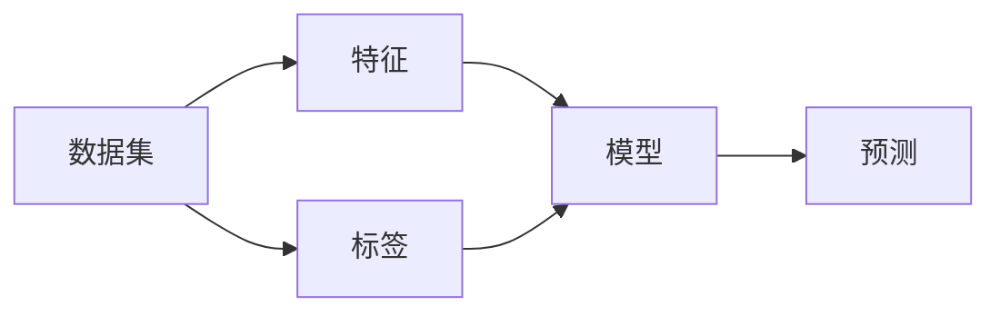

# 机器学习 原理与代码实例讲解

## 1. 背景介绍
### 1.1  问题的由来
机器学习是人工智能的一个重要分支,其目标是通过学习算法,使机器能够自动从数据中学习规律,并利用学习到的规律对未知数据进行预测。近年来,随着大数据时代的到来,海量数据的积累为机器学习的发展提供了前所未有的机遇。同时,计算机硬件性能的飞速提升,也为机器学习算法的实现提供了强大的计算支持。在这样的背景下,机器学习得到了飞速的发展,并在图像识别、自然语言处理、智能推荐等领域取得了令人瞩目的成果。

### 1.2 研究现状
目前,机器学习已经成为人工智能领域的研究热点。国内外众多高校、研究机构和企业都在机器学习领域投入了大量的人力物力,取得了丰硕的研究成果。一些经典的机器学习算法如支持向量机(SVM)、随机森林(Random Forest)、梯度提升决策树(GBDT)等,已经在工业界得到了广泛应用。近年来,随着深度学习的兴起,一些复杂的机器学习任务如图像分类、语音识别、自然语言理解等,也取得了突破性进展。

### 1.3 研究意义
机器学习的研究意义主要体现在以下几个方面:

1. 推动人工智能的发展。机器学习是实现人工智能的核心技术之一,其研究成果直接推动了人工智能的发展。

2. 解放人力,提高效率。通过机器学习,许多需要人工处理的任务可以交给机器完成,极大提高了工作效率,解放了人力。 

3. 挖掘数据价值。机器学习可以从海量数据中自动学习规律,挖掘出数据背后隐藏的价值,为决策提供依据。

4. 创造商业价值。机器学习创造了许多新的商业模式,如个性化推荐、精准广告等,为企业创造了巨大的商业价值。

### 1.4 本文结构
本文将全面介绍机器学习的原理和代码实例。内容安排如下:

第2部分介绍机器学习的核心概念。第3部分介绍几种常见的机器学习算法原理。第4部分介绍机器学习涉及的数学模型和公式。第5部分通过代码实例讲解如何实现这些算法。第6部分探讨机器学习的应用场景。第7部分推荐机器学习的工具和学习资源。第8部分对全文进行总结,并展望机器学习的未来发展趋势与面临的挑战。

## 2. 核心概念与联系

机器学习的核心概念主要包括:

- 数据集(Dataset):机器学习算法的训练数据。
- 特征(Feature):描述数据的属性。
- 标签(Label):数据的真实类别或值。
- 模型(Model):机器学习算法训练出的规则。
- 训练(Training):通过数据训练出模型的过程。
- 预测(Prediction):用训练好的模型对新数据进行预测的过程。

这些概念之间的关系如下图所示:

首先,我们需要收集数据,组成数据集。数据集包含了若干个样本,每个样本通过特征来描述,并且有相应的标签。接着,我们将数据集输入机器学习算法,通过训练得到一个模型。这个模型实际上就是从特征到标签的一个映射关系。训练好的模型可以对新样本的特征进行预测,得到其标签。

根据任务的不同,机器学习可以分为:

- 监督学习(Supervised Learning):训练数据带有标签,目标是学习出特征到标签的映射。代表算法有决策树、SVM等。
- 无监督学习(Unsupervised Learning):训练数据没有标签,目标是发现数据中的隐含结构。代表算法有聚类、降维等。  
- 强化学习(Reinforcement Learning):通过与环境的交互,获得奖励或惩罚,从而学习最优策略。代表算法有Q-Learning等。

## 3. 核心算法原理 & 具体操作步骤
### 3.1 算法原理概述
机器学习的算法很多,本节将介绍三种最常见也是最重要的算法:线性回归、逻辑回归和支持向量机。

线性回归(Linear Regression)是一种监督学习算法,用于拟合连续型标签。其核心思想是找到一个线性函数,使得预测值与真实值的差别最小化。

逻辑回归(Logistic Regression)也是一种监督学习算法,用于二分类任务。其核心思想是找到一个逻辑函数(Sigmoid函数),将特征映射到0~1之间,大于0.5的被预测为正类,小于0.5的被预测为负类。

支持向量机(Support Vector Machine, SVM)同样是一种监督学习算法,可以用于分类和回归。其核心思想是找到一个超平面,使得两个类别的间隔最大化。

### 3.2 算法步骤详解
以线性回归为例,详细说明其算法步骤:

输入:训练集 $\{(x_1,y_1),(x_2,y_2),...,(x_n,y_n)\}$,其中 $x_i$ 为特征向量, $y_i$ 为标签。

输出:线性模型 $f(x)=w^Tx+b$。

步骤:
1. 初始化模型参数 $w$ 和 $b$ 为0。
2. 定义损失函数,常用的是均方误差(Mean Squared Error, MSE):
$$
MSE=\frac{1}{n}\sum_{i=1}^n(f(x_i)-y_i)^2
$$
3. 采用梯度下降法对损失函数进行优化,不断更新 $w$ 和 $b$ 直到收敛:
$$
w:=w-\alpha\frac{\partial MSE}{\partial w}
$$
$$
b:=b-\alpha\frac{\partial MSE}{\partial b}
$$
其中 $\alpha$ 为学习率。
4. 得到最优的模型参数 $w$ 和 $b$,模型训练完成。

逻辑回归和SVM的步骤与线性回归类似,区别在于模型的形式和损失函数的定义。

### 3.3 算法优缺点
线性回归的优点是模型简单,易于理解和实现;缺点是无法拟合非线性数据,容易欠拟合。

逻辑回归的优点是可以给出概率解释,易于理解;缺点是只能处理两类问题,面对非线性数据时也需要进行特征变换。

SVM的优点是可以处理非线性数据,泛化能力强;缺点是训练复杂度高,参数调节困难。

### 3.4 算法应用领域
- 线性回归可以用于销量预测、房价预测等连续值预测任务。
- 逻辑回归常用于金融风控、疾病诊断等二分类任务。
- SVM在文本分类、图像分类等领域应用广泛。

## 4. 数学模型和公式 & 详细讲解 & 举例说明
### 4.1 数学模型构建
以逻辑回归为例,说明其数学模型的构建过程。

逻辑回归的目标是估计 $P(Y=1|X)$,即给定特征 $X$ 下标签 $Y$ 为正例的条件概率。这个条件概率可以用如下的Sigmoid函数来表示:

$$
P(Y=1|X)=\frac{1}{1+e^{-(w^TX+b)}}
$$

其中 $w$ 和 $b$ 是待求的模型参数。

对于二分类任务,我们可以定义如下的似然函数:

$$
L(w,b)=\prod_{i=1}^nP(Y=y_i|X=x_i)
$$

取对数后得到对数似然函数:

$$
\log L(w,b)=\sum_{i=1}^n[y_i\log P(Y=1|X=x_i)+(1-y_i)\log (1-P(Y=1|X=x_i))]
$$

最大化对数似然函数等价于最小化逻辑回归的损失函数:

$$
J(w,b)=-\frac{1}{n}\sum_{i=1}^n[y_i\log P(Y=1|X=x_i)+(1-y_i)\log (1-P(Y=1|X=x_i))]
$$

这就是逻辑回归的数学模型。

### 4.2 公式推导过程
对逻辑回归的损失函数求导,可以得到模型参数 $w$ 和 $b$ 的梯度更新公式:

$$
w:=w-\alpha\frac{\partial J}{\partial w}=w+\alpha\sum_{i=1}^n(y_i-P(Y=1|X=x_i))x_i
$$

$$
b:=b-\alpha\frac{\partial J}{\partial b}=b+\alpha\sum_{i=1}^n(y_i-P(Y=1|X=x_i))
$$

其中 $\alpha$ 为学习率。

通过不断迭代上述梯度更新公式,直到损失函数收敛,就可以得到逻辑回归的最优模型参数。

### 4.3 案例分析与讲解
下面通过一个简单的案例来说明逻辑回归的应用。

假设我们要根据学生的两门考试成绩 $x_1$ 和 $x_2$ 来预测他是否能被大学录取(用 $y=1$ 表示录取, $y=0$ 表示未录取)。已知4个学生的数据:

| $x_1$ | $x_2$ | $y$ |
|-------|-------|-----|
| 80    | 85    | 1   |
| 70    | 65    | 0   |
| 90    | 80    | 1   |
| 75    | 60    | 0   |

我们可以用逻辑回归来建立预测模型:

$$
P(Y=1|X)=\frac{1}{1+e^{-(w_1x_1+w_2x_2+b)}}
$$

通过梯度下降法求解出最优的模型参数 $w_1$, $w_2$ 和 $b$,就可以对新同学是否录取做出预测。假设 $w_1=0.05$,$w_2=0.08$,$b=-10$,那么一个新同学的成绩是 $x_1=85$,$x_2=75$,代入模型可以算出:

$$
P(Y=1|X)=\frac{1}{1+e^{-(0.05*85+0.08*75-10)}}=0.524>0.5
$$

因此预测这个新同学可以被录取。

这就是逻辑回归的一个简单应用实例。实际中我们可以收集更多的历史数据,选取更多的特征,来建立更加准确的录取预测模型。

### 4.4 常见问题解答
**问:** 逻辑回归能否处理多分类问题?

**答:** 标准的二项逻辑回归只能处理二分类问题,但我们可以通过一对多(One vs Rest)或多对多(One vs One)的方式,将其拓展到多分类问题。一对多是训练多个二分类器,每个分类器针对一个类别;多对多是为每对类别训练一个分类器。预测时采用投票机制决定最终的类别。

**问:** 逻辑回归对数据有哪些要求?

**答:** 逻辑回归虽然是一种非线性模型,但是它对数据还是有一定的假设。例如,逻辑回归假设特征之间不存在多重共线性,各特征之间是相互独立的。如果特征之间存在较强的相关性,会影响模型的稳定性。此外,逻辑回归还要求样本量不能太少,否则容易过拟合。一般来说,样本量应该大于特征数量的10倍。

**问:** 如何评估逻辑回归模型的性能?

**答:** 对于逻辑回归模型,我们可以用准确率(Accuracy)、精确率(Precision)、召回率(Recall)、F1值等指标来评估分类的效果。如果是不平衡数据集,还要考察ROC曲线和AUC值。通过交叉验证的方式可以得到模型性能的无偏估计。此外,我们还要对模型系数进行检验,剔除不显著的特征,避免过拟合。

## 5. 项目实践：代码实例和详细解释说明
### 5.1 开