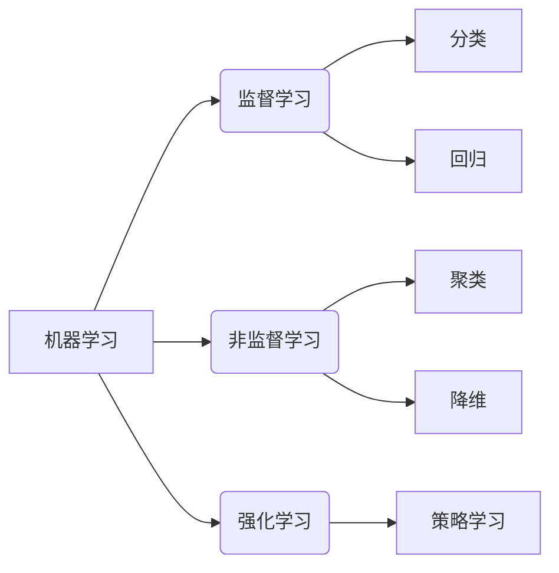

# 机器学习原理与代码实例讲解

## 1. 背景介绍

### 1.1 问题的由来

在当今数据时代,海量数据的产生和积累为机器学习的发展提供了fertile土壤。传统的基于规则的编程方法越来越难以满足复杂问题的需求,因为它们需要人工专家对每一种情况进行硬编码。相比之下,机器学习算法能够从数据中自动学习模式,并对新的数据进行预测或决策,这使得它们在许多领域都有广泛的应用前景。

### 1.2 研究现状

机器学习作为人工智能的一个重要分支,近年来发展迅猛。从最初的决策树、贝叶斯方法、支持向量机,到后来的人工神经网络、深度学习等,算法和模型不断推陈出新。特别是在计算能力的飞速提升和大数据时代的到来之后,机器学习在计算机视觉、自然语言处理、推荐系统等领域取得了令人瞩目的成就。

### 1.3 研究意义

机器学习技术的发展不仅能够提高生产效率,优化决策过程,还能为人类生活带来全新的体验。比如无人驾驶汽车、智能语音助手、个性化推荐系统等,都是机器学习应用的典型案例。可以预见,未来机器学习将会深度融入到社会的方方面面,成为推动科技进步和社会发展的重要动力。

### 1.4 本文结构

本文将全面介绍机器学习的核心概念、算法原理、数学模型,并结合实际案例对关键技术进行讲解和代码实现。内容包括监督学习、非监督学习、强化学习等主要分支,以及深度学习、迁移学习等前沿领域。读者可以通过本文掌握机器学习的基本理论和实践技能。

## 2. 核心概念与联系

机器学习可以概括为一种从数据中学习,并对未知数据进行预测或决策的方法。根据任务类型的不同,可以将机器学习分为以下三大类:

1. **监督学习(Supervised Learning)**

   监督学习的目标是学习一个映射函数,将输入数据映射到相应的输出。常见的任务包括分类(Classification)和回归(Regression)。分类任务是将输入实例划分到有限的几个类别中,如垃圾邮件分类、图像识别等;回归任务则是预测一个连续的数值输出,如房价预测、销量预测等。

2. **非监督学习(Unsupervised Learning)** 

   非监督学习的任务是从未标记的数据中发现内在的结构或模式。常见的任务包括聚类(Clustering)和降维(Dimensionality Reduction)。聚类是将相似的实例划分到同一个簇;降维则是将高维数据映射到低维空间,以减少数据的冗余性和复杂性。

3. **强化学习(Reinforcement Learning)**

   强化学习的目标是学习一个策略函数,使得在一个不确定的环境中,代理能够通过与环境交互并获得奖励,从而找到一个在长期获得最大累积奖励的行为序列。强化学习常用于机器人控制、游戏AI等领域。

这三大类相互关联又有所区别。监督学习和非监督学习都是从现有数据中学习,但监督学习需要标记数据,而非监督学习不需要。强化学习则是通过与环境交互,根据获得的反馈信号(奖励或惩罚)来优化策略。

## 3. 核心算法原理 & 具体操作步骤

机器学习算法的核心思想是从数据中学习,捕捉数据的内在规律,并对未知数据进行预测或决策。不同的算法原理和具体步骤有所不同,但都遵循以下基本流程:

1. 获取数据
2. 数据预处理
3. 特征工程
4. 模型训练
5. 模型评估
6. 模型调优
7. 模型部署

接下来我们将分别介绍几种典型算法的原理和步骤。

### 3.1 算法原理概述

#### 线性回归

线性回归是一种常用的监督学习算法,用于解决回归问题。它的目标是找到一个最佳拟合的直线(或平面),使得数据点到直线的残差平方和最小。线性回归的优点是简单易懂,计算高效,但缺点是只能学习线性模式。

#### 逻辑回归

逻辑回归是一种用于分类的监督学习算法。它通过对数几率回归模型,将输入映射到0到1之间的值,表示实例属于某个类别的概率。逻辑回归的优点是简单、可解释性强,但缺点是对非线性决策边界的拟合能力较差。

#### 决策树

决策树是一种监督学习算法,可用于分类和回归任务。它通过递归地对特征空间进行划分,构建一个树状决策模型。决策树的优点是可解释性强、无需特征缩放,但缺点是容易过拟合,并且对数据的微小变化很敏感。

#### 支持向量机(SVM)

支持向量机是一种有监督的非概率二元线性分类模型。它的基本思想是在特征空间中构建一个最大边界超平面,将不同类别的实例分开。SVM的优点是泛化能力强,可以有效处理高维数据,但缺点是对参数调节和核函数的选择较为敏感,计算开销较大。

#### K-Means聚类

K-Means是一种常用的无监督学习聚类算法。它的目标是将n个样本数据划分为k个簇,使得簇内样本尽量紧密,簇间样本尽量疏远。该算法通过迭代优化的方式,最终收敛于局部最优解。K-Means的优点是简单、高效,但缺点是需要预先指定簇的数量,并且对噪声和异常值敏感。

#### 主成分分析(PCA)

主成分分析是一种常用的无监督学习降维算法。它通过正交变换将原始特征映射到一个新的特征子空间,使得投影在这个子空间上的方差最大,从而达到降维的目的。PCA的优点是简单高效,但缺点是只能发现线性关系,对非线性模式的降维效果不佳。

上述算法只是机器学习中的一小部分代表性算法,实际应用中还有诸如贝叶斯分类器、马尔可夫决策过程、高斯混合模型、谱聚类等多种算法可供选择,具体使用哪种算法需要根据问题的特点和数据的特征进行权衡。

### 3.2 算法步骤详解

以线性回归为例,具体的算法步骤如下:

1. **获取数据**

   获取用于训练的数据集,例如房价数据集,包含房屋面积、房龄、房间数等特征,以及相应的房价(目标值)。

2. **数据预处理**

   - 处理缺失值:用均值、中位数或其他估计值填充缺失的特征值。
   - 特征缩放:将特征值缩放到相似的范围,如[0,1]区间,以防止数值较大的特征对模型的影响过大。

3. **特征工程**

   对原始特征进行加工,提取对目标值更有意义的特征,如房屋面积与房间数的比值等。

4. **拆分数据集**

   将数据集拆分为训练集和测试集,通常按照7:3或其他比例拆分。

5. **模型训练**

   使用训练集数据,通过优化算法(如梯度下降)估计出最佳拟合的线性模型参数,使残差平方和最小。

6. **模型评估**

   在测试集上评估模型的性能,常用指标如均方根误差(RMSE)、决定系数$R^2$等。

7. **模型调优**

   根据评估结果,通过调整超参数(如正则化系数)、增加特征或修改模型结构等方式,提高模型在测试集上的性能。

8. **模型部署**

   将调优后的模型应用于实际的预测或决策任务。

上述算法步骤适用于大多数监督学习算法,只是具体的模型结构、优化目标、评估指标等会有所不同。对于非监督学习和强化学习,步骤也有一些差异,但总的思路是类似的。

### 3.3 算法优缺点

不同的机器学习算法都有其适用场景和局限性,我们需要根据具体问题的特点选择合适的算法。下面总结一下上述算法的主要优缺点:

- 线性回归:
  - 优点:简单、高效、可解释性强
  - 缺点:只能学习线性模式,对异常值敏感

- 逻辑回归:
  - 优点:简单、可解释性强
  - 缺点:对非线性决策边界拟合能力较差

- 决策树:
  - 优点:可解释性强、无需特征缩放
  - 缺点:容易过拟合,对数据扰动敏感

- 支持向量机:
  - 优点:泛化能力强,可处理高维数据
  - 缺点:对参数调节和核函数选择敏感,计算开销大

- K-Means聚类:
  - 优点:简单、高效
  - 缺点:需要预先指定簇数,对噪声和异常值敏感

- 主成分分析:
  - 优点:简单高效
  - 缺点:只能发现线性关系,对非线性模式降维效果不佳

### 3.4 算法应用领域

机器学习算法在诸多领域都有广泛的应用,下面列举了一些典型的应用场景:

- 计算机视觉:图像分类、目标检测、人脸识别等
- 自然语言处理:文本分类、情感分析、机器翻译等
- 推荐系统:个性化推荐、协同过滤等
- 金融风险管理:信用评分、欺诈检测等
- 医疗健康:疾病诊断、药物开发等
- 交通运输:路径规划、交通流量预测等
- 工业制造:故障诊断、产品质量控制等

可以看出,机器学习技术已经深入到了我们生活和工作的方方面面,并正在为各行各业带来革命性的变革。随着算法的不断创新和计算能力的持续提升,机器学习在未来必将拥有更加广阔的应用前景。

## 4. 数学模型和公式 & 详细讲解 & 举例说明

机器学习算法背后都有严谨的数学理论作为基础。本节将介绍一些核心的数学模型和公式,并通过案例进行详细讲解。

### 4.1 数学模型构建

#### 线性回归模型

线性回归试图学习一个由参数向量$\mathbf{w}$和偏置项$b$参数化的函数$f$,使其能够很好地对数据$\mathcal{D}=\{(\mathbf{x}_i,y_i)\}_{i=1}^N$进行拟合,其中$\mathbf{x}_i$是输入特征向量,$y_i$是对应的目标值。线性回归模型可以表示为:

$$f(\mathbf{x})=\mathbf{w}^T\mathbf{x}+b$$

为了找到最佳的参数$\mathbf{w}$和$b$,我们需要定义一个损失函数(Loss Function),通常使用均方误差(Mean Squared Error):

$$\mathcal{L}(\mathbf{w},b)=\frac{1}{N}\sum_{i=1}^N(f(\mathbf{x}_i)-y_i)^2$$

我们的目标是最小化损失函数,即求解以下优化问题:

$$\min_{\mathbf{w},b}\mathcal{L}(\mathbf{w},b)$$

这个优化问题可以通过梯度下降等优化算法求解。

#### 逻辑回归模型

逻辑回归用于解决分类问题,它的目标是学习一个分类器$f$,将输入实例$\mathbf{x}$映射到0到1之间的值,表示该实例属于正类的概率。逻辑回归模型定义为:

$$f(\