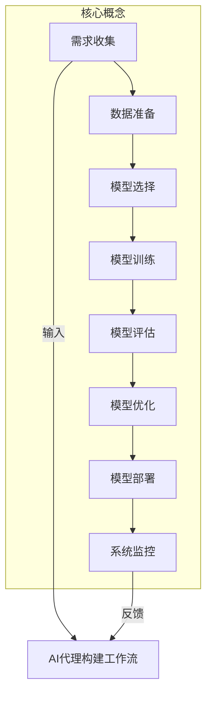
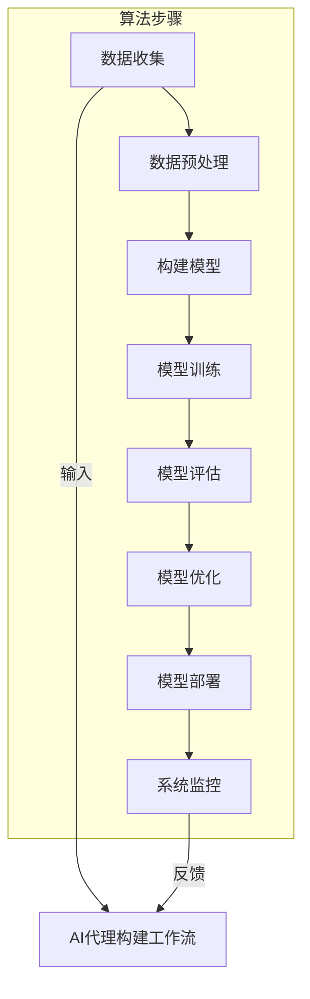

# 构建AI代理：从需求收集到工作流实现

## 1. 背景介绍

### 1.1 问题的由来

在当今数字化时代，人工智能(AI)已经渗透到我们生活的方方面面。从智能助手到自动驾驶汽车,AI系统正在不断优化和改善我们的生活体验。然而,构建一个高效、可靠的AI代理并非易事。它需要精心设计、复杂的算法和大量的数据训练。

传统的软件开发过程通常包括需求收集、设计、编码、测试和部署等阶段。而AI系统的开发则更加复杂,需要考虑数据质量、模型选择、训练策略等多个方面。如何将这些步骤有机地结合在一起,并确保AI代理能够满足实际需求,成为了当前AI领域亟待解决的挑战。

### 1.2 研究现状

近年来,研究人员和从业者提出了多种AI代理构建方法,试图简化和优化这一过程。例如,谷歌的AI平台提供了端到端的工作流,支持数据准备、模型训练和部署等步骤。另一方面,开源社区也在不断探索新的解决方案,如TensorFlow Extended(TFX)和Kubeflow等。

然而,这些现有方法往往专注于特定领域或任务,缺乏通用性和灵活性。此外,它们也存在一些局限性,如对大规模数据处理能力不足、缺乏可解释性等。因此,构建一个通用的、可扩展的AI代理构建工作流,仍然是当前研究的热点和难点。

### 1.3 研究意义

构建高效的AI代理对于推动人工智能的发展至关重要。一个完善的AI代理构建工作流不仅可以简化开发过程,还能提高AI系统的性能和可靠性。具体来说,它可以带来以下好处:

1. **提高开发效率**:通过自动化和标准化的流程,减少手动操作,加快迭代周期。
2. **确保质量一致性**:遵循统一的最佳实践,降低人为错误风险。
3. **支持可解释性**:增强AI系统的透明度,有助于理解和诊断。
4. **促进协作**:标准化的工作流有利于不同团队之间的协作和知识共享。
5. **降低成本**:减少重复工作,提高资源利用率。

因此,研究和构建一个通用的、高效的AI代理构建工作流,对于推动AI技术的发展和应用都具有重要意义。

### 1.4 本文结构

本文将详细介绍如何构建一个完整的AI代理,从需求收集到最终的工作流实现。文章主要分为以下几个部分:

1. **核心概念与联系**:阐述AI代理构建所涉及的关键概念,并分析它们之间的关系。
2. **核心算法原理与具体操作步骤**:深入探讨AI代理构建的核心算法,包括原理、步骤、优缺点和应用领域。
3. **数学模型和公式详细讲解**:介绍相关的数学模型,并通过案例分析和常见问题解答,帮助读者更好地理解公式推导过程。
4. **项目实践:代码实例和详细解释**:提供完整的代码实现,包括开发环境搭建、源代码分析和运行结果展示。
5. **实际应用场景**:探讨AI代理在不同领域的应用,并展望未来的发展方向。
6. **工具和资源推荐**:总结AI代理构建过程中常用的工具、学习资源和相关论文等。
7. **总结:未来发展趋势与挑战**:回顾研究成果,并对AI代理构建的未来趋势和面临的挑战进行展望。
8. **附录:常见问题与解答**:汇总AI代理构建过程中可能遇到的常见问题及其解决方案。

通过全面而深入的探讨,本文旨在为读者提供一个清晰的AI代理构建工作流,帮助他们更好地理解和实践这一过程。

## 2. 核心概念与联系

在深入探讨AI代理构建的细节之前,我们需要先了解其中涉及的一些核心概念。这些概念不仅是构建AI代理的基础,也是相互关联的。理解它们之间的联系,对于掌握整个工作流至关重要。

1. **需求收集(Requirement Gathering)**: 构建AI代理的第一步是明确需求,包括系统的预期功能、性能指标、约束条件等。需求收集阶段通常涉及与最终用户、利益相关者的沟通和讨论,以确保AI代理能够满足实际需求。

2. **数据准备(Data Preparation)**: AI系统高度依赖于数据,因此数据准备是整个工作流中至关重要的一环。它包括数据采集、清洗、标注、分割等多个步骤,以确保数据的质量和适用性。高质量的数据集是训练出优秀AI模型的前提。

3. **模型选择(Model Selection)**: 根据具体的任务和数据特征,选择合适的AI模型架构是非常关键的。不同的模型在性能、计算复杂度、可解释性等方面有所差异,需要权衡各个因素进行选择。常见的模型包括深度神经网络、决策树、支持向量机等。

4. **模型训练(Model Training)**: 选择好模型架构后,就需要使用准备好的数据对模型进行训练。训练过程通常包括设置超参数、选择优化算法、定义损失函数等步骤。训练的目标是使模型在训练数据上达到预期的性能指标。

5. **模型评估(Model Evaluation)**: 在训练完成后,需要对模型进行评估,以衡量其在测试数据上的实际表现。评估指标可以是准确率、精确率、召回率等,具体取决于任务类型。如果评估结果不理想,可能需要调整模型架构或训练策略。

6. **模型优化(Model Optimization)**: 根据模型评估的结果,可能需要对模型进行进一步的优化,以提高其性能。优化方法包括超参数调整、模型压缩、知识蒸馏等技术。

7. **模型部署(Model Deployment)**: 一旦模型达到预期的性能指标,就可以将其部署到生产环境中,为最终用户提供服务。部署过程需要考虑模型的可移植性、可扩展性和安全性等因素。

8. **系统监控(System Monitoring)**: 在AI代理投入使用后,需要持续监控其性能和行为,以确保其能够正常运行并满足需求。监控数据也可以用于反馈优化,形成一个闭环的工作流。

上述概念相互关联,构成了一个完整的AI代理构建工作流。需求收集为整个过程确定了方向,数据准备则为模型训练提供了基础。模型选择、训练、评估和优化是工作流的核心环节,而模型部署和系统监控则关注AI代理的实际应用和持续改进。

理解这些核心概念及其联系,对于掌握AI代理构建的整体过程至关重要。只有将各个环节有机地结合在一起,才能构建出高效、可靠的AI代理系统。

## 3. 核心算法原理与具体操作步骤

### 3.1 算法原理概述

在AI代理构建过程中,涉及多种算法和技术,它们贯穿于工作流的各个环节。本节将重点介绍其中的核心算法原理,为后续的具体实现奠定理论基础。

1. **监督学习算法**:
   - 原理:利用带有标签的训练数据,学习出一个能够对新数据进行预测或决策的模型。
   - 代表算法:支持向量机(SVM)、决策树、逻辑回归等。
   - 应用场景:分类、回归等任务。

2. **非监督学习算法**:
   - 原理:仅使用未标注的训练数据,自动发现数据中的模式和结构。
   - 代表算法:聚类算法(K-Means、DBSCAN等)、关联规则挖掘、主成分分析等。
   - 应用场景:聚类、降维、异常检测等任务。

3. **深度学习算法**:
   - 原理:通过构建深层神经网络模型,自动从数据中学习特征表示。
   - 代表算法:卷积神经网络(CNN)、递归神经网络(RNN)、transformer等。
   - 应用场景:计算机视觉、自然语言处理、语音识别等任务。

4. **强化学习算法**:
   - 原理:通过与环境的交互,学习一个策略,使代理在该环境中获得最大的累积奖励。
   - 代表算法:Q-Learning、策略梯度、Actor-Critic等。
   - 应用场景:机器人控制、游戏AI、自动驾驶等任务。

5. **迁移学习算法**:
   - 原理:利用在源领域学习到的知识,加速在目标领域的模型训练。
   - 代表算法:特征提取、微调、域适应等。
   - 应用场景:缺乏大量标注数据的领域。

6. **模型压缩算法**:
   - 原理:通过剪枝、量化、知识蒸馆等技术,压缩模型的大小和计算复杂度。
   - 代表算法:网络剪枝、模型量化、知识蒸馆等。
   - 应用场景:将训练好的大型模型部署到资源受限的设备上。

上述算法原理为AI代理构建提供了理论支撑,但要将它们应用到实践中,还需要具体的操作步骤。下一小节将详细介绍这些步骤。

### 3.2 算法步骤详解

根据前面介绍的核心算法原理,我们可以总结出AI代理构建的一般步骤,并对每个步骤进行详细说明。

1. **数据收集**:
   - 确定数据来源,可以是现有数据集、网络爬取、实地采集等。
   - 收集足够数量和质量的数据,以确保模型的泛化能力。
   - 注意数据的隐私和版权问题。

2. **数据预处理**:
   - 清洗数据,去除噪声和异常值。
   - 标注数据,为监督学习任务准备标签。
   - 将数据分割为训练集、验证集和测试集。
   - 对数据进行归一化、编码等转换,使其符合模型的输入格式。

3. **构建模型**:
   - 根据任务类型和数据特征,选择合适的模型架构。
   - 定义模型的层次结构、激活函数、损失函数等参数。
   - 初始化模型权重,准备开始训练。

4. **模型训练**:
   - 设置训练超参数,如学习率、批大小、正则化强度等。
   - 选择优化算法,如随机梯度下降、Adam等。
   - 使用训练数据对模型进行迭代训练,直到达到预期性能或满足停止条件。

5. **模型评估**:
   - 在保留的测试数据上评估模型的性能。
   - 选择合适的评估指标,如准确率、F1分数、均方根误差等。
   - 分析模型的优缺点,确定是否需要进一步优化。

6. **模型优化**:
   - 根据评估结果,调整模型架构或训练策略。
   - 应用模型压缩技术,减小模型的大小和计算复杂度。
   - 进行迁移学习,利用其他领域的预训练模型加速训练。

7. **模型部署**:
   - 将优化后的模型导出为可部署的格式。
   - 集成到目标系统或应用程序中。