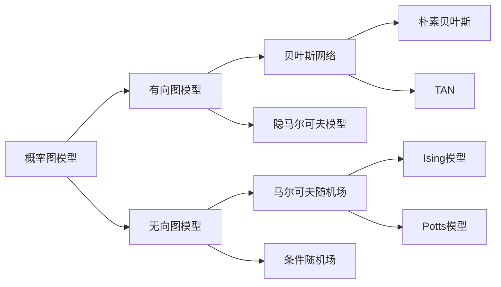

# 概率图模型原理与代码实战案例讲解

关键词：概率图模型、贝叶斯网络、马尔可夫随机场、因子图、隐马尔可夫模型、条件随机场、变分推断、MCMC采样、Python实现

## 1. 背景介绍 
### 1.1 问题的由来
概率图模型(Probabilistic Graphical Models, PGMs)是一类用图来表示变量之间概率依赖关系的模型。它融合了概率论和图论,在许多领域都有广泛应用,如机器学习、自然语言处理、计算机视觉、生物信息学等。概率图模型可以清晰地表示复杂系统中的不确定性和变量之间的关系,是一种非常强大的建模工具。

### 1.2 研究现状
近年来,随着大数据和人工智能的迅猛发展,概率图模型受到越来越多的关注。一方面,海量数据为复杂概率图模型的学习提供了可能;另一方面,概率图模型也为大数据的分析和挖掘提供了新的思路。当前,概率图模型已经成为机器学习领域的重要分支,许多顶级会议如NIPS、ICML、AAAI、IJCAI等都设有专门的概率图模型分会场。

### 1.3 研究意义
概率图模型具有表达能力强、可解释性好、适用领域广等优点。深入研究概率图模型,对于理解复杂系统的内在机理、揭示数据背后的本质规律具有重要意义。同时,概率图模型与其他机器学习方法相结合,有望进一步提升人工智能系统的性能。概率图模型已经在语音识别、自然语言理解、知识图谱、推荐系统等领域取得了瞩目成果,未来还将在更多领域大放异彩。

### 1.4 本文结构
本文将全面介绍概率图模型的基本原理和代码实现。第2部分介绍概率图模型的核心概念;第3部分讲解主要的概率图模型算法;第4部分给出数学模型和公式推导;第5部分提供详细的代码实例;第6部分讨论概率图模型的应用场景;第7部分推荐相关工具和资源;第8部分对全文进行总结。

## 2. 核心概念与联系
概率图模型主要包括有向图模型和无向图模型两大类。有向图模型又称为贝叶斯网络(Bayesian Networks),无向图模型又称为马尔可夫随机场(Markov Random Fields, MRFs)。

在贝叶斯网络中,节点表示随机变量,边表示变量之间的依赖关系,每个节点都有一个条件概率分布。贝叶斯网络常用于表示因果关系,在诊断、决策等领域有重要应用。典型的贝叶斯网络模型包括朴素贝叶斯、树增强朴素贝叶斯(TAN)、最大后验概率树(MPT)等。

在马尔可夫随机场中,节点表示随机变量,边表示变量之间的相关性,没有方向性。马尔可夫随机场常用于表示约束关系,在图像分割、语义标注等领域有广泛应用。典型的马尔可夫随机场模型包括Ising模型、Potts模型、条件随机场(CRF)等。

将有向图和无向图结合起来,就得到了更一般的因子图(Factor Graph)表示。因子图中引入了额外的因子节点,使得概率图模型的表达能力大大增强。很多算法如置信传播(Belief Propagation)、期望最大化(EM)等都是在因子图框架下推导得到的。

概率图模型与许多经典模型存在密切联系。例如隐马尔可夫模型(HMM)可以看作是一种特殊的有向图模型,条件随机场(CRF)可以看作是给定观测值的马尔可夫随机场。图模型为理解各种经典模型提供了新的视角,也启发了很多新模型的设计。



## 3. 核心算法原理 & 具体操作步骤
### 3.1 算法原理概述
概率图模型的核心是学习和推断。学习就是根据观测数据来估计模型参数,推断就是在给定模型结构和参数的情况下,计算某些变量的条件概率分布。常见的学习算法包括极大似然估计、最大后验估计、期望最大化算法等;常见的精确推断算法包括变量消除、置信传播等,近似推断算法包括循环置信传播、Gibbs采样、变分推断等。

### 3.2 算法步骤详解
以贝叶斯网络的变量消除(Variable Elimination)算法为例,其基本步骤如下:
1. 将查询变量之外的变量按任意顺序排列 $X_1,\dots,X_n$。
2. 对 $i=1,2,\dots,n$:
   - 从当前的因子集中,找出所有包含 $X_i$ 的因子,形成集合 $F_i$。
   - 构造一个新因子 $f_i$,其自变量是 $F_i$ 中所有因子的自变量的并集去掉 $X_i$,因子的取值是 $F_i$ 中所有因子的乘积关于 $X_i$ 求和。
   - 将 $F_i$ 从因子集中移除,加入 $f_i$。
3. 此时因子集中只包含查询变量,将所有因子相乘并归一化即得到查询变量的后验概率。

### 3.3 算法优缺点
变量消除算法的优点是精确推断,缺点是当变量和因子数很多时,计算开销会急剧增加。对于树形结构的图,置信传播算法是一种高效的精确推断算法。对于一般结构的图,变分推断和MCMC采样是主要的近似推断算法,通过牺牲一定的精度来降低计算复杂度。

### 3.4 算法应用领域
概率图模型算法被广泛应用于机器学习和人工智能的各个领域。在语音识别中,HMM是主要的声学模型;在自然语言处理中,HMM、MEMM、CRF等被用于词性标注、命名实体识别、句法分析等任务;在计算机视觉中,马尔可夫随机场被用于图像分割、目标检测等;在生物信息学中,贝叶斯网络被用于基因调控网络、蛋白质结构预测等。

## 4. 数学模型和公式 & 详细讲解 & 举例说明
### 4.1 数学模型构建
对于一个包含 $n$ 个变量 $X_1,X_2,\dots,X_n$ 的贝叶斯网络,其联合概率分布可以表示为:

$$
P(X_1,\dots,X_n)=\prod_{i=1}^n P(X_i|Pa(X_i))
$$

其中 $Pa(X_i)$ 表示 $X_i$ 的父节点集合。可见每个变量的条件概率分布只依赖于其父节点。

对于马尔可夫随机场,通常定义能量函数 $E(x)$,联合概率分布可以表示为:

$$
P(X=x)=\frac{1}{Z}\exp(-E(x))
$$

其中 $Z$ 是归一化因子,保证概率和为1。能量函数通常定义为若干势函数之和:

$$
E(x)=\sum_{C}\phi_C(x_C)
$$

其中 $C$ 是最大团,势函数 $\phi_C$ 表示团 $C$ 内变量的相互作用。

### 4.2 公式推导过程
以隐马尔可夫模型的前向-后向算法为例。记观测序列为 $O=(o_1,\dots,o_T)$,状态序列为 $I=(i_1,\dots,i_T)$。定义前向概率 $\alpha_t(i)=P(o_1,\dots,o_t,i_t=i)$,可以递归计算:

$$
\alpha_t(i)=\sum_{j=1}^N \alpha_{t-1}(j)a_{ji}b_i(o_t)
$$

其中 $a_{ji}$ 是状态转移概率,$b_i(o_t)$ 是发射概率。

类似地,定义后向概率 $\beta_t(i)=P(o_{t+1},\dots,o_T|i_t=i)$,有:

$$
\beta_t(i)=\sum_{j=1}^N \beta_{t+1}(j)a_{ij}b_j(o_{t+1}) 
$$

结合前向概率和后向概率,可以计算变量的边缘概率:

$$
P(i_t=i|O)=\frac{\alpha_t(i)\beta_t(i)}{\sum_{j=1}^N \alpha_t(j)\beta_t(j)}
$$

### 4.3 案例分析与讲解
下面以一个简单的朴素贝叶斯文本分类问题为例。假设有两个类别 $C_1,C_2$,词汇表中有 $N$ 个单词 $w_1,\dots,w_N$。给定一个文档 $D=(d_1,\dots,d_M)$,每个 $d_i$ 表示一个单词,我们要计算文档属于每个类别的概率。

根据贝叶斯公式:

$$
P(C|D)=\frac{P(D|C)P(C)}{P(D)}
$$

朴素贝叶斯假设文档中每个单词是条件独立的,因此:

$$
P(D|C)=\prod_{i=1}^M P(d_i|C)
$$

进一步假设单词在每个类别上服从多项式分布,参数为 $\theta_C$,则:

$$
P(d_i|C)=\theta_{C,d_i}
$$

最后,根据极大似然估计可得:

$$
\hat{\theta}_{C,w}=\frac{\text{count}(C,w)+1}{\sum_{w'}\text{count}(C,w')+N}
$$

其中 $\text{count}(C,w)$ 表示类别 $C$ 下单词 $w$ 的出现次数。分母中加上 $N$ 是为了平滑,避免概率为0。

### 4.4 常见问题解答
Q: 朴素贝叶斯为什么叫"朴素"?
A: 因为它假设文档中每个单词是条件独立的,这显然是一个较强的假设。尽管如此,朴素贝叶斯在文本分类等任务上的表现常常出奇的好。

Q: 概率图模型能否表示任意概率分布?
A: 理论上,只要图模型的结构足够复杂,参数足够多,就可以逼近任意概率分布。但在实际应用中,我们希望用尽可能简单的模型去拟合数据,这需要对问题领域有深入的理解,选择合适的图模型。图模型的设计是一个需要经验和创新的过程。

## 5. 项目实践：代码实例和详细解释说明
### 5.1 开发环境搭建
本项目使用Python 3.x作为开发语言,需要安装以下库:
- NumPy: 数值计算库
- SciPy: 科学计算库  
- Pandas: 数据分析处理库
- Matplotlib: 绘图库
- pgmpy: 概率图模型库

可以使用pip安装:
```
pip install numpy scipy pandas matplotlib pgmpy
```

### 5.2 源代码详细实现
下面是使用pgmpy库实现的一个简单的贝叶斯网络例子,根据天气、是否周末等因素推断一个人是否去打高尔夫球。

```python
from pgmpy.models import BayesianModel
from pgmpy.factors.discrete import TabularCPD

# 定义有向图
model = BayesianModel([('Weather', 'Golf'), 
                       ('Weekend', 'Golf')])
                       
# 定义条件概率分布
cpd_weather = TabularCPD(variable='Weather', 
                         variable_card=3, 
                         values=[[0.6, 0.3, 0.1]])

cpd_weekend = TabularCPD(variable='Weekend',
                         variable_card=2,
                         values=[[0.8, 0.2]])
                         
cpd_golf = TabularCPD(variable='Golf', 
                      variable_card=2, 
                      values=[[0.