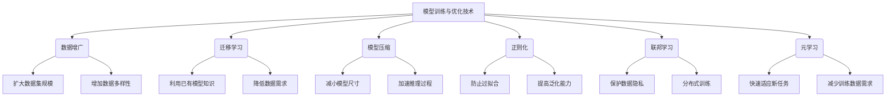

# 模型训练与优化技术原理与代码实战案例讲解

## 1. 背景介绍

### 1.1 问题的由来

在当今的数据时代,机器学习和深度学习模型已经广泛应用于各个领域,包括计算机视觉、自然语言处理、推荐系统等。然而,训练一个高质量的模型并非一蹴而就,需要解决诸多挑战。首先,大规模数据集的获取和处理是一个巨大的工程挑战。其次,模型的训练过程通常耗时耗力,需要大量的计算资源。再者,模型的泛化能力、鲁棒性和可解释性等方面也需要进一步优化。

### 1.2 研究现状

为了解决上述问题,研究人员提出了多种模型训练和优化技术,包括数据增广、迁移学习、模型压缩、正则化等。这些技术从不同角度优化模型的性能,提高了模型的泛化能力和效率。同时,也出现了一些新的训练范式,如联邦学习、元学习等,旨在解决数据隐私和少样本学习等问题。

### 1.3 研究意义

优化模型训练过程对于提高模型性能、降低计算成本、保护数据隐私等具有重要意义。通过研究和应用先进的训练优化技术,我们可以获得更精确、更高效、更可解释的模型,从而推动人工智能技术在各个领域的应用和发展。

### 1.4 本文结构

本文将全面介绍模型训练与优化技术的原理和实践。首先,我们将探讨核心概念和算法原理,包括数据增广、迁移学习、模型压缩等。接下来,我们将详细讲解相关的数学模型和公式推导过程。然后,我们将通过代码实例和案例分析,展示这些技术在实际项目中的应用。最后,我们将总结未来发展趋势和面临的挑战。

## 2. 核心概念与联系

上图展示了模型训练与优化技术的核心概念及其相互联系。我们可以从以下几个方面来理解和应用这些技术:

1. **数据增广**:通过对现有数据进行变换(如旋转、缩放、翻转等)来扩大数据集规模,增加数据多样性,从而提高模型的泛化能力。

2. **迁移学习**:利用已有模型在相关任务上学习到的知识,减少了对新任务的数据需求,加快了新模型的训练过程。

3. **模型压缩**:通过剪枝、量化、知识蒸馏等技术,减小模型的尺寸和计算复杂度,加速推理过程,降低部署成本。

4. **正则化**:通过添加约束项(如L1/L2正则化)或者引入噪声(如Dropout),防止模型过拟合,提高模型的泛化能力。

5. **联邦学习**:在保护数据隐私的前提下,进行分布式训练,利用多个机构或设备的数据,提高模型性能。

6. **元学习**:通过学习"如何学习",快速适应新任务,减少对新任务的训练数据需求。

这些技术相互关联、相辅相成,共同推动了模型训练与优化的发展。在实际应用中,我们可以根据具体场景和需求,选择和组合使用合适的技术。

## 3. 核心算法原理 & 具体操作步骤

### 3.1 算法原理概述

在本节,我们将介绍三种核心算法的原理:数据增广、迁移学习和模型压缩。

1. **数据增广**:数据增广的核心思想是通过对现有数据进行一系列变换(如旋转、缩放、翻转等),生成新的训练样本,扩大数据集的规模和多样性。这种方法可以有效防止过拟合,提高模型的泛化能力。常见的数据增广技术包括:

   - 图像增广:旋转、平移、缩放、翻转、裁剪、噪声注入等。
   - 文本增广:同义词替换、随机插入/交换/删除单词等。
   - 语音增广:时间扭曲、pitched扭曲、加性噪声等。

2. **迁移学习**:迁移学习的核心思想是利用在源域(source domain)学习到的知识,加速在目标域(target domain)的模型训练。常见的迁移学习方法包括:

   - 特征提取:使用源域模型提取通用特征,在目标域进行微调。
   - 微调(fine-tuning):在源域预训练模型的基础上,使用目标域数据进行进一步训练。
   - 模型蒸馏:利用教师模型(源域模型)指导学生模型(目标域模型)的训练。

3. **模型压缩**:模型压缩的核心思想是减小模型的尺寸和计算复杂度,加速推理过程,降低部署成本。常见的模型压缩技术包括:

   - 剪枝(pruning):通过移除冗余的权重和神经元,压缩模型尺寸。
   - 量化(quantization):将浮点数权重和激活值量化为低精度值(如8位或更低),减小模型尺寸和计算开销。
   - 知识蒸馏:利用大型教师模型指导小型学生模型的训练,在保持性能的同时压缩模型尺寸。

### 3.2 算法步骤详解

接下来,我们将详细介绍上述三种算法的具体操作步骤。

#### 3.2.1 数据增广算法步骤

1. 收集和准备原始数据集。
2. 定义数据增广策略,包括要应用的变换操作及其参数。
3. 对原始数据集进行变换,生成新的训练样本。
4. 将原始数据集和新生成的样本合并,构建扩大的训练集。
5. 使用扩大的训练集训练模型。
6. 评估模型在验证集上的性能,根据需要调整增广策略。
7. 在测试集上评估最终模型的性能。

#### 3.2.2 迁移学习算法步骤

1. 选择合适的源域模型,通常是在大型数据集上预训练的模型。
2. 根据目标任务的特点,选择合适的迁移学习方法(特征提取、微调或模型蒸馏)。
3. 准备目标域数据集,进行必要的预处理和标注。
4. 根据选择的迁移学习方法,设计模型架构和训练流程。
5. 使用源域模型的权重初始化目标模型的部分或全部参数。
6. 在目标域数据集上训练和优化目标模型。
7. 评估模型在验证集上的性能,根据需要调整超参数和训练策略。
8. 在测试集上评估最终模型的性能。

#### 3.2.3 模型压缩算法步骤

1. 训练一个高性能但计算开销大的教师模型。
2. 设计一个小型的学生模型架构。
3. 根据具体压缩技术(剪枝、量化或知识蒸馏),设计压缩流程。
4. 对教师模型进行压缩,生成压缩后的学生模型。
5. (可选)在原始训练数据集上进一步微调学生模型。
6. 评估压缩后模型在验证集上的性能,根据需要调整压缩策略。
7. 在测试集上评估最终压缩模型的性能和计算效率。

### 3.3 算法优缺点

#### 3.3.1 数据增广

**优点**:
- 扩大训练数据集规模,增加数据多样性。
- 提高模型的泛化能力,防止过拟合。
- 相对简单,易于实现和应用。

**缺点**:
- 生成的新数据可能与真实数据存在差异。
- 增广策略的选择需要领域知识和经验。
- 对于某些任务(如自然语言处理),增广效果可能有限。

#### 3.3.2 迁移学习

**优点**:
- 利用已有模型的知识,加速新模型的训练。
- 减少对新任务的数据需求。
- 在数据稀缺的领域尤其有效。

**缺点**:
- 源域和目标域之间的差异可能导致负迁移。
- 需要选择合适的源域模型和迁移方法。
- 微调过程可能需要大量计算资源。

#### 3.3.3 模型压缩

**优点**:
- 减小模型尺寸,降低计算和存储开销。
- 加速推理过程,提高部署效率。
- 使大型模型能够在资源受限的设备上运行。

**缺点**:
- 压缩过程可能导致性能下降。
- 需要设计合适的压缩策略和超参数。
- 压缩后的模型可解释性可能降低。

### 3.4 算法应用领域

上述三种算法在不同领域都有广泛的应用:

- **数据增广**:计算机视觉、自然语言处理、语音识别等。
- **迁移学习**:医疗影像分析、情感分析、机器翻译等。
- **模型压缩**:移动设备、物联网、边缘计算等资源受限场景。

除了上述领域,这些算法还可以应用于其他各种机器学习任务,如推荐系统、时序预测、强化学习等。选择合适的算法和策略,可以有效提高模型性能、降低计算开销,推动人工智能技术的发展和应用。

## 4. 数学模型和公式 & 详细讲解 & 举例说明

在本节中,我们将介绍与模型训练和优化相关的数学模型和公式,并通过案例分析加深理解。

### 4.1 数学模型构建

#### 4.1.1 数据增广

数据增广可以看作是一种数据变换过程,将原始数据 $x$ 映射到新的数据 $x'$。我们可以使用变换函数 $f$ 来表示这一过程:

$$x' = f(x; \theta)$$

其中 $\theta$ 表示变换函数的参数,如旋转角度、缩放比例等。通过对 $\theta$ 进行采样,我们可以生成不同的变换样本。

对于图像数据,常见的变换函数包括:

- 旋转: $f(x; \theta) = \text{rotate}(x, \theta)$
- 平移: $f(x; \theta_x, \theta_y) = \text{translate}(x, \theta_x, \theta_y)$
- 缩放: $f(x; \theta_x, \theta_y) = \text{scale}(x, \theta_x, \theta_y)$

对于文本数据,常见的变换函数包括:

- 同义词替换: $f(x; \theta) = \text{replace}(x, \theta)$
- 单词插入/删除: $f(x; \theta) = \text{insert/delete}(x, \theta)$

通过组合不同的变换函数,我们可以构建复杂的数据增广策略。

#### 4.1.2 迁移学习

在迁移学习中,我们希望利用源域模型 $f_S$ 在目标域 $\mathcal{T}$ 上的性能接近于在源域 $\mathcal{S}$ 上的性能。我们可以将这一目标建模为最小化以下损失函数:

$$\mathcal{L}(\theta_T) = \mathbb{E}_{x_T \sim \mathcal{T}} [l(f_T(x_T; \theta_T), y_T)] + \lambda d(f_S, f_T)$$

其中:

- $\theta_T$ 表示目标域模型 $f_T$ 的参数。
- $l(\cdot)$ 是预测损失函数,如交叉熵损失。
- $d(f_S, f_T)$