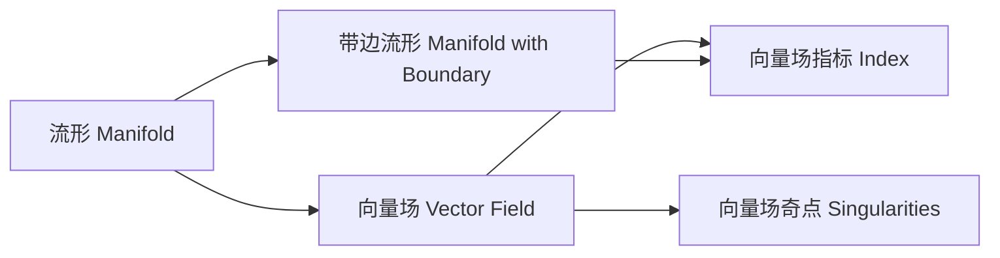

# 流形拓扑学理论与概念的实质：带边流形的向量场指标公式

关键词：流形拓扑、向量场、带边流形、指标公式、Poincaré-Hopf定理

## 1. 背景介绍
### 1.1 问题的由来
流形拓扑学是现代数学的一个重要分支,它研究流形的拓扑性质。流形作为一种基本的几何对象,在物理、工程等领域有着广泛的应用。向量场是流形上的一种基本结构,它在动力系统、微分方程等方面扮演着重要角色。研究流形上向量场的拓扑性质,对于理解流形的整体结构具有重要意义。

### 1.2 研究现状
流形上向量场的研究已有悠久历史,取得了许多重要成果。其中一个里程碑式的结果是Poincaré-Hopf定理,它揭示了流形上向量场奇点的数目与流形的欧拉示性数之间的关系。对于带边流形,即具有非空边界的流形,向量场的研究则相对较少。Morse在其开创性的工作中,研究了带边流形上梯度向量场的临界点与流形拓扑的关系。之后,一些学者对带边流形上的向量场指标公式进行了研究,取得了一些重要进展。

### 1.3 研究意义 
带边流形在物理、工程中有着重要应用,例如带边界的区域、具有边界条件的偏微分方程等。研究带边流形上向量场的拓扑性质,对于理解这些问题的本质具有重要意义。同时,带边流形上的向量场理论也是流形拓扑学的重要组成部分,其研究有助于深化我们对流形结构的认识。此外,向量场指标公式作为一种重要的拓扑工具,在其他数学分支如动力系统、微分方程中也有广泛应用。

### 1.4 本文结构
本文将围绕带边流形上向量场的指标公式展开讨论。第2节介绍流形、向量场等核心概念。第3节讨论带边流形上向量场的延拓问题。第4节给出带边流形上向量场指标的数学模型,并推导相关公式。第5节通过具体算例说明公式的应用。第6节讨论指标公式的实际应用场景。第7节介绍相关工具和学习资源。第8节对全文进行总结,并展望未来研究方向。

## 2. 核心概念与联系
流形是一个局部类似于欧氏空间$\mathbb{R}^n$的空间。$n$维流形$M$是一个$n$维的拓扑空间,且每一点都有一个同胚于$\mathbb{R}^n$的开邻域。如果$M$是带边流形,则$M$有非空边界$\partial M$。

向量场是流形上的一个光滑切向量丛截面。在局部坐标$(x^1,\cdots,x^n)$下,向量场$V$可以写成$V=\sum_{i=1}^n a^i(x) \frac{\partial}{\partial x^i}$,其中$a^i(x)$是光滑函数。向量场的奇点是向量场为零的点。

向量场的指标是一个重要的拓扑不变量,它反映了向量场奇点的分布情况。在闭流形(即无边流形)上,Poincaré-Hopf定理表明向量场指标等于流形的欧拉示性数$\chi(M)$。对于带边流形,情况更加复杂,需要考虑边界的影响。

## 3. 核心算法原理 & 具体操作步骤
### 3.1 算法原理概述
在带边流形$M$上,要定义向量场的指标,首先需要将向量场延拓到边界上。通过在边界$\partial M$的领域内构造合适的向量场,使其与原向量场在边界上匹配,从而得到$M$上的新向量场。新向量场的奇点包括原向量场的内部奇点和边界上新引入的奇点。将这些奇点的指标相加,再加上一个修正项,就得到了带边流形上向量场的指标。

### 3.2 算法步骤详解
1. 考虑带边流形$M$和$M$上的向量场$V$。
2. 在边界$\partial M$的一个领域$U$内,构造向量场$W$,使其在边界上与$V$匹配,即$W|_{\partial M}=V|_{\partial M}$。
3. 将$V$和$W$粘合,得到$M$上的新向量场$\tilde{V}$。
4. 找出$\tilde{V}$的所有奇点,包括原向量场$V$的内部奇点和边界上新引入的奇点。
5. 计算每个奇点处的指标$\mathrm{ind}_p(\tilde{V})$。
6. 将所有奇点的指标求和,得到$\sum_{p\in\mathrm{Zero}(\tilde{V})}\mathrm{ind}_p(\tilde{V})$。
7. 计算边界$\partial M$的欧拉示性数$\chi(\partial M)$。
8. 带边流形$M$上向量场$V$的指标为:
$$
\mathrm{Ind}(V,M)=\sum_{p\in\mathrm{Zero}(\tilde{V})}\mathrm{ind}_p(\tilde{V})+\frac{1}{2}\chi(\partial M)
$$

### 3.3 算法优缺点
该算法的优点在于,它给出了带边流形上向量场指标的一般计算方法。通过延拓技巧,将问题转化为计算内部奇点和边界奇点的指标,并用边界的拓扑不变量进行修正,得到了最终结果。

算法的缺点在于,延拓向量场的构造并不唯一,不同的延拓可能导致不同的奇点分布。虽然最终的指标结果不依赖于具体延拓,但在实际计算时如何选取合适的延拓是一个值得考虑的问题。

### 3.4 算法应用领域
该算法是研究带边流形上向量场拓扑性质的重要工具,在流形拓扑学中有广泛应用。同时,它也为其他领域如动力系统、微分方程等提供了新的视角和方法。向量场的奇点分布与系统的定性行为密切相关,指标公式则提供了刻画这种关系的定量工具。在实际应用中,我们可以利用指标公式研究带边界区域上定义的向量场,分析其奇点分布和拓扑性质,从而深入理解问题的本质。

## 4. 数学模型和公式 & 详细讲解 & 举例说明
### 4.1 数学模型构建
考虑带边紧致流形$M$,其边界为$\partial M$。设$V$是$M$上的连续向量场,我们要定义$V$在$M$上的指标$\mathrm{Ind}(V,M)$。

首先,在边界$\partial M$的领域$U$内构造向量场$W$,使其满足:
1. $W$在$U$内光滑;
2. $W$在边界上与$V$匹配,即$W|_{\partial M}=V|_{\partial M}$;
3. $W$在$U\setminus \partial M$内无奇点。

这样,我们得到$M$上的新向量场$\tilde{V}$,它在内部与$V$一致,在边界附近与$W$一致。

### 4.2 公式推导过程
对新向量场$\tilde{V}$,考虑其奇点集$\mathrm{Zero}(\tilde{V})$。它包括两部分:
1. 原向量场$V$在$M\setminus U$内的奇点集$\mathrm{Zero}(V)\cap (M\setminus U)$;
2. 新引入的边界奇点集$\mathrm{Zero}(W)\cap \partial M$。

对每个奇点$p\in\mathrm{Zero}(\tilde{V})$,定义其指标$\mathrm{ind}_p(\tilde{V})$。具体地,取包含$p$的坐标邻域$(U_p,\varphi)$,其中$\varphi:U_p\to\mathbb{R}^n$是坐标映射。在局部坐标下,向量场$\tilde{V}$可以写为$\sum_{i=1}^n a^i(x) \frac{\partial}{\partial x^i}|_p$。令
$$
J_p=\left(\frac{\partial a^i}{\partial x^j}(p)\right)_{1\leq i,j\leq n}
$$
为$p$点的Jacobi矩阵。若$J_p$非奇异,则$p$点的指标定义为
$$
\mathrm{ind}_p(\tilde{V})=\mathrm{sgn}(\det J_p)=\begin{cases}
+1, & \det J_p>0\\
-1, & \det J_p<0
\end{cases}
$$

现在,我们可以给出带边流形$M$上向量场$V$的指标公式:
$$
\boxed{\mathrm{Ind}(V,M)=\sum_{p\in\mathrm{Zero}(\tilde{V})}\mathrm{ind}_p(\tilde{V})+\frac{1}{2}\chi(\partial M)}
$$
其中$\chi(\partial M)$是边界$\partial M$的欧拉示性数。

### 4.3 案例分析与讲解
考虑2维带边流形$M=\{(x,y)\in\mathbb{R}^2|x^2+y^2\leq 1\}$,即单位圆盘。其边界为单位圆周$\partial M=\{(x,y)\in\mathbb{R}^2|x^2+y^2=1\}$。

在$M$上定义向量场$V(x,y)=(x,y)$,即向外的径向向量场。容易看出,$V$在圆盘内部无奇点,在边界上每一点都是奇点。

为计算$V$的指标,我们在边界附近构造新的向量场$W$。例如,取$U=\{(x,y)\in\mathbb{R}^2|1-\varepsilon<x^2+y^2\leq 1\}$为边界的一个邻域,其中$0<\varepsilon<1$。在$U$内定义$W(x,y)=(x,-y)$,即将$y$方向反转。容易验证,$W$满足延拓条件,且在$U\setminus \partial M$内无奇点。

新向量场$\tilde{V}$的奇点集包括两部分:
1. 原向量场$V$在内部$M\setminus U$的奇点集,即空集;
2. 边界奇点集$\mathrm{Zero}(W)\cap \partial M$,即单位圆周上每一点。

对边界上的每个奇点$p=(x_0,y_0)$,取自然坐标$(x,y)$。在$p$点,Jacobi矩阵为
$$
J_p=\begin{pmatrix}
1 & 0\\
0 & -1
\end{pmatrix}
$$
故每个边界奇点的指标为$\mathrm{ind}_p(\tilde{V})=\mathrm{sgn}(\det J_p)=-1$。

由于圆周$\partial M$的欧拉示性数为$\chi(\partial M)=0$,故由指标公式得
$$
\mathrm{Ind}(V,M)=\sum_{p\in\partial M}(-1)+\frac{1}{2}\cdot 0=0
$$
即向量场$V$在圆盘$M$上的指标为零。这与我们的直观理解一致:向外的径向向量场在内部无奇点,在边界上奇点互相抵消。

### 4.4 常见问题解答
Q: 延拓向量场$W$的选取是否影响最终结果?
A: 虽然延拓向量场的选取并不唯一,但最终的指标结果并不依赖于具体延拓。不同的延拓可能导致不同的边界奇点分布,但它们对指标的贡献之和保持不变。

Q: 边界奇点的指标如何计算?
A: 与内部奇点类似,边界奇点的指标也可以用Jacobi行列式的符号来定义。取包含边界奇点的坐标邻域,将向量场在局部坐标下写出,计算Jacobi矩阵并取行列式的符号即可。

Q: 公式中的$\frac{1}{2}\chi(\partial M)$项有何几何意义?
A: 这一项可以看作边界对向量场指标的修正。当边界$\partial M$非空时,我们在边界附近引入了新的奇点,它们对指标有