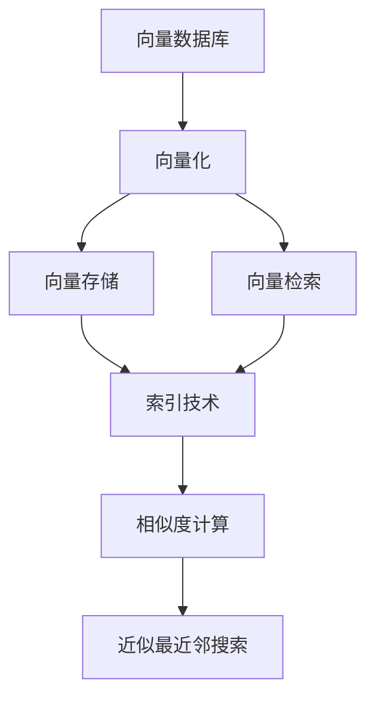
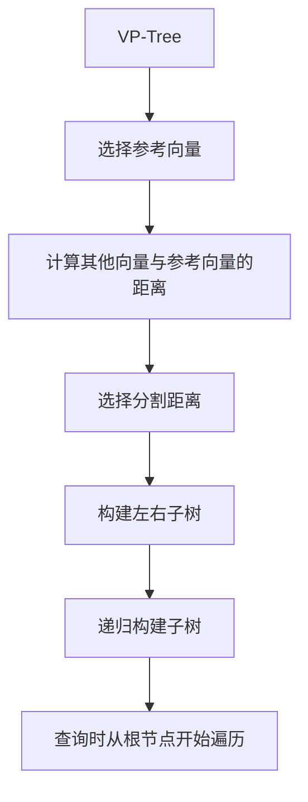
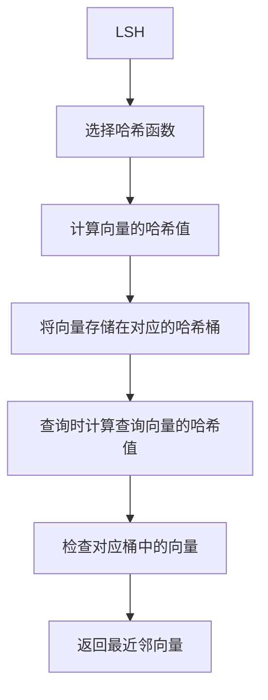
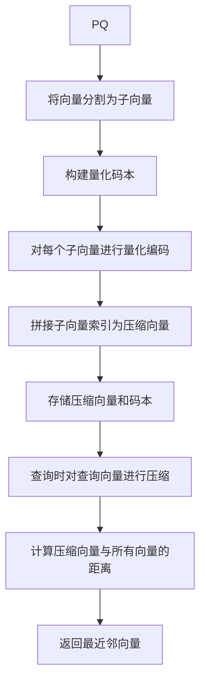

# 深入解析向量数据库的索引技术与优化方法

作者：禅与计算机程序设计艺术 / Zen and the Art of Computer Programming

## 1. 背景介绍

### 1.1 问题的由来

随着大数据时代的到来,数据量呈现出爆炸式增长,传统的结构化数据库已经无法满足现代应用对海量非结构化数据(如文本、图像、音视频等)的存储和检索需求。在这种背景下,向量数据库(Vector Database)应运而生,它能够高效地存储和检索向量化的非结构化数据。

向量数据库的核心是通过将非结构化数据(如文本、图像等)转换为向量的形式进行存储,然后利用向量相似度计算来实现高效的相似性检索。然而,随着数据规模的不断扩大,如何快速地在海量向量数据中找到相似向量成为了一个巨大的挑战。这就需要高效的索引技术来加速相似向量的查找过程。

### 1.2 研究现状

目前,向量数据库的索引技术主要有以下几种:

1. **树状索引**(Tree-based Indexes)：包括VP-Tree、BK-Tree、PB-Tree等,它们通过构建树状结构来组织向量数据,并利用分治策略进行相似向量查找。
2. **哈希索引**(Hashing-based Indexes)：包括LSH(Locality-Sensitive Hashing)、SH(Spectral Hashing)等,它们通过将向量映射到哈希桶中,从而将相似向量聚集在同一个或相邻的桶中,加快了查找速度。
3. **向量压缩**(Vector Compression)：通过对向量进行压缩来减小存储空间,从而提高查询效率。常见的压缩方法包括PQ(Product Quantization)、OPQ(Optimized Product Quantization)等。
4. **GPU加速**(GPU Acceleration)：利用GPU的并行计算能力来加速相似向量的查找过程。

尽管现有的索引技术取得了一定的进展,但仍然存在一些挑战和局限性,例如:

- 索引构建时间过长
- 索引占用的存储空间过大
- 查询精度和效率之间的权衡
- 难以适应高维向量和动态数据场景

因此,如何设计更高效、更精确、更通用的索引技术,成为了向量数据库发展的关键。

### 1.3 研究意义

高效的向量索引技术对于提升向量数据库的性能至关重要,具有重大的理论和实际意义:

- **理论意义**:向量索引技术涉及多个领域的知识,包括数据结构、算法设计、近似最近邻搜索、向量压缩等,对于推动这些领域的理论发展具有重要作用。
- **实际意义**:向量数据库广泛应用于信息检索、推荐系统、计算机视觉、自然语言处理等领域,高效的索引技术可以显著提升这些应用的性能,为各行业带来巨大的经济价值。

### 1.4 本文结构

本文将全面深入地探讨向量数据库的索引技术及优化方法,内容安排如下:

1. 介绍向量数据库的核心概念和基本原理
2. 详细阐述主流的向量索引算法,包括原理、实现步骤、优缺点分析等
3. 推导常用的向量相似度计算公式,并结合案例进行讲解
4. 通过实际项目实践,展示如何在代码层面实现向量索引
5. 分析向量索引技术在不同场景下的应用,并展望未来发展趋势
6. 推荐相关的学习资源、开发工具和论文,方便读者进一步深入研究
7. 总结全文的核心内容,指出当前面临的挑战并对未来发展提出展望

## 2. 核心概念与联系

在深入探讨向量索引技术之前,我们先来了解一些向量数据库的核心概念:

1. **向量化(Vectorization)**:将非结构化数据(如文本、图像等)转换为向量的过程。常用的向量化方法包括Word2Vec、Doc2Vec(文本)、CNN、ResNet(图像)等。

2. **向量存储(Vector Storage)**:高效地存储海量向量数据,通常采用列存储或压缩存储的方式。

3. **向量检索(Vector Retrieval)**:根据给定的查询向量,快速找到数据库中最相似的向量集合,这是向量数据库最核心的功能。

4. **索引技术(Indexing Techniques)**:为了加速向量检索的过程,向量数据库需要构建高效的索引结构,包括树状索引、哈希索引、向量压缩等。

5. **相似度计算(Similarity Computation)**:衡量两个向量之间相似程度的度量标准,常用的相似度函数包括欧几里得距离、余弦相似度、杰卡德相似度等。

6. **近似最近邻搜索(Approximate Nearest Neighbor Search)**:在海量向量数据中快速找到与查询向量最相似的一组向量,是向量检索的核心算法。

上述概念相互关联、环环相扣,构成了向量数据库的理论基础和技术框架。接下来,我们将重点关注其中的索引技术,并深入探讨其算法原理、实现方法和优化策略。

## 3. 核心算法原理 & 具体操作步骤  

### 3.1 算法原理概述

向量数据库的索引技术主要包括以下几种主流算法:

1. **树状索引算法**
   - VP-Tree (Vantage Point Tree)
   - BK-Tree (Burkhard-Keller Tree)
   - PB-Tree (Pivot Binning Tree)
   - ...

2. **哈希索引算法**  
   - LSH (Locality-Sensitive Hashing)
   - SH (Spectral Hashing)
   - ALSH (Asymmetric Locality-Sensitive Hashing)
   - ...

3. **向量压缩算法**
   - PQ (Product Quantization)
   - OPQ (Optimized Product Quantization)
   - IVFPQ (Inverted File with Product Quantization)
   - ...

这些算法各有特点,在不同的场景下表现也不尽相同。我们将分别介绍它们的核心思想、实现步骤和优缺点分析。

### 3.2 算法步骤详解

#### 3.2.1 VP-Tree (Vantage Point Tree)

VP-Tree是一种平衡的二叉树索引结构,它的核心思想是以一个参考向量(vantage point)为中心,将其他向量根据与该参考向量的距离分为两个子集,分别构建左右子树。具体步骤如下:

1. 选择一个参考向量 $p$ 作为树的根节点
2. 计算所有其他向量 $v$ 与 $p$ 的距离 $d(v, p)$
3. 选择一个分割距离 $r$,通常取所有距离的中位数
4. 将所有向量分为两个子集:
   - 左子树包含所有 $d(v, p) < r$ 的向量
   - 右子树包含所有 $d(v, p) \geq r$ 的向量
5. 递归地对左右子树重复上述过程,直到子集中只有一个向量为止

在查询时,从根节点开始,根据查询向量与参考向量的距离决定向左子树还是右子树查找,直到找到最近邻向量或遍历完整棵树。

VP-Tree的优点是查询效率较高,缺点是构建时间较长,并且在高维数据上性能会下降。

#### 3.2.2 LSH (Locality-Sensitive Hashing)

LSH是一种常用的哈希索引算法,它的核心思想是通过设计特殊的哈希函数,使得相似的向量有很高的概率被映射到同一个哈希桶中,从而加快相似向量的查找速度。具体步骤如下:

1. 选择一组 $k$ 个哈希函数 $h_1, h_2, \ldots, h_k$,每个函数将向量映射到一个哈希值
2. 对每个向量 $v$,计算 $k$ 个哈希值 $(h_1(v), h_2(v), \ldots, h_k(v))$,将这 $k$ 个值作为一个桶的键(key)
3. 将向量 $v$ 存储在对应的哈希桶中
4. 查询时,对查询向量 $q$ 计算 $k$ 个哈希值,检查对应桶中的向量,返回最近邻向量

LSH的优点是查询效率高,缺点是需要多次哈希计算,并且存在一定的失误率(false positive和false negative)。

#### 3.2.3 PQ (Product Quantization)

PQ是一种常用的向量压缩算法,它的核心思想是将高维向量分割成多个低维子向量,分别对每个子向量进行量化编码,从而减小存储空间并加速相似度计算。具体步骤如下:

1. 将原始向量 $x \in \mathbb{R}^d$ 分割成 $m$ 个子向量 $x_1, x_2, \ldots, x_m$,每个子向量维度为 $d/m$
2. 对每个子向量 $x_i$,构建一个量化码本 $C_i$,包含 $k$ 个码字(codeword)
3. 对每个子向量 $x_i$,找到与之最近的码字 $c_i \in C_i$,将原始子向量 $x_i$ 用码字 $c_i$ 的索引(index)代替
4. 将所有子向量的索引拼接成压缩向量 $\hat{x} = [idx(c_1), idx(c_2), \ldots, idx(c_m)]$
5. 存储压缩向量 $\hat{x}$ 和所有码本 $C_1, C_2, \ldots, C_m$
6. 查询时,对查询向量 $q$ 进行同样的压缩操作,得到压缩向量 $\hat{q}$,然后计算 $\hat{q}$ 与所有压缩向量的距离,返回最近邻向量

PQ的优点是压缩率高、查询速度快,缺点是压缩过程会引入一定的精度损失。

上述只是介绍了三种典型的索引算法,实际上还有许多其他算法,如BK-Tree、PB-Tree、SH、ALSH、OPQ、IVFPQ等,它们各有特点,适用于不同的场景。在实际应用中,往往需要根据具体需求和数据特征,选择合适的索引算法或者组合使用多种算法。

### 3.3 算法优缺点

每种索引算法都有其优缺点,我们总结如下:

1. **树状索引算法**
   - 优点:查询效率较高,特别是在低维数据上表现良好
   - 缺点:构建时间较长,在高维数据上性能下降
2. **哈希索引算法**
   - 优点:查询速度快,适用于海量数据
   - 缺点:存在一定的失误率,需要多次哈希计算
3. **向量压缩算法**
   - 优点:压缩率高,存储空间小,查询速度快
   - 缺点:压缩过程会引入一定的