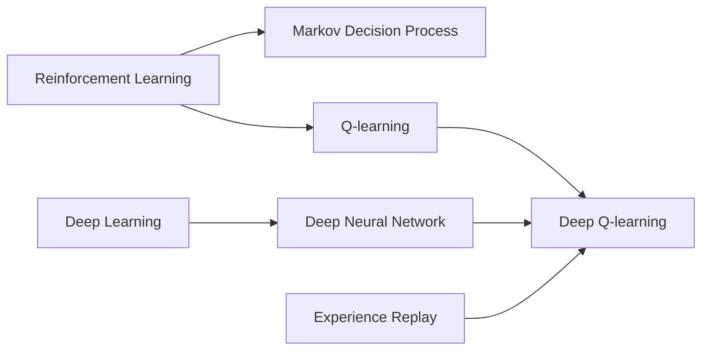

# 深度 Q-learning：基础概念解析

## 1. 背景介绍
### 1.1  问题的由来
在人工智能领域中，强化学习(Reinforcement Learning)是一个重要的研究方向。它旨在让智能体(Agent)通过与环境的交互，学习如何采取最优的行动策略，以获得最大的累积奖励。而Q-learning作为强化学习的一种经典算法，为解决复杂的决策问题提供了有效的解决方案。

然而，传统的Q-learning算法在面对高维、连续的状态空间时，往往难以收敛，限制了其在实际应用中的表现。为了克服这一挑战，研究者们将深度学习与Q-learning相结合，提出了深度Q-learning(Deep Q-learning)算法。

### 1.2  研究现状
深度Q-learning自2013年被提出以来，迅速成为了强化学习领域的研究热点。Google DeepMind团队在《Playing Atari with Deep Reinforcement Learning》一文中，首次将卷积神经网络(CNN)与Q-learning相结合，实现了在Atari游戏中的超人级别表现，引起了学术界和工业界的广泛关注。

此后，深度Q-learning在机器人控制、自动驾驶、推荐系统等诸多领域得到了应用。同时，研究者们也在不断改进算法，提出了Double DQN、Dueling DQN、Prioritized Experience Replay等变体，进一步提升了深度Q-learning的性能和稳定性。

### 1.3  研究意义
深度Q-learning的研究意义主要体现在以下几个方面：

1. 拓展了强化学习的应用范围。深度Q-learning能够处理高维、连续的状态空间，使得强化学习能够应用于更加复杂的实际场景。

2. 提升了智能体的决策能力。通过深度神经网络强大的表示学习能力，深度Q-learning能够从原始的高维感知数据中，自动提取出有效的特征表示，从而做出更加准确的决策。

3. 为智能体的自主学习提供了新的思路。深度Q-learning展示了端到端的强化学习范式，即智能体无需人工设计特征，而是通过与环境的交互，自主地学习最优策略，这为实现通用人工智能(AGI)提供了重要启示。

### 1.4  本文结构
本文将围绕深度Q-learning的基础概念展开，主要内容包括：

- 第2部分介绍深度Q-learning的核心概念与相关知识。
- 第3部分详细阐述深度Q-learning的算法原理和操作步骤。
- 第4部分给出深度Q-learning的数学模型和公式推导。
- 第5部分通过代码实例，演示深度Q-learning的具体实现。
- 第6部分讨论深度Q-learning的实际应用场景。
- 第7部分推荐深度Q-learning的学习资源和开发工具。
- 第8部分总结全文，并展望深度Q-learning的未来发展趋势和挑战。
- 第9部分列举深度Q-learning的常见问题，并给出解答。

## 2. 核心概念与联系
在深入探讨深度Q-learning之前，我们需要了解其背后的一些核心概念：

- 强化学习(Reinforcement Learning)：一种让智能体通过与环境交互来学习最优策略的机器学习范式。
- 马尔可夫决策过程(Markov Decision Process, MDP)：用于描述强化学习问题的数学框架，由状态(State)、动作(Action)、转移概率(Transition Probability)和奖励(Reward)组成。
- Q-learning：一种无模型(Model-Free)、异策略(Off-Policy)的时序差分(Temporal Difference, TD)学习算法，通过迭代更新动作-状态值函数(Q函数)来逼近最优策略。
- 深度学习(Deep Learning)：一类基于多层神经网络的机器学习方法，能够从数据中自动学习多层次的特征表示。
- 深度神经网络(Deep Neural Network, DNN)：由多个隐藏层组成的人工神经网络，常用于实现深度学习。
- 经验回放(Experience Replay)：一种缓存并重用智能体与环境交互数据的机制，用于打破数据的相关性，提高样本利用效率。

深度Q-learning正是将Q-learning与深度神经网络(DNN)相结合的产物。其基本思想是：用DNN来逼近Q函数，将原始的高维状态作为神经网络的输入，输出各个动作的Q值。通过最小化TD误差，来不断优化DNN的参数，最终得到一个能够准确估计Q值的神经网络模型。在训练过程中，深度Q-learning采用经验回放和固定Q目标(Fixed Q-targets)等技巧，以提高算法的稳定性和样本效率。

下图展示了深度Q-learning中各个核心概念之间的联系：

## 3. 核心算法原理 & 具体操作步骤
### 3.1  算法原理概述
深度Q-learning的核心是使用深度神经网络(DNN)来逼近最优的Q函数。Q函数定义为在状态s下采取动作a，然后遵循策略$\pi$的期望累积奖励：

$$
Q^{\pi}(s,a)=\mathbb{E}_{\pi}\left[\sum_{t=0}^{\infty} \gamma^{t} r_{t} \mid s_{0}=s, a_{0}=a\right]
$$

其中，$\gamma \in [0,1]$是折扣因子，用于平衡即时奖励和未来奖励。最优Q函数$Q^*(s,a)$满足Bellman最优方程：

$$
Q^{*}(s, a)=\mathbb{E}_{s^{\prime}}\left[r+\gamma \max _{a^{\prime}} Q^{*}\left(s^{\prime}, a^{\prime}\right) \mid s, a\right]
$$

深度Q-learning使用DNN $Q(s,a;\theta)$来逼近$Q^*(s,a)$，其中$\theta$为神经网络的参数。网络的输入为状态s，输出为各个动作的Q值。训练时，通过最小化TD误差来更新参数$\theta$：

$$
L(\theta)=\mathbb{E}_{s, a, r, s^{\prime}}\left[\left(r+\gamma \max _{a^{\prime}} Q\left(s^{\prime}, a^{\prime} ; \theta^{-}\right)-Q(s, a ; \theta)\right)^{2}\right]
$$

其中，$\theta^-$为目标网络的参数，用于计算TD目标。为了提高稳定性，目标网络的参数$\theta^-$定期从当前网络复制，而不是每次都更新。

### 3.2  算法步骤详解
深度Q-learning的具体训练步骤如下：

1. 初始化经验回放缓存D，用于存储智能体与环境交互的转移数据$(s_t, a_t, r_t, s_{t+1})$。
2. 随机初始化行为值网络Q的参数$\theta$，并复制给目标网络的参数$\theta^-$。
3. 对于每个episode循环：
   1. 初始化起始状态$s_0$。
   2. 对于每个时间步t循环：
      1. 使用$\epsilon-greedy$策略，基于行为值网络Q选择动作$a_t$。
      2. 执行动作$a_t$，观察奖励$r_t$和下一状态$s_{t+1}$。
      3. 将转移数据$(s_t, a_t, r_t, s_{t+1})$存储到经验回放缓存D中。
      4. 从D中随机采样一个批次的转移数据$(s, a, r, s')$。
      5. 计算TD目标$y=r+\gamma \max _{a^{\prime}} Q\left(s^{\prime}, a^{\prime} ; \theta^{-}\right)$。
      6. 通过最小化TD误差$L(\theta)=(y-Q(s, a ; \theta))^2$来更新行为值网络Q的参数$\theta$。
      7. 每隔C步，将行为值网络的参数$\theta$复制给目标网络的参数$\theta^-$。
      8. $s_t \leftarrow s_{t+1}$
   3. 如果满足终止条件(如达到最大episode数)，则停止训练；否则开始下一个episode。

在测试阶段，智能体直接使用训练好的行为值网络Q来选择动作，不再进行探索。

### 3.3  算法优缺点
深度Q-learning的主要优点包括：

- 端到端的学习范式，无需人工设计特征，自动从原始状态中提取特征。
- 通过深度神经网络强大的函数拟合能力，能够处理高维、连续的状态空间。
- 采用经验回放和固定Q目标等技巧，提高了算法的稳定性和样本效率。

但深度Q-learning也存在一些缺点：

- 训练过程不稳定，对超参数敏感，需要仔细调参。
- 难以应用于连续动作空间，需要进行离散化处理。
- 探索效率低，容易陷入局部最优。对于奖励稀疏的任务，难以找到好的策略。

### 3.4  算法应用领域
深度Q-learning在许多领域得到了成功应用，例如：

- 游戏AI：Atari游戏、围棋、星际争霸等。
- 机器人控制：机械臂操作、四足机器人运动规划等。
- 自动驾驶：端到端的驾驶策略学习。
- 推荐系统：基于强化学习的在线推荐。
- 网络优化：路由选择、流量调度等。

## 4. 数学模型和公式 & 详细讲解 & 举例说明
### 4.1  数学模型构建
深度Q-learning的数学模型建立在马尔可夫决策过程(MDP)之上。一个MDP可以表示为一个五元组$(S, A, P, R, \gamma)$：

- 状态空间$S$：智能体所处环境的状态集合。
- 动作空间$A$：智能体可执行的动作集合。
- 转移概率$P(s'|s,a)$：在状态s下执行动作a后，转移到状态s'的概率。
- 奖励函数$R(s,a)$：在状态s下执行动作a后，环境返回的即时奖励。
- 折扣因子$\gamma \in [0,1]$：用于平衡即时奖励和未来奖励的权重。

在MDP中，智能体与环境交互的过程可以看作一个状态-动作轨迹：$\tau=\left(s_{0}, a_{0}, r_{0}, s_{1}, a_{1}, r_{1}, \ldots\right)$。智能体的目标是学习一个策略$\pi(a|s)$，使得期望累积奖励最大化：

$$
J(\pi)=\mathbb{E}_{\tau \sim \pi}\left[\sum_{t=0}^{\infty} \gamma^{t} r_{t}\right]
$$

Q-learning引入动作-状态值函数(Q函数)来评估在状态s下执行动作a的优劣：

$$
Q^{\pi}(s,a)=\mathbb{E}_{\pi}\left[\sum_{t=0}^{\infty} \gamma^{t} r_{t} \mid s_{0}=s, a_{0}=a\right]
$$

最优Q函数$Q^*(s,a)$满足Bellman最优方程：

$$
Q^{*}(s, a)=\mathbb{E}_{s^{\prime} \sim P}\left[R(s, a)+\gamma \max _{a^{\prime}} Q^{*}\left(s^{\prime}, a^{\prime}\right)\right]
$$

一旦得到最优Q函数，最优策略可以通过贪心选择每个状态下Q值最大的动作得到：

$$
\pi^{*}(s)=\arg \max _{a} Q^{*}(s, a)
$$

传统Q-learning使用值表(Q-table)来存储每个状态-动作对的Q值，通过不断更新值表来逼近最优Q函数。然而，对于高维、连续的状态空间，这种做法是不现实的。

深度Q-learning使用深度神经网络$Q(s,a;\theta)$来逼近Q函数，其中$\theta$为网络参数。网络的输入为状态s，输出为各个动作的Q值。损失函数为TD误差的均方误差(MSE)：

$$
L(\theta)=\mathbb{E}_{s, a, r, s^{\prime} \sim D}\left[\left(y-Q(s, a ; \theta)\right)^{2}\right]
$$

其中，$y=r+\gamma \max _{a^{\prime}} Q\left(s^{\prime}, a^{\prime} ; \