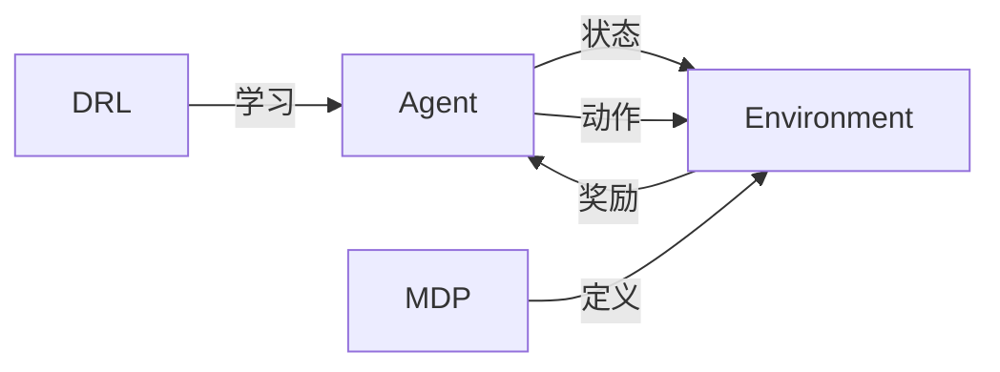

# 深度强化学习实践：供应链管理案例分析

作者：禅与计算机程序设计艺术 / Zen and the Art of Computer Programming

## 1. 背景介绍
### 1.1 问题的由来
在当今瞬息万变的商业环境中,供应链管理(Supply Chain Management, SCM)面临着前所未有的挑战。企业需要在降低成本、提高效率、满足客户需求等多个目标之间寻求平衡。传统的供应链管理方法已经难以应对日益复杂的市场形势,亟需引入新的技术和理念来优化决策过程。

深度强化学习(Deep Reinforcement Learning, DRL)作为人工智能领域的前沿技术,为解决供应链管理中的诸多难题提供了新的思路。它通过智能体(Agent)与环境的交互,不断学习和优化策略,最终实现供应链的自适应调整和动态优化。将深度强化学习应用于供应链管理,有望突破传统方法的局限,实现供应链的智能化和自主化。

### 1.2 研究现状
近年来,学术界和工业界都在积极探索将深度强化学习应用于供应链管理的可能性。一些研究者提出了基于DRL的库存管理[1]、需求预测[2]、运输调度[3]等方法,取得了良好的效果。但总的来说,这一领域的研究还处于起步阶段,在实际应用中仍面临诸多挑战,如算法的可解释性、鲁棒性,以及如何与现有系统进行集成等。

### 1.3 研究意义 
深入研究深度强化学习在供应链管理中的应用,对于推动供应链管理的理论创新和实践应用都具有重要意义:

1. 理论意义:拓展了深度强化学习的应用领域,为解决供应链管理问题提供了新的理论视角和方法论,有助于促进人工智能、运筹优化等学科的交叉融合。

2. 实践意义:通过将深度强化学习应用于供应链管理的关键环节,如库存优化、需求预测、运输调度等,可以显著提高供应链的运作效率,降低成本,提升企业竞争力,对供应链管理实践具有重要的指导意义。

### 1.4 本文结构
本文将围绕深度强化学习在供应链管理中的应用展开探讨。第2部分介绍相关的核心概念;第3部分阐述深度强化学习的基本原理和算法;第4部分建立数学模型并给出公式推导;第5部分通过代码实例演示如何实现DRL算法;第6部分分析实际应用场景;第7部分推荐相关工具和资源;第8部分总结全文并展望未来;第9部分列出常见问题解答。

## 2. 核心概念与联系
在探讨深度强化学习在供应链管理中的应用之前,有必要先明确几个核心概念:

- 供应链管理(SCM):是对供应链中的物流、信息流、资金流进行计划、组织、协调和控制的管理过程,目的是提高供应链整体绩效,为顾客创造价值。

- 深度强化学习(DRL):是强化学习和深度学习的结合,通过深度神经网络逼近值函数或策略函数,实现端到端的学习和决策。它突破了传统强化学习在状态空间和动作空间上的限制,增强了学习能力和泛化能力。

- 马尔可夫决策过程(MDP):是强化学习的理论基础,描述了智能体与环境的交互过程。MDP由状态空间、动作空间、转移概率和奖励函数组成,目标是寻找最优策略以最大化累积奖励。

- 智能体(Agent):在强化学习中扮演决策者的角色,根据当前状态采取动作,并从环境获得奖励反馈,不断学习和优化策略。

深度强化学习、MDP和智能体的关系如下图所示:



将深度强化学习应用于供应链管理,就是要建立合适的MDP模型来刻画供应链环境,设计高效的DRL算法来优化供应链决策,最终实现供应链智能化管理的目标。

## 3. 核心算法原理 & 具体操作步骤
### 3.1 算法原理概述
深度强化学习的核心是价值函数近似和策略优化。价值函数刻画了在某个状态下采取某个动作的长期累积奖励,常见的价值函数包括状态值函数 $V(s)$ 和动作值函数 $Q(s,a)$。策略则决定了在某个状态下应该采取什么动作,可以是确定性策略 $a=\pi(s)$,也可以是随机性策略 $\pi(a|s)$。

深度强化学习利用深度神经网络来近似表示价值函数或策略函数,相比传统方法,它可以处理高维连续状态空间,具有更强的非线性表达能力和泛化能力。主流的DRL算法包括DQN、DDPG、A3C、PPO等,它们在价值函数近似和策略优化上各有侧重。

### 3.2 算法步骤详解
以DQN(Deep Q-Network)算法为例,其主要步骤如下:

1. 初始化Q网络参数 $\theta$,目标网络参数 $\theta^-$,经验回放池 $D$ 

2. for episode = 1 to M do

3. &emsp;初始化初始状态 $s_1$

4. &emsp;for t = 1 to T do 

5. &emsp;&emsp;根据 $\epsilon-greedy$ 策略选择动作 $a_t=\arg\max_aQ(s_t,a;\theta)$

6. &emsp;&emsp;执行动作 $a_t$,观察奖励 $r_t$ 和下一状态 $s_{t+1}$

7. &emsp;&emsp;将转移样本 $(s_t,a_t,r_t,s_{t+1})$ 存入经验回放池 $D$

8. &emsp;&emsp;从 $D$ 中随机采样一个批次的转移样本 $(s,a,r,s')$

9. &emsp;&emsp;计算目标值 $y=r+\gamma\max_{a'}Q(s',a';\theta^-)$

10. &emsp;&emsp;最小化TD误差 $L(\theta)=\mathbb{E}[(y-Q(s,a;\theta))^2]$,更新Q网络参数 $\theta$

11. &emsp;&emsp;每隔C步同步目标网络参数 $\theta^-\leftarrow\theta$

12. &emsp;end for

13. end for

其中,$\epsilon-greedy$策略在探索和利用之间进行权衡,以$\epsilon$的概率随机选择动作,以$1-\epsilon$的概率选择Q值最大的动作。经验回放和目标网络有助于缓解数据的相关性和非平稳性。

### 3.3 算法优缺点
DQN算法的优点包括:

- 端到端学习,无需人工提取特征
- 可以处理高维状态空间
- 通过经验回放缓解数据相关性
- 通过目标网络缓解数据非平稳性

但DQN也存在一些局限:

- 只适用于离散动作空间
- 难以应对连续动作空间
- 需要大量的训练数据和计算资源
- 难以实现稳定、高效的探索

### 3.4 算法应用领域
DQN及其变体广泛应用于各种序贯决策问题,如游戏、机器人、自动驾驶、推荐系统等。在供应链管理领域,DQN可以用于求解库存管理、需求预测、运输调度等问题。例如,将库存水平作为状态,补货量作为动作,缺货和持货成本作为奖励,就可以构建一个库存优化的MDP模型,然后用DQN算法来学习最优补货策略。

## 4. 数学模型和公式 & 详细讲解 & 举例说明
### 4.1 数学模型构建
以一个单品种、单阶段的库存系统为例,假设:

- 第$t$天的需求量$D_t$服从正态分布$N(\mu,\sigma^2)$
- 补货提前期为$L$天
- 单位缺货成本为$p$,单位持货成本为$h$
- 第$t$天的初始库存为$I_t$,补货量为$q_t$

则第$t$天的库存转移过程可以表示为:

$$
I_{t+1}=\max(I_t+q_{t-L}-D_t,0)
$$

第$t$天的缺货量为:

$$
S_t=\max(D_t-I_t-q_{t-L},0)
$$

第$t$天的持货量为:

$$
H_t=\max(I_t+q_{t-L}-D_t,0)
$$

第$t$天的库存成本为:

$$
C_t=pS_t+hH_t
$$

假设初始库存$I_1=0$,则库存优化问题可以表示为:

$$
\min_{q_1,\dots,q_T}\sum_{t=1}^T\mathbb{E}[C_t]
$$

即找到一个最优补货策略$\{q_1^*,\dots,q_T^*\}$,使得总的期望库存成本最小。

### 4.2 公式推导过程
传统的库存理论通常假设需求服从某种已知分布(如正态分布),然后利用随机动态规划求解最优补货策略。但这种方法在实际应用中存在局限:

1. 需求分布往往未知且非平稳
2. 库存系统的状态转移过程复杂,难以建模
3. 最优策略的求解通常需要穷举搜索,计算量大

深度强化学习可以在无需假设需求分布和显式建模状态转移的情况下,直接从数据中学习最优策略。以DQN为例,我们可以将库存优化问题建模为一个MDP:

- 状态$s_t$:第$t$天的初始库存$I_t$
- 动作$a_t$:第$t$天的补货量$q_t$
- 奖励$r_t$:第$t$天的负库存成本$-C_t$
- 状态转移:根据库存转移方程更新下一状态$s_{t+1}$

则最优补货策略可以通过学习动作值函数$Q^*(s,a)$来获得:

$$
Q^*(s,a)=\mathbb{E}[r_t+\gamma\max_{a'}Q^*(s_{t+1},a')|s_t=s,a_t=a]
$$

其中,$\gamma\in[0,1]$为折扣因子。$Q^*(s,a)$表示在状态$s$下采取动作$a$,然后按最优策略行动所获得的期望累积奖励。最优策略为:

$$
\pi^*(s)=\arg\max_aQ^*(s,a)
$$

DQN利用深度神经网络$Q(s,a;\theta)$来近似$Q^*(s,a)$,其中$\theta$为网络参数。通过最小化TD误差来更新参数:

$$
L(\theta)=\mathbb{E}[(r+\gamma\max_{a'}Q(s',a';\theta^-)-Q(s,a;\theta))^2]
$$

其中,$(s,a,r,s')$为转移样本,$$是目标网络参数。不断迭代更新,最终学习到最优Q网络和最优策略。

### 4.3 案例分析与讲解
下面我们以一个简单的数值例子来说明DQN如何求解库存优化问题。

假设需求服从参数为$\mu=10,\sigma=2$的正态分布,补货提前期$L=1$,单位缺货成本$p=2$,单位持货成本$h=1$,初始库存$I_1=0$,优化周期$T=7$。

我们构建一个如下所示的DQN网络:

```mermaid
graph LR
A[状态 s] --> B[隐藏层1 16个单元]
B --> C[隐藏层2 16个单元] 
C --> D[输出层 Q(s,a)]
```

网络输入为状态$s$,输出为各个动作的Q值。隐藏层使用ReLU激活函数,输出层使用线性激活函数。

设置折扣因子$\gamma=0.9$,学习率$\alpha=0.01$,经验回放池容量$N=1000$,批次大小$B=32$,目标网络同步周期$C=100$。

在每个训练周期中,智能体与环境交互,产生转移样本$(s_