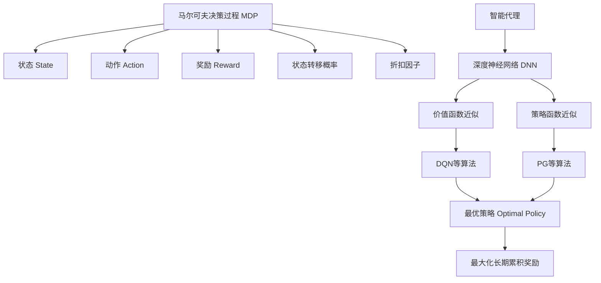

好的,我会按照您的要求,以专业的技术语言撰写这篇关于"深度强化学习实践:能源消费优化案例分析"的博客文章。文章将遵循您提供的结构模板,包含完整的正文内容,使用Markdown格式撰写,并嵌入必要的LaTeX公式。同时我也会尽最大努力绘制核心概念原理和架构的Mermaid流程图。请稍等,我需要一些时间来完成这篇高质量的技术博文。

# 深度强化学习实践:能源消费优化案例分析

## 1. 背景介绍

### 1.1 问题的由来

随着全球气候变化和环境问题日益严峻,能源消费优化成为当前亟待解决的重大挑战。传统的能源系统管理方法存在诸多缺陷,如效率低下、响应迟缓等,无法满足现代社会对能源的高效需求。因此,迫切需要一种全新的智能化方法来优化能源消费,提高能效水平。

### 1.2 研究现状  

近年来,人工智能技术取得了长足进步,尤其是深度强化学习(Deep Reinforcement Learning,DRL)在解决复杂序列决策问题方面展现出巨大潜力。DRL能够通过与环境的交互来学习最优策略,并根据当前状态作出明智决策,从而实现最大化的长期回报。越来越多的研究人员开始将DRL应用于能源系统优化领域,以期获得更加智能化和高效的能源管理方案。

### 1.3 研究意义

本研究旨在探索将DRL应用于能源消费优化的可行性和效果。通过构建智能代理,利用DRL算法学习最优的能源调度策略,实现对能源使用的精细化控制和动态优化。这不仅能够显著提高能源利用效率,降低能耗和碳排放,还可以促进可再生能源的大规模利用,推动能源行业的绿色可持续发展。

### 1.4 本文结构

本文首先介绍DRL在能源消费优化中的核心概念和算法原理,包括马尔可夫决策过程、策略迭代和价值迭代等。接着详细阐述了DRL算法在能源优化案例中的具体实现步骤。然后,我们构建了相应的数学模型,并推导出关键公式,辅以案例分析加深理解。此外,文中还提供了完整的代码实例,并对其进行了逐行解释。最后,我们讨论了DRL在实际能源场景中的应用前景,并总结了该领域的发展趋势和面临的挑战。

## 2. 核心概念与联系

深度强化学习(Deep Reinforcement Learning,DRL)是机器学习的一个重要分支,它结合了深度学习(Deep Learning)和强化学习(Reinforcement Learning)的优势,能够在复杂的序列决策问题中取得卓越表现。

在能源消费优化场景中,我们可以将整个能源系统视为一个马尔可夫决策过程(Markov Decision Process,MDP)。MDP由以下几个要素组成:

- **状态(State)**: 描述当前能源系统的状况,如负载水平、可再生能源发电量等。
- **动作(Action)**: 代理可以采取的行动,如调节发电机输出、启用储能设备等。
- **奖励(Reward)**: 对代理行为的反馈,通常设置为能耗成本的负值。
- **状态转移概率(State Transition Probability)**: 描述在采取某个动作后,系统从当前状态转移到下一状态的概率分布。
- **折扣因子(Discount Factor)**: 用于平衡即时奖励和长期回报的权重。

智能代理的目标是学习一个最优策略(Optimal Policy),即在每个状态下选择最佳动作,从而最大化长期累积奖励(即最小化能耗成本)。

DRL通过将深度神经网络(Deep Neural Network,DNN)引入强化学习框架,来近似价值函数(Value Function)或策略函数(Policy Function)。这种端到端的方式大大提高了算法的表现能力和泛化性。常见的DRL算法包括深度Q网络(Deep Q-Network,DQN)、策略梯度(Policy Gradient)、演员-评论家(Actor-Critic)等。

通过将DRL应用于能源消费优化问题,我们可以构建一个智能化的能源管理系统,动态调节发电、储能和负载响应,从而实现能源的高效利用和成本最小化。

## 3. 核心算法原理与具体操作步骤

### 3.1 算法原理概述

在能源消费优化任务中,我们采用了深度Q网络(Deep Q-Network,DQN)算法,它属于价值迭代(Value Iteration)范畴。DQN的核心思想是使用深度神经网络来近似Q值函数,即在给定状态下,执行某个动作所能获得的长期累积奖励。

具体来说,DQN由以下几个关键组件组成:

- **经验回放池(Experience Replay Buffer)**: 用于存储代理与环境交互过程中产生的转换样本(状态、动作、奖励、下一状态)。
- **Q网络(Q-Network)**: 一个深度神经网络,输入为当前状态,输出为在该状态下执行每个可能动作的Q值估计。
- **目标Q网络(Target Q-Network)**: 另一个与Q网络结构相同但参数不同的神经网络,用于计算目标Q值,以提高训练稳定性。
- **损失函数(Loss Function)**: 通常采用均方误差损失,衡量Q网络输出的Q值估计与目标Q值之间的差距。

在训练过程中,智能代理与环境交互,获取转换样本并存入经验回放池。然后,从经验回放池中采样出一个批次的转换样本,计算目标Q值并将其与Q网络的Q值估计进行比较,根据损失函数更新Q网络的参数。目标Q网络的参数则会定期复制自Q网络。通过不断迭代这一过程,Q网络最终会收敛到一个近似最优的Q值函数,从而得到一个近似最优的策略。

### 3.2 算法步骤详解

1. **初始化**
   - 创建Q网络和目标Q网络,两者参数相同
   - 创建经验回放池
   - 初始化环境,获取初始状态$s_0$

2. **主循环**
   - 对于每个时间步:
     - 根据当前Q网络输出和$\epsilon$-贪婪策略,选择动作$a_t$
     - 在环境中执行动作$a_t$,获得奖励$r_t$和下一状态$s_{t+1}$
     - 将转换样本$(s_t, a_t, r_t, s_{t+1})$存入经验回放池
     - 从经验回放池中采样一个批次的转换样本
     - 计算目标Q值:$y_i = r_i + \gamma \max_{a'} Q'(s_{i+1}, a'; \theta^-)$
     - 计算Q网络输出的Q值估计: $Q(s_i, a_i; \theta)$
     - 计算损失函数: $L = \frac{1}{N}\sum_{i}(y_i - Q(s_i, a_i; \theta))^2$
     - 使用优化算法(如Adam)更新Q网络参数$\theta$,最小化损失函数
     - 每隔一定步骤,将Q网络参数复制到目标Q网络: $\theta^- \leftarrow \theta$

3. **终止条件**
   - 当满足预定义的终止条件时(如达到最大训练步数或策略收敛),停止训练过程。

通过上述步骤,DQN算法可以逐步优化Q网络,最终得到一个近似最优的Q值函数,从而为每个状态推导出相应的最优动作,实现能源消费的智能优化。

### 3.3 算法优缺点

**优点**:

- 无需建模环境的转移概率和奖励函数,通过与环境交互直接学习最优策略。
- 利用深度神经网络的强大近似能力,可以处理高维状态和动作空间。
- 经验回放池的引入打破了数据样本之间的相关性,提高了数据利用效率。
- 目标Q网络的设计增强了算法的稳定性和收敛性。

**缺点**:

- 训练过程计算量大、收敛速度较慢。
- 对于连续动作空间,需要进行离散化处理,可能导致性能下降。
- 算法的超参数(如学习率、折扣因子等)对最终结果影响较大,需要反复调试。
- 在确定性环境中,算法可能会陷入次优的决策循环。

### 3.4 算法应用领域

除了能源消费优化外,DQN算法还可以广泛应用于其他序列决策问题,如:

- 机器人控制
- 自动驾驶决策
- 游戏AI
- 资源调度优化
- 投资组合优化
- 对话系统
- ...

总的来说,DQN算法擅长处理具有离散动作空间、高维状态空间、未知环境动态的强化学习任务。

## 4. 数学模型和公式详细讲解与举例说明

### 4.1 数学模型构建

在能源消费优化问题中,我们可以将整个系统建模为一个马尔可夫决策过程(MDP)。MDP由一个五元组$(S, A, P, R, \gamma)$表示,其中:

- $S$是状态空间的集合
- $A$是动作空间的集合
- $P(s'|s, a)$是状态转移概率,表示在状态$s$下执行动作$a$后,转移到状态$s'$的概率
- $R(s, a)$是奖励函数,表示在状态$s$下执行动作$a$所获得的即时奖励
- $\gamma \in [0, 1)$是折扣因子,用于平衡即时奖励和长期回报

在能源优化场景中,状态$s$可以包括当前负载水平、可再生能源发电量、储能设备状态等信息。动作$a$则对应调节发电机输出、启用储能设备、实施需求响应等决策。奖励函数$R(s, a)$通常设置为能耗成本的负值,目标是最小化长期累积能耗成本。

智能代理的目标是学习一个最优策略$\pi^*(s)$,即在每个状态$s$下选择一个最优动作$a$,使得期望的长期累积奖励最大化:

$$
\pi^*(s) = \arg\max_\pi \mathbb{E}\left[\sum_{t=0}^\infty \gamma^t R(s_t, a_t) | s_0 = s, \pi\right]
$$

为了求解最优策略,我们可以定义状态价值函数$V^\pi(s)$和动作价值函数$Q^\pi(s, a)$:

$$
\begin{aligned}
V^\pi(s) &= \mathbb{E}_\pi\left[\sum_{t=0}^\infty \gamma^t R(s_t, a_t) | s_0 = s\right] \\
Q^\pi(s, a) &= \mathbb{E}_\pi\left[\sum_{t=0}^\infty \gamma^t R(s_t, a_t) | s_0 = s, a_0 = a\right]
\end{aligned}
$$

$V^\pi(s)$表示在策略$\pi$下,从状态$s$开始执行,期望获得的长期累积奖励。$Q^\pi(s, a)$则表示在策略$\pi$下,从状态$s$开始执行动作$a$,期望获得的长期累积奖励。

最优状态价值函数$V^*(s)$和最优动作价值函数$Q^*(s, a)$可以通过贝尔曼方程(Bellman Equations)递推计算:

$$
\begin{aligned}
V^*(s) &= \max_a Q^*(s, a) \\
Q^*(s, a) &= R(s, a) + \gamma \sum_{s'} P(s'|s, a) V^*(s')
\end{aligned}
$$

一旦求解出$Q^*(s, a)$,我们就可以得