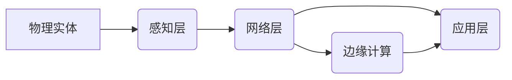

# 物联网 (Internet of Things)

关键词：物联网、IoT、传感器、无线通信、边缘计算、云计算、人工智能、大数据

## 1. 背景介绍

### 1.1 问题的由来
随着互联网、移动通信、嵌入式系统等技术的快速发展,人类社会正在步入一个万物互联的时代。物联网(Internet of Things,IoT)作为新一代信息技术的重要组成部分,受到了学术界和工业界的广泛关注。

物联网的概念最早由MIT Auto-ID中心的Kevin Ashton于1999年提出。他认为,通过射频识别(RFID)、红外感应器、全球定位系统、激光扫描器等信息传感设备,按约定的协议,把任何物品与互联网相连接,进行信息交换和通信,以实现智能化识别、定位、跟踪、监控和管理的一种网络。

### 1.2 研究现状
目前,物联网已经在智慧城市、智能交通、智慧医疗、智能家居、工业互联网等领域得到了广泛应用。据Gartner预测,到2025年全球物联网连接设备数量将达到250亿台。

在学术界,物联网相关研究主要集中在体系架构、关键技术、应用场景等方面。国内外顶级会议如INFOCOM、ICNP、SenSys、IPSN等都设立了IoT专题,发表了大量高质量论文。

工业界巨头如IBM、Google、微软、亚马逊、阿里巴巴等纷纷布局物联网,推出了各自的IoT平台和解决方案。同时,众多创业公司也在物联网垂直领域进行探索和创新。

### 1.3 研究意义
物联网将彻底改变人类社会的生产和生活方式,对经济社会发展产生深远影响。研究物联网,一方面有助于推动物联网产业发展,促进传统产业转型升级;另一方面可以培养物联网领域急需的复合型人才,为国家战略实施提供智力支持。

### 1.4 本文结构
本文将重点介绍物联网的核心概念、关键技术、应用实践以及未来趋势,内容安排如下:

第2节介绍物联网的核心概念;第3节重点讲解物联网的关键技术;第4节给出物联网系统的数学建模与分析;第5节展示物联网项目开发的代码实例;第6节总结物联网的典型应用场景;第7节推荐物联网领域常用的工具和学习资源;第8节对物联网未来发展进行展望,并指出面临的机遇和挑战;第9节列举物联网研究中的常见问题。

## 2. 核心概念与联系

物联网连接了现实世界的物理实体和虚拟的信息世界,其核心是通过各种传感器实时采集物理世界的数据,并通过网络传输汇聚到计算平台进行处理分析,从而实现对物理世界的感知、互联与智能控制。

物联网主要由感知层、网络层和应用层三大部分组成。感知层通过各种传感器(如温度、湿度、光照、压力等)、射频识别(RFID)设备、摄像头等实现对物理世界的信息采集。网络层利用各种有线和无线通信技术(如以太网、WiFi、蓝牙、ZigBee、NB-IoT等),把感知层获取的数据传输到云端或本地的计算与存储平台。应用层通过数据挖掘、机器学习等技术,对汇聚的海量数据进行处理分析,提炼有价值的信息,为用户提供个性化、智能化的服务。

除了上述三层架构,物联网还引入了边缘计算的概念。由于IoT设备产生的数据量巨大,且许多应用场景(如无人驾驶、工业控制)对时延非常敏感,完全依赖云计算难以满足需求。边缘计算就是在靠近物联网设备的网络边缘侧部署计算与存储资源,在本地完成数据的实时处理与分析,减轻云端的压力,提升服务质量。

总的来说,物联网通过感知、通信、计算等技术,打通了物理世界和信息世界,形成了一个人机物三元融合的智能化系统,为人类认识世界、改造世界提供了全新的手段。下图给出了物联网的总体架构:

## 3. 核心算法原理 & 具体操作步骤

### 3.1 算法原理概述
物联网涉及的算法主要包括数据采集、数据融合、数据挖掘、机器学习等。

数据采集主要研究如何高效可靠地获取物理世界的原始数据。常用的技术有模数转换、数字信号处理等。数据融合主要解决物联网多源异构数据的关联、校准、噪声去除等问题。数据挖掘和机器学习算法如聚类、分类、回归、异常检测等,可以从海量物联网数据中发现隐藏的模式和规律,实现预测、诊断、优化控制等功能。

### 3.2 算法步骤详解
以数据融合中的多传感器融合算法为例,其基本步骤如下:

1) 传感器选择。根据应用需求选择合适类型和数量的传感器,使其测量范围、精度、分辨率等满足要求。

2) 时空配准。由于不同传感器的采样频率、坐标系统可能不一致,需要在时间和空间上进行配准,使多个传感器数据统一到同一参考系下。

3) 数据关联。识别出不同传感器观测到的同一物理量,建立它们之间的对应关系。常用的方法有最近邻、概率数据关联等。

4) 状态估计。用概率统计方法估计物理量的状态,消除测量噪声。贝叶斯估计、卡尔曼滤波是两种常用的状态估计方法。

5) 特征提取。从融合后的状态估计中提取反映物理量本质属性的特征量,为后续的判决、推理做准备。

6) 决策融合。利用特征量对物理量进行辨识、分类,给出最终的判决结果。常见的决策融合方法有投票法、贝叶斯决策、模糊逻辑等。

### 3.3 算法优缺点
多传感器融合具有以下优点:

1) 抗干扰能力强。多个传感器的互补观测可以有效抑制单个传感器的噪声和失效。

2) 扩展了感知维度。不同类型的传感器融合,可获得单一传感器无法观测到的物理信息。

3) 提高了决策的可靠性。融合多个传感器的判决比单个传感器判决更加准确可信。

但是,多传感器融合也存在一些局限:

1) 计算复杂度高。融合N个传感器的计算量往往是单个传感器的N倍以上。

2) 对同步性要求高。多传感器的采样需要严格同步,否则会带来融合误差。

3) 鲁棒性不够。个别传感器的失效可能会严重影响整个融合系统的性能。

### 3.4 算法应用领域
多传感器融合在物联网目标跟踪、导航定位、环境监测、故障诊断等领域得到了广泛应用。如在自动驾驶中,激光雷达、毫米波雷达、摄像头等多传感器融合,可以准确感知车辆周围的行人、车辆等目标,大大提高了系统的安全性和可靠性。

## 4. 数学模型和公式 & 详细讲解 & 举例说明

### 4.1 数学模型构建
以卡尔曼滤波为例,说明多传感器融合中的状态估计问题。假设系统状态变量为 $x$,观测变量为 $z$,它们之间的关系可用如下状态方程和观测方程描述:

$$
x(k)=A x(k-1)+B u(k)+w(k) \\
z(k)=H x(k)+v(k)
$$

其中,$A$是状态转移矩阵,$B$是控制矩阵,$H$是观测矩阵,$w$和$v$分别是过程噪声和观测噪声,服从均值为0的高斯分布。

卡尔曼滤波通过预测和更新两个步骤,递归地估计状态变量 $x$ 的条件概率分布 $p(x(k)|z(1:k))$。

预测步骤利用上一时刻的估计值 $\hat{x}(k-1|k-1)$ 和状态方程,计算当前时刻的先验估计 $\hat{x}(k|k-1)$ 及其协方差矩阵 $P(k|k-1)$:

$$
\hat{x}(k|k-1) = A \hat{x}(k-1|k-1) + B u(k) \\
P(k|k-1) = A P(k-1|k-1) A^T + Q
$$

更新步骤利用当前时刻的观测值 $z(k)$,对先验估计进行修正,得到后验估计 $\hat{x}(k|k)$ 及其协方差矩阵 $P(k|k)$:

$$
K(k) = P(k|k-1) H^T (H P(k|k-1) H^T + R)^{-1} \\
\hat{x}(k|k) = \hat{x}(k|k-1) + K(k) (z(k) - H \hat{x}(k|k-1)) \\ 
P(k|k) = (I - K(k) H) P(k|k-1)
$$

其中,$K(k)$称为卡尔曼增益,$Q$和$R$分别是过程噪声和观测噪声的协方差矩阵。

### 4.2 公式推导过程
卡尔曼滤波可以由贝叶斯估计理论推导得到。根据贝叶斯公式,状态变量的后验概率可表示为:

$$
p(x(k)|z(1:k)) = \frac{p(z(k)|x(k)) p(x(k)|z(1:k-1))}{p(z(k)|z(1:k-1))}
$$

其中,$p(z(k)|x(k))$是似然函数,$p(x(k)|z(1:k-1))$是先验概率,$p(z(k)|z(1:k-1))$是归一化因子。假设噪声服从高斯分布,状态变量的先验概率和似然函数均可用高斯分布描述:

$$
p(x(k)|z(1:k-1)) = N(x(k);\hat{x}(k|k-1),P(k|k-1)) \\
p(z(k)|x(k)) = N(z(k);H x(k),R)
$$

将它们代入贝叶斯公式,并利用高斯分布的性质,可得到状态变量后验概率也服从高斯分布:

$$
p(x(k)|z(1:k)) = N(x(k);\hat{x}(k|k),P(k|k))
$$

其中,$\hat{x}(k|k)$和$P(k|k)$的计算公式与卡尔曼滤波更新步骤一致。

### 4.3 案例分析与讲解
考虑一个简单的例子,假设有两个传感器对同一物理量进行测量,它们的观测方程为:

$$
z_1(k) = x(k) + v_1(k) \\
z_2(k) = x(k) + v_2(k)
$$

其中,$v_1$和$v_2$是均值为0,方差分别为$\sigma_1^2$和$\sigma_2^2$的高斯噪声。

根据最大似然估计,两个传感器的融合结果为:

$$
\hat{x}(k) = \frac{\sigma_2^2}{\sigma_1^2+\sigma_2^2} z_1(k) + \frac{\sigma_1^2}{\sigma_1^2+\sigma_2^2} z_2(k)
$$

融合估计的方差为:

$$
\sigma^2 = \frac{\sigma_1^2 \sigma_2^2}{\sigma_1^2+\sigma_2^2}
$$

可以看出,融合估计是两个传感器观测值的加权平均,权重与它们的方差成反比。融合后估计方差小于任一单个传感器的方差,即融合提高了估计精度。

### 4.4 常见问题解答
问:多传感器融合是否总能提高估计性能?

答:理论上,如果各传感器观测不相关,且它们的观测噪声均服从零