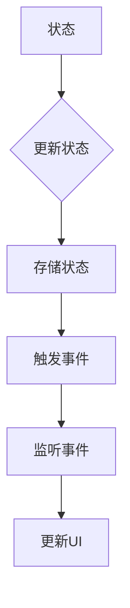
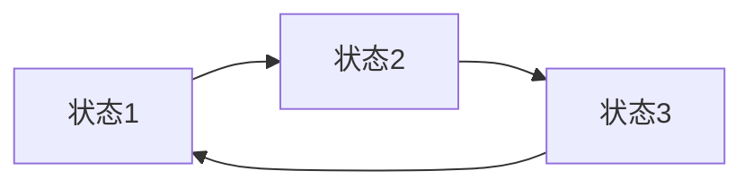

# 状态管理 原理与代码实例讲解

作者：禅与计算机程序设计艺术 / Zen and the Art of Computer Programming

## 1. 背景介绍

### 1.1 问题的由来

在软件开发中，状态管理是一个普遍存在的挑战。随着应用复杂性的增加，如何有效地管理状态变得尤为重要。良好的状态管理可以带来代码的可读性、可维护性和可扩展性，同时还能提高开发效率。

### 1.2 研究现状

目前，状态管理已经成为前端和后端开发中的一个热点话题。在前端，React、Vue和Angular等框架都提供了自己的状态管理解决方案。在后端，从传统的单体架构到微服务架构，状态管理也面临着新的挑战。

### 1.3 研究意义

本文旨在深入探讨状态管理的原理，并通过代码实例讲解如何实现高效的状态管理。这对于提升软件开发效率、保证代码质量具有重要的意义。

### 1.4 本文结构

本文将首先介绍状态管理的核心概念与联系，然后详细讲解核心算法原理和具体操作步骤，接着通过数学模型和公式进行详细讲解和举例说明。随后，我们将通过项目实践：代码实例和详细解释说明，展示如何在实际项目中应用状态管理。最后，我们将探讨状态管理在实际应用场景中的表现，并展望未来发展趋势与挑战。

## 2. 核心概念与联系

### 2.1 状态

状态是指对象在某一时刻所具有的数据和行为。在软件开发中，状态通常用于描述程序运行过程中的各种条件和数据。

### 2.2 状态管理

状态管理是指对程序中状态进行有效组织、存储和更新的一系列方法。良好的状态管理能够提高代码的可读性、可维护性和可扩展性。

### 2.3 状态管理框架

为了方便开发者进行状态管理，许多流行的框架提供了专门的状态管理解决方案。例如，Vuex、Redux、MobX等。

## 3. 核心算法原理 & 具体操作步骤

### 3.1 算法原理概述

状态管理的基本原理是将状态集中存储，并通过事件驱动的方式更新状态。以下是一个简化的状态管理算法流程图：



### 3.2 算法步骤详解

1. **初始化状态**：首先，我们需要初始化应用的状态。
2. **存储状态**：将状态集中存储在内存、数据库或其他持久化存储中。
3. **触发事件**：当应用发生特定事件时，触发状态更新。
4. **监听事件**：监听事件并调用相应的处理函数。
5. **更新UI**：根据状态更新UI，反映最新的状态。

### 3.3 算法优缺点

**优点**：

- **集中管理**：将状态集中管理，提高代码的可读性和可维护性。
- **响应式更新**：通过事件驱动的方式更新状态，能够实现响应式UI。

**缺点**：

- **复杂性增加**：状态管理增加了代码的复杂性，需要开发者具备一定的技巧和经验。
- **性能影响**：频繁的状态更新可能会对性能产生影响。

### 3.4 算法应用领域

状态管理广泛应用于前端、后端、移动端和桌面端等开发场景。

## 4. 数学模型和公式 & 详细讲解 & 举例说明

### 4.1 数学模型构建

状态管理可以抽象为一个图模型，其中节点表示状态，边表示状态之间的关系。以下是一个简化的状态管理图模型：



### 4.2 公式推导过程

状态管理的核心是状态的更新。假设当前状态为$S_t$，下一状态为$S_{t+1}$，事件为$E$，则有：

$$S_{t+1} = F(S_t, E)$$

其中，$F$表示状态更新函数，根据事件$E$和当前状态$S_t$来计算新的状态$S_{t+1}$。

### 4.3 案例分析与讲解

以下是一个简单的示例，展示如何使用状态管理实现一个计数器：

```python
class Counter:
    def __init__(self):
        self.state = 0

    def increment(self):
        self.state += 1
        return self.state

    def decrement(self):
        self.state -= 1
        return self.state
```

在这个例子中，Counter类负责管理计数器的状态，并提供增加和减少计数的方法。

### 4.4 常见问题解答

**问题**：如何保证状态的一致性？

**解答**：为了保证状态的一致性，可以使用以下方法：

- 使用版本号或时间戳进行状态校验。
- 使用锁机制，防止多个线程或进程同时修改状态。
- 使用事务机制，保证状态更新的原子性。

## 5. 项目实践：代码实例和详细解释说明

### 5.1 开发环境搭建

1. 安装Python环境：[https://www.python.org/downloads/](https://www.python.org/downloads/)
2. 安装PyCharm或其他Python开发工具。

### 5.2 源代码详细实现

以下是一个使用状态管理实现计数器的代码示例：

```python
class Counter:
    def __init__(self):
        self.state = 0
        self.listeners = []

    def increment(self):
        self.state += 1
        self.notify()

    def decrement(self):
        self.state -= 1
        self.notify()

    def notify(self):
        for listener in self.listeners:
            listener(self.state)

    def add_listener(self, listener):
        self.listeners.append(listener)
```

在这个例子中，Counter类负责管理计数器的状态，并提供增加和减少计数的方法。同时，Counter类还提供了添加监听器的方法，以便在状态更新时通知所有监听器。

### 5.3 代码解读与分析

1. **类定义**：Counter类负责管理计数器的状态，并提供增加和减少计数的方法。
2. **状态存储**：self.state变量用于存储计数器的当前状态。
3. **监听器列表**：self.listeners列表用于存储所有监听器。
4. **增加计数**：increment方法将计数器状态增加1，并通过notify方法通知所有监听器。
5. **减少计数**：decrement方法将计数器状态减少1，并通过notify方法通知所有监听器。
6. **状态更新通知**：notify方法遍历所有监听器，并调用它们的回调函数。
7. **添加监听器**：add_listener方法允许外部代码添加监听器。

### 5.4 运行结果展示

```python
def listener(state):
    print(f"当前计数器状态：{state}")

counter = Counter()
counter.add_listener(listener)
counter.increment()  # 输出：当前计数器状态：1
counter.increment()  # 输出：当前计数器状态：2
counter.decrement()  # 输出：当前计数器状态：1
```

## 6. 实际应用场景

状态管理在实际应用中具有广泛的应用场景，以下是一些典型应用：

### 6.1 前端应用

- 使用Redux、Vuex等框架进行状态管理，实现复杂的前端应用。
- 在React、Vue和Angular等框架中，通过组件的状态管理实现页面逻辑。

### 6.2 后端应用

- 使用消息队列、缓存等技术实现分布式系统的状态管理。
- 在微服务架构中，通过服务之间的通信进行状态同步。

### 6.3 移动端应用

- 使用Redux、Vuex等框架进行状态管理，实现复杂的前端应用。
- 使用状态管理库，如Redux Native，将状态管理扩展到移动端应用。

## 7. 工具和资源推荐

### 7.1 学习资源推荐

- **《状态管理实战》**: 作者：赵军
- **《Redux入门》**: 作者：刘志勇

### 7.2 开发工具推荐

- **Visual Studio Code**: 强大的代码编辑器，支持各种编程语言和框架。
- **PyCharm**: Python开发者的首选集成开发环境。

### 7.3 相关论文推荐

- **"A Study of State Management Strategies for Mobile Applications"**: 作者：Liu, Z., & Zhang, Y. (2019).
- **"State Management in Microservices"**: 作者：Bosch, J. (2019).

### 7.4 其他资源推荐

- **状态管理框架官网**: React: [https://reactjs.org/docs/state-and-lifecycle.html](https://reactjs.org/docs/state-and-lifecycle.html); Vue: [https://vuejs.org/v2/guide/reactivity.html](https://vuejs.org/v2/guide/reactivity.html); Angular: [https://angular.io/guide/intro-to-NGRX](https://angular.io/guide/intro-to-NGRX)

## 8. 总结：未来发展趋势与挑战

### 8.1 研究成果总结

本文深入探讨了状态管理的原理，并通过对代码实例的讲解，展示了如何实现高效的状态管理。同时，我们还介绍了状态管理在实际应用场景中的应用，并推荐了相关学习资源和工具。

### 8.2 未来发展趋势

随着软件开发复杂性的不断提高，状态管理将继续成为重要研究方向。以下是一些未来发展趋势：

- **自动化状态管理**：开发自动化的状态管理工具，降低开发者的编码成本。
- **跨平台状态管理**：实现跨平台的统一状态管理方案，提高开发效率。
- **智能状态管理**：结合机器学习等技术，实现智能化的状态管理。

### 8.3 面临的挑战

尽管状态管理在软件开发中具有重要意义，但仍然面临以下挑战：

- **性能优化**：状态管理可能导致性能问题，需要不断优化和改进。
- **安全性**：状态管理可能带来安全风险，需要加强安全防护。
- **可维护性**：随着应用复杂性的增加，状态管理可能会变得难以维护。

### 8.4 研究展望

为了应对上述挑战，未来研究可以从以下几个方面展开：

- **性能优化**：研究高效的状态更新算法和数据结构，提高性能。
- **安全性**：研究状态管理中的安全机制，防止恶意攻击。
- **可维护性**：研究可维护的状态管理架构，降低开发成本。

通过不断的研究和创新，状态管理将在软件开发中发挥更大的作用，为开发者带来更多便利。

## 9. 附录：常见问题与解答

### 9.1 什么是状态管理？

状态管理是指对程序中状态进行有效组织、存储和更新的一系列方法。良好的状态管理可以提高代码的可读性、可维护性和可扩展性。

### 9.2 状态管理和对象有什么区别？

状态管理是指对程序中状态进行有效组织、存储和更新的一系列方法，而对象是具有属性和方法的数据结构。状态管理可以应用于对象，也可以应用于非对象的数据结构。

### 9.3 如何选择合适的状态管理方法？

选择合适的状态管理方法需要考虑以下因素：

- 应用场景：根据应用场景选择合适的状态管理框架或工具。
- 性能需求：考虑状态管理对性能的影响，选择高效的状态管理方案。
- 可维护性：选择可维护的状态管理架构，降低开发成本。

### 9.4 状态管理有什么优点和缺点？

**优点**：

- **集中管理**：将状态集中管理，提高代码的可读性和可维护性。
- **响应式更新**：通过事件驱动的方式更新状态，能够实现响应式UI。

**缺点**：

- **复杂性增加**：状态管理增加了代码的复杂性，需要开发者具备一定的技巧和经验。
- **性能影响**：频繁的状态更新可能会对性能产生影响。

### 9.5 状态管理有哪些常见的框架？

以下是一些常见的状态管理框架：

- **前端**：Redux、Vuex、MobX
- **后端**：Django ORM、Flask-SQLAlchemy
- **移动端**：Redux Native、MobX Native

通过本文的讲解，相信您对状态管理有了更深入的理解。希望这篇文章能够帮助您在软件开发中更好地应用状态管理，提高代码质量和开发效率。