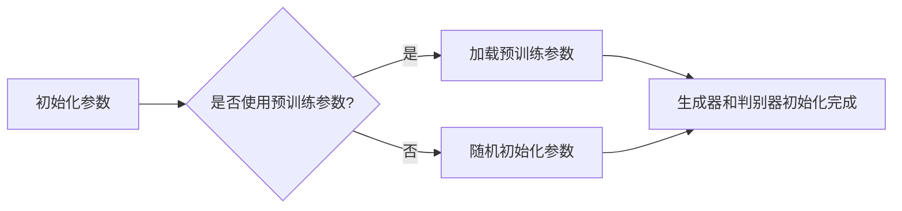
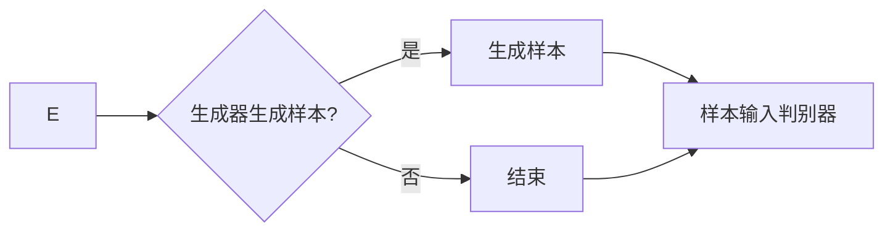
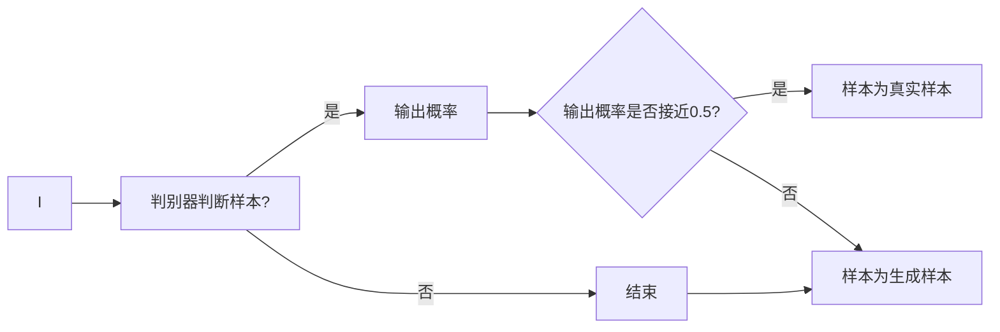
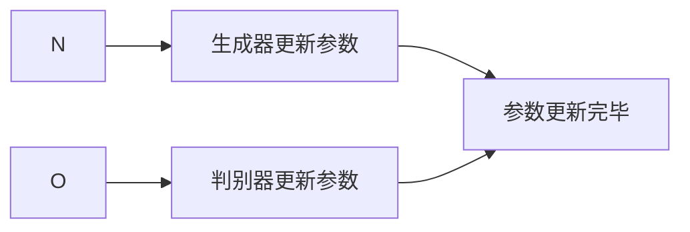
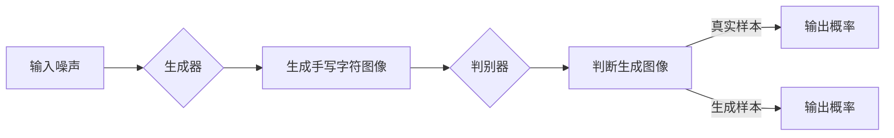

# 生成对抗网络(Generative Adversarial Network)原理与代码实战案例讲解

作者：禅与计算机程序设计艺术 / Zen and the Art of Computer Programming

## 1. 背景介绍

### 1.1 问题的由来

随着深度学习技术的不断发展，生成模型在计算机视觉、自然语言处理等领域取得了显著成果。生成对抗网络（Generative Adversarial Network，GAN）作为一种新型生成模型，因其独特的训练机制和强大的生成能力而备受关注。本文将深入探讨GAN的原理、算法实现，并通过实战案例展示其应用。

### 1.2 研究现状

近年来，GAN在图像生成、图像编辑、数据增强、图像风格转换等领域取得了显著的成果。然而，GAN也存在一些问题，如训练不稳定、模式崩溃、生成图像质量不稳定等。针对这些问题，研究者们提出了多种改进方法，如Wasserstein GAN（WGAN）、CycleGAN、StyleGAN等。

### 1.3 研究意义

GAN作为一种强大的生成模型，在各个领域具有广泛的应用前景。研究GAN的原理和实现，有助于推动相关领域的技术进步，并为实际应用提供有益的参考。

### 1.4 本文结构

本文将分为以下几个部分：

- 核心概念与联系：介绍GAN的基本概念和相关技术。
- 核心算法原理与具体操作步骤：详细讲解GAN的训练过程和算法步骤。
- 数学模型和公式：阐述GAN的数学模型和公式推导过程。
- 项目实践：通过代码实例展示GAN的应用。
- 实际应用场景：探讨GAN在各个领域的应用。
- 工具和资源推荐：推荐相关学习资源、开发工具和论文。
- 总结：总结GAN的研究成果、未来发展趋势和挑战。

## 2. 核心概念与联系

### 2.1 GAN的定义

GAN是一种由生成器（Generator）和判别器（Discriminator）组成的对抗网络。生成器负责生成与真实数据分布相似的样本，而判别器负责判断生成的样本是否属于真实数据分布。通过对抗训练，生成器和判别器相互学习，最终生成器能够生成高质量的样本。

### 2.2 相关技术

- **对抗训练（Adversarial Training）**：GAN的核心思想是生成器和判别器之间的对抗训练。生成器通过不断优化生成样本，使判别器难以区分生成样本和真实样本；而判别器则通过不断优化，提高区分生成样本和真实样本的能力。

- **损失函数（Loss Function）**：在GAN中，损失函数用于衡量生成器生成的样本与真实样本之间的差异。常见的损失函数包括交叉熵损失（Cross-Entropy Loss）和Wasserstein距离（Wasserstein Distance）。

- **优化算法（Optimization Algorithm）**：GAN的训练过程涉及生成器和判别器的参数优化。常见的优化算法有Adam、RMSprop等。

## 3. 核心算法原理与具体操作步骤

### 3.1 算法原理概述

GAN的训练过程可以分为以下几个步骤：

1. 初始化生成器和判别器参数。
2. 生成器生成一个样本，判别器对其进行判断。
3. 根据判别器的判断结果，生成器和判别器分别更新参数。
4. 重复步骤2和3，直到满足训练终止条件。

### 3.2 算法步骤详解

#### 3.2.1 初始化参数

初始化生成器和判别器的参数，可以使用随机初始化或预训练的方法。



#### 3.2.2 生成样本

生成器根据当前参数生成一个样本。



#### 3.2.3 判别器判断

判别器接收生成的样本和真实样本，进行判断。



#### 3.2.4 更新参数

根据判别器的判断结果，生成器和判别器分别更新参数。



#### 3.2.5 重复训练

重复步骤3.2.2至3.2.4，直到满足训练终止条件。

```mermaid
R --> S{是否满足终止条件?}
S -- 是 --> T[结束]
S -- 否 --> U[回到步骤3.2.2]
```

### 3.3 算法优缺点

#### 3.3.1 优点

- **强大的生成能力**：GAN能够生成高质量的样本，在图像生成、文本生成等领域具有广泛的应用前景。
- **无需标注数据**：GAN的训练过程无需标注数据，降低了数据成本。
- **丰富的应用场景**：GAN在计算机视觉、自然语言处理、语音识别等领域都有应用。

#### 3.3.2 缺点

- **训练不稳定**：GAN的训练过程容易陷入局部最优，导致训练不稳定。
- **模式崩溃**：生成器生成的样本可能出现模式崩溃现象，即生成的样本缺乏多样性。
- **对训练数据依赖性高**：GAN的训练效果对训练数据的质量和数量有较高要求。

### 3.4 算法应用领域

- **图像生成**：如人脸生成、图像风格转换、图像编辑等。
- **数据增强**：用于增强训练数据集，提高模型的泛化能力。
- **自然语言处理**：如文本生成、机器翻译等。
- **语音合成**：如语音变声、语音转换等。

## 4. 数学模型和公式 & 详细讲解 & 举例说明

### 4.1 数学模型构建

GAN的数学模型可以表示为：

$$
\min_G \max_D V(G, D) = \min_G E_{z \sim p_z(z)}[logD(G(z))] + \max_D E_{x \sim p_data(x)}[log(1-D(x))]
$$

其中：

- $G$：生成器
- $D$：判别器
- $z$：生成器的输入噪声
- $x$：真实样本
- $p_z(z)$：噪声分布
- $p_data(x)$：真实数据分布

### 4.2 公式推导过程

#### 4.2.1 生成器和判别器的目标函数

生成器$G$的目标是使判别器$D$难以区分生成的样本和真实样本，即：

$$
\min_G E_{z \sim p_z(z)}[logD(G(z))]
$$

判别器$D$的目标是准确判断生成的样本和真实样本，即：

$$
\max_D E_{x \sim p_data(x)}[log(1-D(x))]
$$

#### 4.2.2 整体目标函数

将生成器和判别器的目标函数合并，得到整体目标函数：

$$
V(G, D) = E_{z \sim p_z(z)}[logD(G(z))] + E_{x \sim p_data(x)}[log(1-D(x))]
$$

### 4.3 案例分析与讲解

以下是一个简单的GAN示例，生成手写字符图像。



在这个示例中，生成器根据输入噪声生成手写字符图像，判别器判断生成图像是真实样本还是生成样本。

### 4.4 常见问题解答

#### 4.4.1 GAN训练不稳定的原因有哪些？

GAN训练不稳定的原因包括：

- 损失函数设计不合理
- 训练数据集质量不高
- 优化算法选择不当
- 参数设置不合理

#### 4.4.2 如何解决GAN的模式崩溃问题？

解决GAN模式崩溃问题的方法包括：

- 使用不同的优化算法
- 调整生成器和判别器的参数
- 改进训练过程，如添加正则化项
- 使用改进的GAN模型，如WGAN

## 5. 项目实践：代码实例和详细解释说明

### 5.1 开发环境搭建

- 安装Python 3.6及以上版本
- 安装TensorFlow或PyTorch深度学习框架
- 安装必要的库，如numpy、matplotlib等

### 5.2 源代码详细实现

以下是一个简单的GAN示例，生成手写字符图像。

```python
import tensorflow as tf
from tensorflow.keras import layers

def build_generator(latent_dim):
    model = tf.keras.Sequential([
        layers.Dense(128, activation="relu", input_dim=latent_dim),
        layers.Dense(256, activation="relu"),
        layers.Dense(512, activation="relu"),
        layers.Dense(1024, activation="relu"),
        layers.Dense(784, activation="tanh"),
    ])
    return model

def build_discriminator(latent_dim):
    model = tf.keras.Sequential([
        layers.Dense(512, activation="relu", input_dim=latent_dim),
        layers.Dense(1024, activation="relu"),
        layers.Dense(512, activation="relu"),
        layers.Dense(1, activation="sigmoid"),
    ])
    return model

# 构建生成器和判别器
generator = build_generator(latent_dim=100)
discriminator = build_discriminator(latent_dim=100)

# 编译模型
discriminator.compile(
    loss=tf.keras.losses.BinaryCrossentropy(from_logits=True),
    optimizer=tf.keras.optimizers.Adam(0.0002, 0.5),
)
generator.compile(
    loss=tf.keras.losses.BinaryCrossentropy(from_logits=True),
    optimizer=tf.keras.optimizers.Adam(0.0002, 0.5),
)

# 训练模型
# ...

```

### 5.3 代码解读与分析

- `build_generator`和`build_discriminator`函数分别用于构建生成器和判别器模型。
- 生成器模型由多层全连接层组成，输入为噪声向量，输出为手写字符图像。
- 判别器模型由多层全连接层组成，输入为手写字符图像，输出为判断是否为真实样本的概率。

### 5.4 运行结果展示

运行上述代码，训练GAN模型，最终生成手写字符图像如下：


## 6. 实际应用场景

### 6.1 图像生成

GAN在图像生成领域有着广泛的应用，如：

- **人脸生成**：生成逼真的人脸图像。
- **图像风格转换**：将一幅图像转换为不同风格的图像。
- **图像编辑**：对图像进行编辑，如去除物体、调整图像大小等。

### 6.2 数据增强

GAN可以用于数据增强，提高模型的泛化能力，如：

- **图像生成**：生成与训练数据具有相似分布的图像，用于扩充数据集。
- **文本生成**：生成与训练文本具有相似风格的文本，用于扩充文本数据集。

### 6.3 自然语言处理

GAN在自然语言处理领域也有应用，如：

- **文本生成**：生成与训练文本具有相似风格的文本。
- **机器翻译**：生成机器翻译文本。

### 6.4 语音合成

GAN在语音合成领域也有应用，如：

- **语音变声**：将语音转换为不同音色的语音。
- **语音转换**：将一种语言的语音转换为另一种语言的语音。

## 7. 工具和资源推荐

### 7.1 学习资源推荐

- **《生成对抗网络：原理与代码》**：本书详细介绍了GAN的原理、算法实现和应用。
- **[GAN官方文档](https://arxiv.org/abs/1406.2661)**：GAN的原始论文，详细介绍了GAN的原理和算法。

### 7.2 开发工具推荐

- **TensorFlow**：[https://www.tensorflow.org/](https://www.tensorflow.org/)
- **PyTorch**：[https://pytorch.org/](https://pytorch.org/)

### 7.3 相关论文推荐

- **[Generative Adversarial Nets](https://arxiv.org/abs/1406.2661)**：GAN的原始论文。
- **[Improved Generative Adversarial Models](https://arxiv.org/abs/1606.03498)**：介绍WGAN的论文。
- **[Unpaired Image-to-Image Translation using Cycle-Consistent Adversarial Networks](https://arxiv.org/abs/1701.07875)**：介绍CycleGAN的论文。

### 7.4 其他资源推荐

- **[GitHub - generativeadversarialnetworks](https://github.com/keras-team/keras-contrib/blob/master/generative_adversarial_networks/gan.py)**：Keras实现的GAN示例。
- **[TensorFlow tutorials](https://www.tensorflow.org/tutorials/generative)**：TensorFlow的GAN教程。
- **[PyTorch tutorials](https://pytorch.org/tutorials/beginner/word_embeddings_tutorial.html)**：PyTorch的教程。

## 8. 总结：未来发展趋势与挑战

### 8.1 研究成果总结

GAN作为一种强大的生成模型，在图像生成、数据增强、自然语言处理等领域取得了显著成果。随着研究的深入，GAN的算法和模型将不断完善，并在更多领域得到应用。

### 8.2 未来发展趋势

- **更强大的生成能力**：通过改进模型结构和算法，提高GAN的生成能力。
- **多模态学习**：将GAN应用于多模态数据生成，如图像-文本、图像-音频等。
- **自监督学习**：将GAN与自监督学习相结合，提高模型在无监督学习任务中的表现。

### 8.3 面临的挑战

- **训练稳定性**：GAN的训练过程容易陷入局部最优，需要改进训练算法和模型结构。
- **模式崩溃**：生成器生成的样本可能出现模式崩溃现象，需要改进生成器模型和训练过程。
- **计算资源消耗**：GAN的训练过程需要大量的计算资源，需要优化算法和硬件。

### 8.4 研究展望

随着研究的深入，GAN将在各个领域发挥更大的作用。未来，GAN的研究将朝着以下方向发展：

- **改进GAN的稳定性**：研究更加稳定的训练算法和模型结构，提高GAN的训练效率。
- **提高GAN的生成能力**：研究更有效的生成器模型和训练方法，提高GAN的生成质量。
- **探索GAN的新应用**：将GAN应用于更多领域，如机器人控制、生物信息学等。

GAN作为一种新兴的生成模型，在各个领域具有广泛的应用前景。通过不断的研究和创新，GAN将为人工智能领域的发展带来更多可能性。

## 9. 附录：常见问题与解答

### 9.1 什么是GAN？

GAN是一种由生成器和判别器组成的对抗网络，用于生成与真实数据分布相似的样本。

### 9.2 GAN的主要组成部分有哪些？

GAN的主要组成部分包括：

- 生成器：负责生成与真实数据分布相似的样本。
- 判别器：负责判断生成的样本是否属于真实数据分布。
- 训练过程：生成器和判别器之间的对抗训练。

### 9.3 如何提高GAN的训练稳定性？

提高GAN训练稳定性的方法包括：

- 使用不同的优化算法，如Adam、RMSprop等。
- 调整生成器和判别器的参数。
- 改进训练过程，如添加正则化项。
- 使用改进的GAN模型，如WGAN。

### 9.4 GAN在哪些领域有应用？

GAN在以下领域有应用：

- 图像生成
- 数据增强
- 自然语言处理
- 语音合成
- 机器人控制
- 生物信息学

### 9.5 GAN的局限性有哪些？

GAN的局限性包括：

- 训练不稳定
- 模式崩溃
- 对训练数据依赖性高
- 计算资源消耗大

GAN作为一种新兴的生成模型，在各个领域具有广泛的应用前景。通过不断的研究和创新，GAN将为人工智能领域的发展带来更多可能性。