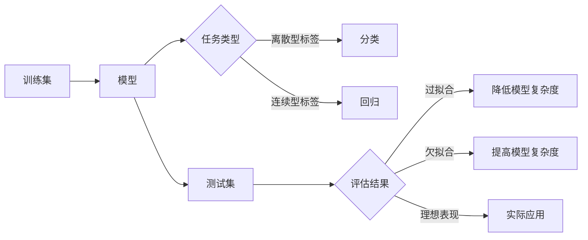

# 监督学习 (Supervised Learning) 原理与代码实例讲解

关键词：监督学习、机器学习、分类、回归、神经网络、决策树、支持向量机

## 1. 背景介绍
### 1.1  问题的由来
在人工智能和机器学习领域,监督学习是一个非常重要和基础的课题。它旨在通过已标记的训练数据来学习一个模型,使得该模型能够对新的未见过的数据进行预测。监督学习广泛应用于图像识别、自然语言处理、语音识别等领域,是实现智能系统的关键技术之一。

### 1.2  研究现状
目前,监督学习的研究已经取得了显著的进展。各种高效的算法被提出,如支持向量机、随机森林、神经网络等。这些算法在不同的任务上展现出了优异的性能。同时,深度学习的兴起为监督学习注入了新的活力,使得在一些复杂任务上取得了突破性的进展。

### 1.3  研究意义  
监督学习的研究对于推动人工智能的发展具有重要意义。一方面,监督学习是实现智能系统的基础,其高效准确的预测能力是智能应用的核心。另一方面,监督学习的研究也促进了机器学习理论的发展,加深了我们对智能行为的理解。

### 1.4  本文结构
本文将全面介绍监督学习的原理和代码实践。第2部分介绍监督学习的核心概念。第3部分讲解经典的监督学习算法。第4部分给出监督学习的数学模型和公式推导。第5部分通过代码实例演示监督学习的实现。第6部分讨论监督学习的应用场景。第7部分推荐相关工具和资源。第8部分总结全文并展望未来。

## 2. 核心概念与联系

监督学习的核心概念包括:

- 训练集(Training Set):用于训练模型的已标记数据集。
- 测试集(Test Set):用于评估模型性能的未标记数据集。
- 特征(Feature):描述数据属性的变量,用于预测的输入。
- 标签(Label):需要预测的目标变量,用于训练模型。
- 分类(Classification):预测离散型标签,如对象类别。
- 回归(Regression):预测连续型标签,如价格、温度等。
- 过拟合(Overfitting):模型过于复杂,在训练集上表现很好但泛化性能差。
- 欠拟合(Underfitting):模型过于简单,无法很好地拟合数据。

这些概念环环相扣,共同构成了监督学习的理论基础。在实践中,我们利用训练集学习一个尽可能准确的模型,再用测试集评估其泛化性能,不断优化以得到理想的模型。



## 3. 核心算法原理 & 具体操作步骤
### 3.1 算法原理概述
监督学习的核心是学习一个模型,使其能够尽可能准确地预测标签。根据任务类型,常用的算法包括:

- 分类算法:逻辑回归、支持向量机、决策树、随机森林、朴素贝叶斯等。
- 回归算法:线性回归、多项式回归、支持向量回归、决策树回归等。
- 神经网络:前馈神经网络、卷积神经网络、循环神经网络等。

这些算法从不同角度出发,力图找到特征与标签之间的关系,构建最优的预测模型。

### 3.2 算法步骤详解

以逻辑回归为例,其算法步骤如下:

1. 数据预处理:对特征进行归一化、特征选择等。
2. 初始化模型参数:随机初始化逻辑回归的权重矩阵。
3. 计算预测概率:根据当前参数计算样本属于各类别的概率。
4. 计算损失函数:度量预测概率与真实标签的差距。
5. 优化模型参数:通过梯度下降等优化算法最小化损失函数。
6. 重复步骤3~5,直到模型收敛或达到预设的迭代次数。
7. 在测试集上评估模型性能,进行模型选择和调优。

其他算法的步骤也大同小异,都是通过不断迭代优化模型,使其在训练集上的预测结果尽可能接近真实标签。

### 3.3 算法优缺点

每种算法都有其优缺点,需要根据任务的特点进行选择:

- 逻辑回归:适合二分类问题,对噪声敏感,不能很好处理非线性关系。
- 决策树:可解释性强,能处理非线性关系,但容易过拟合。
- 支持向量机:泛化性能好,但对参数敏感,大规模训练较慢。
- 神经网络:强大的非线性拟合能力,但需要大量数据,训练时间长。

### 3.4 算法应用领域

监督学习被广泛应用于各个领域:

- 计算机视觉:图像分类、目标检测、语义分割等。
- 自然语言处理:文本分类、情感分析、机器翻译等。
- 语音识别:语音-文本转换、说话人识别等。
- 生物信息学:疾病诊断、药物研发等。
- 金融科技:风险评估、客户分析、股票预测等。

## 4. 数学模型和公式 & 详细讲解 & 举例说明
### 4.1 数学模型构建

监督学习可以用数学语言进行精确描述。假设数据集为$D=\{(x_1,y_1),...,(x_N,y_N)\}$,其中$x_i$为特征向量,$y_i$为对应的标签。监督学习的目标是学习一个模型函数$f$,使得$f(x_i)\approx y_i$。

以线性模型为例,假设特征维度为$d$,模型函数可表示为:

$$f(x)=w^Tx+b$$

其中$w\in \mathbb{R}^d$为权重向量,$b\in \mathbb{R}$为偏置项。模型的优化目标是最小化损失函数,如均方误差:

$$\mathcal{L}(w,b)=\frac{1}{N}\sum_{i=1}^N(f(x_i)-y_i)^2$$

### 4.2 公式推导过程

以梯度下降法为例,权重$w$和偏置$b$的更新公式可推导如下:

$$\begin{aligned}
\frac{\partial \mathcal{L}}{\partial w}&=\frac{2}{N}\sum_{i=1}^N(f(x_i)-y_i)x_i\\
\frac{\partial \mathcal{L}}{\partial b}&=\frac{2}{N}\sum_{i=1}^N(f(x_i)-y_i)
\end{aligned}$$

根据梯度下降法,参数更新公式为:

$$\begin{aligned}
w&\leftarrow w-\eta \frac{\partial \mathcal{L}}{\partial w}\\
b&\leftarrow b-\eta \frac{\partial \mathcal{L}}{\partial b}
\end{aligned}$$

其中$\eta$为学习率,控制每次更新的步长。重复此过程直至收敛。

### 4.3 案例分析与讲解

考虑一个简单的二维数据集,如下图所示:

```python
import numpy as np
import matplotlib.pyplot as plt

X = np.array([[1, 1], [1.5, 2], [2, 3], [3, 4], [3.5, 5], [4, 6], [6, 8], [7, 9], [8, 10], [9, 11]])
y = np.array([0, 0, 0, 0, 0, 1, 1, 1, 1, 1])

plt.figure(figsize=(8,6))
plt.scatter(X[:, 0], X[:, 1], c=y, cmap='viridis')
plt.xlabel('Feature 1')
plt.ylabel('Feature 2')
plt.title('Binary Classification Dataset')
plt.show()
```

我们可以用逻辑回归模型来对该数据集进行二分类。逻辑回归的模型函数为:

$$f(x)=\sigma(w^Tx+b)$$

其中$\sigma(z)=\frac{1}{1+e^{-z}}$为Sigmoid函数,将实数映射到(0,1)区间内,表示样本属于正类的概率。逻辑回归的损失函数为交叉熵:

$$\mathcal{L}(w,b)=-\frac{1}{N}\sum_{i=1}^N[y_i\log f(x_i)+(1-y_i)\log(1-f(x_i))]$$

通过梯度下降法不断更新参数$w$和$b$,最终得到决策边界,如下图所示:

```python
from sklearn.linear_model import LogisticRegression

model = LogisticRegression()
model.fit(X, y)

plt.figure(figsize=(8,6))
plt.scatter(X[:, 0], X[:, 1], c=y, cmap='viridis')
x_min, x_max = X[:, 0].min() - 0.5, X[:, 0].max() + 0.5
y_min, y_max = X[:, 1].min() - 0.5, X[:, 1].max() + 0.5
xx, yy = np.meshgrid(np.arange(x_min, x_max, 0.02), np.arange(y_min, y_max, 0.02))
Z = model.predict(np.c_[xx.ravel(), yy.ravel()]).reshape(xx.shape)
plt.contourf(xx, yy, Z, alpha=0.3, cmap='viridis')
plt.xlabel('Feature 1')
plt.ylabel('Feature 2')
plt.title('Logistic Regression Decision Boundary')
plt.show()
```

可以看到,逻辑回归学习到了一个线性决策边界,将两类样本很好地分开。这展示了监督学习的强大威力。

### 4.4 常见问题解答

Q: 监督学习对数据有哪些要求?
A: 监督学习需要大量高质量的标注数据。数据需要覆盖尽可能多的模式,标签要准确无误。数据还要经过清洗、预处理等步骤。

Q: 如何解决过拟合和欠拟合问题?
A: 过拟合可以通过正则化、数据增强、提前停止等方法缓解。欠拟合可以通过增加模型复杂度、特征工程等方法改善。交叉验证有助于选择合适的模型。

Q: 监督学习的优缺点是什么?
A: 监督学习的优点是可以学习复杂的非线性模式,预测准确率高。缺点是需要大量标注数据,泛化能力有限,难以处理未知类别。

## 5. 项目实践：代码实例和详细解释说明
### 5.1 开发环境搭建

监督学习的项目实践需要搭建合适的开发环境。以Python为例,我们需要安装以下库:

- NumPy:数值计算库,支持大规模多维数组和矩阵运算。
- Pandas:数据分析库,提供高性能易用的数据结构。
- Matplotlib:绘图库,用于数据可视化。
- Scikit-learn:机器学习库,提供了各种监督学习算法的实现。

可以使用pip进行安装:

```bash
pip install numpy pandas matplotlib scikit-learn
```

### 5.2 源代码详细实现

以手写数字识别任务为例,我们使用MNIST数据集和多层感知机(MLP)模型。完整代码如下:

```python
import numpy as np
import matplotlib.pyplot as plt
from sklearn.datasets import fetch_openml
from sklearn.model_selection import train_test_split
from sklearn.preprocessing import StandardScaler
from sklearn.neural_network import MLPClassifier
from sklearn.metrics import classification_report

# 加载MNIST数据集
mnist = fetch_openml('mnist_784')
X, y = mnist['data'], mnist['target']
y = y.astype(np.int8) 

# 数据归一化
scaler = StandardScaler()
X = scaler.fit_transform(X)

# 划分训练集和测试集
X_train, X_test, y_train, y_test = train_test_split(X, y, test_size=0.2, random_state=42)

# 创建MLP模型
mlp = MLPClassifier(hidden_layer_sizes=(100,), max_iter=500, alpha=1e-4,
                    solver='sgd', verbose=10, random_state=42,
                    learning_rate_init=.01)

# 训练模型
mlp.fit(X_train, y