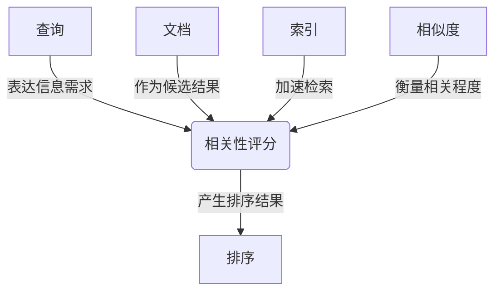

# 相关性评分 原理与代码实例讲解

## 1. 背景介绍

### 1.1 问题的由来

在现代信息时代,我们每天都会接触到大量的数据和信息。无论是在网络搜索、电子商务网站、社交媒体平台还是推荐系统中,我们都需要从海量的数据中快速找到与我们需求相关的内容。因此,相关性评分(Relevance Scoring)作为一种衡量查询与文档相关程度的方法,在信息检索、数据挖掘和自然语言处理等领域扮演着至关重要的角色。

### 1.2 研究现状  

相关性评分已经成为信息检索领域的核心研究课题之一。早期的布尔模型和向量空间模型为相关性评分奠定了基础,但存在一些局限性。随着机器学习和深度学习技术的发展,基于概率模型、语义模型和神经网络模型的相关性评分方法不断涌现,展现出更加优秀的性能。

### 1.3 研究意义

高效准确的相关性评分对于提高信息系统的检索质量、用户体验和商业价值至关重要。通过深入研究相关性评分的原理和算法,我们可以更好地理解和优化信息检索过程,为用户提供更加个性化和智能化的服务。同时,相关性评分的研究成果也可以推广应用于自然语言处理、推荐系统和知识图谱等领域。

### 1.4 本文结构

本文将全面介绍相关性评分的核心概念、算法原理、数学模型、代码实现和实际应用场景。我们将从基础知识出发,逐步深入探讨相关性评分的各个方面,并结合实例代码和案例分析,帮助读者更好地掌握相关性评分的理论与实践。

## 2. 核心概念与联系

相关性评分涉及多个核心概念,包括查询(Query)、文档(Document)、索引(Index)、相似度(Similarity)和排序(Ranking)等。这些概念相互关联,共同构建了相关性评分的基础框架。

1. **查询(Query)**: 用户输入的查询词或查询语句,表达了用户的信息需求。
2. **文档(Document)**: 存储在系统中的文本数据,是相关性评分的候选结果。
3. **索引(Index)**: 通过建立倒排索引等数据结构,加速文档的检索过程。
4. **相似度(Similarity)**: 衡量查询与文档之间的相关程度,是相关性评分的核心计算。
5. **排序(Ranking)**: 根据相似度得分,对文档进行排序,输出最终的检索结果。

## 3. 核心算法原理 & 具体操作步骤

### 3.1 算法原理概述

相关性评分算法的核心目标是计算查询与文档之间的相似度得分,并根据得分对文档进行排序。常见的相关性评分算法包括:

1. **布尔模型(Boolean Model)**: 基于查询词在文档中的出现与否进行匹配。
2. **向量空间模型(Vector Space Model)**: 将查询和文档表示为向量,计算它们在向量空间中的相似度。
3. **概率模型(Probabilistic Model)**: 基于概率论原理,计算文档满足查询的概率作为相似度得分。
4. **语义模型(Semantic Model)**: 考虑查询和文档的语义信息,通过语义相似度计算相关性。
5. **神经网络模型(Neural Network Model)**: 利用深度学习技术,自动学习查询和文档的语义表示,进行相关性评分。

### 3.2 算法步骤详解

以经典的 **TF-IDF 向量空间模型** 为例,相关性评分的具体步骤如下:

1. **文本预处理**: 对查询和文档进行分词、去停用词、词形还原等预处理操作。
2. **构建向量空间**: 基于文档集合构建词袋(Bag-of-Words)模型,每个文档表示为一个向量。
3. **计算 TF(Term Frequency)**: 统计每个词在文档中出现的频率。
4. **计算 IDF(Inverse Document Frequency)**: 计算每个词的逆文档频率,降低常见词的权重。
5. **计算 TF-IDF 权重**: 将 TF 和 IDF 相乘,得到每个词在文档中的 TF-IDF 权重。
6. **计算相似度**: 使用余弦相似度等方法,计算查询向量与文档向量之间的相似度得分。
7. **排序输出**: 根据相似度得分,对文档进行降序排序,输出最终的检索结果。

### 3.3 算法优缺点

**TF-IDF 向量空间模型的优点**:

- 简单直观,易于理解和实现。
- 考虑了词频和逆文档频率,能够较好地反映词的重要性。
- 支持部分匹配,可以检索到与查询不完全相同但相关的文档。

**TF-IDF 向量空间模型的缺点**:

- 忽略了词与词之间的位置和序列信息。
- 无法很好地处理同义词、近义词和多义词等语义问题。
- 对于短文本和查询,向量维度较低,可能导致相似度计算不准确。

### 3.4 算法应用领域

相关性评分算法广泛应用于以下领域:

- **信息检索系统**: 用于网络搜索引擎、企业知识库和文档管理系统等。
- **推荐系统**: 根据用户的历史行为和偏好,推荐相关的商品、内容或服务。
- **自然语言处理**: 用于问答系统、文本摘要、机器翻译等任务中的相关性计算。
- **数据挖掘**: 用于文本聚类、主题模型和异常检测等任务。
- **生物信息学**: 用于基因序列比对和蛋白质结构预测等任务。

## 4. 数学模型和公式 & 详细讲解 & 举例说明

### 4.1 数学模型构建

在 TF-IDF 向量空间模型中,查询 $q$ 和文档 $d$ 都可以表示为向量:

$$
\vec{q} = (q_1, q_2, \dots, q_n)
$$

$$
\vec{d} = (d_1, d_2, \dots, d_n)
$$

其中 $n$ 是词袋模型中的词汇表大小,每个分量表示对应词在查询或文档中的 TF-IDF 权重。

TF-IDF 权重的计算公式如下:

$$
w_{i,j} = tf_{i,j} \times idf_i
$$

$$
tf_{i,j} = \frac{n_{i,j}}{\sum_k n_{k,j}}
$$

$$
idf_i = \log \frac{|D|}{|\{d : t_i \in d\}|}
$$

其中:

- $w_{i,j}$ 表示词 $t_i$ 在文档 $d_j$ 中的 TF-IDF 权重。
- $tf_{i,j}$ 表示词 $t_i$ 在文档 $d_j$ 中的词频(Term Frequency)。
- $n_{i,j}$ 表示词 $t_i$ 在文档 $d_j$ 中出现的次数。
- $idf_i$ 表示词 $t_i$ 的逆文档频率(Inverse Document Frequency)。
- $|D|$ 表示文档集合的总数。
- $|\{d : t_i \in d\}|$ 表示包含词 $t_i$ 的文档数量。

### 4.2 公式推导过程

我们可以从信息论的角度推导 TF-IDF 公式,理解其背后的原理。

假设一个词 $t$ 在文档集合 $D$ 中出现的概率为 $P(t)$,则该词携带的信息量可以用信息熵 $-\log P(t)$ 来表示。如果一个词在所有文档中均匀分布,那么它携带的信息量就较小;反之,如果一个词只出现在少数文档中,那么它携带的信息量就较大。

因此,我们可以用 $\log \frac{1}{P(t)}$ 来衡量一个词的重要性,这就是逆文档频率 IDF 的来源。具体推导过程如下:

$$
\begin{aligned}
idf_t &= \log \frac{1}{P(t)} \\
&= \log \frac{|D|}{|\{d : t \in d\}|} \\
&= \log \frac{|D|}{df_t}
\end{aligned}
$$

其中 $df_t$ 表示包含词 $t$ 的文档数量。

另一方面,词频 TF 反映了一个词在文档中出现的次数,可以用来衡量该词对文档的重要性。通常使用归一化的词频,即将词频除以文档中所有词的总数。

综合 TF 和 IDF,我们就得到了 TF-IDF 权重公式:

$$
w_{t,d} = tf_{t,d} \times idf_t
$$

该公式表示,一个词在文档中的重要性不仅取决于它在该文档中出现的频率,还取决于它在整个文档集合中的稀有程度。

### 4.3 案例分析与讲解

假设我们有一个包含以下三个文档的小型文档集合:

- $d_1$: "The quick brown fox jumps over the lazy dog."
- $d_2$: "The brown fox is quick and lazy."
- $d_3$: "The fox is not lazy, it is very quick."

现在,我们来计算查询 "quick fox" 与每个文档的相似度得分。

首先,我们构建词袋模型,词汇表为 `["the", "quick", "brown", "fox", "jumps", "over", "lazy", "dog", "is", "and", "not", "it", "very"]`。

接下来,计算每个词的 TF 和 IDF:

| 词 | $d_1$ TF | $d_2$ TF | $d_3$ TF | DF | IDF |
|---|---|---|---|---|---|
| the | 2/9 | 1/6 | 1/7 | 3 | $\log \frac{3}{3} = 0$ |
| quick | 1/9 | 1/6 | 2/7 | 3 | $\log \frac{3}{3} = 0$ |
| brown | 1/9 | 1/6 | 0/7 | 2 | $\log \frac{3}{2} \approx 0.176$ |
| fox | 1/9 | 1/6 | 1/7 | 3 | $\log \frac{3}{3} = 0$ |
| jumps | 1/9 | 0/6 | 0/7 | 1 | $\log \frac{3}{1} \approx 0.477$ |
| over | 1/9 | 0/6 | 0/7 | 1 | $\log \frac{3}{1} \approx 0.477$ |
| lazy | 1/9 | 1/6 | 1/7 | 3 | $\log \frac{3}{3} = 0$ |
| dog | 1/9 | 0/6 | 0/7 | 1 | $\log \frac{3}{1} \approx 0.477$ |
| is | 0/9 | 1/6 | 2/7 | 2 | $\log \frac{3}{2} \approx 0.176$ |
| and | 0/9 | 1/6 | 0/7 | 1 | $\log \frac{3}{1} \approx 0.477$ |
| not | 0/9 | 0/6 | 1/7 | 1 | $\log \frac{3}{1} \approx 0.477$ |
| it | 0/9 | 0/6 | 1/7 | 1 | $\log \frac{3}{1} \approx 0.477$ |
| very | 0/9 | 0/6 | 1/7 | 1 | $\log \frac{3}{1} \approx 0.477$ |

然后,计算每个文档中每个词的 TF-IDF 权重:

$$
\vec{d_1} = (0, 0.111, 0.111, 0.111, 0.477, 0.477, 0.111, 0.477, 0, 0, 0, 0, 0)
$$

$$
\vec{d_2} = (0, 0.176, 0.176, 0.176, 0, 0, 0.176, 0, 0.176, 0.477, 0, 0, 0)
$$

$$
\vec{d_3} = (0, 0.285, 0, 0.143, 0, 0,