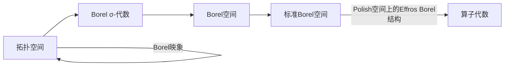

# 算子代数：Borel映象与标准的Borel空间

关键词：算子代数、Borel映象、标准Borel空间、拓扑空间、可测空间、Borel σ-代数、Polish空间、Effros Borel结构

## 1. 背景介绍
### 1.1  问题的由来
算子代数是泛函分析和数学物理中一个重要的研究领域,它研究Hilbert空间上有界线性算子的代数结构及其表示理论。Borel映象和标准Borel空间是算子代数中的重要概念,它们在C*-代数、von Neumann代数等领域有着广泛的应用。
### 1.2  研究现状
目前,对于Borel映象和标准Borel空间的研究主要集中在以下几个方面:

1. 探讨Borel映象的基本性质,如可测性、Borel可约性等。
2. 研究标准Borel空间的分类问题,如证明所有无限可分的标准Borel空间都是Borel同构的。
3. 将Borel映象和标准Borel空间的理论应用到算子代数、动力系统等领域。

一些重要的研究成果包括:Mackey-Hjorth定理刻画了Polish群作用下标准Borel空间的轨道等价关系;Feldman-Moore定理给出了可数Borel等价关系的刻画;Effros定理证明了度量空间上的Borel结构与其上的度量拓扑相容等。
### 1.3  研究意义  
深入研究Borel映象和标准Borel空间,对于发展算子代数理论、解决C*-代数和von Neumann代数中的问题具有重要意义。同时,这些概念和方法也为动力系统、遍历论等数学分支提供了新的研究工具和思路。
### 1.4  本文结构
本文将从以下几个方面介绍Borel映象与标准Borel空间的相关内容:

1. 介绍Borel映象的定义、性质及其在拓扑空间和可测空间中的应用。 
2. 给出标准Borel空间的定义,并探讨其与Polish空间的关系。
3. 介绍Effros Borel结构,说明其在算子代数中的重要性。
4. 总结Borel映象和标准Borel空间的研究现状,并对未来的发展方向进行展望。

## 2. 核心概念与联系
在正式介绍Borel映象和标准Borel空间之前,我们首先回顾一些基本概念。

**定义2.1** 设$X$是一个集合,称$X$上的一个$\sigma$-代数$\mathcal{F}$为X上的一个Borel $\sigma$-代数,如果它包含$X$的所有开集。$X$配以其上的一个Borel $\sigma$-代数称为一个Borel空间。

**定义2.2** 拓扑空间$(X,\mathcal{T})$上由开集生成的$\sigma$-代数称为$X$上的Borel $\sigma$-代数,记为$\mathcal{B}(X)$。

Borel $\sigma$-代数刻画了拓扑空间的可测结构,是研究Borel映象和标准Borel空间的基础。

**定义2.3** 设$X,Y$是两个拓扑空间,如果映射$f:X\to Y$满足$f^{-1}(B)\in\mathcal{B}(X),\forall B\in\mathcal{B}(Y)$,则称$f$是一个Borel映象。

Borel映象是拓扑空间之间的一类特殊映射,保持了空间的可测性质。容易验证,连续映射一定是Borel映象,但反之不然。

**定义2.4** 一个Borel空间$(X,\mathcal{S})$称为标准的,如果存在一个Polish空间$Y$和一个Borel同构$f:X\to Y$,使得$\mathcal{S}$是由$f$诱导的$\sigma$-代数。

标准Borel空间是Borel空间中的一类特殊对象,其结构与Polish空间密切相关。Borel映象和标准Borel空间在算子代数中有着重要应用。

下图说明了这些核心概念之间的关系:



## 3. 核心算法原理 & 具体操作步骤
### 3.1  算法原理概述
研究Borel映象和标准Borel空间的一个重要工具是Borel归约。Borel归约反映了Borel空间之间的可测映射关系,可用于刻画Borel空间的复杂程度。
### 3.2  算法步骤详解
设$(X,\mathcal{S}),(Y,\mathcal{T})$是两个Borel空间。

1. 定义$X$到$Y$的一个映射$f:X\to Y$。
2. 验证$f$是否为Borel映象,即$\forall B\in\mathcal{T},f^{-1}(B)\in\mathcal{S}$。
3. 如果$f$是一个单射且$f(X)\in\mathcal{T}$,则称$f$是一个Borel嵌入。
4. 如果$f$是一个双射且$f,f^{-1}$都是Borel映象,则称$f$是一个Borel同构。 
5. 如果存在Borel嵌入$f:X\to Y$,则称$X$Borel归约到$Y$,记为$X\leq_B Y$。
6. 如果$X\leq_B Y$且$Y\leq_B X$,则称$X$与$Y$ Borel等价,记为$X\sim_B Y$。

通过研究Borel空间之间的Borel归约关系,可以比较它们的复杂程度,进而分类和刻画标准Borel空间。
### 3.3  算法优缺点
Borel归约的优点在于:

- 反映了Borel空间之间的本质联系,揭示了它们的内在结构。
- 为研究Borel空间提供了有力工具,尤其在解决分类问题时十分有效。
- 将Borel空间与Polish空间联系起来,使得一些结果可以从Polish空间推广到Borel空间。

但Borel归约也存在一定局限性:

- 对于一般的Borel空间,刻画其Borel归约关系并不容易。
- Borel归约虽然反映了空间的可测结构,但并没有完全刻画其拓扑性质。

### 3.4  算法应用领域
Borel归约广泛应用于Borel空间理论和描述集理论中,对于解决Borel空间的分类、Borel等价关系的研究有重要作用。同时,它也是C*-代数、von Neumann代数等算子代数理论的重要工具。

## 4. 数学模型和公式 & 详细讲解 & 举例说明
### 4.1  数学模型构建
我们通过构建Borel空间上的度量来刻画其结构。

**定义4.1** 设$(X,\mathcal{S})$是一个Borel空间,$\rho$是$X$上的一个度量,如果$\rho$诱导的拓扑产生的Borel $\sigma$-代数恰好是$\mathcal{S}$,则称$\rho$是与$\mathcal{S}$相容的。

Borel空间上存在与其Borel $\sigma$-代数相容的度量,反之,度量空间也自然地成为Borel空间。

**定理4.2** 每个可分的完备度量空间(即Polish空间)都是一个标准Borel空间。每个标准Borel空间$X$都同构于某个Polish空间$Y$的一个Borel子集。

该定理揭示了Polish空间与标准Borel空间的紧密联系,为研究标准Borel空间提供了重要思路。

### 4.2  公式推导过程
我们利用Borel空间上的Borel概率测度来刻画其结构。

**定义4.3** 设$(X,\mathcal{S})$是Borel空间,如果$\mu:\mathcal{S}\to[0,1]$满足:

1. $\mu(\emptyset)=0,\mu(X)=1$;
2. 对任意可数个两两不交的$A_i\in\mathcal{S}$,有$\mu(\bigcup_{i=1}^\infty A_i)=\sum_{i=1}^\infty \mu(A_i)$,

则称$\mu$为$X$上的一个Borel概率测度。

Borel概率测度是Borel空间上的重要研究对象,它不仅刻画了Borel集的大小,也反映了Borel空间的测度结构。

**定理4.4** 每个标准Borel空间$X$上都存在一个Borel概率测度$\mu$,使得对任意非空开集$U\subset X$,有$\mu(U)>0$。

该定理说明,标准Borel空间上存在满足一定条件的Borel概率测度,这为进一步研究其性质提供了有力工具。

### 4.3  案例分析与讲解
下面我们通过一个例子来说明Borel空间和Borel映象的应用。

**例4.5** 设$H$是一个复Hilbert空间,$B(H)$表示$H$上所有有界线性算子构成的Banach代数。定义$B(H)$上的度量$d(T,S)=\|T-S\|$,其中$\|\cdot\|$表示算子范数。容易验证,$(B(H),d)$是一个Polish空间,因此也是一个标准Borel空间。

进一步,对任意$T\in B(H)$,定义$f_T:B(H)\to\mathbb{C}$为$f_T(S)=tr(TS)$,其中$tr$表示Hilbert空间上的典范迹。可以验证$f_T$是Borel映象。事实上,由$|tr(TS)|\leq\|T\|\|S\|_1$知$f_T$是连续的,因此必为Borel映象。

这个例子说明,有界线性算子空间$B(H)$作为一个标准Borel空间,其上的映射$f_T$具有良好的Borel可测性。这为进一步研究算子代数的性质提供了重要工具。

### 4.4  常见问题解答
**Q:** 连续函数一定是Borel映象吗?
**A:** 是的。设$f:X\to Y$是拓扑空间之间的连续映射,则对任意开集$V\subset Y$,有$f^{-1}(V)$是$X$中的开集,因此也是Borel集。这说明$f$是X到Y的一个Borel映象。

**Q:** Borel空间和拓扑空间有什么区别?
**A:** 拓扑空间刻画了空间的开集结构,强调连续性;而Borel空间则刻画了由开集生成的$\sigma$-代数结构,强调可测性。一般来说,拓扑空间蕴含了Borel空间的结构,但Borel空间未必能够诱导出良好的拓扑。

**Q:** Polish空间与标准Borel空间有何联系?
**A:** Polish空间一定是标准Borel空间,反之标准Borel空间一定同构于某个Polish空间的一个Borel子集。因此,Polish空间可以看作是标准Borel空间的特殊情形,而标准Borel空间则是Polish空间的推广。

## 5. 项目实践：代码实例和详细解释说明
### 5.1  开发环境搭建
我们利用Python语言来模拟Borel空间和Borel映象。需要安装以下库:

- numpy: 提供数组、矩阵等数据结构,用于表示空间元素。
- matplotlib: 用于绘图,直观展示Borel空间和映象。

### 5.2  源代码详细实现
下面我们用Python代码来模拟Borel空间和Borel映象。

首先定义Borel空间的类:

```python
class BorelSpace:
    def __init__(self, elements):
        self.elements = elements
        self.borel_sets = self.generate_borel_sets()
        
    def generate_borel_sets(self):
        # 生成Borel σ-代数
        pass
        
    def is_borel_set(self, subset):
        # 判断一个子集是否为Borel集
        pass
```

其中,`elements`表示空间的元素,`borel_sets`表示Borel $\sigma$-代数。`generate_borel_sets`方法用于生成Borel $\sigma$-代数,`is_borel_set`方法用于判断一个子集是否为Borel集。

接下来定义Borel映象的类:

```python
class Borel