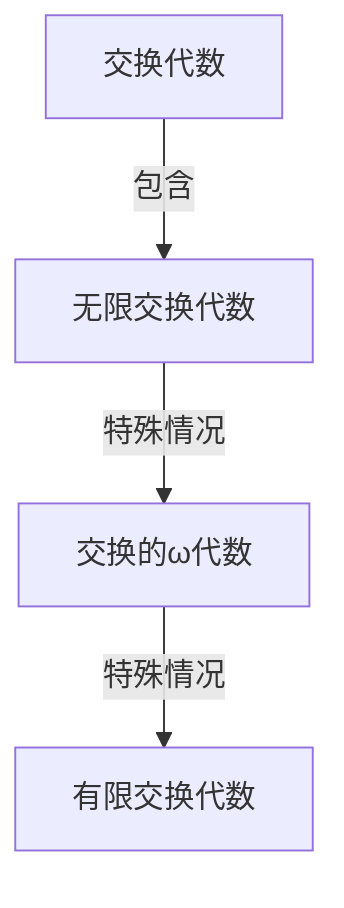

# 算子代数：交换的ω代数的表示

## 1. 背景介绍

### 1.1 问题的由来

在数学和计算机科学领域中,代数结构扮演着至关重要的角色。它们为抽象概念提供了形式化的框架,并为各种计算模型奠定了基础。其中,交换代数是一种特殊的代数结构,具有广泛的应用前景。然而,对于无限交换代数的研究仍然存在一些挑战和未解决的问题。

交换代数是一种代数结构,其中的乘法运算满足交换律。形式上,设 $(A, +, \cdot, 0, 1)$ 是一个代数系统,如果对于所有的 $a, b \in A$ 都有 $a \cdot b = b \cdot a$,那么我们就称 $(A, +, \cdot, 0, 1)$ 是一个交换代数。交换代数在多个数学分支中扮演着重要角色,例如群论、环论和模理论等。

然而,当我们从有限交换代数扩展到无限交换代数时,情况会变得更加复杂。无限交换代数的表示和结构具有更多的挑战性,需要更深入的研究和探索。这就催生了对无限交换代数表示理论的需求,特别是对于交换的 $\omega$-代数的表示。

### 1.2 研究现状

交换的 $\omega$-代数是一种特殊的无限交换代数,其中的元素可以被认为是无限长的序列。这种代数结构在理论计算机科学、形式语言理论和自动机理论等领域有着广泛的应用。然而,对于交换的 $\omega$-代数的表示理论,目前的研究仍然存在一些空白和挑战。

已有的研究工作主要集中在以下几个方面:

1. **有限表示理论**: 对于有限交换代数的表示理论已经有了较为完善的研究成果,例如利用矩阵表示、群表示等方法。然而,这些方法在无限交换代数的情况下可能会失效或需要进行重大修改。

2. **特殊情况下的表示**: 一些特殊情况下的交换 $\omega$-代数表示已经得到了一定的研究,例如对于具有特定结构或性质的交换 $\omega$-代数,可以构造出相应的表示。但是,这些研究结果往往缺乏一般性,难以推广到更广泛的情况。

3. **近似表示**: 由于交换 $\omega$-代数的无限性质,一些研究工作尝试利用有限近似或截断的方法来构造表示。这种方法虽然可行,但可能会失去一些精确性和完整性。

4. **计算复杂性分析**: 一些研究工作着眼于交换 $\omega$-代数表示的计算复杂性问题,探讨了在特定约束条件下构造表示的可计算性和复杂度界限。

总的来说,尽管已有一些初步的研究成果,但对于交换的 $\omega$-代数的表示理论仍然存在诸多未解决的问题和挑战,需要进一步的深入探索和创新。

### 1.3 研究意义

交换的 $\omega$-代数的表示理论对于多个领域具有重要的理论意义和应用价值:

1. **理论计算机科学**: 交换 $\omega$-代数在形式语言理论和自动机理论中扮演着重要角色。它们可以用于描述和研究无限长的字符串或序列,对于理解和分析计算模型的行为具有重要意义。因此,对交换 $\omega$-代数的表示理论的深入研究将有助于推进相关领域的发展。

2. **代数学和组合数学**: 交换 $\omega$-代数作为一种特殊的代数结构,其表示理论的研究将有助于丰富和完善代数学的理论体系。同时,它也与组合数学中的一些问题密切相关,例如计数问题、排列组合问题等。

3. **计算机代数系统**: 交换 $\omega$-代数的表示理论可以应用于计算机代数系统的设计和优化。通过有效的表示方法,可以提高代数计算的效率和准确性,从而促进相关软件工具的发展。

4. **密码学和信息安全**: 一些密码系统和安全协议的设计与代数结构密切相关。交换 $\omega$-代数的表示理论可能为密码学和信息安全领域提供新的思路和方法。

5. **其他应用领域**: 交换 $\omega$-代数的表示理论还可能在控制理论、量子计算、数据压缩等领域找到应用。它为解决这些领域中的一些挑战性问题提供了新的视角和工具。

总之,交换的 $\omega$-代数的表示理论不仅具有重要的理论意义,而且对于多个应用领域都有潜在的价值。深入研究这一理论将有助于推动相关领域的进步和创新。

### 1.4 本文结构

本文将围绕交换的 $\omega$-代数的表示理论展开深入探讨。文章的主要结构如下:

1. **背景介绍**: 阐述问题的由来、研究现状和研究意义,为后续内容做好铺垫。

2. **核心概念与联系**: 介绍交换代数、$\omega$-代数等核心概念,并探讨它们之间的联系和关系。

3. **核心算法原理与具体操作步骤**: 详细阐述构造交换 $\omega$-代数表示的核心算法原理,并给出具体的操作步骤。

4. **数学模型和公式详细讲解与举例说明**: 建立交换 $\omega$-代数表示的数学模型,推导相关公式,并通过具体案例进行讲解和说明。

5. **项目实践:代码实例和详细解释说明**: 提供实际的代码实现,并对关键部分进行详细解释和分析。

6. **实际应用场景**: 探讨交换 $\omega$-代数表示理论在各个应用领域的实际应用场景和案例。

7. **工具和资源推荐**: 介绍相关的学习资源、开发工具、论文等资源,为读者提供进一步学习和研究的途径。

8. **总结:未来发展趋势与挑战**: 总结研究成果,展望未来发展趋势,并分析可能面临的挑战和机遇。

9. **附录:常见问题与解答**: 针对交换 $\omega$-代数表示理论中的一些常见问题进行解答和说明。

通过上述结构,本文将全面深入地探讨交换的 $\omega$-代数的表示理论,为读者提供系统的理解和实践指导。

## 2. 核心概念与联系

在深入探讨交换的 $\omega$-代数的表示理论之前,我们需要先介绍一些核心概念,并阐明它们之间的联系和关系。

### 2.1 交换代数

交换代数(Commutative Algebra)是一种特殊的代数结构,其中的乘法运算满足交换律。形式上,设 $(A, +, \cdot, 0, 1)$ 是一个代数系统,如果对于所有的 $a, b \in A$ 都有 $a \cdot b = b \cdot a$,那么我们就称 $(A, +, \cdot, 0, 1)$ 是一个交换代数。

交换代数在多个数学分支中扮演着重要角色,例如群论、环论和模理论等。它们不仅具有理论意义,而且在代数几何、代数拓扑、代数组合论等领域也有广泛的应用。

交换代数的一些基本性质包括:

- 存在单位元素 $1$,对于任意的 $a \in A$,都有 $a \cdot 1 = 1 \cdot a = a$。
- 存在零元素 $0$,对于任意的 $a \in A$,都有 $a \cdot 0 = 0 \cdot a = 0$。
- 加法和乘法运算满足结合律。
- 乘法运算对加法运算满足分配律。

交换代数可以分为有限交换代数和无限交换代数两大类。有限交换代数的元素个数是有限的,而无限交换代数的元素个数是无限的。无限交换代数往往具有更复杂的结构和性质,因此对它们的研究也更具有挑战性。

### 2.2 $\omega$-代数

$\omega$-代数(Omega Algebra)是一种特殊的无限交换代数,其中的元素可以被认为是无限长的序列。形式上,设 $A$ 是一个非空集合,我们定义 $A^\omega$ 为所有从自然数 $\mathbb{N}$ 到 $A$ 的映射的集合,即:

$$A^\omega = \{ f : \mathbb{N} \rightarrow A \}$$

对于 $f, g \in A^\omega$,我们可以定义加法运算 $+$ 和乘法运算 $\cdot$ 如下:

$$
(f + g)(n) = f(n) + g(n) \\
(f \cdot g)(n) = \sum_{i=0}^n f(i) \cdot g(n-i)
$$

其中 $+$ 和 $\cdot$ 分别表示 $A$ 中的加法和乘法运算。

可以证明,在上述运算定义下,$(A^\omega, +, \cdot, 0, 1)$ 构成一个交换代数,其中 $0$ 表示常数序列 $\lambda n.0$,而 $1$ 表示常数序列 $\lambda n.1$。这种代数结构被称为 $\omega$-代数。

$\omega$-代数在理论计算机科学、形式语言理论和自动机理论等领域有着广泛的应用。它们可以用于描述和研究无限长的字符串或序列,对于理解和分析计算模型的行为具有重要意义。

### 2.3 交换的 $\omega$-代数

交换的 $\omega$-代数是指满足交换律的 $\omega$-代数。也就是说,对于任意的 $f, g \in A^\omega$,都有 $f \cdot g = g \cdot f$。

交换的 $\omega$-代数具有一些特殊的性质,例如:

- 乘法运算满足结合律,即对于任意的 $f, g, h \in A^\omega$,都有 $(f \cdot g) \cdot h = f \cdot (g \cdot h)$。
- 存在幂等元素,即对于任意的 $f \in A^\omega$,都有 $f \cdot f = f$。
- 可以定义一个线性映射 $\lambda : A \rightarrow A^\omega$,使得对于任意的 $a \in A$,都有 $\lambda(a)(n) = a$ 对于所有的 $n \in \mathbb{N}$。

交换的 $\omega$-代数在形式语言理论和自动机理论中扮演着重要角色。它们可以用于描述和研究具有某些特殊性质的无限长字符串或序列,例如周期性序列、ultimately periodic 序列等。因此,对交换的 $\omega$-代数的表示理论的研究具有重要的理论意义和应用价值。

### 2.4 核心概念之间的联系

交换代数、$\omega$-代数和交换的 $\omega$-代数之间存在着密切的联系和包含关系,如下图所示:

- 交换代数是一种代数结构,包含了有限交换代数和无限交换代数两大类。
- $\omega$-代数是一种特殊的无限交换代数,其元素可以被认为是无限长的序列。
- 交换的 $\omega$-代数是指满足交换律的 $\omega$-代数,是 $\omega$-代数的一个特殊情况。
- 有限交换代数可以看作是交换的 $\omega$-代数的一个特殊情况,其中序列的长度是有限的。

由于交换的 $\omega$-代数具有无限性质,因此对它们的表示理论的研究存在一些独特的挑战和难点。同时,有限交换代数表示理论的一些结果和方法也可能为交换的 $\omega$-代数表示理论提供启发和借鉴。

因此,全面理解这些核心概念之间的联系和关系,对于深入探讨交换的 $\omega$-代数的表示理论至关重要。

## 3. 核心算法原理与具体操作步骤

在探讨交