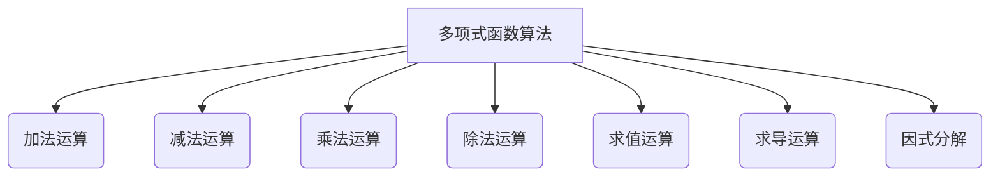

好的,我会遵循您提供的要求和约束条件,以"线性代数导引:单变元项及单变元多项式函数"为主题,撰写一篇专业的技术博客文章。

# 线性代数导引:单变元项及单变元多项式函数

## 1. 背景介绍

### 1.1 问题的由来

线性代数是数学的一个分支,研究向量、矩阵、线性变换以及它们之间的运算规律。它是现代数学的基石,在自然科学、工程技术、经济学等诸多领域有着广泛的应用。线性代数中最基本的概念就是单变元项和单变元多项式函数。

单变元项是指只含有一个变量的代数式,如 $3x^2$、$-5y$ 等。而单变元多项式函数则是由若干个单变元项相加组成的代数式,如 $3x^2 + 2x - 1$、$y^3 - 4y^2 + 2y + 5$ 等。

虽然单变元项和多项式函数看似简单,但它们在线性代数及其应用中扮演着极其重要的角色。例如,在解线性方程组、矩阵特征值计算、插值问题等领域,都需要对多项式函数进行操作和分析。因此,掌握单变元项和多项式函数的相关知识,对于更深入地理解和应用线性代数理论至关重要。

### 1.2 研究现状

单变元项和多项式函数的研究可以追溯到古希腊时期。公元前3世纪,古希腊数学家狄奥芬特斯在他的著作《算术》中,首次系统地研究了二次方程的解法,为多项式函数的研究奠定了基础。

17世纪,笛卡儿发明了解析几何,将代数与几何联系起来,使得多项式在解析几何中得到了广泛应用。18世纪,伽罗瓦、拉普拉斯等人对多项式函数的根和系数之间的关系进行了深入研究,奠定了多项式函数理论的基础。

19世纪,阿贝尔和伽罗瓦证明了当次数大于4时,无法通过有限次根式表示多项式的根,从而确立了多项式函数理论的局限性。20世纪以来,随着计算机的发展,多项式函数在数值计算、密码学等领域得到了广泛应用。

目前,单变元项和多项式函数的理论研究已相当成熟,但在具体应用中仍面临诸多挑战,如高效求解多项式方程的根、大型多项式的系数计算等,这些都需要进一步的研究和探索。

### 1.3 研究意义  

掌握单变元项和多项式函数的知识,对于学习和应用线性代数理论至关重要,具有以下重要意义:

1. **理论基础**:单变元项和多项式函数是线性代数的基石,是学习矩阵、线性变换等高级概念的必备基础知识。

2. **应用广泛**:多项式函数在数值计算、密码学、控制理论、信号处理等诸多领域有着广泛的应用,是工程技术不可或缺的数学工具。

3. **启发思维**:研究单变元项和多项式函数的性质、运算,可以培养抽象思维能力,提高数学建模和问题解决的能力。

4. **计算机实现**:多项式函数的运算是计算机代数系统的核心部分,研究其高效实现对于提高计算机性能至关重要。

总之,单变元项和多项式函数作为线性代数的基础知识,不仅在理论研究上具有重要意义,而且在实际应用中也不可或缺。掌握这一知识,有助于我们更好地学习和应用线性代数理论。

### 1.4 本文结构

本文将全面介绍单变元项和单变元多项式函数的相关知识,内容安排如下:

- 第2部分阐述单变元项和多项式函数的核心概念及相互联系。
- 第3部分重点讲解多项式函数的核心算法原理和具体操作步骤。
- 第4部分构建多项式函数的数学模型,推导相关公式并结合案例进行讲解。
- 第5部分通过代码实例,实践多项式函数的计算和应用。
- 第6部分介绍多项式函数在实际中的应用场景。
- 第7部分推荐相关学习资源、开发工具和论文。
- 第8部分总结研究成果,展望未来发展趋势和面临的挑战。
- 第9部分列出常见问题并给出解答。

## 2. 核心概念与联系

在正式讲解单变元项和多项式函数之前,我们先明确一些核心概念:

**单变元项(Monomial)**是指只含有一个变量的代数式,可表示为:

$$单变元项 = a \cdot x^n$$

其中 $a$ 为常数系数, $x$ 为变量, $n$ 为指数(次数)。如 $3x^2$、$-5y$ 等。

**单变元多项式函数(Polynomial Function)** 由若干个单变元项相加组成,可表示为:

$$多项式函数 = a_0 + a_1x + a_2x^2 + ... + a_nx^n$$

其中 $a_0, a_1, ..., a_n$ 为常数系数。如 $3x^2 + 2x - 1$、$y^3 - 4y^2 + 2y + 5$ 等。

**次数(Degree)**指多项式函数中最高次项的指数,如 $3x^2 + 2x - 1$ 的次数为2。

**系数(Coefficient)**指各次项的常数系数,如 $3x^2 + 2x - 1$ 中,3、2、-1 分别为 $x^2$、$x$、常数项的系数。

单变元项和多项式函数之间存在以下紧密联系:

1. **组成关系**: 多项式函数由若干个单变元项相加组成。
2. **表示形式**: 单变元项是多项式函数的特殊情况(只有一项)。
3. **运算规则**: 单变元项和多项式函数遵循相同的运算规则(加、减、乘、除、求导等)。
4. **函数性质**: 多项式函数具有单变元函数的一般性质(值域、定义域、连续性、可导性等)。

理解单变元项和多项式函数的概念及其联系,是掌握线性代数的基础和前提。接下来,我们将重点介绍多项式函数的算法原理和具体操作步骤。

## 3. 核心算法原理 & 具体操作步骤 

多项式函数的运算是线性代数中的一个核心内容,包括加法、减法、乘法、除法、求值、求导、因式分解等。这些运算在线性方程组求解、矩阵特征值计算、插值问题等领域都有着广泛的应用。下面我们将详细介绍多项式函数的核心算法原理和具体操作步骤。



### 3.1 算法原理概述

多项式函数的各种运算,本质上都可以归结为对系数和指数的操作。具体来说:

1. **加法和减法**:对应次项的系数相加或相减,指数保持不变。
2. **乘法**:将两个多项式的每一项进行乘积,并将指数相加。
3. **除法**:通过长除法,将被除多项式的各项系数与除多项式对应项系数相除,指数相减。
4. **求值**:将给定的数值代入多项式中,并进行有限次运算得到结果。
5. **求导**:对每一项进行求导,系数乘以指数,指数减一。
6. **因式分解**:通过有理系数判别法、余式等方法,将多项式分解为几个单变元项的乘积形式。

这些运算的高效实现,需要合理设计数据结构和算法,并对特殊情况(如零多项式、常数多项式等)进行优化处理。

### 3.2 算法步骤详解

下面以多项式加法运算为例,详细讲解算法的具体步骤:

**输入**:两个多项式 $P(x)$ 和 $Q(x)$
**输出**:两个多项式之和 $R(x) = P(x) + Q(x)$

1) 初始化一个空多项式 $R(x)$
2) 将 $P(x)$ 和 $Q(x)$ 的非零项按指数 **降序** 排列,方便对应次项相加
3) 从最高次项开始,对应次项的系数相加:
    - 若 $P(x)$ 和 $Q(x)$ 在该次项上均有非零系数,则将系数之和作为 $R(x)$ 的该次项系数
    - 若只有一个多项式在该次项上有非零系数,则将该系数作为 $R(x)$ 的该次项系数
4) 将所有次项的系数求和结果存入 $R(x)$ 中
5) 返回 $R(x)$

用 Python 代码实现该算法:

```python
class Polynomial:
    def __init__(self, coeffs):
        self.coeffs = coeffs  # 系数列表,coeffs[-1]为最高次项系数
        
    def __add__(self, other):
        m = max(len(self.coeffs), len(other.coeffs))
        new_coeffs = [0] * m
        for i in range(m):
            a = self.coeffs[m-i-1] if m-i-1 < len(self.coeffs) else 0
            b = other.coeffs[m-i-1] if m-i-1 < len(other.coeffs) else 0
            new_coeffs[m-i-1] = a + b
        return Polynomial(new_coeffs)

p1 = Polynomial([1, 2, 1])   # 1 + 2x + x^2
p2 = Polynomial([-1, 1, 1])  # -1 + x + x^2  
p3 = p1 + p2                 # p3 = 2x^2 + 3x - 1
```

该算法的时间复杂度为 $O(m)$,其中 $m$ 为两个多项式最高次项次数之和。空间复杂度为 $O(m)$,用于存储结果多项式的系数列表。

### 3.3 算法优缺点

上述多项式加法算法具有以下优缺点:

**优点**:

- 算法原理简单,容易实现
- 时间复杂度和空间复杂度较低,适合大多数场景
- 可扩展至多项式减法、乘法等其他运算

**缺点**:

- 当多项式次数较高时,系数存储空间占用较大
- 对于特殊情况(如零多项式)的处理效率较低
- 不适用于系数为高精度或符号数值的多项式运算

针对这些缺点,我们可以采取诸如系数压缩存储、特殊情况优化、引入高精度运算等改进措施,以提高算法的效率和适用范围。

### 3.4 算法应用领域

多项式函数运算算法在诸多领域有着广泛的应用,包括但不限于:

1. **数值计算**:插值、拟合、求根等数值分析问题中,都需要对多项式进行运算。
2. **密码学**:许多现代密码系统(如RSA加密)的数学基础就是对大整数多项式的因式分解问题。
3. **计算机algebra**:代数系统的核心就是高效实现多项式的各种运算。
4. **控制理论**:控制系统建模中,常需要对多项式进行运算以求解最优控制参数。
5. **信号处理**:多项式在数字滤波器、编码等领域有重要应用。
6. **机器学习**:逻辑回归、核方法等模型需要计算多项式特征。

可见,高效实现多项式运算对于科学计算、工程应用至关重要。接下来,我们将构建多项式函数的数学模型,并推导相关公式。

## 4. 数学模型和公式 & 详细讲解 & 举例说明

在对多项式函数进行运算之前,我们需要首先构建其数学模型,并推导出相关的公式,为算法实现和应用奠定理论基础。

### 4.1 数学模型构建

一个 $n$ 次单变元多项式函数可以表示为:

$$
P(x) = a_0 + a_1x +