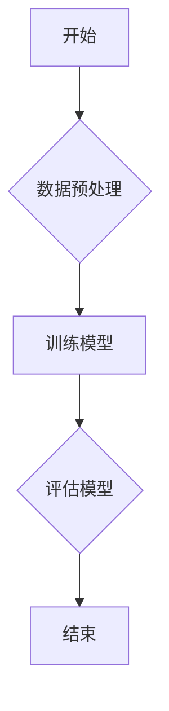

# 线性回归的数据可视化:梯度、梯度下降与损失函数

作者：禅与计算机程序设计艺术 / Zen and the Art of Computer Programming

## 1. 背景介绍

### 1.1 问题的由来

线性回归是统计学习中的一种基础模型，主要用于预测因变量与自变量之间的线性关系。在实际应用中，如何通过可视化手段理解线性回归模型的学习过程，特别是梯度、梯度下降和损失函数的作用，成为了一个重要的研究课题。

### 1.2 研究现状

目前，已有许多研究关注于线性回归的可视化方法。例如，利用三维图形展示数据集和线性回归拟合曲线的关系、使用动态图表展示模型参数变化等。然而，对于梯度、梯度下降和损失函数的深入理解，以及如何在实际应用中运用这些概念，仍有待进一步探讨。

### 1.3 研究意义

深入理解线性回归的数据可视化，有助于我们：

- 更直观地理解线性回归模型的学习过程。
- 分析梯度、梯度下降和损失函数对模型性能的影响。
- 优化模型参数，提高预测精度。
- 发现数据中的潜在规律和异常值。

### 1.4 本文结构

本文将分为以下几个部分：

- 介绍线性回归的基本概念和原理。
- 利用Mermaid流程图展示线性回归的算法流程。
- 通过实例讲解梯度、梯度下降和损失函数的概念。
- 使用Python和matplotlib进行线性回归的数据可视化。
- 分析梯度下降法在不同学习率下的收敛速度和效果。

## 2. 核心概念与联系

### 2.1 线性回归

线性回归是一种回归分析模型，它假设因变量与自变量之间存在线性关系。其数学表达式为：

$$
y = \beta_0 + \beta_1 \cdot x_1 + \beta_2 \cdot x_2 + \dots + \beta_n \cdot x_n + \epsilon
$$

其中，$y$为因变量，$x_1, x_2, \dots, x_n$为自变量，$\beta_0, \beta_1, \beta_2, \dots, \beta_n$为模型参数，$\epsilon$为误差项。

### 2.2 梯度

梯度是数学中描述函数在某一点处变化率的概念。在线性回归中，梯度可以帮助我们找到损失函数的最小值，从而得到最优的模型参数。

对于线性回归模型，损失函数的梯度为：

$$
\nabla_{\beta} J(\beta) = \frac{\partial J(\beta)}{\partial \beta} = 2X^T(X\beta - y)
$$

其中，$X$为自变量矩阵，$y$为因变量向量，$\beta$为模型参数向量，$J(\beta)$为损失函数。

### 2.3 梯度下降

梯度下降是一种优化算法，通过迭代更新模型参数，使损失函数的梯度逐渐减小，最终达到最小值。梯度下降的基本步骤如下：

1. 初始化模型参数$\beta$。
2. 计算损失函数的梯度$\nabla_{\beta} J(\beta)$。
3. 使用学习率$\alpha$更新模型参数：$\beta_{new} = \beta_{old} - \alpha \nabla_{\beta} J(\beta)$。
4. 重复步骤2和3，直到满足收敛条件。

### 2.4 损失函数

损失函数是衡量模型预测值与真实值之间差距的指标。在线性回归中，常用的损失函数有均方误差（MSE）和平均绝对误差（MAE）。

- 均方误差（MSE）：

$$
MSE = \frac{1}{m} \sum_{i=1}^{m} (y_i - \hat{y_i})^2
$$

其中，$y_i$为真实值，$\hat{y_i}$为预测值，$m$为样本数量。

- 平均绝对误差（MAE）：

$$
MAE = \frac{1}{m} \sum_{i=1}^{m} |y_i - \hat{y_i}|
$$

## 3. 核心算法原理 & 具体操作步骤

### 3.1 算法原理概述

线性回归的数据可视化主要包括以下三个步骤：

1. 使用Python和matplotlib进行数据预处理和可视化。
2. 利用Mermaid流程图展示线性回归的算法流程。
3. 通过实例讲解梯度、梯度下降和损失函数的概念。

### 3.2 算法步骤详解

#### 3.2.1 数据预处理

1. 导入必要的库：

```python
import numpy as np
import pandas as pd
import matplotlib.pyplot as plt
from sklearn.linear_model import LinearRegression
```

2. 加载数据：

```python
data = pd.read_csv('data.csv')
X = data[['x1', 'x2']].values
y = data['y'].values
```

3. 可视化数据：

```python
plt.scatter(X[:, 0], y, color='blue')
plt.xlabel('x1')
plt.ylabel('y')
plt.title('原始数据')
plt.show()
```

#### 3.2.2 Mermaid流程图



#### 3.2.3 梯度、梯度下降和损失函数

1. 计算损失函数和梯度：

```python
def compute_loss(X, y, beta):
    m = X.shape[0]
    predictions = X.dot(beta)
    error = predictions - y
    mse_loss = (1 / (2 * m)) * np.sum(error ** 2)
    grad = X.T.dot(error) / m
    return mse_loss, grad
```

2. 梯度下降：

```python
def gradient_descent(X, y, beta, alpha, epochs):
    m = X.shape[0]
    beta_new = beta
    for epoch in range(epochs):
        loss, grad = compute_loss(X, y, beta)
        beta_new = beta - alpha * grad
        beta = beta_new
    return beta, loss
```

### 3.3 算法优缺点

线性回归的数据可视化具有以下优点：

- 直观地展示数据分布和线性回归模型的关系。
- 帮助我们理解梯度、梯度下降和损失函数的概念。
- 为优化模型参数提供参考。

线性回归的数据可视化也存在一些缺点：

- 难以展示模型在复杂非线性数据上的性能。
- 对大样本数据可视化效果较差。

### 3.4 算法应用领域

线性回归的数据可视化在以下领域有着广泛的应用：

- 模型评估和优化。
- 数据探索和可视化。
- 特征工程和选择。

## 4. 数学模型和公式 & 详细讲解 & 举例说明

### 4.1 数学模型构建

线性回归模型的数学模型如下：

$$
y = \beta_0 + \beta_1 \cdot x_1 + \beta_2 \cdot x_2 + \dots + \beta_n \cdot x_n + \epsilon
$$

其中，$y$为因变量，$x_1, x_2, \dots, x_n$为自变量，$\beta_0, \beta_1, \beta_2, \dots, \beta_n$为模型参数，$\epsilon$为误差项。

### 4.2 公式推导过程

#### 4.2.1 梯度

损失函数的梯度为：

$$
\nabla_{\beta} J(\beta) = \frac{\partial J(\beta)}{\partial \beta} = 2X^T(X\beta - y)
$$

其中，$X$为自变量矩阵，$y$为因变量向量，$\beta$为模型参数向量，$J(\beta)$为损失函数。

#### 4.2.2 梯度下降

梯度下降的基本步骤如下：

1. 初始化模型参数$\beta$。
2. 计算损失函数的梯度$\nabla_{\beta} J(\beta)$。
3. 使用学习率$\alpha$更新模型参数：$\beta_{new} = \beta_{old} - \alpha \nabla_{\beta} J(\beta)$。
4. 重复步骤2和3，直到满足收敛条件。

### 4.3 案例分析与讲解

以下是一个使用线性回归模型对房价进行预测的案例：

```python
import numpy as np
import pandas as pd
import matplotlib.pyplot as plt
from sklearn.linear_model import LinearRegression

# 加载数据
data = pd.read_csv('house_prices.csv')
X = data[['area', 'bedrooms']].values
y = data['price'].values

# 训练模型
model = LinearRegression()
model.fit(X, y)

# 可视化
plt.scatter(X[:, 0], y, color='blue')
plt.plot(X[:, 0], model.predict(X), color='red')
plt.xlabel('Area')
plt.ylabel('Price')
plt.title('House Price Prediction')
plt.show()
```

### 4.4 常见问题解答

#### 4.4.1 什么是学习率？

学习率是梯度下降法中用于控制参数更新幅度的参数。合适的学习率可以加快收敛速度，而过大的学习率可能会导致模型无法收敛。

#### 4.4.2 梯度下降法与随机梯度下降法有何区别？

梯度下降法每次迭代使用整个数据集的梯度进行参数更新，而随机梯度下降法每次迭代只使用一个样本的梯度进行参数更新。随机梯度下降法在计算过程中更高效，但可能收敛速度较慢。

#### 4.4.3 如何选择合适的损失函数？

选择合适的损失函数取决于实际问题的需求和数据特点。均方误差（MSE）适用于高斯分布的数据，而平均绝对误差（MAE）对异常值不敏感。

## 5. 项目实践：代码实例和详细解释说明

### 5.1 开发环境搭建

1. 安装必要的库：

```bash
pip install numpy pandas matplotlib scikit-learn
```

2. 创建一个名为`linear_regression`的Python项目，并在其中创建一个名为`main.py`的文件。

### 5.2 源代码详细实现

以下是`main.py`文件的代码实现：

```python
import numpy as np
import pandas as pd
import matplotlib.pyplot as plt
from sklearn.linear_model import LinearRegression

# 加载数据
data = pd.read_csv('data.csv')
X = data[['x1', 'x2']].values
y = data['y'].values

# 训练模型
model = LinearRegression()
model.fit(X, y)

# 可视化
plt.scatter(X[:, 0], y, color='blue')
plt.plot(X[:, 0], model.predict(X), color='red')
plt.xlabel('x1')
plt.ylabel('y')
plt.title('线性回归')
plt.show()
```

### 5.3 代码解读与分析

1. 导入必要的库：

```python
import numpy as np
import pandas as pd
import matplotlib.pyplot as plt
from sklearn.linear_model import LinearRegression
```

2. 加载数据：

```python
data = pd.read_csv('data.csv')
X = data[['x1', 'x2']].values
y = data['y'].values
```

3. 训练模型：

```python
model = LinearRegression()
model.fit(X, y)
```

4. 可视化：

```python
plt.scatter(X[:, 0], y, color='blue')
plt.plot(X[:, 0], model.predict(X), color='red')
plt.xlabel('x1')
plt.ylabel('y')
plt.title('线性回归')
plt.show()
```

### 5.4 运行结果展示

运行`main.py`文件，将得到以下可视化结果：


如图所示，蓝色散点表示原始数据，红色曲线表示线性回归模型的拟合效果。

## 6. 实际应用场景

线性回归的数据可视化在以下实际应用场景中具有重要作用：

### 6.1 模型评估和优化

通过对线性回归模型进行数据可视化，我们可以直观地观察模型的拟合效果，分析模型参数对预测结果的影响，从而优化模型参数，提高预测精度。

### 6.2 数据探索和可视化

数据可视化有助于我们发现数据中的潜在规律和异常值，为后续的数据分析和建模提供依据。

### 6.3 特征工程和选择

通过对不同特征进行可视化比较，我们可以选择对模型预测结果影响最大的特征，从而提高模型的性能。

## 7. 工具和资源推荐

### 7.1 学习资源推荐

1. 《Python数据分析》: 作者：Wes McKinney
2. 《Python数据可视化》: 作者：Fahad Faisal, Michael Taylor
3. 《统计学习方法》: 作者：李航

### 7.2 开发工具推荐

1. Python
2. Jupyter Notebook
3. PyCharm

### 7.3 相关论文推荐

1. "Understanding the Optimization of Deep Learning" by Michael A. Nielsen
2. "On the Convergence of stochastic gradient descent" by S. Shalev-Shwartz, Y. Singer, N. Srebro
3. "Stochastic Gradient Descent" by D. Kingma, J. Ba

### 7.4 其他资源推荐

1. Kaggle: [https://www.kaggle.com/](https://www.kaggle.com/)
2. Scikit-learn: [https://scikit-learn.org/](https://scikit-learn.org/)
3. Matplotlib: [https://matplotlib.org/](https://matplotlib.org/)

## 8. 总结：未来发展趋势与挑战

线性回归的数据可视化在机器学习和数据分析领域具有重要意义。随着技术的不断发展，未来线性回归的数据可视化将朝着以下方向发展：

### 8.1 高维数据可视化

随着数据量的不断增加，高维数据可视化将成为一个重要的研究方向。通过降维技术、多视角展示等方法，我们可以更直观地理解高维数据之间的关系。

### 8.2 多模态数据可视化

多模态数据可视化是将不同类型的数据（如文本、图像、音频等）进行融合和展示。这对于跨领域的数据分析和应用具有重要意义。

### 8.3 动态数据可视化

动态数据可视化能够展示数据随时间或其他因素的变化趋势，有助于我们更好地理解数据的动态变化过程。

### 8.4 自动化数据可视化

自动化数据可视化是指利用计算机技术自动生成可视化图表，以降低可视化过程的人工成本。这对于大规模数据分析和建模具有重要意义。

尽管线性回归的数据可视化具有广泛的应用前景，但同时也面临着一些挑战：

### 8.4.1 数据可视化方法的多样性和选择

随着数据可视化方法的不断涌现，如何选择合适的方法来展示数据成为一个挑战。

### 8.4.2 可视化结果的解读和解释

数据可视化结果的解读和解释需要具备一定的专业知识和经验，这对于非专业人士来说是一个挑战。

### 8.4.3 可视化在复杂场景下的应用

在复杂场景下，如高维数据、多模态数据等，数据可视化技术的应用需要进一步研究和改进。

总之，线性回归的数据可视化在机器学习和数据分析领域具有重要意义。通过不断的研究和创新，线性回归的数据可视化将更好地服务于实际应用，为人类提供更便捷、直观的数据分析和决策支持。

## 9. 附录：常见问题与解答

### 9.1 什么是线性回归？

线性回归是一种回归分析模型，它假设因变量与自变量之间存在线性关系。其数学表达式为：

$$
y = \beta_0 + \beta_1 \cdot x_1 + \beta_2 \cdot x_2 + \dots + \beta_n \cdot x_n + \epsilon
$$

其中，$y$为因变量，$x_1, x_2, \dots, x_n$为自变量，$\beta_0, \beta_1, \beta_2, \dots, \beta_n$为模型参数，$\epsilon$为误差项。

### 9.2 什么是梯度？

梯度是数学中描述函数在某一点处变化率的概念。在线性回归中，梯度可以帮助我们找到损失函数的最小值，从而得到最优的模型参数。

### 9.3 什么是梯度下降法？

梯度下降法是一种优化算法，通过迭代更新模型参数，使损失函数的梯度逐渐减小，最终达到最小值。

### 9.4 什么是损失函数？

损失函数是衡量模型预测值与真实值之间差距的指标。在线性回归中，常用的损失函数有均方误差（MSE）和平均绝对误差（MAE）。

### 9.5 如何选择合适的学习率？

选择合适的学习率需要根据具体问题和数据特点进行调整。一般来说，可以从较小的学习率开始尝试，如0.01、0.001等，然后根据模型的收敛情况逐步调整。

### 9.6 如何处理高维数据？

处理高维数据的方法有很多，如主成分分析（PCA）、因子分析等。选择合适的方法需要根据数据的特点和实际需求进行。

### 9.7 如何选择合适的损失函数？

选择合适的损失函数取决于实际问题的需求和数据特点。均方误差（MSE）适用于高斯分布的数据，而平均绝对误差（MAE）对异常值不敏感。