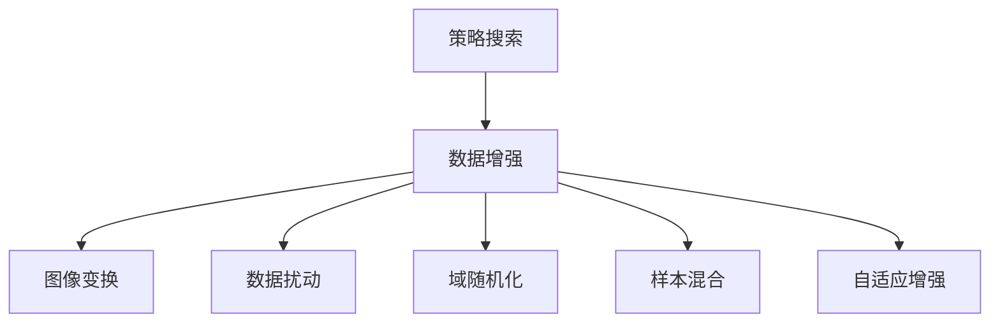

# 自动数据增强 原理与代码实例讲解

## 1. 背景介绍
### 1.1  问题的由来
在机器学习和深度学习领域,数据是模型训练的基础和关键。然而,在实际应用中,我们往往面临着训练数据不足、样本不均衡等问题,这会导致模型性能不佳。为了解决这些问题,数据增强(Data Augmentation)技术应运而生。

### 1.2  研究现状
目前,数据增强技术已经在计算机视觉、自然语言处理等领域得到了广泛应用。传统的数据增强方法主要是基于人工设计的图像变换,如旋转、平移、缩放、裁剪、颜色变换等。这些方法虽然简单有效,但是缺乏灵活性和多样性。

近年来,基于深度学习的自动数据增强方法逐渐兴起,如AutoAugment、RandAugment、Fast AutoAugment等。这些方法利用搜索算法自动寻找最优的数据增强策略,极大地提高了数据增强的效率和性能。

### 1.3  研究意义
自动数据增强技术的研究意义主要体现在以下几个方面:

1. 提高模型泛化能力:通过自动数据增强生成更加多样化的训练样本,可以有效提高模型的泛化能力,减少过拟合风险。

2. 缓解数据不足问题:当训练数据量较小时,自动数据增强可以生成更多的合成样本,缓解数据不足问题。

3. 改善样本不平衡:对于样本不平衡的数据集,可以对少数类样本进行重点增强,改善类别不平衡问题。

4. 提高模型鲁棒性:通过引入各种数据变换和扰动,可以提高模型对噪声和干扰的鲁棒性。

### 1.4  本文结构
本文将围绕自动数据增强技术展开详细讨论,内容安排如下:

第2部分介绍自动数据增强的核心概念与内在联系;
第3部分重点讲解自动数据增强的核心算法原理和具体操作步骤;
第4部分给出数学模型和公式推导过程,并结合实例进行详细说明;
第5部分通过代码实例,演示自动数据增强算法的实现细节;
第6部分讨论自动数据增强技术的实际应用场景和未来应用前景;
第7部分推荐自动数据增强领域的学习资源、开发工具和相关论文;
第8部分总结全文,并展望自动数据增强技术的未来发展趋势和面临的挑战;
第9部分列出常见问题解答,为读者答疑解惑。

## 2. 核心概念与联系
自动数据增强的核心概念包括:

1. 数据增强(Data Augmentation):通过对原始数据进行一系列变换,生成新的合成样本,从而扩充训练集的技术。

2. 图像变换(Image Transformation):对图像数据进行几何变换(如旋转、平移、缩放等)和颜色变换(如亮度、对比度调整等)。

3. 策略搜索(Policy Search):搜索数据增强变换的最优组合策略,通常基于强化学习或进化算法。 

4. 数据扰动(Data Perturbation):在原始样本的基础上,通过添加随机噪声或干扰,生成新的合成样本。

5. 域随机化(Domain Randomization):通过随机改变数据的背景、纹理、光照等属性,提高模型的泛化能力。

6. 样本混合(Sample Mixing):通过混合不同样本的特征,生成新的插值样本,如Mixup、Cutmix等。

7. 自适应增强(Adaptive Augmentation):根据模型训练过程中的反馈信息,动态调整数据增强策略。

这些概念之间存在着内在联系:数据增强是总括概念,包含图像变换、数据扰动等具体变换方式。策略搜索是自动优化数据增强策略的方法。域随机化和样本混合是数据增强的两种特殊形式。自适应增强则是一种更高级的数据增强范式,能够根据模型状态动态调整策略。它们共同构成了自动数据增强技术的核心内容。

## 3. 核心算法原理 & 具体操作步骤
### 3.1  算法原理概述
自动数据增强的核心算法可以分为两大类:基于搜索的方法和基于学习的方法。

基于搜索的方法通过搜索算法(如强化学习、进化算法等)来寻找最优的数据增强策略组合。其基本思路是将数据增强策略的选择看作一个组合优化问题,通过设计适当的搜索空间和优化目标,利用搜索算法找到最优解。代表算法有AutoAugment、Fast AutoAugment等。

基于学习的方法通过元学习或梯度优化来学习数据增强策略的参数。其基本思路是将数据增强策略参数化,将其看作可学习的超参数,通过元学习或梯度下降等方法进行优化。代表算法有MetaAugment、DADA等。

### 3.2  算法步骤详解
以AutoAugment为例,详细介绍基于搜索的自动数据增强算法步骤:

1. 定义搜索空间:确定数据增强变换的候选集合(如旋转、平移、裁剪等),以及每种变换的可选参数范围(如旋转角度、裁剪比例等)。

2. 参数化策略:将每个数据增强策略表示为一个参数向量,包含变换类型、变换参数、执行概率等。

3. 设计优化目标:通常以验证集上的模型性能(如准确率)作为优化目标,也可以引入其他指标如训练效率等。

4. 选择搜索算法:常见的有强化学习(如策略梯度)、进化算法(如遗传算法)等。

5. 搜索最优策略:利用选定的搜索算法,在参数化策略空间中搜索最优的数据增强策略组合。

6. 应用最优策略:将搜索得到的最优策略应用于训练数据,生成增强后的数据集用于模型训练。

7. 模型评估:在测试集上评估模型性能,验证自动数据增强的有效性。

### 3.3  算法优缺点
自动数据增强算法的优点包括:
- 自动化程度高,减少了人工设计和调参的工作量;
- 策略搜索空间大,可以找到更加优化的增强策略组合;
- 增强后的数据多样性更好,有助于提高模型泛化性能。

同时也存在一些缺点:
- 搜索计算开销大,需要较长的搜索时间和较多的计算资源;
- 搜索结果依赖于具体任务和数据集,缺乏通用性;
- 增强后的数据合成质量不可控,可能引入噪声或失真。

### 3.4  算法应用领域
自动数据增强算法主要应用于计算机视觉和自然语言处理领域,包括:
- 图像分类:如ImageNet分类、细粒度图像分类等;
- 目标检测:如行人检测、车辆检测等;
- 语义分割:如场景解析、医学影像分割等;
- 文本分类:如情感分析、主题分类等;
- 命名实体识别:如人名、地名、机构名识别等。

此外,自动数据增强在低资源学习、域自适应、元学习等场景中也有广阔的应用前景。

## 4. 数学模型和公式 & 详细讲解 & 举例说明
### 4.1  数学模型构建
以AutoAugment为例,介绍其数学模型的构建过程。

首先,定义数据增强策略搜索空间。假设有$n$种图像变换操作$\{o_1,\dots,o_n\}$,每种操作$o_i$有$m_i$个可选参数值$\{v_{i1},\dots,v_{im_i}\}$。则一个数据增强策略$s$可以表示为一个$n$维参数向量:

$$
s=(\lambda_1,\dots,\lambda_n),\quad \lambda_i\in\{v_{i1},\dots,v_{im_i}\}
$$

其中$\lambda_i$表示对第$i$种操作选择的参数值。

假设针对每个类别$c$,搜索$K$个子策略$\{s_{c1},\dots,s_{cK}\}$,每个子策略包含$L$个操作,则完整的数据增强策略空间$\mathcal{S}$为:

$$
\mathcal{S}=\{S=(s_{11},\dots,s_{1K},\dots,s_{C1},\dots,s_{CK})\}
$$

其中$C$为类别总数。策略搜索的目标是找到最优策略$S^*\in\mathcal{S}$,使得在验证集上的模型性能最大化:

$$
S^*=\arg\max_{S\in\mathcal{S}} \mathcal{M}(\mathcal{D}_{train}^S;\theta^*)
$$

其中$\mathcal{D}_{train}^S$表示应用策略$S$增强后的训练集,$\theta^*$表示在增强后训练集上训练得到的模型参数,$\mathcal{M}$表示模型性能评估函数(如准确率)。

### 4.2  公式推导过程
AutoAugment采用强化学习中的策略梯度方法来优化上述问题。其核心思想是将策略$S$看作智能体(Agent),将模型性能看作奖励(Reward),通过梯度上升不断更新策略以最大化期望奖励。

定义奖励函数为:

$$
R(S)=\mathcal{M}(\mathcal{D}_{train}^S;\theta^*)-\mathcal{M}(\mathcal{D}_{train};\theta)
$$

即增强后模型性能相对于原始模型的提升。

定义策略$S$的概率分布为:

$$
p_\phi(S)=\prod_{c=1}^C\prod_{k=1}^K\prod_{l=1}^L p_\phi(s_{ckl})
$$

其中$\phi$为策略分布的参数,通过梯度上升进行更新:

$$
\phi\leftarrow\phi+\eta\nabla_\phi J(\phi)
$$

其中$\eta$为学习率,$J(\phi)$为期望奖励:

$$
J(\phi)=\mathbb{E}_{S\sim p_\phi}[R(S)]=\sum_{S\in\mathcal{S}}p_\phi(S)R(S)
$$

根据策略梯度定理,上式可以改写为:

$$
\nabla_\phi J(\phi)=\mathbb{E}_{S\sim p_\phi}[R(S)\nabla_\phi\log p_\phi(S)]
$$

通过蒙特卡洛采样近似梯度:

$$
\nabla_\phi J(\phi)\approx\frac{1}{N}\sum_{i=1}^N R(S_i)\nabla_\phi\log p_\phi(S_i)
$$

其中$\{S_1,\dots,S_N\}$为从$p_\phi$采样的$N$个策略样本。

### 4.3  案例分析与讲解
下面以CIFAR-10图像分类任务为例,说明AutoAugment的具体应用。

首先,定义数据增强操作集合,包括:

- ShearX/Y:沿x/y方向剪切,参数为剪切角度;
- TranslateX/Y:沿x/y方向平移,参数为平移距离;
- Rotate:旋转,参数为旋转角度;
- AutoContrast:自适应调整对比度;
- Invert:反色;
- Equalize:直方图均衡化;
- Solarize:过曝光,参数为阈值;
- Posterize:色彩减少,参数为色阶数;
- Contrast:调整对比度,参数为对比度因子;
- Color:调整颜色饱和度,参数为饱和度因子;
- Brightness:调整亮度,参数为亮度因子;
- Sharpness:调整锐度,参数为锐度因子;
- Cutout:随机遮挡,参数为遮挡面积。

每个操作有$m=10$个离散参数值可选。针对每个类别搜索$K=5$个子策略,每个子策略包含$L=2$个操作。策略分布$p_\phi$采用softmax参数化:

$$
p_\phi(s_{ckl})