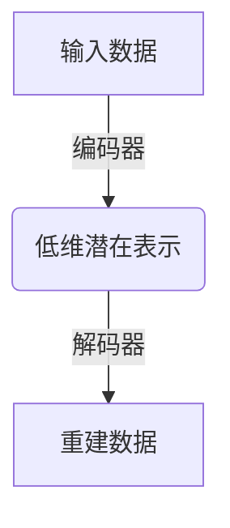

# 自编码器 (Autoencoders) 原理与代码实例讲解

## 1. 背景介绍

### 1.1 问题的由来

在机器学习和深度学习领域中,数据表示和特征提取是一个关键挑战。传统的特征工程方法需要人工设计和选择特征,这个过程通常是主观的、耗时的,并且需要领域专业知识。因此,自动学习有效的数据表示对于解决各种复杂任务至关重要。

### 1.2 研究现状  

自编码器(Autoencoders)作为一种无监督学习技术,近年来在特征学习和表示学习方面取得了广泛的关注和应用。它们可以从原始数据中自动学习出有意义的表示,捕捉数据的内在结构,从而为后续的任务提供良好的特征表示。

### 1.3 研究意义

自编码器的核心思想是将高维输入数据压缩编码为低维表示,然后再从低维表示重建出原始输入数据。通过这种编码-解码的过程,自编码器可以学习到输入数据的紧致表示,有效地去除冗余信息,提取关键特征。这种无监督特征学习方式具有广泛的应用前景,包括降维、去噪、数据压缩、数据生成等。

### 1.4 本文结构

本文将全面介绍自编码器的原理、算法细节、数学模型以及实现代码。我们将从基本的自编码器出发,逐步探讨各种变体,如稀疏自编码器、去噪自编码器等。同时,还将讨论自编码器在各种实际应用场景中的使用,并分享相关的工具和资源。

## 2. 核心概念与联系

自编码器(Autoencoders)是一种无监督学习算法,其核心思想是将高维输入数据压缩编码为低维表示,然后再从低维表示重建出原始输入数据。这个编码-解码的过程可以自动学习出输入数据的紧致表示,提取关键特征。

自编码器由两个主要部分组成:编码器(Encoder)和解码器(Decoder)。编码器将高维输入数据映射到低维潜在表示空间,而解码器则将这个低维表示重建回原始的高维输入空间。

自编码器的训练目标是使重建数据尽可能接近原始输入数据,通过最小化输入数据与重建数据之间的重构误差来实现。这种无监督特征学习方式可以捕捉数据的内在结构和模式,为后续的任务提供良好的特征表示。

自编码器可以看作是一种维数约减技术,通过学习低维潜在表示来压缩数据。与主成分分析(PCA)等传统线性降维方法不同,自编码器可以学习非线性的数据表示,从而更好地捕捉数据的复杂结构。

自编码器的核心思想启发了许多变体算法,如稀疏自编码器、去噪自编码器、变分自编码器等,这些变体在不同的应用场景下发挥着重要作用。

## 3. 核心算法原理 & 具体操作步骤  

### 3.1 算法原理概述

自编码器的核心思想是通过一个编码器网络将高维输入数据映射到低维潜在表示空间,然后通过一个解码器网络将这个低维表示重建回原始的高维输入空间。在训练过程中,自编码器会最小化输入数据与重建数据之间的重构误差,从而学习到一个良好的数据表示。

自编码器的训练过程可以看作是一个优化问题,目标是找到一组编码器和解码器参数,使得重构误差最小化。常用的重构误差函数包括均方误差(MSE)和交叉熵误差(Cross-Entropy)等。

### 3.2 算法步骤详解

1. **输入数据预处理**: 将输入数据进行适当的预处理,如归一化、标准化等,以确保数据的统一性和稳定性。

2. **定义网络架构**: 设计自编码器的网络架构,包括编码器和解码器的层数、神经元数量等。常见的架构包括全连接网络、卷积网络等。

3. **前向传播**: 将输入数据通过编码器网络映射到低维潜在表示空间,得到编码向量。然后,将编码向量通过解码器网络重建回原始的高维输入空间,得到重建数据。

   - 编码器: $h = f(Wx + b)$
   - 解码器: $r = g(W'h + b')$

   其中,W和W'分别是编码器和解码器的权重矩阵,b和b'是偏置向量,f和g是非线性激活函数。

4. **计算重构误差**: 计算输入数据与重建数据之间的重构误差,常用的误差函数包括均方误差(MSE)和交叉熵误差(Cross-Entropy)等。

5. **反向传播**: 通过反向传播算法计算参数的梯度,并使用优化算法(如梯度下降)更新编码器和解码器的参数,以最小化重构误差。

6. **迭代训练**: 重复步骤3-5,直到模型收敛或达到预设的迭代次数。

7. **特征提取**: 使用训练好的编码器网络将新的输入数据映射到低维潜在表示空间,得到其特征表示。

8. **可选步骤**: 根据具体需求,可以对自编码器进行各种变体扩展,如稀疏自编码器、去噪自编码器等。

### 3.3 算法优缺点

**优点**:

- 无监督学习,无需标注数据,可以从原始数据中自动学习有意义的特征表示。
- 可以捕捉数据的内在结构和模式,提供良好的特征表示。
- 具有很强的泛化能力,可以应用于各种领域的数据。
- 可以扩展为各种变体算法,如稀疏自编码器、去噪自编码器等,适用于不同的场景。

**缺点**:

- 训练过程可能陷入局部最优,需要合理初始化参数和调整超参数。
- 对于高维数据,编码器和解码器网络可能需要较深的架构,增加了训练难度。
- 自编码器学习到的特征表示可能缺乏可解释性,难以直观理解其含义。
- 自编码器的性能在一定程度上依赖于网络架构的设计,需要一定的经验和调试。

### 3.4 算法应用领域

自编码器及其变体算法在各个领域都有广泛的应用,包括但不限于:

- **降维和数据可视化**: 将高维数据映射到低维空间,用于数据可视化和探索。
- **去噪和数据预处理**: 通过去噪自编码器等变体,可以从噪声数据中重建干净的数据。
- **数据压缩和特征学习**: 自编码器可以学习数据的紧致表示,用于数据压缩和特征提取。
- **异常检测**: 利用自编码器的重构误差,可以检测异常数据点。
- **生成模型**: 变分自编码器等变体可以用于生成新的数据样本。
- **图像处理**: 自编码器在图像去噪、超分辨率重构、图像压缩等领域有广泛应用。
- **推荐系统**: 通过学习用户和物品的潜在表示,可以改进推荐系统的性能。
- **自然语言处理**: 自编码器可以用于文本表示学习、机器翻译等任务。

## 4. 数学模型和公式 & 详细讲解 & 举例说明

### 4.1 数学模型构建

自编码器的数学模型可以形式化表示为:

给定一个输入数据集 $\mathcal{D} = \{x^{(1)}, x^{(2)}, \dots, x^{(m)}\}$,其中 $x^{(i)} \in \mathbb{R}^{n}$ 表示第 i 个样本。我们希望通过一个编码器函数 $f_\theta$ 和一个解码器函数 $g_\phi$ 来重建原始输入数据,即:

$$x^{(i)} \approx g_\phi(f_\theta(x^{(i)}))$$

其中,编码器函数 $f_\theta: \mathbb{R}^n \rightarrow \mathbb{R}^d$ 将高维输入数据映射到低维潜在表示空间,解码器函数 $g_\phi: \mathbb{R}^d \rightarrow \mathbb{R}^n$ 则将低维表示重建回原始的高维输入空间。$\theta$ 和 $\phi$ 分别表示编码器和解码器的参数。

为了训练自编码器,我们需要定义一个重构误差函数 $\mathcal{L}$,用于衡量重建数据与原始输入数据之间的差异。常用的重构误差函数包括:

- 均方误差 (Mean Squared Error, MSE):

$$\mathcal{L}_{MSE}(\theta, \phi) = \frac{1}{m} \sum_{i=1}^m \|x^{(i)} - g_\phi(f_\theta(x^{(i)}))\|_2^2$$

- 交叉熵误差 (Cross-Entropy):

$$\mathcal{L}_{CE}(\theta, \phi) = -\frac{1}{m} \sum_{i=1}^m \left[x^{(i)} \log g_\phi(f_\theta(x^{(i)})) + (1 - x^{(i)}) \log (1 - g_\phi(f_\theta(x^{(i)})))\right]$$

自编码器的训练目标是找到最优参数 $\theta^*$ 和 $\phi^*$,使得重构误差函数 $\mathcal{L}$ 最小化:

$$\theta^*, \phi^* = \arg\min_{\theta, \phi} \mathcal{L}(\theta, \phi)$$

这个优化问题通常使用梯度下降法及其变体算法来求解。

### 4.2 公式推导过程

以均方误差 (MSE) 为例,我们可以推导自编码器的梯度公式,用于通过反向传播算法更新编码器和解码器的参数。

定义如下符号:

- $x$: 输入数据
- $h$: 编码器的输出,即低维潜在表示
- $r$: 解码器的输出,即重建数据
- $W_e, b_e$: 编码器的权重和偏置
- $W_d, b_d$: 解码器的权重和偏置
- $f, g$: 编码器和解码器的激活函数

则有:

$$h = f(W_e x + b_e)$$
$$r = g(W_d h + b_d)$$

均方误差函数为:

$$\mathcal{L}_{MSE} = \frac{1}{2}\|x - r\|_2^2$$

对 $W_d$ 求偏导:

$$\frac{\partial \mathcal{L}_{MSE}}{\partial W_d} = (r - x) \odot g'(W_d h + b_d) h^T$$

对 $b_d$ 求偏导:

$$\frac{\partial \mathcal{L}_{MSE}}{\partial b_d} = (r - x) \odot g'(W_d h + b_d)$$

对 $W_e$ 求偏导:

$$\frac{\partial \mathcal{L}_{MSE}}{\partial W_e} = W_d^T \left[(r - x) \odot g'(W_d h + b_d)\right] \odot f'(W_e x + b_e) x^T$$

对 $b_e$ 求偏导:

$$\frac{\partial \mathcal{L}_{MSE}}{\partial b_e} = W_d^T \left[(r - x) \odot g'(W_d h + b_d)\right] \odot f'(W_e x + b_e)$$

其中, $\odot$ 表示元素wise乘积操作,`'`表示对应函数的导数。

通过上述公式,我们可以使用梯度下降法更新编码器和解码器的参数,从而最小化重构误差。

### 4.3 案例分析与讲解

为了更好地理解自编码器的原理和实现,我们将通过一个简单的案例进行分析和讲解。

假设我们有一个手写数字图像数据集,每个图像大小为 28x28 像素,因此每个样本可以表示为一个 784 维的向量。我们希望使用自编码器来学习这些图像的低维表示,以便进行降维和数据压缩。

我们定义一个简单的全连接自编码器,其中编码器和解码器均由单层神