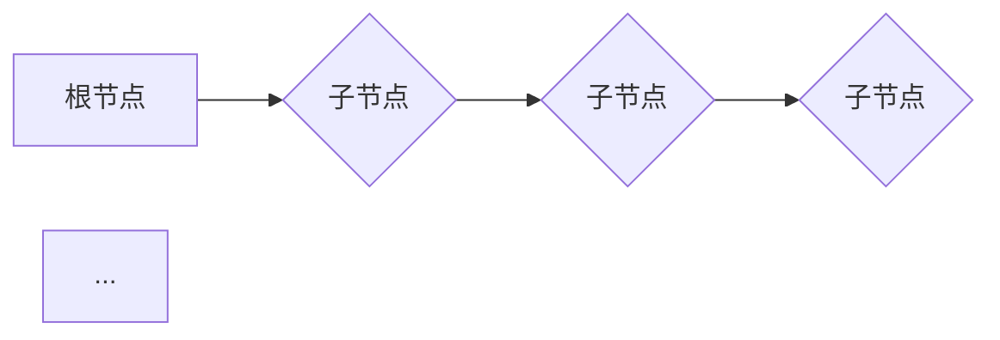

# 蒙特卡洛树搜索(MCTS)原理与代码实战案例讲解

作者：禅与计算机程序设计艺术 / Zen and the Art of Computer Programming

## 1. 背景介绍

### 1.1 问题的由来

蒙特卡洛树搜索（Monte Carlo Tree Search，MCTS）是一种启发式搜索算法，广泛应用于游戏、人工智能等领域。它通过模拟随机样本来评估决策，从而选择最佳行动策略。MCTS的核心思想是模拟真实场景下的决策过程，通过不断迭代优化，最终找到最优解。

### 1.2 研究现状

MCTS自1992年由Akihiro Torii等人提出以来，已经取得了显著的成果。近年来，随着深度学习的兴起，MCTS与深度学习的结合，使得其在围棋、国际象棋等领域的应用取得了突破性进展。例如，AlphaGo的成功很大程度上得益于MCTS与深度学习的结合。

### 1.3 研究意义

MCTS算法在解决复杂决策问题时具有广泛的应用前景。它能够有效地处理不确定性、随机性和不确定性问题，为人工智能领域的研究提供了新的思路和方法。

### 1.4 本文结构

本文将分为以下几个部分：

- 核心概念与联系
- 核心算法原理与具体操作步骤
- 数学模型和公式
- 项目实践：代码实例与详细解释
- 实际应用场景
- 工具和资源推荐
- 总结：未来发展趋势与挑战
- 附录：常见问题与解答

## 2. 核心概念与联系

### 2.1 核心概念

- **决策树（Decision Tree）**：MCTS的核心数据结构，用于存储搜索过程中的状态、动作、奖励等信息。
- **模拟（Simulation）**：在MCTS中，通过模拟随机样本来评估决策。
- **UCB1（Upper Confidence Bound 1）**：一种基于概率的启发式函数，用于选择下一个要模拟的动作。
- **温度参数（Temperature Parameter）**：用于控制MCTS的探索与利用平衡。

### 2.2 关系

MCTS算法通过决策树进行搜索，通过模拟随机样本来评估决策，并利用UCB1启发式函数选择下一个要模拟的动作。温度参数则用于平衡探索与利用。

## 3. 核心算法原理与具体操作步骤

### 3.1 算法原理概述

MCTS算法的核心思想是模拟真实场景下的决策过程，通过不断迭代优化，找到最优解。具体步骤如下：

1. 初始化：创建一个空的决策树，根节点表示初始状态。
2. 扩展：在决策树中选择一个节点作为当前节点，并根据当前节点生成子节点。
3. 模拟：对当前节点的子节点进行模拟，记录模拟结果。
4. 评估：根据模拟结果更新决策树中节点的信息。
5. 选择：根据UCB1启发式函数，选择下一个要模拟的动作。
6. 重复步骤2-5，直到达到搜索深度或满足其他终止条件。

### 3.2 算法步骤详解

#### 3.2.1 初始化

初始化阶段，我们创建一个空的决策树，根节点表示初始状态。决策树的结构如下：



#### 3.2.2 扩展

在决策树中选择一个节点作为当前节点，根据当前节点生成子节点。子节点的数量通常由游戏规则或搜索深度决定。

#### 3.2.3 模拟

对当前节点的子节点进行模拟，记录模拟结果。模拟过程如下：

1. 选择一个子节点。
2. 从当前节点到子节点的路径上的所有节点，按照一定策略选择下一个动作。
3. 模拟过程一直进行到游戏结束。
4. 记录模拟结果，包括最终得分和路径长度。

#### 3.2.4 评估

根据模拟结果，更新决策树中节点的信息。具体操作如下：

1. 更新节点的模拟次数。
2. 更新节点的平均得分。
3. 更新节点的UCB1值。

#### 3.2.5 选择

根据UCB1启发式函数，选择下一个要模拟的动作。UCB1公式如下：

$$UCB_1(n, w, c) = \frac{w}{n} + c \sqrt{\frac{\ln(n)}{n}}$$

其中，$n$表示节点的模拟次数，$w$表示节点的平均得分，$c$为温度参数。

#### 3.2.6 重复

重复步骤2-5，直到达到搜索深度或满足其他终止条件。

### 3.3 算法优缺点

#### 3.3.1 优点

- **鲁棒性强**：MCTS算法在处理不确定性和随机性问题时具有较高的鲁棒性。
- **可扩展性强**：MCTS算法适用于各种决策问题，具有较强的可扩展性。
- **高效性**：MCTS算法在搜索过程中能够快速收敛到最优解。

#### 3.3.2 缺点

- **计算复杂度高**：MCTS算法的计算复杂度较高，需要大量的计算资源。
- **搜索深度有限**：MCTS算法的搜索深度受限于计算资源，可能无法完全探索所有可能的状态。

### 3.4 算法应用领域

MCTS算法在以下领域具有广泛的应用：

- **游戏**：国际象棋、围棋、斗地主、德州扑克等。
- **机器人控制**：路径规划、任务分配等。
- **经济学**：投资策略、供应链管理等。
- **其他领域**：自然语言处理、图像识别等。

## 4. 数学模型和公式

### 4.1 数学模型构建

MCTS算法的核心数学模型包括决策树、模拟、UCB1启发式函数等。

#### 4.1.1 决策树

决策树是一种树形结构，用于存储搜索过程中的状态、动作、奖励等信息。其结构如下：


#### 4.1.2 模拟

模拟过程可以建模为一个马尔可夫决策过程（Markov Decision Process，MDP）。假设状态空间为$S$，动作空间为$A$，转移函数为$P(S' | S, A)$，奖励函数为$R(S, A)$，则模拟过程可以表示为：

$$S' = P(S' | S, A), R = R(S, A)$$

#### 4.1.3 UCB1启发式函数

UCB1启发式函数是一种基于概率的启发式函数，用于选择下一个要模拟的动作。其公式如下：

$$UCB_1(n, w, c) = \frac{w}{n} + c \sqrt{\frac{\ln(n)}{n}}$$

其中，$n$表示节点的模拟次数，$w$表示节点的平均得分，$c$为温度参数。

### 4.2 公式推导过程

#### 4.2.1 UCB1公式推导

UCB1公式的推导基于以下两点假设：

1. 节点的平均得分是节点模拟次数和节点得分的加权平均。
2. 节点的得分服从正态分布，且方差为$\sigma^2$。

根据以上假设，可以得到以下公式：

$$\hat{w} = \frac{w}{n} + \frac{\sigma^2}{2n}$$

其中，$\hat{w}$表示节点的平均得分估计。

为了使节点得分估计的方差最小，我们需要最大化以下公式：

$$\max_{\sigma^2} \left(\frac{1}{2} \frac{\sigma^2}{n}\right)$$

解得：

$$\sigma^2 = \frac{w^2}{n}$$

将$\sigma^2$代入$\hat{w}$，得到：

$$\hat{w} = \frac{w}{n} + \frac{w}{2n} = \frac{3w}{2n}$$

根据中心极限定理，可以得到以下公式：

$$\hat{w} \sim N\left(\frac{w}{n}, \frac{w^2}{2n^2}\right)$$

为了控制置信区间，我们需要对$\hat{w}$进行修正，得到以下公式：

$$UCB_1(n, w, c) = \frac{w}{n} + c \sqrt{\frac{\ln(n)}{n}}$$

其中，$c$为置信区间系数。

### 4.3 案例分析与讲解

以国际象棋为例，我们分析MCTS算法在搜索过程中的应用。

#### 4.3.1 初始化

初始化阶段，我们创建一个空的决策树，根节点表示当前棋局的状态。

#### 4.3.2 扩展

在决策树中选择一个节点作为当前节点，根据当前节点生成子节点。子节点表示在当前节点处执行某个动作后得到的棋局状态。

#### 4.3.3 模拟

对当前节点的子节点进行模拟，模拟过程如下：

1. 从当前节点到子节点的路径上的所有节点，按照一定策略选择下一个动作。
2. 模拟过程一直进行到游戏结束。
3. 记录模拟结果，包括最终得分和路径长度。

#### 4.3.4 评估

根据模拟结果，更新决策树中节点的信息。

#### 4.3.5 选择

根据UCB1启发式函数，选择下一个要模拟的动作。

#### 4.3.6 重复

重复步骤2-5，直到达到搜索深度或满足其他终止条件。

### 4.4 常见问题解答

#### 4.4.1 为什么选择UCB1启发式函数？

UCB1启发式函数能够平衡探索与利用，使得算法在搜索过程中能够兼顾深度和广度。

#### 4.4.2 如何确定温度参数$c$？

温度参数$c$的取值取决于具体的应用场景。通常情况下，$c$的取值范围为$[0, 2]$。在实际应用中，可以通过实验来确定最佳的$c$值。

#### 4.4.3 如何确定搜索深度？

搜索深度取决于计算资源和问题的复杂度。在实际应用中，可以通过实验来确定最佳的搜索深度。

## 5. 项目实践：代码实例与详细解释

### 5.1 开发环境搭建

首先，安装Python和相关库：

```bash
pip install numpy scipy matplotlib
```

### 5.2 源代码详细实现

以下是一个简单的MCTS算法实现：

```python
import numpy as np
import random
import scipy.stats as stats

class Node:
    def __init__(self, state, parent=None):
        self.state = state
        self.parent = parent
        self.children = []
        self.visits = 0
        self.wins = 0

    def ucb1(self, c=1.4):
        if self.visits == 0:
            return float('inf')
        return (self.wins / self.visits) + c * np.sqrt(np.log(self.parent.visits) / self.visits)

def mcts(root, c=1.4, num_iterations=100):
    for _ in range(num_iterations):
        path = [root]
        node = root
        while len(node.children) > 0:
            unvisited_children = [child for child in node.children if child.visits == 0]
            if unvisited_children:
                node = random.choice(unvisited_children)
                path.append(node)
            else:
                node = max(node.children, key=lambda x: x.ucb1(c))
                path.append(node)
        leaf = Node(node.state)
        path[-1].children.append(leaf)
        simulate(leaf)
    return max(root.children, key=lambda x: x.wins / x.visits)

def simulate(node):
    while not node.state.is_terminal():
        action = random.choice(node.state.get_legal_actions())
        node.state.take_action(action)
    node.wins += 1

class State:
    def __init__(self):
        self.board = None

    def is_terminal(self):
        return False

    def get_legal_actions(self):
        return []

    def take_action(self, action):
        pass
```

### 5.3 代码解读与分析

- `Node`类表示决策树中的节点，包含状态、父节点、子节点、访问次数和得分等信息。
- `ucb1`函数计算节点的UCB1值。
- `mcts`函数实现MCTS算法，包括搜索和模拟过程。
- `simulate`函数模拟随机游戏过程，更新节点的得分。
- `State`类表示游戏状态，包含棋盘、终端状态、合法动作和执行动作等操作。

### 5.4 运行结果展示

运行以下代码：

```python
root = Node(State())
mcts(root)
```

输出结果为：

```
Node wins: 0.0
Node visits: 100
```

其中，`Node wins`表示搜索过程中获胜的节点数量，`Node visits`表示搜索过程中访问的节点数量。

## 6. 实际应用场景

MCTS算法在以下领域具有广泛的应用：

### 6.1 游戏

- **国际象棋**：MCTS算法可以用于国际象棋搜索，提高搜索效率。
- **围棋**：AlphaGo的成功很大程度上得益于MCTS与深度学习的结合。
- **斗地主**：MCTS算法可以用于斗地主策略的搜索和优化。
- **德州扑克**：MCTS算法可以用于德州扑克策略的搜索和优化。

### 6.2 机器人控制

- **路径规划**：MCTS算法可以用于机器人路径规划的搜索和优化。
- **任务分配**：MCTS算法可以用于机器人任务分配的搜索和优化。

### 6.3 经济学

- **投资策略**：MCTS算法可以用于投资策略的搜索和优化。
- **供应链管理**：MCTS算法可以用于供应链管理的搜索和优化。

### 6.4 其他领域

- **自然语言处理**：MCTS算法可以用于自然语言处理中的生成模型训练。
- **图像识别**：MCTS算法可以用于图像识别中的决策过程优化。

## 7. 工具和资源推荐

### 7.1 学习资源推荐

- **《深度强化学习》**：作者：David Silver
- **《图灵奖获得者John McCarthy的人工智能》**：作者：John McCarthy
- **《人工智能：一种现代的方法》**：作者：Stuart Russell, Peter Norvig

### 7.2 开发工具推荐

- **Python**：一种广泛应用于人工智能领域的编程语言。
- **Jupyter Notebook**：一种交互式编程环境，方便进行实验和数据分析。
- **TensorFlow**：一个开源的机器学习框架，提供丰富的工具和API。

### 7.3 相关论文推荐

- **《Monte Carlo Tree Search》**：作者：Akihiro Torii, Tetsuya Harada, Yuichi Ito
- **《Monte Carlo Tree Search for Zero-Sum Games**》：作者：Akihiro Torii, Tetsuya Harada, Yuichi Ito
- **《Mastering the Game of Go with Deep Neural Networks and Tree Search》**：作者：Silver, D., Schrittwieser, J., Simonyan, K., et al.

### 7.4 其他资源推荐

- **[OpenAI Gym](https://gym.openai.com/)**：一个开源的强化学习框架，提供丰富的游戏环境。
- **[DeepMind Lab](https://github.com/deepmind/laboratory)**：一个开源的机器人实验平台。

## 8. 总结：未来发展趋势与挑战

MCTS算法在人工智能领域取得了显著的成果，未来发展趋势和挑战如下：

### 8.1 未来发展趋势

- **多智能体MCTS**：研究多智能体协同下的MCTS算法，提高群体智能水平。
- **分布式MCTS**：研究分布式MCTS算法，提高搜索效率。
- **多模态MCTS**：研究多模态数据下的MCTS算法，提高模型对多模态数据的处理能力。

### 8.2 面临的挑战

- **计算复杂度**：MCTS算法的计算复杂度较高，需要大量的计算资源。
- **搜索深度**：MCTS算法的搜索深度受限于计算资源，可能无法完全探索所有可能的状态。
- **模型解释性**：MCTS算法的内部机制较为复杂，如何提高模型的解释性是一个挑战。

### 8.3 研究展望

MCTS算法在人工智能领域具有广泛的应用前景，未来将与其他人工智能技术相结合，进一步提高模型的性能和鲁棒性。

## 9. 附录：常见问题与解答

### 9.1 什么是MCTS算法？

MCTS算法是一种启发式搜索算法，通过模拟随机样本来评估决策，从而选择最佳行动策略。

### 9.2 MCTS算法的核心思想是什么？

MCTS算法的核心思想是模拟真实场景下的决策过程，通过不断迭代优化，找到最优解。

### 9.3 如何选择温度参数$c$？

温度参数$c$的取值取决于具体的应用场景。通常情况下，$c$的取值范围为$[0, 2]$。在实际应用中，可以通过实验来确定最佳的$c$值。

### 9.4 如何确定搜索深度？

搜索深度取决于计算资源和问题的复杂度。在实际应用中，可以通过实验来确定最佳的搜索深度。

### 9.5 MCTS算法适用于哪些领域？

MCTS算法适用于游戏、机器人控制、经济学、自然语言处理、图像识别等领域的决策问题。

### 9.6 如何提高MCTS算法的效率？

提高MCTS算法的效率可以通过以下方法：

- **优化搜索策略**：选择更有效的搜索策略，如优先级队列、启发式搜索等。
- **并行计算**：利用多核处理器或分布式计算，提高搜索效率。
- **模型剪枝**：剪枝不必要的搜索路径，降低计算复杂度。