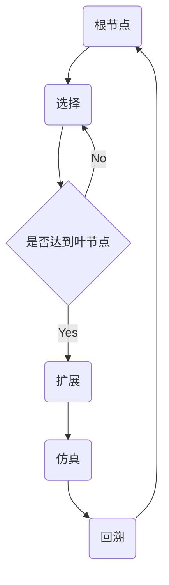

# 蒙特卡罗树搜索 (Monte Carlo Tree Search, MCTS) 原理与代码实例讲解

关键词：蒙特卡罗树搜索, MCTS, 博弈论, 启发式搜索, 强化学习, AlphaGo

## 1. 背景介绍

### 1.1 问题的由来

在人工智能领域，博弈问题一直是一个重要的研究方向。国际象棋、围棋等经典棋类游戏，以其庞大的状态空间和极高的策略复杂度，对人工智能算法提出了巨大挑战。传统的基于搜索树的算法如极小化极大算法，在面对围棋这样的复杂博弈时往往难以奏效。如何设计一种高效、通用的博弈算法，成为了AI研究者孜孜以求的目标。

### 1.2 研究现状

蒙特卡罗树搜索（Monte Carlo Tree Search, 简称MCTS）算法的提出，为解决复杂博弈问题带来了新的突破。自2006年由Coulom首次提出以来，MCTS以其独特的随机采样思想和启发式搜索策略，在博弈领域取得了瞩目成就。2016年，由DeepMind公司开发的AlphaGo程序利用MCTS算法击败了人类顶尖围棋高手，令世人惊叹。此后，MCTS及其变种算法被广泛应用于围棋、国际象棋、五子棋、星际争霸等诸多游戏领域，并取得了非凡的成果。

### 1.3 研究意义

MCTS算法不仅在博弈领域大放异彩，其思想对其他领域也有重要启发意义。MCTS高效的策略搜索能力可用于解决规划、优化等问题。将深度学习等其他机器学习方法与MCTS结合，能进一步提升算法性能。对MCTS的研究，有助于推动人工智能在更多领域的应用，具有重要的理论和实践价值。

### 1.4 本文结构

本文将全面讲解蒙特卡罗树搜索算法的原理和应用。第2部分介绍MCTS的核心概念；第3部分深入讲解MCTS的算法原理和操作步骤；第4部分阐述MCTS所依赖的数学模型和公式；第5部分通过代码实例演示MCTS的具体实现；第6部分探讨MCTS在不同领域的应用；第7部分推荐MCTS相关的学习资源；第8部分总结全文并展望未来；第9部分列举一些常见问题解答。

## 2. 核心概念与联系

蒙特卡罗树搜索中有四个核心概念：

1. **状态 (State)**：博弈过程中的一个节点，代表当前的游戏局面。
2. **动作 (Action)**：一个状态下的可选行动，对应博弈中的一步棋。
3. **策略 (Policy)**：在一个状态下选择动作的概率分布。
4. **价值 (Value)**：一个状态的期望回报，代表该状态对游戏结果的贡献。

这四个概念环环相扣：博弈从一个状态开始，通过选择一系列动作到达新的状态，直到游戏结束。每个状态都有一个价值，代表从该状态开始到游戏结束期间的累积奖赏。MCTS的目标就是通过不断地模拟博弈过程来估计每个状态的价值，并根据价值指导动作的选择。

除此之外，MCTS还涉及以下关键概念：

- **探索 (Exploration)**：尝试新的动作，发掘可能更优的选择。
- **利用 (Exploitation)**：选择当前看来最优的动作，最大化累积奖赏。
- **平衡 (Balance)**：在探索和利用之间权衡，避免过度偏向任一方。
- **置信上限 (Upper Confidence Bound, UCB)**：一种平衡探索和利用的策略，通过添加探索奖励项鼓励探索。
- **选择 (Selection)**：从根节点开始，递归地选择最优子节点，直到叶节点。 
- **扩展 (Expansion)**：在叶节点处扩展新的子节点。
- **仿真 (Simulation)**：从新扩展的节点开始，进行快速随机博弈，直到游戏结束。
- **回溯 (Backpropagation)**：将仿真结果反向传播更新树中各节点的统计信息。

这些概念构成了蒙特卡罗树搜索的核心框架。下面我们将通过一张流程图来直观展示MCTS的工作流程：

可以看到，MCTS算法通过选择、扩展、仿真、回溯四个步骤周而复始地运作，不断优化博弈策略。下一节我们将详细讲解每一步的具体算法。

## 3. 核心算法原理 & 具体操作步骤

### 3.1 算法原理概述

蒙特卡罗树搜索在博弈树上进行随机采样，通过大量的仿真来估计每个状态的价值。相比传统的极大极小搜索，MCTS更关注前景好的动作，能更有效地平衡探索和利用。

MCTS的核心是一个策略迭代过程。每一轮迭代分为四个步骤：

1. 选择 (Selection)：从根节点出发，递归选择最优子节点，直到叶节点。
2. 扩展 (Expansion)：如果叶节点不是终止状态，则创建一个或多个子节点。
3. 仿真 (Simulation)：从新扩展的节点开始，进行随机博弈直到游戏结束。 
4. 回溯 (Backpropagation)：将仿真结果反向传播更新树中节点的统计信息。

经过足够多的迭代后，根节点处每个动作被选择的次数就反映了该动作的价值。MCTS最终选择访问次数最高的动作作为最优决策。

### 3.2 算法步骤详解

下面我们详细讲解MCTS的四个步骤。

**选择 (Selection)**

从当前节点开始，递归地选择最优子节点，直到叶节点。最优节点的选择通过UCB公式来平衡探索和利用：

$$UCB=\frac{w_i}{n_i}+c\sqrt{\frac{\ln N}{n_i}}$$

其中$w_i$是节点$i$的胜率，$n_i$是节点$i$的访问次数，$N$是父节点的访问次数，$c$是探索常数。UCB值最高的子节点会被优先选择。

**扩展 (Expansion)**

当选择到叶节点时，如果该节点不是终止状态（游戏尚未结束），则在该节点上扩展一个或多个子节点。子节点代表可能的后继状态。

**仿真 (Simulation)**

从新扩展的节点开始，进行快速随机博弈，直到到达终止状态。这一过程不需要按照UCB公式，而是完全随机地选择动作。仿真通常采用轻量级的随机策略，以提高搜索效率。

**回溯 (Backpropagation)**

将仿真的结果（胜负或得分）反向传播更新树中节点的统计信息（访问次数和胜率）。假设仿真结果为$\Delta$，则每个节点的统计信息更新如下：

$$n_i=n_i+1$$
$$w_i=w_i+\Delta$$

更新从叶节点开始，沿着搜索路径反向进行，直到根节点。

以上就是MCTS算法的核心步骤。通过不断迭代这四个步骤，MCTS逐步构建起一颗博弈树，并找到最优决策。

### 3.3 算法优缺点

MCTS算法具有以下优点：

1. 通用性强，不依赖于领域知识，适用于各种博弈问题。
2. 渐进式搜索，可随时终止并给出当前最优决策。
3. 自动平衡探索和利用，聚焦于前景好的动作。
4. 容易与其他学习方法结合，如深度学习、强化学习等。

同时，MCTS也存在一些局限：

1. 搜索树会迅速增长，内存和计算开销大。
2. 需要较多的仿真次数才能获得可靠的结果。
3. 对随机性的利用不够充分，容易陷入局部最优。
4. 在状态空间极大的问题上表现不佳，如围棋的布局阶段。

尽管如此，MCTS依然是目前博弈领域最成功的算法之一。通过改进探索策略、引入领域知识、利用并行计算等手段，可进一步提升MCTS的性能。

### 3.4 算法应用领域

MCTS最初是为博弈设计的，但其思想可以推广到许多其他领域：

1. 棋类游戏：围棋、国际象棋、五子棋、军棋等。
2. 电子游戏：星际争霸、炉石传说、魔兽争霸等。
3. 组合优化：旅行商问题、车间调度、资源分配等。
4. 自动规划：机器人路径规划、自动驾驶决策等。
5. 推荐系统：广告投放、个性化推荐等。

MCTS提供了一种通用的决策框架。只要问题能够建模为状态-动作的形式，并且可以进行随机采样，就可以尝试使用MCTS求解。

## 4. 数学模型和公式 & 详细讲解 & 举例说明

### 4.1 数学模型构建

MCTS依赖于马尔可夫决策过程 (Markov Decision Process, MDP) 模型。MDP由以下五元组构成：

- 状态集合 $\mathcal{S}$
- 动作集合 $\mathcal{A}$ 
- 状态转移概率 $\mathcal{P}(s'|s,a)$
- 奖赏函数 $\mathcal{R}(s,a)$
- 折扣因子 $\gamma \in [0,1]$

在博弈问题中，状态 $s$ 对应游戏的局面，动作 $a$ 对应可选的落子或行动。状态转移概率 $\mathcal{P}$ 由游戏规则决定。奖赏函数 $\mathcal{R}$ 在终止状态给出奖赏（如胜负关系），在非终止状态一般为0。折扣因子 $\gamma$ 表示对未来奖赏的重视程度，在博弈问题中通常设为1（即不折扣未来奖赏）。

MDP的目标是寻找一个最优策略 $\pi^*$，使得从任意状态 $s$ 开始，执行 $\pi^*$ 能获得的期望累积奖赏最大。用数学语言描述即：

$$\pi^*=\arg\max_{\pi} \mathbb{E}\left[\sum_{t=0}^{\infty} \gamma^t \mathcal{R}(s_t,\pi(s_t))\right]$$

其中 $s_t$ 是第 $t$ 步的状态，$\pi(s_t)$ 是在状态 $s_t$ 下根据策略 $\pi$ 选择的动作。求解最优策略 $\pi^*$ 的过程，就是MDP的优化目标。

### 4.2 公式推导过程

MCTS没有显式地求解 $\pi^*$，而是通过随机采样来逼近最优策略。我们重点看UCB公式的推导。

回忆UCB公式：

$$UCB=\frac{w_i}{n_i}+c\sqrt{\frac{\ln N}{n_i}}$$

其中 $w_i$ 是节点 $i$ 的胜率，$n_i$ 是节点 $i$ 的访问次数，$N$ 是父节点的访问次数，$c$ 是探索常数。这个公式其实来源于多臂老虎机问题的Hoeffding不等式。

在多臂老虎机问题中，每个臂（对应MCTS的一个节点）有一个未知的奖赏概率 $\mu_i$。我们记 $\bar{X}_i$ 为第 $i$ 个臂的平均奖赏（对应MCTS的胜率 $w_i/n_i$）。Hoeffding不等式告诉我们，对任意 $t>0$，以下不等式以至少 $1-e^{-2t^2}$ 的概率成立：

$$\mu_i \leq \bar{X}_i + \sqrt{\frac