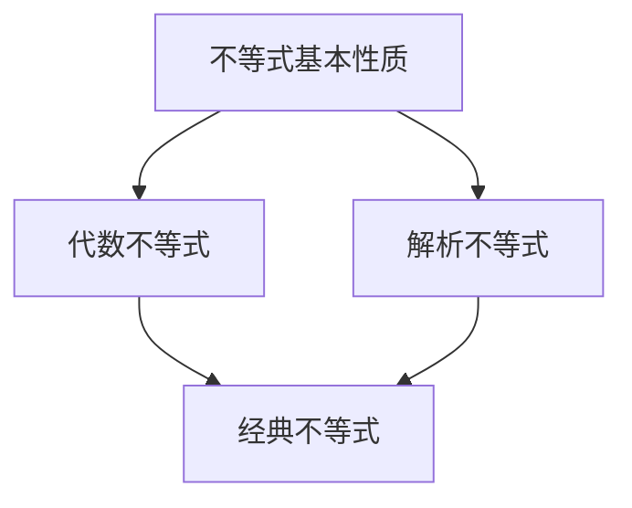

# 解析数论基础：基本不等式

## 1. 背景介绍

### 1.1 问题的由来

在数论和代数等数学分支中,不等式扮演着至关重要的角色。它们为我们提供了一种描述和理解数量关系的强有力工具。无论是探索整数的性质,还是研究多项式方程的解,不等式都是我们不可或缺的盟友。

然而,不等式的世界并非一蹴而就。它源于古希腊时期对几何问题的研究,随着时间的推移,逐渐发展成为一门独立的数学分支。从最基本的算术不等式,到更加复杂的代数不等式和解析不等式,每一个进步都标志着人类对数量关系理解的深化。

### 1.2 研究现状

当前,不等式理论已经成为数学的核心组成部分,并在各个领域发挥着重要作用。在数论中,不等式为我们提供了探索素数分布、算术级数等问题的有力工具。在分析中,不等式帮助我们估计函数的行为,并推动微积分的发展。在优化理论中,不等式是制约条件的体现,为寻找最优解提供了基础。

然而,尽管取得了长足的进步,不等式理论仍然存在许多未解决的问题和挑战。著名的孪生素数猜想、哥德巴赫猜想等,都与不等式的估计密切相关。此外,在复杂系统和随机过程的研究中,不等式也扮演着关键角色。

### 1.3 研究意义

不等式理论的重要性不言而喻。它不仅是数学本身的基石,也是科学和工程领域的重要工具。通过不等式,我们能够量化和优化各种过程,从而推动技术的进步。

此外,不等式理论还具有巨大的教育价值。它培养了学生的逻辑思维能力,并帮助他们建立对数量关系的直觉。无论是在学校还是在职场,掌握不等式都是一项宝贵的技能。

### 1.4 本文结构

本文将从基础开始,逐步深入探讨不等式理论的核心内容。我们将首先介绍不等式的基本概念和性质,然后探讨代数不等式和解析不等式的求解技巧。接下来,我们将重点关注一些经典的不等式,并揭示它们在数论和分析中的应用。最后,我们将总结不等式理论的发展趋势和挑战,为读者提供进一步学习的方向。

## 2. 核心概念与联系

不等式理论的核心概念包括:

1. **不等式的基本性质**:这包括不等式的传递性、加法性和乘法性等基本运算规则。
2. **代数不等式**:涉及代数式的不等式,如一元二次不等式、绝对值不等式等。
3. **解析不等式**:涉及函数的不等式,如三角不等式、指数对数不等式等。
4. **经典不等式**:一些具有重要理论意义和应用价值的不等式,如AM-GM不等式、Cauchy不等式等。

这些概念之间存在着紧密的联系,相互依赖和促进。例如,代数不等式的求解往往需要借助基本不等式性质,而解析不等式则需要代数不等式的理论作为基础。同时,经典不等式的证明和应用也离不开代数和解析不等式的知识。

为了更好地理解这些概念之间的关系,我们可以使用Mermaid流程图进行可视化表示:

该流程图清晰地展示了不等式理论各个部分之间的依赖关系。掌握这些核心概念及其联系,是深入学习不等式理论的关键所在。

## 3. 核心算法原理 & 具体操作步骤

### 3.1 算法原理概述

在不等式理论中,存在一些通用的算法和求解策略,可以帮助我们高效地处理各种类型的不等式问题。这些算法的核心原理可以概括为以下几个方面:

1. **等价变形**:通过合理的代数运算,将原不等式转化为等价的更简单形式。
2. **区间划分**:根据函数的连续性和单调性,将定义域划分为若干个区间,分别讨论每个区间上的不等式情况。
3. **函数估计**:利用已知的不等式,估计目标函数的上下界,从而得到所需的不等式结论。
4. **反证法**:假设结论不成立,通过推导出矛盾,从而证明原命题的正确性。

这些原理为不等式的求解提供了坚实的理论基础,并且相互补充、相得益彰。例如,在处理解析不等式时,我们通常需要先进行等价变形,然后结合函数的性质进行区间划分,最后利用已知的经典不等式对函数值进行估计。

### 3.2 算法步骤详解

虽然不同类型的不等式问题存在一定差异,但它们的求解过程通常可以归纳为以下几个步骤:

1. **问题转化**:将原始问题转化为适当的不等式形式,明确需要求解的目标不等式。
2. **等价变形**:通过代数运算,将目标不等式化简为更简单的等价形式。
3. **区间划分**:根据函数的连续性和单调性,将定义域划分为若干个区间。
4. **区间讨论**:分别讨论每个区间上不等式的成立情况,并给出相应的解集。
5. **解集合并**:将各个区间上的解集合并,得到原不等式的整体解集。
6. **结果检验**:将解集代入原不等式,验证结果的正确性。

这些步骤形成了一个完整的求解流程,可以有效地指导我们处理各种不等式问题。下面,我们将通过具体的例子,详细说明这些步骤的实际应用。

### 3.3 算法优缺点

不等式求解算法具有以下优点:

1. **通用性强**:可以应用于各种类型的不等式问题,包括代数不等式和解析不等式。
2. **思路清晰**:遵循等价变形、区间划分、函数估计等明确的步骤,求解过程具有良好的逻辑性。
3. **可视化**:通过绘制函数图像和区间划分,可以直观地理解不等式的求解过程。

然而,该算法也存在一些缺点和局限性:

1. **计算复杂度高**:对于一些复杂的不等式,等价变形和区间划分可能会变得非常繁琐。
2. **需要丰富的先验知识**:求解过程中需要充分利用函数的性质、经典不等式等先验知识。
3. **存在特殊情况**:对于一些特殊的不等式形式,可能需要采用其他特殊的求解技巧。

因此,在实际应用中,我们需要根据具体问题的特点,合理选择和调整求解策略,以提高求解效率和准确性。

### 3.4 算法应用领域

不等式求解算法在数学及其应用领域具有广泛的应用前景,包括但不限于:

1. **数论**:素数分布估计、算术级数估计等问题都需要借助不等式理论。
2. **分析**:函数极限、导数、积分的估计都离不开不等式的应用。
3. **优化理论**:在约束条件下寻找最优解时,不等式是不可或缺的工具。
4. **概率统计**:大数定律、中心极限定理等理论都与不等式密切相关。
5. **工程应用**:在控制理论、信号处理、通信系统等领域,不等式都扮演着重要角色。

总的来说,不等式求解算法为我们提供了一种有力的数学工具,可以应用于广泛的理论研究和实际问题求解中。掌握这一算法,对于数学工作者和工程技术人员来说都是非常宝贵的。

## 4. 数学模型和公式 & 详细讲解 & 举例说明

### 4.1 数学模型构建

在研究不等式理论时,我们经常需要构建合适的数学模型来描述问题。一个好的数学模型不仅能够准确地反映问题的本质,还应该具有一定的简洁性和可操作性。

对于不等式问题,我们通常会采用以下几种数学模型:

1. **代数式模型**:使用代数式来表示不等式,例如 $x^2 - 5x + 6 \geq 0$。
2. **函数模型**:将不等式表示为函数的性质,例如 $f(x) = \ln x \geq 0, x > 0$。
3. **序列模型**:将不等式问题转化为对序列项的估计,例如 $\sum_{n=1}^\infty \frac{1}{n^2} \leq 2$。
4. **几何模型**:利用几何图形来描述不等式关系,例如利用三角形边长表示三角不等式。

在构建模型时,我们需要根据问题的具体情况,选择合适的变量和表示方式。同时,我们还需要注意模型的约束条件和边界条件,以确保模型的完整性和正确性。

### 4.2 公式推导过程

在不等式理论中,推导公式是一项非常重要的工作。通过严谨的推理和运算,我们可以得到一些具有重要理论意义和应用价值的不等式结论。

以AM-GM不等式为例,我们将详细介绍公式推导的过程:

$$
\begin{aligned}
\text{设}\ x_1, x_2, \ldots, x_n \geq 0,\ \text{则有}\\
\sqrt[n]{x_1x_2\cdots x_n} &\leq \frac{x_1 + x_2 + \cdots + x_n}{n}\\
\text{证明过程:}\\
\text{令}\ f(x_1, x_2, \ldots, x_n) &= x_1^{1/n} \cdot x_2^{1/n} \cdots x_n^{1/n} - \frac{x_1 + x_2 + \cdots + x_n}{n}\\
\text{由AM-GM不等式的等式性质可知,}\ f &\leq 0\\
\text{对}\ f\ \text{关于任意一个变量}\ x_i\ \text{求偏导数,可得}\\
\frac{\partial f}{\partial x_i} &= \frac{1}{n}\left(\frac{1}{x_i^{1-1/n}} - 1\right) \leq 0\\
\therefore\ x_i &\geq 1\\
\text{由于}\ x_i \geq 0,\ \text{故当}\ x_i = 1\ \text{时,}\ f = 0\\
\text{综上所述,}\ f &\leq 0\ \text{对任意}\ x_i \geq 0\ \text{成立}\\
\therefore\ \sqrt[n]{x_1x_2\cdots x_n} &\leq \frac{x_1 + x_2 + \cdots + x_n}{n}
\end{aligned}
$$

在推导过程中,我们首先构造了一个辅助函数 $f$,利用 AM-GM 不等式的等式性质得到了 $f \leq 0$。然后,通过对 $f$ 求偏导数并分析其单调性,我们得到了 $x_i \geq 1$ 的条件。最后,将所有条件综合起来,就可以得到 AM-GM 不等式的最终形式。

这个推导过程体现了不等式理论中常见的思路和技巧,包括构造辅助函数、利用已知不等式、分析函数的单调性等。通过类似的方法,我们可以推导出许多其他重要的不等式公式。

### 4.3 案例分析与讲解

为了更好地理解不等式理论的应用,我们将通过一个具体的案例进行分析和讲解。

**案例背景**:设计一个无线通信系统,要求在一定的功率约束下,实现最大的信息传输率。我们需要建立合适的数学模型,并利用不等式理论求解最优解。

**步骤1:建立数学模型**

令 $P$ 表示发射功率, $N$ 表示噪声功率, $C$ 表示信道容量(即最大信息传输率),根据香农公式,我们可以得到:

$$
C = B\log_2\left(1 + \frac{P}{N}\right)
$$

其中,