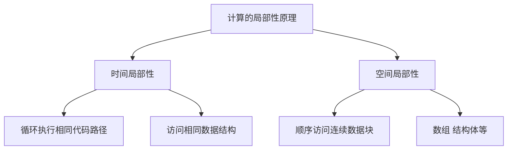
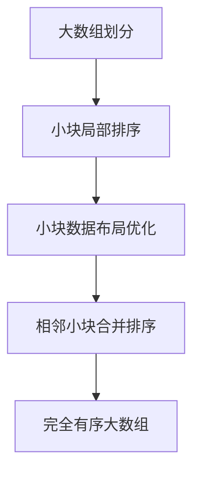

# 计算：第四部分 计算的极限 第 9 章 计算复杂性 计算的局部性原理

## 1. 背景介绍

### 1.1 问题的由来

在现代计算机系统中,计算复杂性是一个无法回避的问题。随着问题规模的不断扩大和数据量的持续增长,计算资源的有限性使得高效的算法设计和优化变得至关重要。传统的计算模型通常假设计算机具有无限的内存和计算能力,但在实际应用中,这种假设往往过于理想化。因此,我们需要一种新的计算理论来描述和分析真实世界中的计算问题。

计算的局部性原理(Principle of Locality)正是为了解决这一挑战而提出的。它认为,在实际计算过程中,计算机不仅需要访问大量的数据,而且这些数据通常都集中在内存或存储器的某些局部区域。由于局部数据的访问速度远高于远程数据的访问速度,因此合理利用局部性可以极大地提高计算效率。

### 1.2 研究现状

计算的局部性原理已经成为当代计算机体系结构和算法设计的核心理论之一。在硬件层面,现代CPU设计都充分考虑了数据局部性,通过多级缓存系统来加速局部数据的访问。在软件层面,许多经典算法(如排序、搜索等)的优化都与利用数据局部性密切相关。

然而,随着大数据时代的到来,传统的局部性优化方法面临着新的挑战。当数据量超过了计算机的内存容量时,如何有效地利用局部性就变得更加困难。此外,在分布式计算和云计算环境下,数据的分布性也给局部性优化带来了新的挑战。

### 1.3 研究意义

深入研究计算的局部性原理,对于设计高效的算法和优化计算系统至关重要。通过合理利用数据局部性,我们可以极大地提高计算效率,缩短运行时间,节省计算资源。这不仅有助于解决大规模计算问题,也有利于降低能源消耗,促进可持续发展。

此外,局部性原理还为新型计算模型和计算架构的设计提供了理论基础。例如,近年来兴起的基于局部性的计算模型(Locality-Based Computing)就是一个典型案例。通过深入探讨局部性原理,我们可以更好地理解和优化这些新型计算系统。

### 1.4 本文结构

本文将全面介绍计算的局部性原理。首先,我们将阐述局部性原理的核心概念,包括时间局部性、空间局部性等,并探讨它们之间的联系。接下来,我们将详细分析局部性原理在算法设计中的应用,包括排序、搜索等经典算法的局部性优化。

此外,我们还将介绍局部性原理在硬件层面的体现,包括CPU缓存设计、存储器层次结构等。在项目实践部分,我们将提供具体的代码示例,展示如何利用局部性原理优化程序性能。

最后,我们将探讨局部性原理在大数据时代和分布式计算环境下的新挑战,并展望其在未来计算系统中的发展趋势。

## 2. 核心概念与联系

计算的局部性原理包含两个核心概念:时间局部性(Temporal Locality)和空间局部性(Spatial Locality)。

**时间局部性**是指,如果某个数据项在某个时间点被访问过,那么在不久的将来,它很可能会被再次访问。这种现象的根源在于,计算机程序通常会反复执行相同的代码路径或访问相同的数据结构。利用时间局部性可以提高缓存命中率,从而加速数据访问。

**空间局部性**是指,如果某个存储器位置被访问过,那么与它相邻的存储器位置也很可能会被访问。这种现象的根源在于,计算机程序通常会顺序访问连续的数据块,如数组、结构体等。利用空间局部性可以提高预取(Prefetching)的效率,从而减少数据访问延迟。

时间局部性和空间局部性密切相关,并且相互影响。例如,对于一个循环遍历数组的程序,它同时利用了时间局部性(每次迭代都会访问相同的数组元素)和空间局部性(连续访问相邻的数组元素)。因此,在设计算法和优化计算系统时,需要综合考虑这两种局部性。

## 3. 核心算法原理 & 具体操作步骤

### 3.1 算法原理概述

利用局部性原理优化算法的核心思想是,尽可能地将计算过程中需要访问的数据集中在一个局部区域,从而减少远程数据访问的开销。具体来说,可以采取以下策略:

1. **数据布局优化**:通过调整数据在内存中的布局,使得经常一起访问的数据彼此靠近,从而提高空间局部性。
2. **访问模式优化**:调整算法的数据访问模式,使得每次访问的数据都尽可能集中在一个局部区域,从而提高时间局部性。
3. **分块技术**:将大规模数据划分为多个小块,每次只在内存中加载需要的数据块,从而减少内存占用并提高局部性。
4. **缓存优化**:充分利用CPU缓存,将热点数据保存在缓存中,从而加速数据访问。
5. **预取技术**:预测未来可能需要访问的数据,并提前加载到缓存中,从而减少访问延迟。

### 3.2 算法步骤详解

以下是一个利用局部性原理优化排序算法的具体步骤:

1. **分块**:将待排序的大数组划分为多个小块,每个小块的大小设置为可以完全容纳在CPU缓存中。
2. **局部排序**:对每个小块进行局部排序,可以使用快速排序、插入排序等经典算法。
3. **数据布局优化**:将排序后的小块按照一定顺序重新布局在内存中,使得相邻的小块之间的元素有序。
4. **合并排序**:使用归并排序算法,将相邻的有序小块两两合并,直到得到完全有序的大数组。

在合并排序的过程中,由于相邻的小块之间的元素已经有序,因此只需要对小块之间的元素进行比较和交换,从而大大减少了数据移动的开销。同时,由于每次只需要在CPU缓存中加载两个相邻的小块,因此可以充分利用空间局部性和时间局部性,提高缓存命中率和数据访问效率。

### 3.3 算法优缺点

**优点**:

1. 充分利用了CPU缓存,提高了数据访问效率。
2. 减少了数据移动的开销,提高了算法的运行速度。
3. 可以处理大规模数据,不受内存容量的限制。
4. 算法思路清晰,易于理解和实现。

**缺点**:

1. 增加了算法的复杂度,需要额外的分块、合并等操作。
2. 对于已经具有良好局部性的数据,优化效果可能不太明显。
3. 需要根据具体硬件环境(如缓存大小)调整参数,可移植性略差。
4. 在分布式环境下,局部性优化可能会受到一定影响。

### 3.4 算法应用领域

利用局部性原理优化的算法广泛应用于以下领域:

1. **大数据处理**:在处理海量数据时,合理利用局部性可以极大提高计算效率。
2. **科学计算**:许多科学计算问题涉及大规模矩阵运算,局部性优化可以加速这些运算。
3. **图形渲染**:在3D图形渲染中,局部性优化可以提高纹理映射、光线跟踪等操作的性能。
4. **数据库**:数据库系统中的索引、查询优化等操作都与局部性原理密切相关。
5. **机器学习**:在训练深度神经网络时,充分利用数据局部性可以加速模型训练。
6. **编译器优化**:现代编译器通常会对生成的机器代码进行局部性优化,以提高程序运行效率。

## 4. 数学模型和公式 & 详细讲解 & 举例说明

### 4.1 数学模型构建

为了量化描述局部性原理,我们可以构建一个简单的数学模型。假设计算机系统包含一个大小为M的主存,以及一个大小为C的缓存(C << M)。我们定义以下变量:

- $h$: 缓存命中率,即访问请求在缓存中的命中概率。
- $t_c$: 从缓存读取数据的时间开销。
- $t_m$: 从主存读取数据的时间开销,通常$t_m >> t_c$。

如果一个算法需要执行$N$次数据访问操作,那么它的总时间开销$T$可以表示为:

$$T = N \times (h \times t_c + (1-h) \times t_m)$$

我们的目标是最小化$T$,即提高缓存命中率$h$,从而减少算法的执行时间。

### 4.2 公式推导过程

现在,我们来推导一个估计缓存命中率的公式。假设算法访问的数据块大小为$B$,数据在主存中的布局为随机分布。如果$B \leq C$,那么一旦数据块加载到缓存中,后续对该数据块的访问都将命中缓存。因此,缓存命中率可以估计为:

$$h = \frac{N_c}{N}$$

其中,$N_c$是命中缓存的访问次数,$N$是总访问次数。进一步推导,我们有:

$$N_c = \sum_{i=1}^{M/B} \min\left(N_i, B\right)$$

这里,$N_i$表示对第$i$个数据块的访问次数。将上式代入$h$的定义,我们可以得到缓存命中率的估计公式:

$$h = \frac{1}{N} \sum_{i=1}^{M/B} \min\left(N_i, B\right)$$

### 4.3 案例分析与讲解

为了更好地理解上述公式,我们来分析一个具体的案例。假设主存大小为$M=1GB$,缓存大小为$C=64KB$,数据块大小为$B=4KB$,算法需要执行$N=10^7$次数据访问操作。

首先,我们计算出$M/B = 1GB/4KB = 2^{18}$,即主存中共有$2^{18}$个数据块。

接下来,我们假设算法的数据访问模式服从均匀分布,即每个数据块被访问的次数$N_i$都相等,为$N_i = 10^7/2^{18} = 32$次。

将这些参数代入缓存命中率公式,我们可以得到:

$$h = \frac{1}{10^7} \sum_{i=1}^{2^{18}} \min\left(32, 4\right) = \frac{4 \times 2^{18}}{10^7} = 0.25$$

也就是说,在这种情况下,算法的缓存命中率约为25%。如果我们能够通过优化算法的数据访问模式,提高局部性,使得$N_i$的分布更加集中,那么缓存命中率就可以进一步提高。

### 4.4 常见问题解答

**Q1: 为什么空间局部性和时间局部性对算法优化如此重要?**

A1: 空间局部性和时间局部性都可以提高缓存命中率,从而加速数据访问。由于CPU缓存的访问速度远高于主存,因此提高缓存命中率可以极大地减少算法的执行时间。

**Q2: 如何判断一个算法是否具有良好的局部性?**

A2: 可以通过分析算法的数据访