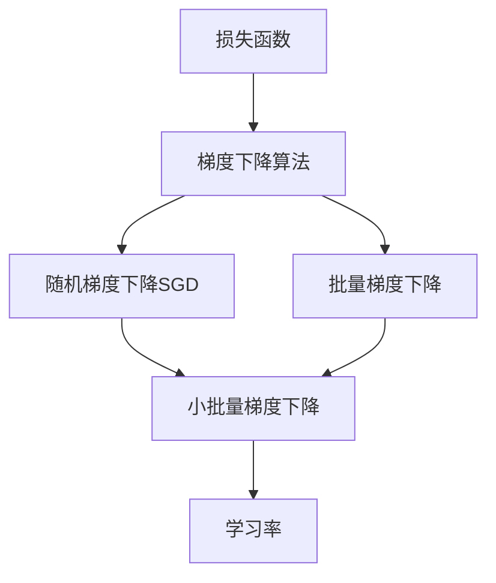
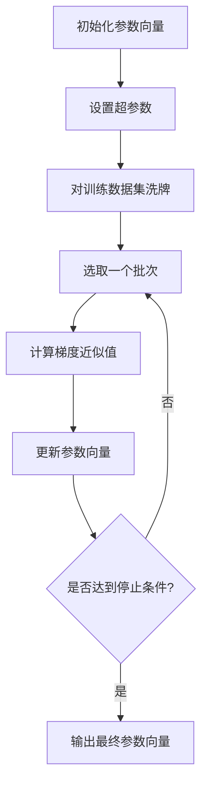

好的,我会按照您的要求,以《随机梯度下降法(SGD)原理与代码实战案例讲解》为主题,撰写一篇字数超过8000字的专业技术博客文章。文中会包含核心概念原理、数学模型推导、代码实例讲解等内容,并给出 Mermaid 流程图。请稍等,我需要一些时间准备素材和撰写内容。

# 随机梯度下降法(SGD)原理与代码实战案例讲解

## 1. 背景介绍

### 1.1 问题的由来

在机器学习和深度学习领域,通常需要优化一个高维非凸目标函数,以找到其最小值对应的参数解。这种优化问题通常是一个无约束优化问题,可以形式化为:

$$\min_\mathbf{w} f(\mathbf{w})$$

其中 $f(\mathbf{w})$ 是要优化的目标函数,也称为损失函数或代价函数, $\mathbf{w}$ 是模型的参数向量。

传统的优化算法如梯度下降法,需要计算目标函数的梯度,并且每次迭代都需要遍历所有训练数据,计算代价非常大。特别是当训练数据规模很大时,每次迭代的计算量都是一个瓶颈。

### 1.2 研究现状

为了解决上述问题,研究人员提出了随机梯度下降(Stochastic Gradient Descent, SGD)算法。SGD算法的主要思想是:在每次迭代中,从训练数据中随机选取一个批次(batch)的样本,计算在这一批样本上的梯度近似值,并用这个近似梯度值更新参数。

SGD算法由于只使用训练数据的一个子集来计算梯度近似值,所以每次迭代的计算代价大大降低。同时,SGD还具有一定的正则化效果,有助于模型的泛化能力。因此,SGD算法在深度学习中得到了广泛应用。

### 1.3 研究意义

SGD算法作为一种在线优化算法,能够高效地处理大规模数据,并实现参数向量的快速收敛。研究SGD算法的原理和实现方法,对于提高深度学习模型的训练效率和性能具有重要意义。本文将深入探讨SGD算法的数学原理、收敛性分析、实现细节和代码案例,为读者提供全面的理解和实践指导。

### 1.4 本文结构  

本文共分为9个部分:

1. 背景介绍
2. 核心概念与联系
3. 核心算法原理与具体操作步骤 
4. 数学模型和公式详细讲解与举例说明
5. 项目实践:代码实例和详细解释说明
6. 实际应用场景
7. 工具和资源推荐
8. 总结:未来发展趋势与挑战
9. 附录:常见问题与解答

## 2. 核心概念与联系

在介绍SGD算法之前,我们先来了解一些核心概念:

- **损失函数(Loss Function)**: 用于衡量模型预测值与真实值之间的差异,是需要被优化的目标函数。常用的损失函数有均方误差、交叉熵等。

- **梯度下降(Gradient Descent)**: 一种常用的无约束优化算法。它通过计算目标函数的梯度,并沿着梯度相反的方向更新参数,逐步找到目标函数的最小值。

- **学习率(Learning Rate)**: 梯度下降算法中的一个超参数,用于控制每次迭代时参数更新的步长。合适的学习率能够加快收敛速度。

- **批量梯度下降(Batch Gradient Descent)**: 每次迭代时使用全部训练数据计算梯度,然后更新参数。计算量大但是收敛稳定。

- **随机梯度下降(SGD)**: 每次迭代时从训练数据中随机选取一个批次(batch)的样本,计算在这一批样本上的梯度近似值,并用这个近似梯度值更新参数。计算量小但收敛曲线波动较大。

- **小批量梯度下降(Mini-Batch Gradient Descent)**: 综合了批量梯度下降和随机梯度下降的优点,每次迭代使用一个小批量的样本来计算梯度近似值。是深度学习中最常用的优化算法。

上述概念之间存在一定的联系,如下Mermaid流程图所示:

## 3. 核心算法原理与具体操作步骤

### 3.1 算法原理概述

SGD算法的核心思想是:在每次迭代中,从训练数据集中随机选取一个批次(batch)的样本,计算在这一批样本上的损失函数的梯度近似值,并用这个近似梯度值更新参数。具体来说,假设损失函数为 $f(\mathbf{w})$,参数向量为 $\mathbf{w}$,学习率为 $\eta$,训练数据集为 $\mathcal{D}=\{(\mathbf{x}_1,y_1),(\mathbf{x}_2,y_2),...,(\mathbf{x}_N,y_N)\}$,其中 $\mathbf{x}_i$ 为输入特征,  $y_i$ 为标签。在第 $t$ 次迭代中,SGD算法执行以下步骤:

1. 从训练数据集 $\mathcal{D}$ 中随机选取一个批次 $\mathcal{B}_t$ 作为当前迭代的样本。
2. 计算在批次 $\mathcal{B}_t$ 上的损失函数梯度近似值:

$$\nabla f_{\mathcal{B}_t}(\mathbf{w}_t) = \frac{1}{|\mathcal{B}_t|} \sum_{(\mathbf{x},y)\in\mathcal{B}_t} \nabla f(\mathbf{w}_t;\mathbf{x},y)$$

其中 $|\mathcal{B}_t|$ 表示批次 $\mathcal{B}_t$ 中样本的个数。

3. 根据梯度近似值更新参数:

$$\mathbf{w}_{t+1} = \mathbf{w}_t - \eta \nabla f_{\mathcal{B}_t}(\mathbf{w}_t)$$

4. 重复上述过程,直到达到停止条件(如最大迭代次数或目标函数值小于阈值等)。

SGD算法的关键在于:通过随机选取小批量样本,可以大大减少每次迭代的计算量;同时,由于引入了噪声,SGD算法还具有一定的正则化效果,有助于提高模型的泛化能力。

### 3.2 算法步骤详解

SGD算法的具体步骤如下:

1. **初始化参数向量** $\mathbf{w}_0$,可以随机初始化或使用一些启发式方法。
2. **设置超参数**,包括学习率 $\eta$、批次大小 $b$、最大迭代次数 $T$ 等。
3. **对训练数据集 $\mathcal{D}$ 进行洗牌**,打乱样本顺序,以保证每次迭代时选取的批次是随机的。
4. **进入迭代循环**:
    - 从 $\mathcal{D}$ 中选取一个批次 $\mathcal{B}_t$,其大小为 $b$。
    - 计算在批次 $\mathcal{B}_t$ 上的损失函数梯度近似值 $\nabla f_{\mathcal{B}_t}(\mathbf{w}_t)$。
    - 根据梯度近似值更新参数: $\mathbf{w}_{t+1} = \mathbf{w}_t - \eta \nabla f_{\mathcal{B}_t}(\mathbf{w}_t)$。
    - 重复上述过程,直到达到最大迭代次数 $T$ 或其他停止条件。
5. **输出最终的参数向量** $\mathbf{w}_T$。

上述算法步骤的流程图如下所示:

### 3.3 算法优缺点

SGD算法具有以下优点:

1. **高效性**: 由于每次迭代只使用一小批训练样本,计算量大大降低,因此SGD算法在处理大规模数据集时非常高效。
2. **正则化效果**: SGD算法引入了噪声,具有一定的正则化效果,有助于提高模型的泛化能力。
3. **在线学习**: SGD算法可以在新的训练数据到来时,不断地更新模型参数,实现在线学习。
4. **并行化**: SGD算法的计算过程可以很容易地并行化,从而进一步提高计算效率。

SGD算法也存在一些缺点:

1. **收敛性能差**: 由于每次迭代只使用一小批样本,导致SGD算法的收敛曲线波动较大,收敛性能不如批量梯度下降算法。
2. **陷入鞍点**: SGD算法可能会陷入高曲率区域的鞍点,导致收敛缓慢。
3. **需要精心调参**: SGD算法的收敛性能和最终结果很大程度上依赖于超参数(如学习率、批次大小等)的设置,需要进行大量的调参工作。

### 3.4 算法应用领域

SGD算法由于其高效性和在线学习的特点,在以下领域得到了广泛应用:

1. **深度学习**: SGD算法是训练深度神经网络的主要优化算法之一,在计算机视觉、自然语言处理等领域有着广泛应用。
2. **在线学习**: SGD算法可以在新的训练数据到来时不断更新模型参数,因此非常适合在线学习任务,如推荐系统、广告投放等。
3. **大规模数据处理**: SGD算法的高效性使其可以处理大规模数据集,在大数据分析、互联网应用等领域有重要应用。
4. **核方法**: SGD算法也可以应用于核方法(如支持向量机)的训练,提高了核方法在大规模数据集上的可扩展性。

## 4. 数学模型和公式详细讲解与举例说明

### 4.1 数学模型构建

在介绍SGD算法的数学模型之前,我们先来建立一个简单的机器学习模型。假设我们有一个线性回归模型:

$$\hat{y} = \mathbf{w}^\top \mathbf{x} + b$$

其中 $\mathbf{x} \in \mathbb{R}^d$ 是输入特征向量, $\mathbf{w} \in \mathbb{R}^d$ 是模型权重向量, $b \in \mathbb{R}$ 是偏置项, $\hat{y} \in \mathbb{R}$ 是模型的预测输出。

我们的目标是找到最优的参数 $\mathbf{w}^*$ 和 $b^*$,使得模型在训练数据集 $\mathcal{D} = \{(\mathbf{x}_1, y_1), (\mathbf{x}_2, y_2), \ldots, (\mathbf{x}_N, y_N)\}$ 上的损失函数最小,其中 $y_i$ 是对应输入 $\mathbf{x}_i$ 的真实标签值。

常用的损失函数是均方误差(Mean Squared Error, MSE):

$$J(\mathbf{w}, b) = \frac{1}{N} \sum_{i=1}^N (\hat{y}_i - y_i)^2 = \frac{1}{N} \sum_{i=1}^N \left(\mathbf{w}^\top \mathbf{x}_i + b - y_i\right)^2$$

我们的目标是求解以下无约束优化问题:

$$\min_{\mathbf{w}, b} J(\mathbf{w}, b)$$

为了方便计算,我们可以将偏置项 $b$ 并入权重向量 $\mathbf{w}$,构建扩充特征向量 $\tilde{\mathbf{x}}_i = [\mathbf{x}_i^\top, 1]^\top$,扩充权重向量 $\tilde{\mathbf{w}} = [\mathbf{w}^\top, b]^\top$,则模型可以重