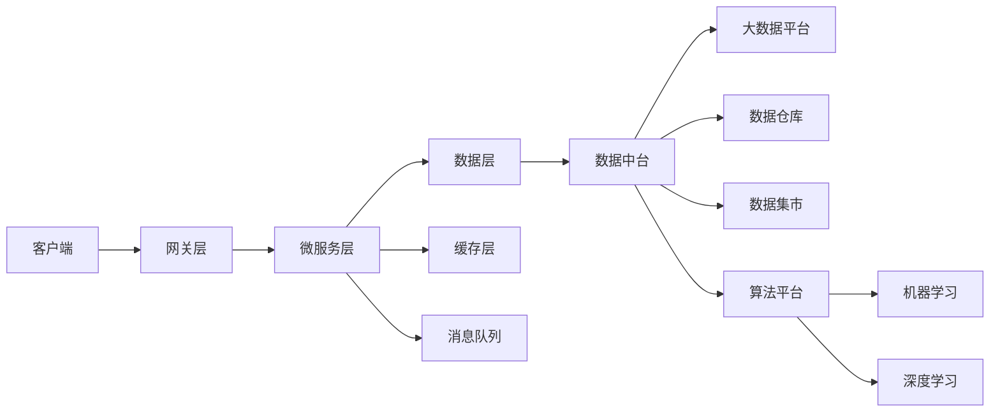
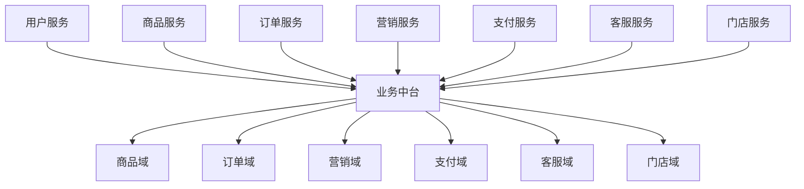
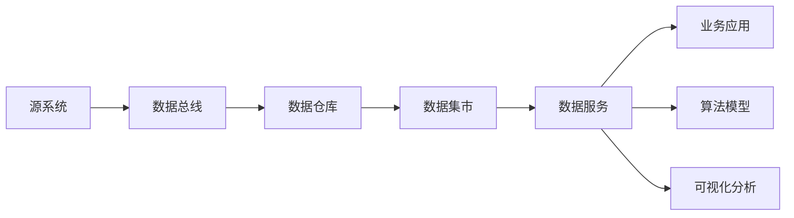
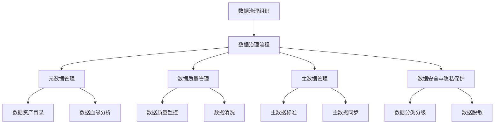

# 零售行业信息化建设方案

关键词：零售行业、信息化、系统架构、大数据、云计算、人工智能、供应链管理

## 1. 背景介绍

### 1.1 问题的由来
随着互联网技术的快速发展,传统零售行业面临着前所未有的挑战。消费者购物习惯的改变、电商平台的冲击、新零售模式的兴起,无不要求零售企业加快数字化转型的步伐。而信息化建设则是零售企业实现数字化转型的关键举措之一。

### 1.2 研究现状
目前,国内外众多零售巨头都在积极推进信息化建设。沃尔玛、亚马逊等企业通过大数据分析、人工智能等技术手段,优化供应链管理,提升运营效率,改善用户体验。国内阿里巴巴、京东、苏宁等企业也纷纷布局新零售,利用线上线下融合、智慧门店等信息化手段增强竞争力。

### 1.3 研究意义
深入研究零售行业信息化建设,对于传统零售企业成功转型具有重要意义。一方面,信息化可以帮助企业提高管理效率,优化业务流程,降低运营成本。另一方面,大数据分析、个性化推荐等技术手段可以洞察消费者需求,改善购物体验,提升客户粘性和忠诚度。

### 1.4 本文结构
本文将从零售行业信息化建设的背景出发,阐述其核心概念和关键技术,提出一套完整的信息化解决方案。通过对系统架构、数据治理、业务应用等方面的深入剖析,为零售企业的数字化转型提供参考和指引。全文主要包括以下章节:

1. 背景介绍
2. 核心概念与联系
3. 核心架构设计 
4. 数据治理体系
5. 业务应用场景
6. 系统实施路径
7. 效果评估与优化
8. 未来展望
9. 附录:常见问题解答

## 2. 核心概念与联系

零售行业信息化建设涉及诸多概念和技术,本节将重点阐述几个核心概念,厘清其内在联系。

### 2.1 零售信息化
零售信息化是指零售企业利用现代信息技术手段,对内部管理和外部服务进行系统性的改造与提升的过程。其目的是打通线上线下渠道,优化业务流程,提高运营效率,为消费者提供更加便捷、个性化的购物体验。

### 2.2 新零售
新零售是以消费者体验为中心,以数据和技术驱动为基础,实现线上线下全渠道融合发展的零售新模式。它强调以消费者需求为导向,利用大数据、人工智能等新技术重塑业态,推动实体零售与电商的深度融合。

### 2.3 全渠道零售
全渠道零售是指零售企业为消费者提供线上线下一体化、无缝衔接的购物体验。消费者可以通过门店、网站、移动APP等多种渠道自由选择商品,享受统一的价格、促销、售后服务。而对于零售商而言,全渠道有助于实现库存共享、订单统筹,提高资源配置效率。

### 2.4 大数据与人工智能
大数据和人工智能是零售信息化的两大利器。海量的用户行为、交易、库存等数据蕴含着巨大价值,零售企业可以通过大数据分析挖掘用户画像、优化商品组合、预测销量走势等。而人工智能技术如机器学习、计算机视觉等,可应用于智能导购、动态定价、无人零售等场景,大幅提升运营效率和用户体验。

### 2.5 技术架构演进
传统的单体架构已无法支撑零售企业日益复杂的业务场景,亟需引入新的技术架构。微服务架构通过将系统拆分为多个独立的微服务,可以提高系统的弹性和可维护性。而基于云原生的架构如Serverless、容器化等,则可以降低基础设施成本,加速产品迭代速度。此外,数据中台的构建也是零售信息化的重要一环,有助于打通数据孤岛,实现数据资产化。

## 3. 核心架构设计

零售信息化系统涉及多个业务域和技术领域,需要一个合理的架构设计来支撑。本节将重点介绍零售信息化的核心架构设计,包括技术架构、业务架构和数据架构。

### 3.1 技术架构

#### 3.1.1 微服务架构
微服务架构是零售信息化系统的首选。通过将业务功能拆分为一系列松耦合的微服务,每个微服务都有独立的数据存储和部署,可以灵活应对业务变化。同时,微服务架构也便于不同团队并行开发,加快产品上线速度。

#### 3.1.2 云原生架构
云原生架构充分利用了云计算的弹性伸缩、高可用等特性,可以显著降低系统运维成本。Serverless、容器化是两大关键技术。Serverless允许开发者专注于业务逻辑,而无需关心服务器运维。容器化则提供了一致的运行环境,易于实现持续集成、持续部署。

#### 3.1.3 数据中台
数据中台是连接数据层和业务层的纽带,负责数据的采集、存储、计算、服务等。通过数据中台,零售企业可以打通线上线下数据,沉淀数据资产,赋能业务决策。数据中台通常采用大数据技术栈如Hadoop、Spark、Flink等,可以高效处理海量数据。

以下是零售信息化系统技术架构的示意图:

### 3.2 业务架构

#### 3.2.1 业务域划分
零售信息化系统涵盖了多个业务域,包括商品、营销、订单、库存、物流、客服等。每个业务域都有其独特的业务属性和流程,需要进行合理的划分和抽象。通过领域驱动设计(DDD)等方法,可以将复杂的业务逻辑拆分为若干个高内聚、低耦合的业务域。

#### 3.2.2 业务中台
业务中台是位于前台业务和后台系统之间的一层,负责业务能力的沉淀和复用。通过业务中台,可以将零售的核心业务能力如商品管理、订单管理、营销管理等进行抽象和封装,形成标准化的服务接口,供多个前台应用调用。这有助于提高业务的灵活性和可扩展性,加快新业务的上线速度。

#### 3.2.3 前后台分离
前后台分离是零售信息化系统的重要设计原则。前台侧重于用户交互和业务场景,如门店收银、移动APP、电商网站等。后台则侧重于业务逻辑和数据处理,如订单履约、库存管理、数据分析等。通过前后台分离,可以实现前台的快速迭代和后台的稳定运行,提高系统的可维护性。

以下是零售信息化系统业务架构的示意图:

### 3.3 数据架构

#### 3.3.1 数据总线
数据总线是零售企业数字化转型的关键基础设施,负责连接各个业务系统和数据源,实现数据的集中管理和流通。通过数据总线,可以将分散在各个系统中的数据进行采集、清洗、集成,形成统一的数据视图。数据总线通常基于消息队列、数据集成等技术构建。

#### 3.3.2 数据仓库
数据仓库是零售信息化系统的核心数据资产,存储了企业历史数据和当前数据,为数据分析和业务决策提供支持。数据仓库通常采用多维建模,将数据按照主题域进行组织,如销售主题、商品主题、会员主题等。通过ETL工具,可以将源系统数据抽取到数据仓库。

#### 3.3.3 数据集市
数据集市是面向特定业务主题或部门的数据子集,通常从数据仓库中派生而来。相比数据仓库,数据集市的数据粒度更细、数据量更小、响应速度更快,更适合业务人员的即席查询和自助分析。常见的数据集市如会员分析、销售分析、供应链分析等。

#### 3.3.4 数据服务
数据服务是数据中台对外提供的标准化接口,允许业务系统通过API的方式调用数据。通过数据服务,可以将数据资产进行封装和复用,加速数据在各个业务场景中的应用。数据服务通常基于RESTful、GraphQL等轻量级协议实现。

以下是零售信息化系统数据架构的示意图:

## 4. 数据治理体系

数据治理是零售信息化建设的重要一环,旨在规范数据管理流程,提高数据质量,发挥数据价值。本节将重点介绍零售企业数据治理的几个关键方面。

### 4.1 元数据管理

元数据是对数据的描述性信息,包括数据的定义、结构、来源、权限等。通过元数据管理,可以实现数据资产的全景式视图,方便数据的检索、溯源和重用。常见的元数据管理工具有Collibra、Informatica等。

### 4.2 数据质量管理

数据质量直接影响到业务决策的准确性。零售企业需要建立数据质量管理机制,从数据采集、清洗、集成、应用等环节入手,持续提升数据的准确性、完整性、一致性、及时性等。数据质量管理的常用方法包括数据探查、数据清洗、数据标准化等。

### 4.3 主数据管理

主数据是零售企业最核心的数据资产,如商品、会员、供应商等。主数据管理旨在建立统一的主数据标准和流程,确保各个业务系统的主数据保持一致。通过主数据管理,可以消除数据孤岛,提高数据共享水平。常见的主数据管理工具有Informatica MDM、IBM InfoSphere MDM等。

### 4.4 数据安全与隐私保护

零售企业掌握了大量消费者的隐私数据,需要高度重视数据安全和隐私保护。一方面要建立严格的数据访问控制机制,采用加密、脱敏等技术手段防止数据泄露。另一方面要遵循GDPR等隐私保护法规,尊重用户的知情权和选择权。

以下是零售企业数据治理框架的示意图:

## 5. 业务应用场景

零售信息化的最终目的是利用数据和技术赋能业务,提升运营效率和用户体验。本节将重点介