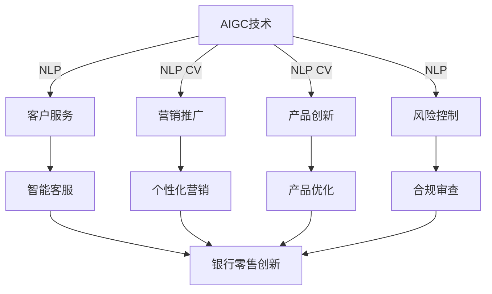

# AIGC从入门到实战：AIGC 在金融行业的创新场景—银行零售新范式

关键词：AIGC、金融行业、银行零售、人工智能生成内容、创新场景、新范式

## 1. 背景介绍
### 1.1  问题的由来
随着人工智能技术的飞速发展,AIGC(AI-Generated Content,人工智能生成内容)正在成为各行各业变革创新的新引擎。特别是在金融领域,AIGC正凭借其高效、智能、个性化的特点,重塑着传统金融服务模式。银行零售作为金融行业的重要组成部分,正面临着数字化转型的巨大挑战和机遇。如何利用AIGC技术赋能银行零售业务创新,打造智能化、个性化、场景化的客户服务新范式,成为当前亟需探索和实践的课题。

### 1.2  研究现状
目前,国内外学界和业界对AIGC技术在金融领域的应用研究还处于起步阶段。一些大型银行和金融科技公司开始尝试将AIGC技术应用于客户服务、营销推广、风险管控等场景,取得了初步成效。但总体来看,AIGC在银行零售领域的落地实践还比较有限,缺乏成熟的解决方案和最佳实践。同时,AIGC技术本身也存在一些局限性和风险,如生成内容的可控性、合规性等问题,需要在实践中不断完善。

### 1.3  研究意义
深入研究AIGC技术在银行零售领域的应用,对于推动银行数字化转型,提升客户体验,实现业务创新具有重要意义:

1. 通过AIGC赋能,银行可以为客户提供更加智能、高效、个性化的服务,大幅提升服务质量和客户满意度。
2. AIGC可以帮助银行实现营销自动化和精准化,提高获客转化率,拓展业务增长空间。
3. 运用AIGC优化银行运营流程,可以降低人工成本,提高风险管控能力,增强银行核心竞争力。
4. AIGC是人工智能领域的前沿方向,研究AIGC在银行业的创新应用,有利于推动人工智能在金融领域的进一步发展。

### 1.4  本文结构
本文将围绕AIGC技术在银行零售领域的应用展开深入探讨。首先介绍AIGC的核心概念和关键技术,然后重点阐述AIGC在银行零售场景中的典型应用,包括智能客服、个性化推荐、营销内容生成等,并通过案例分析说明AIGC的实际效果。接着,提出一种基于AIGC的银行零售创新模式,从客户洞察、产品创新、营销优化、风控合规等方面,系统阐述AIGC赋能银行零售的实现路径。最后,展望AIGC技术在银行业的发展前景,提出银行应对AIGC浪潮的策略建议。

## 2. 核心概念与联系
AIGC是人工智能技术的一个重要分支,其核心是利用机器学习算法,特别是深度学习模型,自动生成接近人类创作水平的文本、图像、音视频等内容。AIGC的关键技术包括:

- 自然语言处理(NLP):通过语言模型、知识图谱等技术,让机器理解、生成自然语言文本。
- 计算机视觉(CV):运用图像分类、目标检测、语义分割等算法,使机器能够理解、生成图像和视频内容。  
- 语音处理:语音识别、语音合成等技术,赋予机器处理语音信号的能力。

这些AIGC技术与银行零售业务的关键环节紧密相关。银行零售主要涉及客户服务、营销推广、产品创新、风险控制等领域,而AIGC可以在这些领域发挥重要作用:

- 客户服务:通过NLP、语音处理技术,构建智能客服系统,提供24小时不间断的人机交互服务。
- 营销推广:利用NLP、CV技术,自动生成个性化的营销内容(文案、海报、短视频等),提升营销效率。
- 产品创新:运用AIGC技术,捕捉客户需求,优化产品设计,加速产品迭代。 
- 风险控制:基于AIGC自动生成的内容,进行合规审查、风险提示,辅助人工决策。

由此可见,AIGC技术与银行零售业务高度相关,将AIGC嵌入银行各业务流程,有望全面赋能银行零售变革。下图展示了AIGC技术在银行零售创新中的作用:

## 3. 核心算法原理 & 具体操作步骤
### 3.1  算法原理概述
AIGC的核心是生成式深度学习算法。与判别式模型通过学习输入和输出之间的映射关系不同,生成式模型以学习数据的概率分布为目标,可以随机生成与训练数据相似的新样本。AIGC常用的生成式模型包括变分自编码器(VAE)、生成式对抗网络(GAN)等。

以文本生成为例,当前最常用的是基于Transformer结构的语言模型,如GPT系列模型。Transformer本质上是一种Seq2Seq模型,通过自注意力机制建模文本序列的长程依赖关系。在预训练阶段,模型以自回归的方式学习文本序列的概率分布。在生成阶段,模型根据输入的文本前缀,不断预测下一个词,直至生成完整的文本。

### 3.2  算法步骤详解
以GPT模型的文本生成过程为例,主要分为以下步骤:

1. 模型预训练:在大规模无标注文本语料上,以Language Modeling为目标,通过最大化文本序列概率来训练模型参数。预训练使模型学会了语言的基本规律和常识性知识。

2. 输入编码:将输入的文本前缀通过Embedding层映射为实值向量序列,再加入位置编码向量,作为Transformer的输入。

3. Self-Attention:通过计算每个位置与其他位置的注意力权重,建模文本序列的长程依赖关系。Self-Attention可以并行计算,大幅提升训练和推理效率。

4. 前馈神经网络:通过两层全连接网络,对Self-Attention的输出进行非线性变换,增强模型的表达能力。

5. 残差连接和Layer Normalization:在Self-Attention和前馈网络之后,通过残差连接和Layer Normalization,既能防止梯度消失,又能加速模型收敛。

6. 重复堆叠:将步骤3-5所构成的Transformer Block重复堆叠多次,形成完整的GPT模型。堆叠的层数越多,模型理解和生成文本的能力越强。

7. 文本生成:给定文本前缀,将其编码为向量序列输入GPT模型,模型通过自回归方式不断预测下一个词,选择概率最大的词作为输出,再将其添加到前缀中,直至达到预设的文本长度或遇到终止符。

以上是GPT文本生成的基本流程。对于图像、语音等其他模态的内容生成,虽然所采用的具体模型有所不同,但基本思路是一致的,都是通过生成式模型学习数据分布,再根据随机噪声或输入条件生成新样本。

### 3.3  算法优缺点
AIGC算法的主要优点包括:

- 生成效果逼真:通过在海量数据上训练,AIGC模型可以生成与人类创作难以区分的内容,在文本通顺流畅性、图像清晰度等方面媲美专业水准。
- 生成效率高:传统内容创作需要耗费大量人力物力,而AIGC可以在几秒钟内自动生成大量内容,大幅提高生产效率。  
- 可控性强:通过调节输入条件和算法参数,AIGC可以根据需求灵活定制内容风格和属性,满足个性化需求。

但AIGC算法也存在一定局限性:

- 生成内容缺乏深度创新:AIGC模型本质上是从训练数据中学习模式,很难产生出超出训练集范畴的全新内容。
- 偏见和安全风险:AIGC模型可能会放大训练数据中的偏见,生成不恰当、有害甚至违法的内容。
- 可解释性差:AIGC模型通常是黑盒模型,难以解释其生成内容的内在逻辑,这对于需要可信可控的业务场景是个挑战。

### 3.4  算法应用领域
AIGC算法在许多领域展现出广阔的应用前景,主要包括:

- 内容创作:机器写作、自动配图、视频生成等,可用于新闻、社交媒体、数字营销等场景。
- 游戏娱乐:游戏场景、角色、剧情的自动生成,提升游戏内容丰富度。
- 设计创意:工业设计、UI设计、Logo设计等,通过AIGC提供设计灵感和初稿。
- 教育培训:智能组卷、课件制作、虚拟助教等,促进教育的个性化和智能化。
- 医疗健康:医学影像生成、药物分子设计等,辅助诊断和药物开发。
- 金融服务:客户画像生成、金融知识问答、营销内容创作等,为客户提供智能化服务。

AIGC正在为这些行业注入新的创新动能,未来有望衍生出更多崭新的应用场景。

## 4. 数学模型和公式 & 详细讲解 & 举例说明
### 4.1  数学模型构建
以Transformer为例,详细阐述AIGC的数学模型。Transformer的核心是Self-Attention机制,通过计算序列中每个位置与其他位置的注意力权重,建模序列的长程依赖关系。

给定输入序列 $X=(x_1,\cdots,x_n)$,其中 $x_i \in \mathbb{R}^d$ 表示第 $i$ 个位置的 $d$ 维特征向量。Self-Attention 的计算过程如下:

1. 计算 Query、Key、Value 矩阵:

$$
\begin{aligned}
Q &= XW^Q \\
K &= XW^K \\
V &= XW^V
\end{aligned}
$$

其中 $W^Q, W^K, W^V \in \mathbb{R}^{d \times d_k}$ 是可学习的参数矩阵。

2. 计算注意力权重:

$$
A = \text{softmax}(\frac{QK^T}{\sqrt{d_k}})
$$

$A \in \mathbb{R}^{n \times n}$ 是注意力权重矩阵,其中 $A_{ij}$ 表示位置 $i$ 对位置 $j$ 的注意力权重。$\sqrt{d_k}$ 是缩放因子,用于控制点积的方差。

3. 计算注意力输出:

$$
\text{Attention}(Q,K,V) = AV
$$

将注意力权重矩阵与 Value 矩阵相乘,得到 Self-Attention 的输出,维度为 $\mathbb{R}^{n \times d_v}$。

在实际应用中,Transformer 通常采用多头注意力(Multi-head Attention)机制,即将 Query、Key、Value 矩阵拆分为多个子空间,分别计算注意力,再将结果拼接起来:

$$
\begin{aligned}
\text{MultiHead}(Q,K,V) &= \text{Concat}(\text{head}_1,\cdots,\text{head}_h)W^O \\
\text{head}_i &= \text{Attention}(QW_i^Q, KW_i^K, VW_i^V)
\end{aligned}
$$

其中 $W_i^Q \in \mathbb{R}^{d \times d_k}, W_i^K \in \mathbb{R}^{d \times d_k}, W_i^V \in \mathbb{R}^{d \times d_v}, W^O \in \mathbb{R}^{hd_v \times d}$。多头注意力允许模型在不同的子空间中捕捉序列的不同方面的信息。