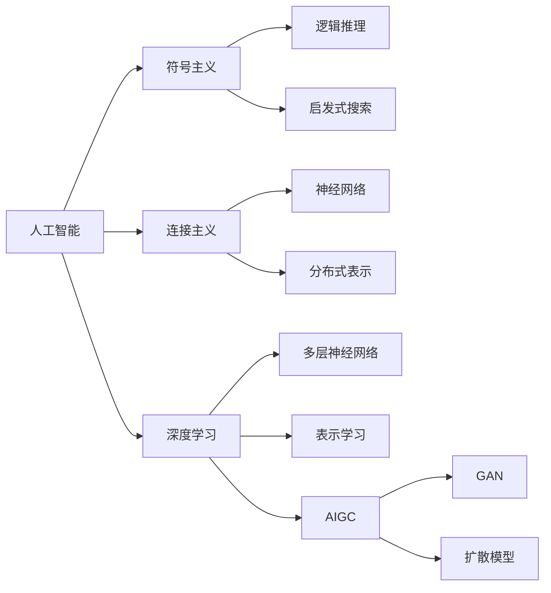

# AIGC从入门到实战：历史上人工智能科学发展史的三个阶段

关键词：人工智能、AI发展史、符号主义、连接主义、深度学习、神经网络、AIGC

## 1. 背景介绍
### 1.1 问题的由来
人工智能(Artificial Intelligence,AI)自1956年达特茅斯会议提出以来,经历了60多年的发展历程。在这一过程中,AI经历了几次大的起起伏伏,从最初的符号主义到后来的连接主义,再到如今方兴未艾的深度学习和AIGC(AI Generated Content),人工智能技术不断突破,给人类社会带来深远影响。回顾AI发展史,总结其发展规律,对于把握AI未来趋势具有重要意义。

### 1.2 研究现状
目前,国内外学者对人工智能发展历史的研究主要集中在几个方面:一是对人工智能发展的不同阶段进行划分,总结各阶段的主要特点[1][2];二是分析不同时期人工智能技术的突破和瓶颈[3][4];三是研究人工智能发展对社会经济、就业、伦理等方面的影响[5][6]。但现有研究对人工智能发展规律的总结还不够系统全面,特别是对当前火热的AIGC发展趋势研究还比较少。

### 1.3 研究意义
系统梳理人工智能发展的不同阶段,总结其突破和瓶颈,把握其发展规律,对于正确认识人工智能的发展现状,预测其未来走向,推动人工智能健康可持续发展具有重要意义。同时,分析新兴的AIGC发展现状和趋势,对于抢占人工智能发展制高点,推动数字经济高质量发展也十分必要。

### 1.4 本文结构
本文将从以下几个方面系统阐述人工智能发展的三个主要阶段:第2部分介绍人工智能发展的核心概念;第3部分分析三大发展阶段的主要特点和核心算法;第4部分总结各阶段的数学模型和公式;第5部分通过代码实例演示各阶段的技术实现;第6部分展望人工智能和AIGC的应用场景;第7部分推荐相关学习资源;第8部分总结全文并展望人工智能的未来发展趋势与挑战。

## 2. 核心概念与联系
人工智能是研究、开发用于模拟、延伸和扩展人的智能的理论、方法、技术及应用系统的一门新的技术科学。其核心是让机器具备类似人脑的感知、学习、推理、决策等智能能力,从而部分或全面代替人类完成某些复杂任务。

人工智能经历了三个主要的发展阶段:

1. 符号主义阶段(20世纪50年代-80年代):认为人工智能就是用计算机对符号进行演绎推理,通过逻辑、搜索等方法求解问题。代表性成果有"通用问题求解器"等。这一阶段由于知识表示和推理方式过于简单,在处理复杂问题时陷入瓶颈。

2. 连接主义阶段(20世纪80年代-2010年):受神经科学启发,认为人工智能应模仿大脑的结构和功能,通过大量简单的处理单元(神经元)连接形成复杂网络。代表性成果有BP神经网络等。这一阶段虽然取得了一定进展,但也遇到了网络结构设计、训练效率等难题。

3. 深度学习阶段(2010年至今):伴随大数据和算力快速发展,通过构建多层次的神经网络结构,利用海量数据训练,使网络自动学习高层次的特征表示,大幅提升了模式识别、自然语言理解等任务性能。代表性成果有CNN、RNN、Transformer等。深度学习使AI在多个领域取得突破,但也面临可解释性差、泛化能力弱等挑战。

在深度学习基础上,人工智能开始向生成式任务拓展,催生了AIGC(AI Generated Content)的崛起。AIGC利用生成式对抗网络(GAN)、扩散模型等新的深度学习架构,实现了图像、视频、音频、文本等多种内容的自动生成,代表性成果有DALL-E、Midjourney、ChatGPT等。AIGC有望成为人工智能发展的新引擎,但也带来版权、伦理等新的问题。

人工智能各发展阶段的核心概念和联系如下图所示:

## 3. 核心算法原理 & 具体操作步骤
### 3.1 算法原理概述
人工智能三大发展阶段的核心算法原理分别为:

1. 符号主义阶段:基于逻辑推理和启发式搜索。主要思想是将问题形式化为一系列的逻辑表达式,然后利用演绎推理得出结论。同时引入启发式知识指导搜索,提高求解效率。

2. 连接主义阶段:基于神经网络和分布式表示。通过构建多层次的神经元连接网络,每个神经元可以接收其他神经元的输入并产生输出。通过调整神经元之间的连接权重,网络可以学习输入输出间的复杂映射关系。同时,知识以神经元间的连接权重分布式存储于网络中。

3. 深度学习阶段:基于深层神经网络和表示学习。通过构建多达数十上百层的深度神经网络,并利用海量数据进行训练,使得网络可以自动学习输入数据的层次化特征表示,从而显著提升模式识别等任务的性能。同时,深度网络可以作为一种通用的特征提取器,在不同任务间迁移和复用。

### 3.2 算法步骤详解

以深度学习中的卷积神经网络(CNN)为例,详细介绍其算法步骤:

输入:训练样本集$D=\{(x_1,y_1),(x_2,y_2),...,(x_N,y_N)\}$,其中$x_i$为输入图像,$y_i$为对应的类别标签。

1. 定义CNN网络结构,包括卷积层、池化层、全连接层等,设定超参数(如学习率、批大小、迭代轮数等)。
2. 随机初始化CNN各层参数(卷积核权重、偏置项等)。 
3. 对训练集进行多轮迭代训练:
   for epoch=1,2,...,num_epochs do
     for batch in dataset do
       a. 前向传播:将一批训练样本输入CNN,逐层计算各神经元激活值,直到输出层,得到预测类别概率分布。
       b. 计算损失函数(如交叉熵),衡量预测结果与真实标签的差异。
       c. 反向传播:按照链式法则,从输出层开始,逐层计算损失函数对各参数的梯度。
       d. 参数更新:利用梯度下降法,根据计算出的梯度,更新各层参数以最小化损失函数。
     end for
   end for
4. 在测试集上评估模型性能,计算准确率等指标。若不满足要求,调整网络结构或超参数,重复训练过程。

### 3.3 算法优缺点

以CNN为代表的深度学习算法相比传统机器学习,主要有以下优点:

1. 端到端学习:可以直接从原始数据(如图像、文本)中自动学习特征表示,无需人工设计和提取特征,大大简化了流程。
2. 特征层次化:通过逐层抽象,CNN可以学习到图像等数据的层次化特征表示,从低层的边缘、纹理到高层的部件、整体,有利于刻画复杂模式。
3. 参数共享:卷积核在图像上滑动,可以检测不同位置的相同特征,大大减少了参数数量,也使得网络对平移等变化更加鲁棒。
4. 样本高效:得益于参数共享和空间池化,CNN能够以较少的参数和样本学习到鲁棒的特征,在图像等领域远胜传统机器学习方法。

但CNN等深度学习方法也存在一些局限:
1. 可解释性差:CNN学习到的特征表示难以解释,模型决策过程像"黑盒",缺乏透明性。
2. 泛化能力弱:CNN在训练数据上拟合很好,但在新的测试数据上泛化性能往往下降很多,容易过拟合。
3. 样本依赖:CNN需要大量标注样本进行训练,样本获取成本高,且样本质量直接影响模型性能。
4. 计算开销大:CNN模型参数量巨大,训练和推理开销大,对计算资源要求高。

### 3.4 算法应用领域

CNN等深度学习算法在多个领域取得了广泛应用,主要包括:

1. 计算机视觉:CNN是图像分类、检测、分割等任务的主流方法,在安防监控、无人驾驶、医学影像等领域得到广泛应用。
2. 语音识别:CNN可以用于声学模型,将语音信号映射为音素或词的概率分布,与语言模型结合构成完整的语音识别系统。
3. 自然语言处理:将文本看作一维的序列信号,CNN可以用于文本分类、情感分析、机器翻译等任务。
4. 推荐系统:将用户和物品的交互记录看作一幅图像,CNN可以自动提取用户和物品的隐式特征,学习两者的匹配关系,从而给出个性化推荐。
5. 生物信息学:将DNA、蛋白质序列看作一维信号,RNA结构看作二维图像,CNN可以预测生物大分子的结构和功能。

## 4. 数学模型和公式 & 详细讲解 & 举例说明
### 4.1 数学模型构建

以CNN的数学模型为例。假设第$l$层是一个卷积层,其输入为$a^{[l-1]}$,输出为$a^{[l]}$,卷积核为$W^{[l]}$,偏置为$b^{[l]}$,激活函数为$\sigma$,则卷积层的前向传播过程可表示为:

$$a^{[l]} = \sigma(W^{[l]} * a^{[l-1]} + b^{[l]})$$

其中$*$表示卷积操作。假设损失函数为$L$,则反向传播过程需要计算$L$对$W^{[l]}$和$b^{[l]}$的梯度:

$$\frac{\partial L}{\partial W^{[l]}} = \frac{\partial L}{\partial a^{[l]}} * rot180(a^{[l-1]})$$

$$\frac{\partial L}{\partial b^{[l]}} = \sum \frac{\partial L}{\partial a^{[l]}}$$

其中$rot180$表示将矩阵旋转180度。根据链式法则,$\frac{\partial L}{\partial a^{[l]}}$可以根据$\frac{\partial L}{\partial a^{[l+1]}}$递归计算:

$$\frac{\partial L}{\partial a^{[l]}} = \frac{\partial L}{\partial a^{[l+1]}} * rot180(W^{[l+1]}) \odot \sigma'(W^{[l]} * a^{[l-1]} + b^{[l]})$$

其中$\odot$表示逐元素相乘,$\sigma'$表示激活函数的导数。

### 4.2 公式推导过程

对于卷积层的反向传播公式,可以这样推导:

首先,根据链式法则:

$$\frac{\partial L}{\partial W^{[l]}} = \frac{\partial L}{\partial a^{[l]}} \frac{\partial a^{[l]}}{\partial W^{[l]}}$$

其中$\frac{\partial a^{[l]}}{\partial W^{[l]}}$可以表示为:

$$\frac{\partial a^{[l]}}{\partial W^{[l]}} = \frac{\partial \sigma(W^{[l]} * a^{[l-1]} + b^{[l]})}{\partial W^{[l]}} = \sigma'(W^{[l]} * a^{[l-1]} + b^{[l]}) \odot a^{[l-1]}$$

将其