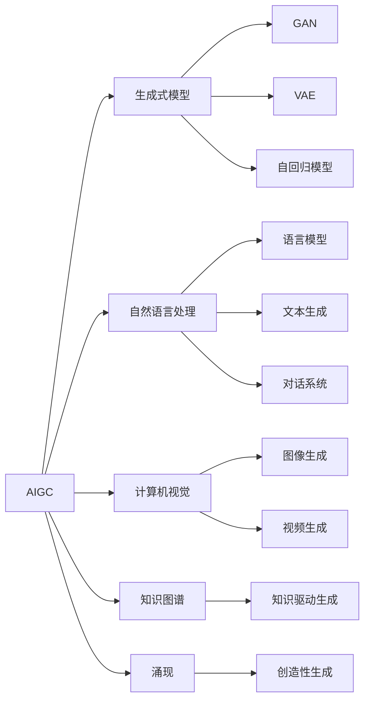

# AIGC从入门到实战：涌现：人工智能的应用

关键词：AIGC、人工智能、机器学习、深度学习、自然语言处理、计算机视觉、生成式对抗网络、强化学习、知识图谱、涌现

## 1. 背景介绍
### 1.1  问题的由来
人工智能生成内容(AIGC)是近年来人工智能领域的一个热点研究方向。随着深度学习等人工智能技术的快速发展,利用AI算法自动生成文本、图像、音频、视频等多模态内容已成为可能。AIGC在内容创作、虚拟助手、智能客服、游戏等诸多领域展现出广阔的应用前景。然而,要实现高质量、个性化、可控的内容生成,还面临诸多技术挑战。深入探讨AIGC的原理、方法与应用,对于推动人工智能技术的进步和产业化应用具有重要意义。

### 1.2  研究现状
目前,AIGC主要涉及以下几个研究方向:

1. 文本生成:利用自然语言处理和机器学习技术,根据上下文或指定主题自动生成连贯、通顺的文本内容,如新闻报道、产品描述、对话回复等。代表性工作如GPT系列语言模型。

2. 图像生成:通过生成式对抗网络(GAN)、变分自编码器(VAE)等深度学习模型,根据文本描述或随机噪声生成逼真的图像。代表性工作如StyleGAN、DALL-E等。 

3. 音频生成:利用语音合成、声音转换等技术,生成特定语者的声音或根据文本内容合成语音。如WaveNet、SampleRNN等。

4. 视频生成:在图像生成的基础上,引入时序信息,生成连贯的视频片段。如MoCoGAN、VideoGPT等。

5. 多模态内容生成:探索不同模态(如文本、图像)之间的语义关联,实现跨模态内容生成。如CLIP、DALL-E等。

尽管AIGC取得了长足进展,但在生成内容的一致性、连贯性、多样性、可控性等方面仍存在不足,亟需进一步的理论创新和技术突破。

### 1.3  研究意义
AIGC技术的发展对内容生产、创意设计等行业具有变革性影响。一方面,AIGC可显著提升内容生产效率,降低创作门槛,激发更多创新可能;另一方面,AIGC与人类创作的结合,有望催生出更加精彩纷呈的内容形式。AIGC的进步也将推动人机交互、知识服务、数字孪生等领域的智能化发展。因此,AIGC的研究对于开拓人工智能新赛道、赋能传统行业数字化转型具有重要意义。

### 1.4  本文结构
本文将围绕AIGC的原理、方法与应用展开系统论述。第2部分介绍AIGC的核心概念;第3部分重点阐述生成式深度学习模型的基本原理;第4部分从数学角度对AIGC的关键模型进行推导与分析;第5部分给出AIGC的代码实例;第6部分讨论AIGC的典型应用场景;第7部分梳理AIGC的学习资源;第8部分总结全文并展望未来;第9部分列举AIGC的常见问题解答。

## 2. 核心概念与联系
AIGC的核心概念主要包括:

1. 生成式模型:通过学习数据分布,生成与训练数据相似的新样本。常见的生成式模型有GAN、VAE、自回归模型等。它们是实现AIGC的基础。

2. 自然语言处理:利用计算机处理、理解和生成自然语言的技术,如语言模型、文本生成、对话系统等,是文本内容生成的理论支撑。

3. 计算机视觉:研究如何使计算机能够"看懂"图像、视频等视觉信息并进行分析、生成的技术。图像、视频内容生成高度依赖计算机视觉的进展。

4. 知识图谱:通过构建实体、概念间的语义关联网络,形成结构化、可计算的知识库。将知识图谱与AIGC相结合,可实现知识驱动的内容生成。

5. 涌现:指系统展现出超出其组成部分的复杂行为。AIGC生成的内容往往呈现出涌现特征,表现出超出训练数据范畴的创造性。

这些概念相互交织、协同促进,共同构成了AIGC的理论与技术基础。下图展示了AIGC的核心概念及其关联:

## 3. 核心算法原理 & 具体操作步骤
### 3.1  算法原理概述
AIGC的核心算法主要基于生成式深度学习模型。相比判别式模型直接学习输入到输出的映射,生成式模型关注数据本身的分布特征。通过刻画真实数据的概率分布,生成式模型可以生成与训练数据相似的新样本。常见的生成式模型包括:

1. 生成式对抗网络(GAN):通过构建生成器和判别器两个对抗网络,生成器尝试生成以假乱真的样本欺骗判别器,判别器则努力判别真假样本,两者博弈优化,最终使生成器能生成逼真的数据。

2. 变分自编码器(VAE):通过编码器将输入数据映射到隐空间获得隐变量,再通过解码器从隐变量重构出原始数据。在此过程中,VAE对隐变量分布进行约束,从而可从先验分布采样隐变量,生成新样本。

3. 自回归模型:通过建模数据序列的条件概率分布,根据前几个元素预测下一个元素。可用于序列数据的生成,如语言模型GPT就是基于自回归Transformer结构。

4. 流模型:通过可逆变换将复杂数据分布映射为简单先验分布,再从先验分布采样并逆变换,生成新样本。代表模型如RealNVP。

5. 扩散模型:通过迭代噪声扰动逐步破坏数据结构,再学习逆转此过程以从噪声恢复原始数据,从而实现生成新样本。如DDPM。

这些生成模型从不同角度刻画了数据分布,为AIGC提供了多元化的实现路径。

### 3.2  算法步骤详解
以GAN为例,详细说明其算法步骤:

1. 定义生成器G和判别器D,二者均为神经网络。生成器G以随机噪声z为输入,生成假样本;判别器D以真实样本x或生成样本G(z)为输入,输出样本为真的概率。

2. 初始化生成器和判别器的参数。

3. 训练判别器:
   - 从真实数据分布采样一批真实样本x
   - 从先验分布采样一批噪声z,送入生成器G生成一批假样本G(z) 
   - 将真实样本x和生成样本G(z)分别送入判别器D,获得其输出概率D(x)和D(G(z))
   - 计算判别器的损失函数:
     $L_D = -E_{x\sim p_{data}}[\log D(x)] - E_{z\sim p_z}[\log(1-D(G(z)))]$
   - 对判别器D的参数进行梯度下降更新

4. 训练生成器:
   - 从先验分布采样一批噪声z,送入生成器G生成一批假样本G(z)
   - 将生成样本G(z)送入判别器D,获得其输出概率D(G(z))  
   - 计算生成器的损失函数:
     $L_G = -E_{z\sim p_z}[\log D(G(z))]$
   - 对生成器G的参数进行梯度下降更新

5. 重复步骤3-4,直到模型收敛或达到预设的训练轮数。

6. 训练完成后,生成器G可用于生成新样本。从先验分布采样噪声z,送入G即可生成相应的样本。

GAN通过生成器和判别器的对抗博弈,不断优化生成器的生成能力,最终使其能生成接近真实数据分布的样本。

### 3.3  算法优缺点
以下分析了几种主要生成式模型的优缺点:

GAN的优点在于:
- 生成效果较为逼真,尤其在图像、视频生成任务上表现出色
- 通过对抗学习机制,生成器可隐式地学习数据分布,不需要显式定义似然函数
- 可扩展性强,适用于多种不同的数据形式与网络结构

GAN的缺点包括:  
- 训练不稳定,容易出现模式崩溃、梯度消失等问题
- 生成多样性不足,容易陷入局部最优
- 缺乏对生成过程的可解释性
  
VAE的优点有:
- 训练稳定,易于调参
- 可显式建模数据分布,具有概率解释
- 学习到的隐空间具有良好的结构性,可用于表征学习

VAE的局限在于:
- 生成效果常常比GAN模糊,细节丢失
- 假设隐变量服从高斯分布,限制了其表征能力
- 解码器输出与真实样本间采用逐点比较的重构损失,难以捕捉高层语义信息

自回归模型的优势包括:
- 可建模任意长度的序列数据
- 可显式计算似然概率,便于评估模型性能
- 结构简单,训练稳定

自回归模型的不足之处在于:
- 生成样本时只能串行,难以并行加速
- 生成长序列时误差累积,导致内容失真
- 难以捕捉全局结构信息

尽管各类生成式模型存在局限,但它们为AIGC任务提供了行之有效的解决方案。未来还需在算法的稳定性、多样性、可控性等方面进一步突破。

### 3.4  算法应用领域
AIGC算法在以下领域得到广泛应用:

1. 内容创作:利用AIGC技术自动或半自动生成文章、故事、剧本、诗歌等文本内容,以及图像、音乐、视频等多媒体内容,辅助内容创作者提升效率。

2. 虚拟助手:通过对话生成技术构建智能对话系统,提供个性化的客户服务、任务协助等。如小爱同学、Siri等。

3. 教育培训:自动生成教学案例、练习题、解题思路等教辅内容,实现因材施教。

4. 游戏娱乐:生成游戏中的场景地图、NPC对话、任务剧情等,丰富游戏内容。在虚拟主播、虚拟偶像等泛娱乐领域也有应用。

5. 设计创意:辅助平面设计、工业设计、UI设计等,提供设计灵感,生成各类设计素材。

6. 仿真测试:在自动驾驶、智能制造等领域,通过AIGC生成大量仿真数据,支撑算法测试与系统验证。

7. 知识服务:利用知识图谱与AIGC技术,构建智能问答、知识推荐等知识服务系统。

随着AIGC技术的不断发展,其应用领域还将不断扩展,为各行各业赋能增效。

## 4. 数学模型和公式 & 详细讲解 & 举例说明
### 4.1  数学模型构建
以VAE为例,说明其数学模型的构建过程。

VAE的目标是最大化数据的边际对数似然$\log p(x)$。根据贝叶斯法则,有:

$$\log p(x) = \log \int p(x|z)p(z)dz$$

其中,$p(z)$为隐变量$z$的先验分布,$p(x|z)$为解码器对应的条件概率分布。

由于边际分布的积分难以直接计算,VAE引入