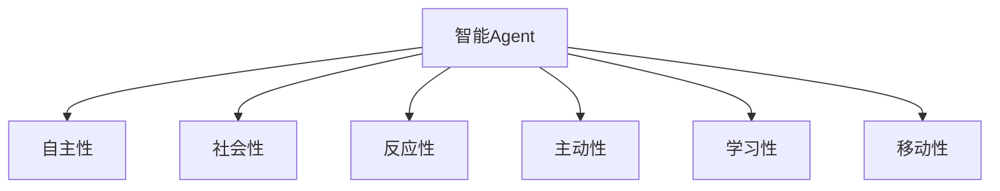
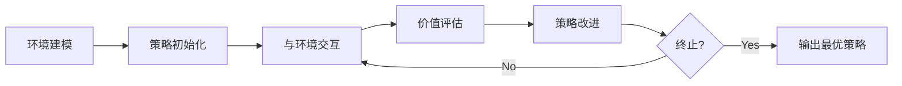

# AI人工智能 Agent：高级概念剖析

作者：禅与计算机程序设计艺术 / Zen and the Art of Computer Programming

## 1. 背景介绍

### 1.1 问题的由来

人工智能(Artificial Intelligence, AI)是计算机科学领域的一个重要分支,旨在研究如何让计算机模拟人类的智能行为。而智能Agent作为人工智能的核心概念之一,在AI系统中扮演着至关重要的角色。

智能Agent是一个能够感知环境并采取行动的自主实体,它能根据环境的变化做出相应的决策和行为。智能Agent概念的提出,为我们构建高级AI系统提供了新的思路和方法。

### 1.2 研究现状

目前,智能Agent已经在多个领域得到广泛应用,如智能助理、自动驾驶、智能制造等。各大科技公司和研究机构也在积极开展智能Agent相关的研究工作。

谷歌的DeepMind团队提出了深度强化学习算法,并将其应用于智能Agent的决策控制中,取得了显著成果。微软的研究人员提出了基于知识图谱的智能Agent框架,增强了Agent的语义理解和推理能力。

国内外高校如麻省理工、斯坦福大学、清华大学等也纷纷成立了专门的人工智能实验室,开展智能Agent的前沿探索。

### 1.3 研究意义

智能Agent作为连接现实世界与虚拟AI系统的桥梁,对于实现通用人工智能具有重要意义:

1. 智能Agent能够感知复杂多变的真实环境,为AI系统提供海量的数据和知识。

2. Agent能够执行多样化的任务,大大拓展了AI的应用场景和功能边界。

3. 多Agent协同合作,有望突破单个AI系统的能力瓶颈,实现更加强大的智能。

4. 智能Agent的研究,将促进人机交互、认知科学、机器人等多个领域的协同发展。

因此,深入剖析智能Agent的核心概念和关键技术,对于推动人工智能的进一步发展具有重要的理论和实践价值。

### 1.4 本文结构

本文将重点围绕智能Agent的以下几个核心问题展开:

- 智能Agent的基本概念和内涵
- Agent的感知、决策、执行等关键能力
- 多Agent系统的协同机制
- Agent的学习进化和自主成长
- Agent的行为模型和系统架构
- 主流的Agent开发框架和工具

通过系统梳理智能Agent的理论基础和关键技术,阐述Agent在人工智能领域的重要作用和发展趋势,为相关研究人员和开发者提供参考。

## 2. 核心概念与联系

智能Agent涉及了多个核心概念,它们相互关联、互为补充,构成了Agent的理论基础。

- 自主性(Autonomy):Agent能够独立地感知环境,自主地做出决策和执行任务,不需要人为的直接控制。

- 社会性(Sociality):Agent之间能够通过一定机制进行通信、协作与竞争,多Agent系统能够实现群体智能。

- 反应性(Reactivity):Agent能够及时响应环境的变化,根据感知信息动态调整自身行为。

- 主动性(Proactiveness):Agent不仅被动地响应环境,还能够主动地执行目标导向的任务。

- 学习性(Learning):Agent能够从经验中学习,不断提升自身的能力和性能。

- 移动性(Mobility):Agent可以在不同的主机或平台之间迁移,适应开放动态的网络环境。

下图展示了智能Agent的核心概念之间的关系:

智能Agent正是由这些关键属性构成的,不同的Agent实现可以针对特定应用场景,选择性地实现和增强某些属性。比如,自动驾驶Agent需要更强的反应性和学习性,而智能助理Agent则更加注重社会性和移动性。

## 3. 核心算法原理 & 具体操作步骤

### 3.1 算法原理概述

智能Agent的实现离不开多种人工智能算法的支撑,主要包括:

- 搜索算法:用于Agent的路径规划、任务分解等,如A*搜索、启发式搜索等。

- 机器学习算法:赋予Agent学习和适应能力,如监督学习、无监督学习、强化学习等。

- 博弈论算法:解决多Agent博弈与对抗问题,如纳什均衡、最小最大算法等。

- 规划算法:用于制定Agent的行动计划,如STRIPS、HTN等。

- 推理算法:增强Agent的决策与问题求解能力,如演绎推理、归纳推理、模糊推理等。

这些算法与Agent的感知、决策、学习等模块紧密结合,共同构成了Agent的核心能力。

### 3.2 算法步骤详解

以强化学习算法为例,详细说明其在智能Agent中的应用步骤:

1. 环境建模:将Agent所处的环境抽象为马尔可夫决策过程(MDP),定义状态空间、动作空间和奖励函数。

2. 策略初始化:为Agent设置初始策略,可以是随机策略或先验知识指导下的策略。

3. 与环境交互:Agent根据当前策略选择动作,执行动作后获得环境的即时奖励和新状态。

4. 价值评估:根据累积奖励评估当前策略的优劣,可以使用蒙特卡洛估计或时序差分学习等方法。

5. 策略改进:根据价值评估的结果,利用策略梯度、Q-learning等算法对策略进行迭代优化。

6. 终止条件判断:设置一定的迭代次数或收敛阈值,判断是否满足终止条件,否则返回步骤3。

通过不断试错和优化,Agent最终能够学习到一个最优策略,使期望累积奖励达到最大。

### 3.3 算法优缺点

强化学习算法的优点包括:

- 无需人工标注数据,通过自主探索优化策略
- 在连续状态和动作空间上表现出色
- 能够处理延迟奖励问题

但其缺点也比较明显:

- 样本利用效率低,学习速度慢
- 难以设计合适的奖励函数
- 容易陷入局部最优

因此,实际应用中需要根据具体问题,选择或改进合适的强化学习算法。未来基于深度学习的强化学习有望进一步提升性能。

### 3.4 算法应用领域

强化学习在智能Agent领域已有广泛应用,代表性的有:

- AlphaGo:基于深度强化学习的围棋AI,击败多位世界冠军。
- OpenAI Five:Dota2游戏AI,可与人类高手对战。
- 智能电网调度:基于多Agent强化学习的电网负荷调度系统。
- 自动驾驶决策控制:端到端的强化学习驾驶策略。

未来强化学习有望在机器人控制、工业调度优化、智慧城市管理等领域取得更大突破。

## 4. 数学模型和公式 & 详细讲解 & 举例说明

### 4.1 数学模型构建

智能Agent可以用一个六元组来抽象表示:
$$Agent=<S,A,P,R,\gamma,\pi>$$

其中,S表示Agent的有限状态集,A表示有限动作集,P表示状态转移概率矩阵,R表示奖励函数,$\gamma$表示折扣因子,$\pi$表示Agent的策略。

Agent与环境的交互过程可以用下面的公式来刻画:

$$S_t \overset{A_t}{\longrightarrow}R_t,S_{t+1}$$

即Agent在t时刻执行动作$A_t$,环境反馈即时奖励$R_t$,并转移到下一状态$S_{t+1}$。Agent的目标就是寻找最优策略$\pi^*$,最大化期望累积奖励:

$$\pi^*=\arg \max_{\pi} \mathbb{E}[\sum_{t=0}^{\infty}\gamma^t R_t|\pi]$$

其中,$\mathbb{E}$表示数学期望,$\gamma^t$为衰减系数,保证累积奖励收敛。

### 4.2 公式推导过程

以Q-learning算法为例,说明其价值函数的推导过程。Q-learning是一种常用的无模型、异策略的强化学习算法。其核心是学习动作-状态值函数Q(s,a),表示在状态s下选择动作a的长期价值。

根据Bellman最优方程,最优Q函数满足:

$$Q^*(s,a)=\mathbb{E}[R_t+\gamma \max_{a'}Q^*(S_{t+1},a')|S_t=s,A_t=a]$$

即在状态s下选择动作a,获得即时奖励R,然后在下一状态$S_{t+1}$选择使Q值最大的动作$a'$,最终获得的累积奖励期望。

Q-learning算法基于随机采样的思想,逐步逼近最优Q函数,其迭代公式为:

$$Q(S_t,A_t) \leftarrow Q(S_t,A_t)+\alpha[R_t+\gamma \max_a Q(S_{t+1},a)-Q(S_t,A_t)]$$

$\alpha$为学习率,控制Q值更新的幅度。可以证明,当采样次数趋于无穷时,Q函数能够收敛到最优值 $Q^*$。

### 4.3 案例分析与讲解

下面以一个简单的迷宫寻路问题为例,说明Q-learning算法的应用。

如上图所示,Agent需要从起点S走到终点G,其中灰色方格为障碍物。

我们可以将每个空白方格视为一个状态,Agent在每个状态下有4个可选动作:上、下、左、右。执行动作后,根据是否撞墙或到达终点,环境会反馈不同的即时奖励,如下表所示:

| 动作结果 | 即时奖励 |
|---------|---------|
| 撞到墙   | -10      |
| 普通移动 | -1       |
| 到达终点 | +100     |

根据Q-learning算法,我们初始化一个全0的Q表,然后利用$\varepsilon-greedy$策略进行探索和利用,即以$\varepsilon$的概率随机选择动作,以$1-\varepsilon$的概率选择Q值最大的动作。每次与环境交互后,根据上面的迭代公式更新Q表。

经过多轮迭代,Q表最终收敛,得到了最优策略,如下图所示:

可以看到,Agent学会了在每个状态下选择最优动作,成功规避障碍并到达目标。

### 4.4 常见问题解答

Q: Q-learning算法能否保证收敛到最优策略?

A: 理论上,只要采样次数足够多,学习率适中,Q-learning算法能够收敛到最优策略。但在实际应用中,复杂的环境状态和奖励设计可能导致难以收敛,需要借助经验replay、Target网络等技巧来提高稳定性。

Q: 如何设计奖励函数?

A: 奖励函数的设计直接影响Agent学习到的策略质量。一般来说,奖励应该与任务目标紧密相关,引导Agent朝着正确方向优化。同时奖励也不宜过于稀疏,以免Agent难以获得有效反馈。在实践中,通常需要反复调试和优化奖励函数。

Q: 如何处理连续状态和动作空间?

A: 传统的Q表只适用于离散状态和动作空间。对于连续问题,可以使用函数逼近的方法,用神经网络来拟合Q函数。比较成功的算法有DQN、DDPG、SAC等,它们将深度学习与强化学习结合,大大提升了处理复杂状态