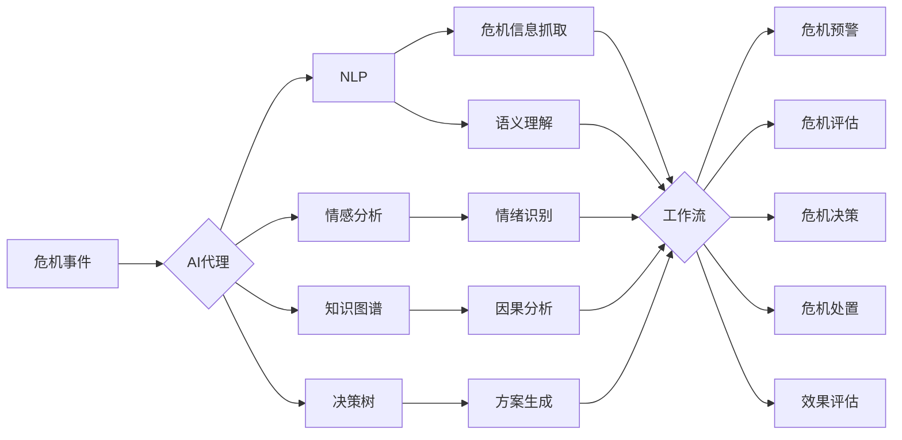

# AI人工智能代理工作流 AI Agent WorkFlow：在公关危机管理中的应用

关键词：AI代理、工作流、公关危机管理、自然语言处理、情感分析、知识图谱、决策树

## 1. 背景介绍
### 1.1  问题的由来
在当今瞬息万变的商业环境中，企业面临着各种各样的公关危机。这些危机可能源于产品质量问题、管理不善、员工不当行为等多方面因素，如果处理不当，将对企业的声誉和业绩造成严重影响。传统的公关危机管理主要依赖人工处理，存在响应速度慢、决策不一致等问题。因此，亟需引入人工智能技术，提高公关危机管理的效率和效果。

### 1.2  研究现状
目前，国内外学者已经开始探索将人工智能技术应用于公关危机管理。如MIT的研究者提出了一种基于机器学习的社交媒体舆情监测系统[1]，可以实时发现潜在的公关危机。香港科技大学的学者提出了一种基于深度学习的公关危机预警模型[2]，可以提前识别可能引发公关危机的事件。清华大学的研究者提出了一种基于知识图谱的公关危机决策支持系统[3]，可以辅助公关人员制定应对策略。但是，现有研究主要集中在单一技术的应用，缺乏系统性的解决方案。

### 1.3  研究意义
本文提出了一种基于AI代理工作流的公关危机管理新方法。该方法综合运用了自然语言处理、情感分析、知识图谱、决策树等多种人工智能技术，构建了一套自动化、智能化的公关危机管理流程。相比传统方法，该方法可以显著提高公关危机的发现、评估、决策、处置、回顾等各个环节的效率和效果，为企业的声誉管理提供有力支撑。

### 1.4  本文结构
本文的结构安排如下：第2部分介绍了AI代理工作流中涉及的核心概念；第3部分详细阐述了AI代理工作流的核心算法原理和操作步骤；第4部分建立了AI代理工作流的数学模型，并给出公式推导和案例分析；第5部分给出了一个基于Python的项目实践，展示了AI代理工作流的代码实现；第6部分分析了AI代理工作流在公关危机管理中的实际应用场景；第7部分推荐了一些学习和实践AI代理工作流的工具和资源；第8部分总结了全文的主要内容，并展望了AI代理工作流的未来发展方向。

## 2. 核心概念与联系

在阐述AI代理工作流的核心算法之前，有必要对其中涉及的几个核心概念进行必要的说明：

- **AI代理(Agent)**：能够感知环境并采取行动以实现特定目标的人工智能系统。在公关危机管理场景下，AI代理负责危机信息的收集、分析、决策等任务。

- **工作流(Workflow)**：一系列有序的、相互关联的活动或任务。将公关危机管理的各个环节组织成工作流，可以提高管理的规范性和连贯性。

- **自然语言处理(NLP)**：赋予计算机处理和理解人类语言的能力。在公关危机管理中，NLP主要用于危机信息的抓取和语义理解。

- **情感分析(Sentiment Analysis)**：从文本中识别和提取主观信息的过程。通过情感分析，可以自动评估公众对危机事件的情绪倾向。

- **知识图谱(Knowledge Graph)**：用节点代表实体、边代表实体间关系的语义网络。利用知识图谱，可以建立危机事件的因果链条，辅助决策制定。

- **决策树(Decision Tree)**：一种树形结构的分类模型。在公关危机管理中，决策树可用于自动生成危机处置方案。

下图展示了上述核心概念在AI代理工作流中的作用和联系：



由上图可见，AI代理工作流以NLP、情感分析、知识图谱、决策树等技术为基础，以工作流为组织形式，实现了公关危机管理全流程的自动化和智能化。

## 3. 核心算法原理 & 具体操作步骤

### 3.1  算法原理概述

AI代理工作流的核心算法包括：

- **文本分类算法**：用于对抓取到的危机信息进行分类，如负面信息、中性信息、正面信息等。常用的文本分类算法有朴素贝叶斯、支持向量机、卷积神经网络等。

- **情感分析算法**：用于识别文本中蕴含的情感倾向，如积极、消极、中性等。常用的情感分析算法有基于词典的方法、基于机器学习的方法等。

- **知识推理算法**：用于在知识图谱上进行因果链路的推理，发现危机事件的根源和影响。常用的知识推理算法有基于规则的方法、基于表示学习的方法等。

- **决策树算法**：用于根据危机事件的特征自动生成处置方案。常用的决策树算法有ID3、C4.5、CART等。

### 3.2  算法步骤详解

以下以决策树算法为例，详细说明其具体步骤：

**输入**：危机事件特征集合$D=\{(x_1,y_1),(x_2,y_2),...,(x_N,y_N)\}$，其中$x_i$为第$i$个危机事件的特征向量，$y_i$为其对应的处置方案。

**输出**：决策树$T$。

1. 如果$D$中所有实例属于同一类$C_k$，则$T$为单节点树，并将$C_k$作为该节点的类标记，返回$T$；
2. 如果特征集合$A$为空，则$T$为单节点树，并将$D$中实例数最大的类$C_k$作为该节点的类标记，返回$T$；
3. 否则，计算$A$中各特征对$D$的信息增益，选择信息增益最大的特征$A_g$；
4. 对$A_g$的每一可能值$a_i$，根据$A_g=a_i$将$D$分割成若干非空子集$D_i$，将$D_i$中实例数最大的类作为标记，构建子节点，由节点及其子节点构成树$T$，返回$T$；
5. 对第$i$个子节点，以$D_i$为训练集，以$A-\{A_g\}$为特征集，递归地调用步1-5，得到子树$T_i$，返回$T_i$。

### 3.3  算法优缺点

决策树算法的优点包括：

- 易于理解和解释，可以通过可视化的方式呈现决策过程；
- 能够同时处理连续和离散属性；
- 对缺失值不敏感，可以处理含有缺失值的数据；
- 计算复杂度较低，易于实现。

决策树算法的缺点包括：

- 可能产生过拟合问题，泛化能力较差；
- 对连续属性的处理较弱，需要进行离散化；
- 容易受到不平衡数据集的影响，产生偏斜的决策树。

### 3.4  算法应用领域

除了公关危机管理，决策树算法还广泛应用于以下领域：

- 金融风控：根据客户特征预测其违约风险；
- 医疗诊断：根据患者症状预测其患病概率；
- 故障诊断：根据设备参数预测其故障类型；
- 营销决策：根据用户属性预测其购买意向。

## 4. 数学模型和公式 & 详细讲解 & 举例说明

### 4.1  数学模型构建

决策树的生成过程可以用以下数学模型来描述：

给定训练数据集$D=\{(x_1,y_1),(x_2,y_2),...,(x_N,y_N)\}$，其中$x_i=(x_i^{(1)},x_i^{(2)},...,x_i^{(n)})$为第$i$个实例的$n$维特征向量，$y_i\in\{C_1,C_2,...,C_K\}$为其对应的类标记，决策树学习的目标是根据给定的训练数据集构建一个决策树模型，使它能够对新的实例进行分类。

决策树学习的本质是从训练数据中归纳出一组分类规则。每条规则对应决策树的一条路径，路径上的内部节点对应特征测试，叶节点对应决策结果。

### 4.2  公式推导过程

决策树的生成通常采用自顶向下、递归的方法，其核心是在每个节点选择一个最优划分特征。常用的特征选择准则有信息增益、信息增益比、基尼指数等。以信息增益为例，其定义为：

给定数据集$D$，假设有$K$个类$C_k$，$|C_k|$表示属于类$C_k$的样本个数，$|D|$表示数据集$D$的样本总数，则数据集$D$的信息熵定义为：

$$
H(D)=-\sum_{k=1}^K\frac{|C_k|}{|D|}\log_2\frac{|C_k|}{|D|}
$$

假设特征$A$有$V$个可能的取值$\{a_1,a_2,...,a_V\}$，根据$A$的取值将$D$划分为$V$个子集$\{D_1,D_2,...,D_V\}$，其中$D_v$包含$D$中所有在特征$A$上取值为$a_v$的样本，则特征$A$对数据集$D$的信息增益定义为：

$$
g(D,A)=H(D)-\sum_{v=1}^V\frac{|D_v|}{|D|}H(D_v)
$$

其中，$H(D_v)$表示子数据集$D_v$的信息熵。

决策树学习的目标是选择信息增益最大的特征作为划分特征，递归地构建决策树，直到满足停止条件。

### 4.3  案例分析与讲解

以下以一个简单的危机事件分类问题为例，说明决策树算法的应用。

假设有以下训练数据：

| 序号 | 危机等级 | 负面情绪 | 传播速度 | 处置方案 |
| ---- | -------- | -------- | -------- | -------- |
| 1    | 高       | 强       | 快       | A        |
| 2    | 高       | 强       | 慢       | A        |
| 3    | 低       | 弱       | 慢       | B        |
| 4    | 中       | 中       | 快       | A        |
| 5    | 中       | 强       | 慢       | B        |
| 6    | 低       | 中       | 快       | B        |
| 7    | 高       | 中       | 慢       | A        |
| 8    | 中       | 弱       | 慢       | B        |
| 9    | 低       | 强       | 快       | B        |
| 10   | 高       | 弱       | 快       | A        |

根据上述数据，可以构建如下决策树：

```mermaid
graph TD
A{危机等级}
A --> B{高}
A --> C{中}
A --> D{低}
B --> E{负面情绪}
B --> F{强}
B --> G{弱}
C --> H{负面情绪}
C --> I{强}
C --> J{中}
C --> K{弱}
D --> L{处置方案B}
E --> M{传播速度}
E --> N{快}
E --> O{慢}
F --> P{处置方案A}
G --> Q{处置方案A}
H --> R{传播速度}
H --> S{快}
H --> T{慢}
I --> U{处置方案B}
J --> V{处置方案A}
K --> W{处置方案B}
M --> X{处置方案A}
N --> Y{处置方案A}
O --> Z{处置方案A}
R --> a{处置方案A}
S