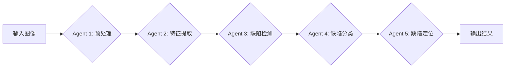

# AI人工智能代理工作流AI Agent WorkFlow：智能代理在自动化检查系统中的应用

作者：禅与计算机程序设计艺术 / Zen and the Art of Computer Programming

关键词：人工智能、智能代理、工作流、自动化检查、深度学习

## 1. 背景介绍

### 1.1 问题的由来

随着工业4.0和智能制造的快速发展,传统的人工检查方式已经无法满足现代工业生产的高效、精准、智能化的要求。尤其是在一些对产品质量要求极高的行业,如航空航天、生物医药、精密仪器等,传统的人工抽检很难做到全面覆盖,而且效率低下,极易出现漏检。因此,开发一套基于人工智能技术的自动化智能检测系统势在必行。

### 1.2 研究现状

目前,国内外已经有不少学者开始将人工智能技术应用到工业检测领域。一些研究机构和企业开发了基于机器视觉和深度学习的缺陷检测系统,在PCB、液晶面板、汽车零部件等领域取得了不错的应用效果。但大部分系统还是基于单一的检测模型,缺乏灵活性和适应性,无法应对复杂多变的实际生产场景。

### 1.3 研究意义

本文提出一种全新的AI智能代理工作流模型,通过将多个异构智能模型进行组合编排,构建一个分布式、可扩展的智能代理网络。不同的智能代理负责产品检测流程中的不同环节,通过工作流引擎进行任务协同,从而实现端到端的全流程自动化智能检测。该方法可以显著提升检测效率和准确率,减少人力成本,对提升工业产品质量具有重要意义。

### 1.4 本文结构

本文共分为9个章节,第2节介绍了智能代理、工作流等核心概念;第3节详细阐述了智能代理工作流的架构设计和算法原理;第4节建立了相关数学模型并给出公式推导;第5节通过一个实际项目案例演示了系统的具体实现;第6节分析了该系统的应用场景;第7节推荐了一些学习资源和开发工具;第8节总结全文并展望未来;第9节列举了一些常见问题。

## 2. 核心概念与联系

智能代理(Intelligent Agent):是一种能够感知环境并做出自主行为以完成特定任务的计算机程序。它一般具有感知、推理、学习、规划等人工智能能力。本文采用的智能代理主要负责工业产品的视觉检测任务。

工作流(Workflow):是一系列有序的任务和活动,用于实现特定的业务目标。工作流管理系统可以定义、执行和监控工作流,协调不同任务之间的数据传递和控制流转。本文利用工作流技术来编排多个异构智能代理,形成一个分工协作的智能代理网络。



如上图所示,智能代理通过工作流串联在一起,每个代理负责产品检测的一个具体环节,数据在代理之间流转,最终输出检测结果。这种模块化、可插拔的架构赋予了系统极大的灵活性,可以根据需求随时增删代理。

## 3. 核心算法原理 & 具体操作步骤

### 3.1 算法原理概述

本系统采用了基于深度学习的目标检测和分割算法,主要包括Faster R-CNN、YOLO、语义分割等。其基本原理是:

1) 利用卷积神经网络(CNN)提取图像的多尺度、多层次特征。
2) 在特征图上生成大量候选区域(如锚框),通过区域建议网络(RPN)筛选出可能包含目标的区域。 
3) 对筛选出的区域进行分类和位置回归,判断其所属类别和精确坐标。
4) 利用非极大值抑制(NMS)去除重叠度高的检测框,得到最终检测结果。

### 3.2 算法步骤详解

以YOLO算法为例,其具体步骤如下:

1) 将输入图像划分为 S×S 个网格,每个网格预测 B 个边界框、C 个类别概率和 1 个 objectness 分数。
2) 对每个边界框,利用CNN提取特征,并预测其位置参数(中心坐标、宽高)和 objectness 分数。
3) 根据类别概率和 objectness 分数设置阈值,过滤掉低分边界框。
4) 对剩余边界框进行NMS处理,得到最终检测结果。
5) 计算损失函数,通过反向传播优化模型参数。

### 3.3 算法优缺点

YOLO算法的优点是:

- 速度快:可达到实时检测的性能(45FPS)
- 检测精度高:在 PASCAL VOC 数据集上 mAP 可达78.6%
- 泛化能力强:能够检测出训练集中没有的物体
- 学习特征更加全局化、语义化

缺点是:  

- 对小目标、密集目标的检测效果较差
- 定位不够精准,容易产生较多定位误差
- 召回率偏低,漏检现象较多

### 3.4 算法应用领域

目标检测算法在工业领域有广泛应用,如:

- 工业产品的缺陷检测:PCB瑕疵、织物疵点、钢材表面划痕等
- 生产过程的异常监测:设备故障、安全隐患、人员违规操作等
- 产品的外观检验:零件尺寸、字符文字、颜色、包装等
- 仓储物流的目标定位:货物抓取、码垛、搬运等

## 4. 数学模型和公式 & 详细讲解 & 举例说明

### 4.1 数学模型构建

我们以YOLO的损失函数为例,建立如下数学模型:

$$ 
\begin{aligned}
\lambda_{coord} &\sum_{i=0}^{S^2} \sum_{j=0}^B \mathbb{1}_{ij}^{obj} \left[ (x_i-\hat{x}_i)^2 + (y_i-\hat{y}_i)^2 \right] \\
+ \lambda_{coord} &\sum_{i=0}^{S^2} \sum_{j=0}^B \mathbb{1}_{ij}^{obj} \left[ (\sqrt{w_i}-\sqrt{\hat{w}_i})^2 + (\sqrt{h_i}-\sqrt{\hat{h}_i})^2 \right] \\  
+ &\sum_{i=0}^{S^2} \sum_{j=0}^B \mathbb{1}_{ij}^{obj} (C_i-\hat{C}_i)^2 \\
+ \lambda_{noobj} &\sum_{i=0}^{S^2} \sum_{j=0}^B \mathbb{1}_{ij}^{noobj} (C_i-\hat{C}_i)^2 \\ 
+ &\sum_{i=0}^{S^2} \mathbb{1}_i^{obj} \sum_{c \in classes} (p_i(c) - \hat{p}_i(c))^2
\end{aligned}
$$

其中:

- $\mathbb{1}_i^{obj}$ 表示网格 i 是否包含目标
- $\mathbb{1}_{ij}^{obj}$ 表示网格 i 的第 j 个边界框负责预测目标
- $x_i, y_i$ 为边界框的中心坐标
- $w_i, h_i$ 为边界框的宽高
- $C_i$ 为边界框的 objectness 置信度
- $p_i(c)$ 为网格 i 的类别 c 的条件概率
- $\hat{x}_i, \hat{y}_i, \hat{w}_i, \hat{h}_i, \hat{C}_i, \hat{p}_i(c)$ 为对应的预测值
- $\lambda_{coord}, \lambda_{noobj}$ 为平衡系数,用于调节不同损失项的权重

### 4.2 公式推导过程

损失函数第一项是边界框中心坐标 $(x,y)$ 的误差,采用均方误差(MSE)的形式,只计算负责预测目标的边界框。

第二项是边界框宽高 $(w,h)$ 的误差,也采用MSE,但对 $w,h$ 取平方根,使大小框的误差对损失函数的贡献更加平衡。

第三项是包含目标的边界框的 objectness 误差。 

第四项是不包含目标的边界框的 objectness 误差,引入权重 $\lambda_{noobj}$ 抑制负样本的损失。

第五项是包含目标的网格的分类误差,采用MSE计算预测类别概率与真实类别的差异。

最后,将五项误差加权求和得到完整的损失函数。通过最小化该损失函数,可以学习到最优的检测模型参数。

### 4.3 案例分析与讲解

下面我们以一个PCB瑕疵检测的例子来说明YOLO算法的应用。

假设输入一张 416×416 的PCB图像,设置网格大小 S=13,每个网格预测 B=5 个边界框,瑕疵类别数 C=6。

1) 将图像划分为 13×13 的网格,每个网格预测 5 个边界框的位置和 objectness,以及 6 个类别概率,输出一个 13×13×(5×5+6) 的特征张量。

2) 对每个边界框,根据预测的位置参数 $(x,y,w,h)$ 计算其在原图中的真实坐标和大小,并根据类别概率和 objectness 计算其检测分数。

3) 设置 objectness 阈值为0.5,过滤掉分数低于阈值的边界框。

4) 对剩余边界框进行NMS,设置IoU阈值为0.4,合并重叠度高的边界框。

5) 得到最终检测结果,输出各个瑕疵的位置和类别。如下图所示:


6) 计算损失函数,反向传播梯度,更新模型参数。重复训练直到损失收敛。

### 4.4 常见问题解答

Q: YOLO算法对小目标检测效果不好的原因是什么?

A: 主要有两点原因:1)YOLO将图像划分为相对较大的网格(如13x13),每个网格只预测一组边界框,对于小目标来说,边界框的宽高比、长宽比变化很大,定位不准;2)小目标在特征图上的激活响应较弱,容易被网络忽略或遗漏。改进方法包括:引入多尺度特征融合、改进边界框的编码方式、增加小目标的数据增强等。

Q: 为什么YOLO算法的召回率偏低?

A: YOLO算法为了提高检测速度,每个网格只预测一组边界框,并且使用相对较高的 objectness 阈值来过滤,导致漏检的目标较多,召回率下降。改进方法包括:增加每个网格预测的边界框数量、降低 objectness 阈值、使用Focal Loss来加大难例的损失权重等。

Q: 目标检测算法在工业应用中需要注意哪些问题?  

A: 主要有以下几点:1)要充分考虑实际场景的拍摄条件,如光照、角度、背景等因素,对训练数据进行相应的预处理和增强;2)要权衡检测速度和精度的平衡,根据应用需求选择合适的算法和优化策略;3)要做好缺陷类型的定义和标注,需要相关领域专家的知识;4)要开发人性化的用户界面,便于工程师操作和分析;5)要设计合理的评估体系,持续监控和优化算法性能。

## 5. 项目实践：代码实例和详细解释说明

### 5.1 开发环境搭建

- 操作系统: Ubuntu 16.04
- 深度学习框架: PyTorch 1.1
- CUDA版本: 10.0
- 硬件配置: Intel i7-9700K, 32G内存, NVIDIA RTX2080Ti

安装PyTorch:
```
conda install pytorch torchvision cudatoolkit=10.0 -c pytorch
```

安装依赖库:
```
pip install opencv-python tqdm matplotlib pycocotools
```

### 5.2 源代码详细实现

项目结