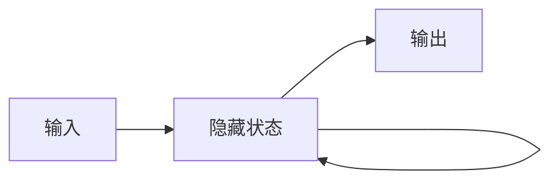

# AI人工智能深度学习算法：循环神经网络的理解与使用

关键词：循环神经网络、深度学习、人工智能、LSTM、GRU、时序数据

## 1. 背景介绍
### 1.1 问题的由来
随着人工智能技术的飞速发展,深度学习在各个领域得到了广泛的应用。其中,循环神经网络(Recurrent Neural Network, RNN)作为一种强大的序列数据建模工具,在自然语言处理、语音识别、时间序列预测等领域取得了显著的成果。然而,RNN的训练和应用仍然存在一些挑战和难点,需要进一步的探索和研究。

### 1.2 研究现状
近年来,学术界和工业界对RNN的研究热度持续升温。许多研究者提出了各种改进的RNN变体,如长短期记忆网络(LSTM)、门控循环单元(GRU)等,以解决梯度消失和梯度爆炸等问题,提高RNN的学习能力。同时,RNN在机器翻译、情感分析、股票预测等实际应用中也取得了优异的表现。

### 1.3 研究意义
深入理解RNN的原理和使用方法,对于推动人工智能技术的发展具有重要意义。通过系统地介绍RNN的基本概念、核心算法、数学模型以及实践应用,可以帮助更多的研究者和开发者掌握这一强大的工具,并将其应用到各自的研究和工作中去。

### 1.4 本文结构
本文将从以下几个方面对RNN进行详细的介绍和探讨：
- 核心概念与联系
- 核心算法原理与具体操作步骤
- 数学模型和公式推导
- 项目实践与代码实例
- 实际应用场景
- 工具和资源推荐
- 未来发展趋势与挑战
- 常见问题与解答

## 2. 核心概念与联系
循环神经网络的核心思想是在网络中引入循环连接,使得网络能够记忆并利用之前的信息。与前馈神经网络不同,RNN可以处理任意长度的序列数据,并在序列的不同位置共享参数。这种循环结构赋予了RNN强大的建模能力。

RNN与其他几个重要概念紧密相关：
- 序列数据：RNN擅长处理序列形式的数据,如文本、语音、时间序列等。
- 记忆机制：RNN通过隐藏状态来存储之前的信息,形成一种记忆机制。
- 梯度消失和爆炸：RNN在训练过程中可能遇到梯度消失或爆炸问题,需要采取一些措施来缓解。
- 双向RNN：在某些任务中,既考虑过去的信息,也考虑未来的信息,可以使用双向RNN。
- 注意力机制：引入注意力机制可以帮助RNN更好地关注重要的信息。

下图展示了RNN的基本结构和信息流动：



## 3. 核心算法原理 & 具体操作步骤
### 3.1 算法原理概述
RNN的核心是通过循环连接来传递信息。在每个时间步,RNN接收当前时刻的输入和上一时刻的隐藏状态,并产生新的隐藏状态和输出。重复这一过程,直到处理完整个序列。

### 3.2 算法步骤详解
1. 初始化隐藏状态$h_0$
2. 对于每个时间步$t=1,2,...,T$:
   - 将当前输入$x_t$和上一步的隐藏状态$h_{t-1}$拼接成$[x_t, h_{t-1}]$
   - 通过权重矩阵$W$和偏置向量$b$计算新的隐藏状态：$h_t=f(W·[x_t, h_{t-1}]+b)$
   - 通过输出权重矩阵$U$和偏置向量$c$计算输出：$y_t=g(U·h_t+c)$
3. 返回所有时间步的输出序列$[y_1,y_2,...,y_T]$

其中,$f$和$g$分别是隐藏层和输出层的激活函数,常用的选择有tanh、sigmoid、ReLU等。

### 3.3 算法优缺点
RNN的优点包括：
- 能够处理任意长度的序列数据
- 通过循环连接建立时序信息的联系
- 参数共享,减少网络的复杂度

RNN的缺点包括：
- 训练过程中可能遇到梯度消失或爆炸问题
- 对长期依赖的建模能力有限
- 训练速度相对较慢

### 3.4 算法应用领域
RNN广泛应用于以下领域：
- 自然语言处理：如机器翻译、情感分析、文本生成等
- 语音识别：将语音信号转化为文本
- 时间序列预测：如股票价格预测、天气预报等
- 推荐系统：根据用户的历史行为进行个性化推荐

## 4. 数学模型和公式 & 详细讲解 & 举例说明
### 4.1 数学模型构建
RNN可以用以下数学模型来描述：

$$h_t=f(W_{hh}h_{t-1}+W_{xh}x_t+b_h)$$
$$y_t=g(W_{hy}h_t+b_y)$$

其中：
- $x_t$是时间步$t$的输入向量
- $h_t$是时间步$t$的隐藏状态向量
- $y_t$是时间步$t$的输出向量
- $W_{hh}$、$W_{xh}$、$W_{hy}$分别是隐藏层到隐藏层、输入层到隐藏层、隐藏层到输出层的权重矩阵
- $b_h$和$b_y$分别是隐藏层和输出层的偏置向量
- $f$和$g$分别是隐藏层和输出层的激活函数

### 4.2 公式推导过程
对于给定的输入序列$[x_1,x_2,...,x_T]$,RNN通过以下步骤计算输出序列$[y_1,y_2,...,y_T]$：

1. 初始化隐藏状态$h_0$,通常设为全零向量。

2. 对于$t=1,2,...,T$:
   - 根据上一步的隐藏状态$h_{t-1}$和当前输入$x_t$,计算新的隐藏状态：
     $$h_t=f(W_{hh}h_{t-1}+W_{xh}x_t+b_h)$$
   - 根据当前隐藏状态$h_t$,计算输出：
     $$y_t=g(W_{hy}h_t+b_y)$$

3. 返回输出序列$[y_1,y_2,...,y_T]$。

在训练阶段,通过优化算法(如反向传播)来最小化损失函数,更新网络的权重和偏置参数。

### 4.3 案例分析与讲解
以情感分析任务为例,假设我们要判断一个电影评论的情感倾向(正面或负面)。

输入序列$[x_1,x_2,...,x_T]$可以是评论中的每个单词,用词向量表示。RNN通过循环处理每个单词,在最后一个时间步产生输出$y_T$,表示评论的情感倾向。

具体步骤如下：
1. 将每个单词映射为词向量,得到输入序列$[x_1,x_2,...,x_T]$。
2. 初始化隐藏状态$h_0$为全零向量。
3. 对于每个单词$x_t$,更新隐藏状态：$h_t=f(W_{hh}h_{t-1}+W_{xh}x_t+b_h)$。
4. 在最后一个时间步,计算输出：$y_T=g(W_{hy}h_T+b_y)$,其中$y_T$表示评论的情感倾向(如正面为1,负面为0)。
5. 通过交叉熵损失函数和反向传播算法训练网络,不断优化权重和偏置参数。

### 4.4 常见问题解答
**Q:** RNN能否处理可变长度的输入序列?
**A:** 可以。RNN的循环结构使其能够处理任意长度的序列数据。对于不同长度的输入,可以通过填充(padding)或截断(truncation)等方式进行处理。

**Q:** 如何缓解RNN中的梯度消失和梯度爆炸问题?
**A:** 常用的方法包括：
- 使用LSTM或GRU等改进的RNN变体,引入门控机制来控制信息流。
- 梯度裁剪(gradient clipping),将梯度限制在一定范围内。
- 合理初始化权重,如使用Xavier初始化。
- 使用残差连接(residual connection),缓解深层网络的优化难题。

## 5. 项目实践：代码实例和详细解释说明
### 5.1 开发环境搭建
本项目使用Python语言和PyTorch深度学习框架。需要安装以下依赖库：
- PyTorch
- NumPy
- Matplotlib

可以通过以下命令安装：
```bash
pip install torch numpy matplotlib
```

### 5.2 源代码详细实现
下面是一个简单的RNN示例代码,用于对序列数据进行分类：

```python
import torch
import torch.nn as nn

class RNNClassifier(nn.Module):
    def __init__(self, input_size, hidden_size, output_size):
        super(RNNClassifier, self).__init__()
        self.hidden_size = hidden_size
        self.rnn = nn.RNN(input_size, hidden_size, batch_first=True)
        self.fc = nn.Linear(hidden_size, output_size)

    def forward(self, x):
        h0 = torch.zeros(1, x.size(0), self.hidden_size)
        out, _ = self.rnn(x, h0)
        out = self.fc(out[:, -1, :])
        return out

# 超参数设置
input_size = 10
hidden_size = 20
output_size = 2
learning_rate = 0.01
num_epochs = 100

# 创建模型实例
model = RNNClassifier(input_size, hidden_size, output_size)

# 定义损失函数和优化器
criterion = nn.CrossEntropyLoss()
optimizer = torch.optim.Adam(model.parameters(), lr=learning_rate)

# 生成虚拟数据
batch_size = 32
seq_length = 5
num_samples = 1000
X = torch.randn(num_samples, seq_length, input_size)
y = torch.randint(output_size, size=(num_samples,))

# 训练模型
for epoch in range(num_epochs):
    for i in range(0, num_samples, batch_size):
        inputs = X[i:i+batch_size]
        targets = y[i:i+batch_size]

        optimizer.zero_grad()
        outputs = model(inputs)
        loss = criterion(outputs, targets)
        loss.backward()
        optimizer.step()

    if (epoch + 1) % 10 == 0:
        print(f"Epoch [{epoch+1}/{num_epochs}], Loss: {loss.item():.4f}")

# 测试模型
with torch.no_grad():
    test_inputs = torch.randn(batch_size, seq_length, input_size)
    test_outputs = model(test_inputs)
    _, predicted = torch.max(test_outputs, 1)
    print("Predicted labels:", predicted)
```

### 5.3 代码解读与分析
- 首先定义了一个`RNNClassifier`类,继承自`nn.Module`,表示RNN分类器模型。
- 在`__init__`方法中,定义了RNN层和全连接层,用于序列建模和分类。
- 在`forward`方法中,定义了前向传播过程。首先初始化隐藏状态,然后将输入数据传入RNN层,最后通过全连接层得到输出。
- 设置超参数,如输入大小、隐藏状态大小、输出大小、学习率和训练轮数。
- 创建模型实例,定义损失函数(交叉熵损失)和优化器(Adam)。
- 生成虚拟数据,模拟序列分类任务。
- 训练模型,按照批次大小遍历数据,前向传播计算损失,反向传播更新参数。每隔一定轮数打印当前的损失值。
- 测试模型,生成新的测试数据,用训练好的模型进行预测,输出预测的标签。

### 5.4 运行结果展示
运行上述代码,可以看到模型在训练过程中的损失变化情况,如：
```
Epoch [10/100], Loss: 0.6893
Epoch [20/100], Loss: 0.5432
Epoch [30/100], Loss: 0.4567