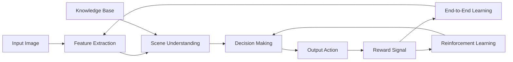

# AI人工智能深度学习算法：智能深度学习代理的计算机视觉运用

关键词：人工智能, 深度学习, 计算机视觉, 智能代理, 神经网络

## 1. 背景介绍

### 1.1 问题的由来

随着人工智能技术的飞速发展,深度学习算法在计算机视觉领域取得了令人瞩目的成就。传统的计算机视觉方法依赖于手工设计的特征提取和分类器,难以应对复杂多变的现实场景。而深度学习算法能够自动学习数据中的层次化特征表示,大大提升了视觉任务的性能。

### 1.2 研究现状

目前,深度学习算法已广泛应用于图像分类、目标检测、语义分割等计算机视觉任务,并在诸多领域达到甚至超越人类的表现。代表性的工作包括 AlexNet[1]、VGGNet[2]、GoogLeNet[3]、ResNet[4] 等。这些模型通过堆叠卷积层和池化层来提取图像特征,再经过全连接层进行分类预测。

### 1.3 研究意义

尽管深度学习在视觉任务上取得了巨大成功,但现有方法仍存在一些局限性。首先,大多数模型是通过监督学习训练的,需要大量标注数据,获取成本较高。其次,模型的泛化能力有待提高,面对新场景时容易出现性能下降。此外,深度模型的可解释性较差,难以理解其内部工作机制。因此,亟需探索更加智能、高效、鲁棒的深度学习算法。

### 1.4 本文结构

本文将围绕智能深度学习代理的计算机视觉应用展开论述。第2部分介绍相关的核心概念;第3部分阐述智能代理的核心算法原理;第4部分建立数学模型并给出详细推导;第5部分通过代码实例演示算法的具体实现;第6部分分析实际应用场景;第7部分推荐相关工具和学习资源;第8部分总结全文并展望未来发展方向。

## 2. 核心概念与联系

智能深度学习代理是一种能够自主学习、推理、决策的人工智能系统。它以深度学习为核心,通过端到端的学习方式建立从原始输入到输出决策的映射。与传统的深度学习模型相比,智能代理更加注重主动学习和探索未知环境的能力。

在计算机视觉领域,智能代理需要具备对图像和视频的理解与分析能力。这不仅包括对场景内容的识别,还要求能够对场景的语义、几何、物理等属性进行推理。同时,智能代理应当具有一定的记忆与认知能力,能够将视觉信息与已有知识相结合,形成对世界的整体认知。

下图展示了一个智能深度学习代理的基本架构。输入的图像经过特征提取得到抽象表示,结合先验知识库构建场景理解,再由决策模块给出最终输出。整个过程通过端到端学习和强化学习不断优化,提升智能代理的性能。

## 3. 核心算法原理 & 具体操作步骤

### 3.1 算法原理概述

智能深度学习代理的核心是端到端的深度强化学习算法。不同于监督学习,强化学习让智能体在与环境的交互中学习最优策略。每一步行动会得到环境的反馈奖励,智能体的目标是最大化长期累积奖励。

深度强化学习将深度神经网络引入价值函数或策略函数的建模中。价值函数刻画了在某状态下采取某行动可获得的长期回报,而策略函数则直接给出在某状态下应采取的行动概率分布。两者形成互补,共同指导智能体做出最优决策。

### 3.2 算法步骤详解

智能深度学习代理的训练过程可分为以下几个步骤:

1. 状态表示:将输入图像通过卷积神经网络编码为一个紧凑的特征向量,作为强化学习的状态表示。

2. 策略评估:在当前状态下,通过策略网络输出各个行动的概率分布。一般采用 softmax 函数将网络输出归一化为概率。

3. 行动选择:根据策略网络给出的行动分布,选择一个具体的行动。可以使用 ε-greedy 策略,以 ε 的概率随机探索,否则选择概率最大的行动。

4. 环境交互:智能体执行选定的行动,环境根据行动给出下一时刻的状态和即时奖励。

5. 经验存储:将当前的状态转移样本(状态、行动、奖励、下一状态)存入经验回放池中。

6. 网络更新:从经验回放池中随机抽取一批样本,根据 TD 误差更新策略网络和价值网络的参数。价值网络以 Bellman 方程为目标,策略网络以价值函数为引导改进策略。

7. 重复迭代:重复步骤 2-6,不断收集新的状态转移样本并更新网络参数,直到策略网络收敛或达到预设的训练轮数。

### 3.3 算法优缺点

深度强化学习的优势在于能够端到端地学习最优策略,不需要人工设计复杂的规则。同时,深度神经网络强大的表示能力使得算法能够处理原始的高维观测数据。

但是,深度强化学习也存在一些问题。样本利用效率较低,需要大量的环境交互才能收敛。此外,训练过程不够稳定,容易出现振荡。对于复杂的视觉任务,探索的难度也比较大。

### 3.4 算法应用领域

智能深度学习代理可应用于多个计算机视觉领域。在自动驾驶中,智能代理可根据车载摄像头的视频流控制车辆。在智能监控中,智能代理可实时分析监控画面,检测异常行为。在机器人视觉中,智能代理可赋予机器人主动探索和视觉导航的能力。

## 4. 数学模型和公式 & 详细讲解 & 举例说明

### 4.1 数学模型构建

智能深度学习代理的数学模型可用马尔可夫决策过程(MDP)来刻画。一个MDP由状态空间 $\mathcal{S}$, 行动空间 $\mathcal{A}$, 转移概率 $\mathcal{P}$, 奖励函数 $\mathcal{R}$ 和折扣因子 $\gamma$ 组成。

在每个时刻 $t$, 智能体观测到状态 $s_t \in \mathcal{S}$, 根据策略 $\pi(a|s)$ 选择行动 $a_t \in \mathcal{A}$。环境根据转移概率 $p(s_{t+1}|s_t,a_t)$ 转移到下一状态 $s_{t+1}$, 同时给出奖励 $r_t=\mathcal{R}(s_t,a_t)$。 

智能体的目标是最大化累积奖励 $G_t = \sum_{k=0}^{\infty} \gamma^k r_{t+k}$。 价值函数 $V^{\pi}(s)$ 表示从状态 $s$ 开始,遵循策略 $\pi$ 的期望累积奖励:

$$V^{\pi}(s) = \mathbb{E}[G_t | s_t=s] = \mathbb{E}[\sum_{k=0}^{\infty} \gamma^k r_{t+k} | s_t=s]$$

而行动价值函数 $Q^{\pi}(s,a)$ 表示在状态 $s$ 下采取行动 $a$,然后遵循策略 $\pi$ 的期望累积奖励:

$$Q^{\pi}(s,a) = \mathbb{E}[G_t | s_t=s, a_t=a] = \mathbb{E}[\sum_{k=0}^{\infty} \gamma^k r_{t+k} | s_t=s, a_t=a]$$

最优价值函数 $V^*(s) = \max_{\pi} V^{\pi}(s)$ 满足 Bellman 最优方程:

$$V^*(s) = \max_{a} \mathcal{R}(s,a) + \gamma \sum_{s'} p(s'|s,a) V^*(s')$$

### 4.2 公式推导过程

将深度神经网络引入强化学习,可以用函数 $V_{\theta}(s)$ 和 $Q_{\theta}(s,a)$ 来近似价值函数。其中 $\theta$ 为网络参数。以 $Q_{\theta}(s,a)$ 为例,我们优化如下损失函数:

$$\mathcal{L}(\theta) = \mathbb{E}_{s,a,r,s'}[(r + \gamma \max_{a'} Q_{\theta^{-}}(s',a') - Q_{\theta}(s,a))^2]$$

其中 $\theta^{-}$ 为目标网络的参数,用于计算 TD 目标。引入目标网络可以提高训练稳定性。

根据梯度下降法,参数 $\theta$ 的更新公式为:

$$\theta \leftarrow \theta - \alpha \nabla_{\theta} \mathcal{L}(\theta)$$

其中 $\alpha$ 为学习率。策略函数 $\pi_{\phi}(a|s)$ 的更新可以用策略梯度定理:

$$\nabla_{\phi} J(\phi) = \mathbb{E}_{s \sim p^{\pi}, a \sim \pi_{\phi}}[Q^{\pi}(s,a) \nabla_{\phi} \log \pi_{\phi}(a|s)]$$

即沿着价值函数的梯度方向更新策略,使得更优行动的概率增大。实际中可以用 $Q_{\theta}(s,a)$ 来近似 $Q^{\pi}(s,a)$。

### 4.3 案例分析与讲解

下面我们以 Atari 游戏为例,说明智能深度学习代理的训练过程。输入为游戏画面的像素,输出为操纵杆的动作(上、下、左、右、开火)。

首先,将连续4帧游戏画面灰度化并下采样,得到大小为 84x84x4 的状态表示。然后,状态输入卷积神经网络,提取高层特征。网络输出各个行动的 Q 值估计。

接下来,智能体与游戏环境交互,在每个时刻根据 ε-greedy 策略选择 ε 概率随机探索,1-ε 概率选择 Q 值最大的行动。环境返回下一状态和即时奖励(游戏得分)。

将状态转移样本(状态、行动、奖励、下一状态)存入经验回放池。训练时从回放池中随机抽取一批样本,根据 TD 误差更新网络参数。TD 目标中的最大 Q 值由目标网络计算,每隔一定步数同步目标网络参数。

不断重复以上过程,随着训练的进行,智能体的游戏策略会不断提升,最终能够达到甚至超越人类玩家的水平。例如在 Breakout 游戏中,智能体学会了高效的挡板操作,大大提高了游戏得分。

### 4.4 常见问题解答

**Q**: 深度强化学习容易出现训练不稳定的问题,有哪些改进方法?

**A**: 主要有以下几种改进方法:
1. 经验回放:打破数据间的关联性,提高样本利用效率。
2. 目标网络:缓解训练过程中的振荡现象。 
3. 双 Q 学习:解决 Q 值过估计的问题。
4. 优先级回放:提高重要样本的采样概率。

此外,还可以在损失函数中引入熵正则化项,鼓励探索不同的策略。多步 bootstrapping 也能加速学习过程。

**Q**: 对于高维连续的行动空间,有哪些可用的策略梯度算法?

**A**: 对于连续行动空间,可以用高斯策略来建模行动分布。均值由状态决定,方差可学习或固定。常用的算法包括:
1. REINFORCE:利用蒙特卡洛方法估计策略梯度。 
2. Actor-Critic:引入价值函数减小策略梯度的方