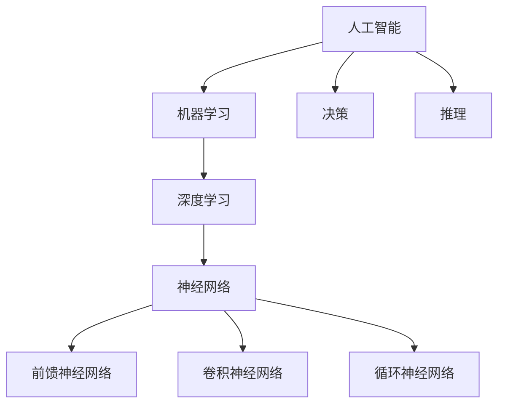
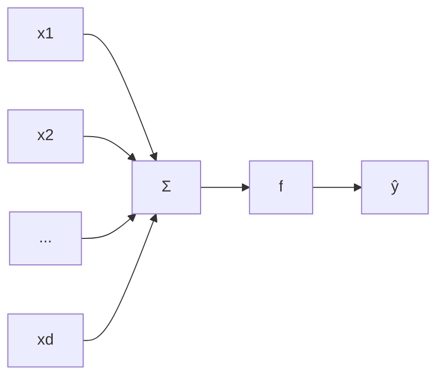

# AI人工智能深度学习算法：理解决策制定与推理机制

关键词：人工智能, 深度学习, 决策制定, 推理机制, 神经网络, 机器学习

## 1. 背景介绍
### 1.1 问题的由来
人工智能(Artificial Intelligence, AI)作为计算机科学的一个分支,其目标是研究如何让计算机模拟甚至超越人类的智能。人工智能的核心是让机器具备学习、推理、决策等人类智能的能力。近年来,随着大数据、云计算、GPU等技术的发展,人工智能尤其是深度学习取得了突破性的进展,在语音识别、图像识别、自然语言处理等领域达到甚至超越了人类的水平。深度学习算法能够从海量数据中自动学习特征,构建多层次的特征表示,从而对未知数据做出精准预测。然而,我们对深度学习算法的决策制定和推理机制的理解还比较有限,这限制了深度学习的可解释性和可信性。

### 1.2 研究现状 
目前,深度学习主要采用基于梯度的端到端学习方法,通过反向传播算法优化网络权重,从而得到性能优异的模型。但这种方法更像一个黑盒子,我们很难解释模型的内部工作原理。近年来,可解释性AI成为研究的热点,旨在揭示AI系统的决策机制。已有的工作主要集中在对深度学习模型的可视化解释、基于注意力机制的解释、基于因果推理的解释等。但现有方法还存在解释粒度粗、缺乏语义性、难以揭示内在逻辑等局限性。我们亟需新的理论和方法来刻画深度学习的决策制定与推理过程。

### 1.3 研究意义
揭示深度学习算法的决策制定与推理机制,对于提升AI系统的可解释性、可信性、安全性具有重要意义。可解释性有助于我们理解模型的内在逻辑,发现潜在的错误和偏差;可信性让我们对AI系统的决策更有信心;安全性则保障AI不被恶意操纵。可解释性也有利于知识的萃取和迁移,促进人机协同。此外,刻画AI系统的推理机制,有助于我们探索机器思维的奥秘,甚至为认知科学和神经科学研究提供新的视角。总之,理解AI的决策制定与推理,是发展可解释、可信、安全、高效的AI系统的关键。

### 1.4 本文结构
本文将系统阐述深度学习算法的决策制定与推理机制。第2节介绍相关的核心概念。第3节讨论深度学习的核心算法原理。第4节建立数学模型并推导相关公式。第5节通过代码实例演示算法的实现。第6节分析深度学习的实际应用场景。第7节推荐相关的工具和资源。第8节总结全文并展望未来。第9节是附录,回答一些常见问题。

## 2. 核心概念与联系
在讨论深度学习的决策制定与推理机制之前,我们先来了解一些核心概念:

- 人工智能(Artificial Intelligence):让机器表现出人类智能的能力,如学习、推理、决策等。
- 机器学习(Machine Learning):无需明确编程,让计算机从数据中自主学习的方法。
- 深度学习(Deep Learning):机器学习的一个分支,基于多层神经网络,能够学习数据的层次化特征表示。
- 神经网络(Neural Network):一种模拟生物神经系统结构和功能的数学模型,由大量节点(神经元)组成,通过调整节点间的连接权重来学习。
- 前馈神经网络(Feedforward Neural Network):信息单向传播的神经网络,没有回路,适合监督学习。
- 卷积神经网络(Convolutional Neural Network):一种借鉴视觉皮层结构的神经网络,主要用于图像识别。
- 循环神经网络(Recurrent Neural Network):一种适合处理序列数据的神经网络,节点间存在循环连接。
- 决策(Decision):根据当前信息,从备选方案中选择一个最优方案的过程。
- 推理(Inference或Reasoning):根据已知信息,推导出新信息或结论的过程。

这些概念相互关联(如图1所示)。人工智能的目标是让机器具有智能,机器学习是实现人工智能的主流方法,深度学习则是机器学习的一个重要分支。深度学习主要基于各种神经网络模型,如前馈神经网络、卷积神经网络、循环神经网络等。决策和推理是人工智能的核心能力,深度学习算法本质上就是一个复杂的决策与推理过程。理解深度学习的决策制定与推理机制,有助于我们构建更加智能、可解释的人工智能系统。

图1 核心概念关系图

## 3. 核心算法原理 & 具体操作步骤
### 3.1 算法原理概述
深度学习算法的核心是构建多层神经网络,通过学习大量数据来优化网络参数。以最经典的前馈神经网络为例,其基本结构如图2所示。网络由输入层、隐藏层和输出层组成,层与层之间完全连接。每个节点(神经元)接收来自上一层的加权输入,经过非线性变换产生输出。网络通过反向传播算法来学习,即根据损失函数的梯度,采用梯度下降等优化算法来更新权重,使网络输出与真实标签尽可能接近。网络学习到的权重矩阵,蕴含了从输入到输出的映射关系,可看作是一种知识表示。

图2 前馈神经网络结构示意图

### 3.2 算法步骤详解
下面我们以三层前馈神经网络的二分类任务为例,详细说明深度学习算法的步骤:

输入:训练集$\{(x_i,y_i)\}_{i=1}^N$,其中$x_i \in \mathbb{R}^d$为输入特征,$y_i \in \{0,1\}$为类别标签。

(1) 参数初始化:随机初始化各层权重矩阵$W^{(i)}$和偏置向量$b^{(i)}$。

(2) 前向传播:对每个样本$x_i$,计算各层输出:
$$a^{(1)} = x_i$$
$$z^{(2)} = W^{(1)}a^{(1)} + b^{(1)}$$  
$$a^{(2)} = f(z^{(2)})$$
$$z^{(3)} = W^{(2)}a^{(2)} + b^{(2)}$$
$$\hat{y}_i = a^{(3)} = \sigma(z^{(3)})$$
其中$f$为隐藏层激活函数(如ReLU),$ \sigma $为输出层激活函数(如Sigmoid)。

(3) 计算损失:使用交叉熵损失函数:
$$J(W,b) = -\frac{1}{N}\sum_{i=1}^N[y_i\log \hat{y}_i + (1-y_i)\log(1-\hat{y}_i)]$$

(4) 反向传播:根据链式法则计算损失函数对各层参数的梯度:
$$\delta^{(3)} = \hat{y}_i - y_i$$
$$\delta^{(2)} = (W^{(2)})^T\delta^{(3)} \odot f'(z^{(2)})$$
$$\frac{\partial J}{\partial W^{(2)}} = \frac{1}{N}\delta^{(3)}(a^{(2)})^T, \frac{\partial J}{\partial b^{(2)}} = \frac{1}{N}\sum_{i=1}^N\delta^{(3)}$$
$$\frac{\partial J}{\partial W^{(1)}} = \frac{1}{N}\delta^{(2)}(a^{(1)})^T, \frac{\partial J}{\partial b^{(1)}} = \frac{1}{N}\sum_{i=1}^N\delta^{(2)}$$
其中$\odot$表示Hadamard积。

(5) 参数更新:使用梯度下降法更新参数:
$$W^{(i)} := W^{(i)} - \alpha \frac{\partial J}{\partial W^{(i)}}$$
$$b^{(i)} := b^{(i)} - \alpha \frac{\partial J}{\partial b^{(i)}}$$
其中$\alpha$为学习率。

(6) 重复步骤(2)-(5),直到损失收敛或达到最大迭代次数。

### 3.3 算法优缺点
深度学习算法的主要优点包括:

- 端到端学习:可直接从原始数据学习,不需要人工设计复杂特征。
- 特征自动提取:通过多层非线性变换,能学习数据内在的层次化特征表示。 
- 强大的表示能力:超大规模网络有极强的表示能力,在多个领域达到甚至超越人类水平。
- 普适性:同一套算法可应用于多种不同任务,具有很好的通用性。

但深度学习算法也存在一些局限:

- 需要大量标注数据:深度学习是数据驱动的方法,需要大量高质量的标注数据,获取成本高。
- 计算开销大:训练深度模型需要大量的计算资源和时间,对硬件要求高。
- 可解释性差:深度学习更像一个黑盒子,内部决策过程难以解释,缺乏可解释性。
- 泛化能力有限:模型容易过拟合训练数据,在新数据上的泛化能力有待提高。

### 3.4 算法应用领域
深度学习在多个领域取得了突破性进展,主要应用包括:

- 计算机视觉:图像分类、目标检测、语义分割、人脸识别等
- 语音识别:语音转文本、说话人识别、语音合成等  
- 自然语言处理:机器翻译、情感分析、问答系统、文本摘要等
- 推荐系统:个性化推荐、广告投放等
- 生物医疗:医学影像分析、药物发现、基因组学等
- 游戏:AlphaGo等智能游戏AI
- 无人驾驶:环境感知、路径规划、决策控制等

## 4. 数学模型和公式 & 详细讲解 & 举例说明
### 4.1 数学模型构建
我们以单个神经元为例,说明深度学习的数学模型。如图3所示,一个神经元接收$d$维输入向量$\boldsymbol{x} = (x_1, \cdots, x_d)^T$,输出$\hat{y}$由输入的加权求和再经过激活函数$f$计算得到:

$$
z = \boldsymbol{w}^T\boldsymbol{x} + b = \sum_{i=1}^d w_ix_i + b \\
\hat{y} = f(z)
$$

其中权重向量$\boldsymbol{w} = (w_1, \cdots, w_d)^T$和偏置$b$为神经元的参数。这实际上是一个线性回归模型,再经过非线性函数变换。

图3 单个神经元计算模型

将多个神经元按层级连接,就得到了前馈神经网络。设$L$层网络第$l$层有$n_l$个神经元,令$\boldsymbol{a}^{(l)} = (a_1^{(l)}, \cdots, a_{n_l}^{(l)})^T$为第$l$层的激活值向量,则相邻层间的前向传播公式为:

$$
\boldsymbol{z}^{(l)} = \boldsymbol{W}^{(l)}\boldsymbol{a}^{(l-1)} + \boldsymbol{b}^{(l)} \\
\boldsymbol{a}^{(l)} = f(\boldsymbol{z}^{(l)})
$$

其中权重矩阵$\boldsymbol{W}^{(l)} \in \mathbb{R}^{n_l \times n_{l-1}}$,偏置向量$\boldsymbol{