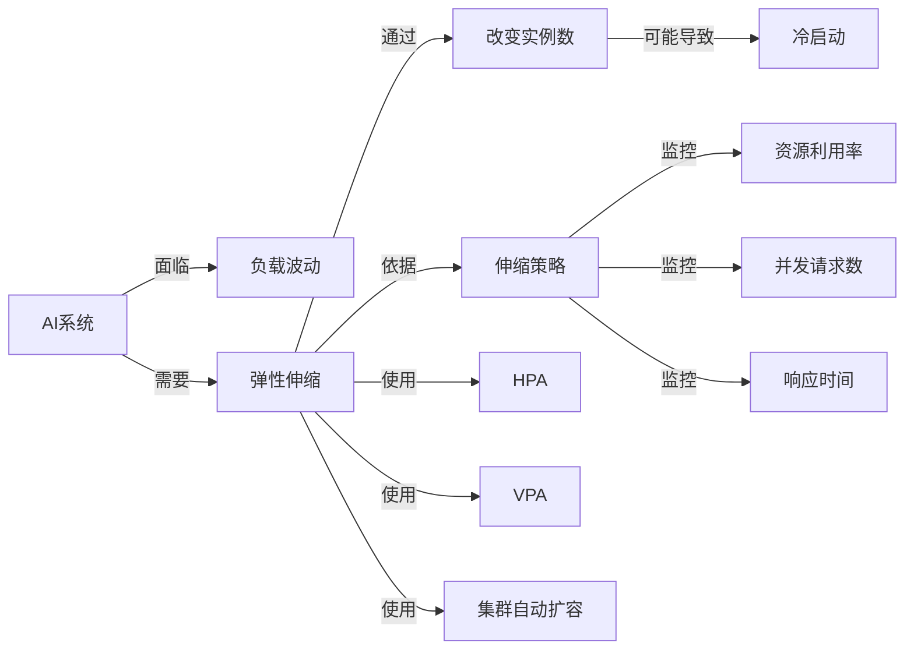

# AI系统弹性伸缩原理与代码实战案例讲解

关键词：AI系统、弹性伸缩、自动扩缩容、负载均衡、资源调度、Kubernetes、微服务

## 1. 背景介绍
### 1.1 问题的由来
随着人工智能技术的快速发展,越来越多的AI应用被广泛部署到生产环境中。然而,AI系统面临着用户请求量波动大、计算资源需求变化频繁等挑战。为了保证AI服务的高可用性和稳定性,需要引入弹性伸缩机制,根据实际负载动态调整资源配置。

### 1.2 研究现状
目前,业界主流的弹性伸缩解决方案包括Kubernetes的HPA(Horizontal Pod Autoscaler)、AWS的Auto Scaling、阿里云的弹性伸缩等。这些方案基于资源利用率或自定义指标,通过增减Pod副本数或虚拟机实例数量来实现弹性伸缩。但针对AI系统的特点,还需要更精细化的伸缩策略。

### 1.3 研究意义
研究AI系统的弹性伸缩原理,设计高效的伸缩算法,并给出实际的代码实现,对于提升AI系统的服务质量、降低运维成本具有重要意义。同时,也为其他类型的应用系统的弹性伸缩提供了参考。

### 1.4 本文结构
本文将首先介绍AI系统弹性伸缩的核心概念和关键技术,然后重点阐述基于Kubernetes的三种弹性伸缩算法原理,并给出详细的数学模型和公式推导过程。接着,我们将展示算法的代码实现,以及在实际AI项目中的应用案例。最后,总结全文并展望AI弹性伸缩技术的发展趋势与挑战。

## 2. 核心概念与联系
- 弹性:系统能够根据负载变化自动调整资源配置的能力,从而匹配实际需求。
- 伸缩:通过改变服务实例(如容器、虚拟机)的数量来增减系统处理能力的过程。
- 自动扩缩容:依据伸缩策略,由系统自主判断和执行的伸缩动作,无需人工干预。
- 冷启动:新增实例从创建到完全可用的时间,期间服务能力受限。
- 资源利用率:实际资源使用量占总资源配置的比例,如CPU使用率。
- 并发请求数:系统同时处理的请求数量,体现了系统的负载。
- 响应时间:系统处理单个请求所需的时间,是服务质量的关键指标。
- HPA:Kubernetes的Horizontal Pod Autoscaler,基于CPU等指标自动调整Pod数量。
- VPA:Kubernetes的Vertical Pod Autoscaler,自动调整Pod的CPU和内存资源请求值。
- 集群自动扩容:Cluster Autoscaler,调整Kubernetes集群的工作节点数量。

下图展示了AI系统弹性伸缩的核心概念之间的关系:

## 3. 核心算法原理 & 具体操作步骤
### 3.1 算法原理概述
本文重点介绍三种AI系统弹性伸缩算法:

1. 基于资源利用率的弹性伸缩算法
2. 基于请求率的预测性弹性伸缩算法  
3. 基于强化学习的自适应弹性伸缩算法

### 3.2 算法步骤详解
#### 3.2.1 基于资源利用率的弹性伸缩算法
该算法以CPU、内存等资源利用率为依据,设置伸缩阈值,当利用率超过或低于阈值时触发扩缩容。

具体步骤如下:
1. 设置CPU、内存利用率的伸缩阈值上限TU和下限TL
2. 监控当前资源利用率U(t)
3. 若U(t) > TU,则触发扩容,新增实例数量为:
$$ N_{new} = \lceil \frac{U(t)}{TU} \rceil \times N_{cur} - N_{cur} $$
4. 若U(t) < TL,则触发缩容,减少实例数量为:  
$$ N_{del} = N_{cur} -  \lfloor \frac{U(t)}{TL} \rfloor \times N_{cur} $$
5. 更新实例数量,完成本轮伸缩,返回步骤2

其中,$N_{cur}$为当前实例数量,$\lceil x \rceil$和$\lfloor x \rfloor$分别表示x的向上和向下取整。

#### 3.2.2 基于请求率的预测性弹性伸缩算法
该算法基于历史请求率数据,预测未来一段时间的请求率,并据此提前调整实例数量,从而减少冷启动时间。

具体步骤如下:
1. 记录过去T个时间窗口的请求率数据$R(t-T+1),...,R(t)$
2. 使用时间序列预测模型(如ARIMA),预测未来K个时间窗口的请求率$\hat{R}(t+1),...,\hat{R}(t+k)$
3. 对预测的请求率取最大值$\hat{R}_{max} = max(\hat{R}(t+1),...,\hat{R}(t+k))$
4. 计算目标实例数量:
$$ N_{target} = \lceil \frac{\hat{R}_{max}}{\alpha \times C} \rceil $$
5. 若$N_{target} > N_{cur}$,则新增$N_{target} - N_{cur}$个实例
6. 若$N_{target} < N_{cur}$,则减少$N_{cur} - N_{target}$个实例
7. 更新实例数量,完成本轮伸缩,返回步骤1

其中,$C$为单个实例的最大处理能力(请求/秒),$\alpha$为实例目标利用率,一般取0.7~0.9。

#### 3.2.3 基于强化学习的自适应弹性伸缩算法
该算法将伸缩问题建模为马尔可夫决策过程(MDP),使用强化学习的方法自动学习最优的伸缩策略。

具体步骤如下:
1. 定义MDP的状态空间、动作空间和奖励函数:
   - 状态$s$:当前请求率$R(t)$和实例数$N_{cur}$
   - 动作$a$:新增或减少的实例数量
   - 奖励$r$:吞吐量和资源成本的加权和
2. 使用Deep Q-Network(DQN)算法训练Q函数$Q(s,a)$
3. 在每个控制周期t,执行以下伸缩过程:
   - 观察当前状态$s_t$
   - 使用$\epsilon-greedy$策略选择动作$a_t = argmax_aQ(s_t,a)$
   - 执行动作$a_t$,修改实例数量
   - 观察下一状态$s_{t+1}$和奖励$r_t$
   - 将$(s_t,a_t,r_t,s_{t+1})$存入经验回放池
   - 从经验回放池中随机采样一批样本,更新Q函数参数
4. 不断重复步骤3,使策略网络收敛到最优

### 3.3 算法优缺点
1. 基于资源利用率的算法:
   - 优点:实现简单,通用性强
   - 缺点:滞后性,可能导致过度或不足的伸缩
2. 基于请求率预测的算法:
   - 优点:提前伸缩,减少冷启动时间
   - 缺点:预测误差会影响伸缩效果,需要大量历史数据
3. 基于强化学习的算法:
   - 优点:可自适应地学习最优策略,充分利用闲置资源  
   - 缺点:需要专家知识设计MDP,训练时间长
   
### 3.4 算法应用领域
AI系统弹性伸缩算法可广泛应用于以下领域:
- 智能客服系统:根据客户咨询量动态调节客服机器人数量
- 推荐系统:应对节日大促等流量高峰,及时扩容推荐服务
- 智能监控系统:针对监控数据量的变化,动态优化资源配置
- 自动驾驶决策系统:车流量变化时,自适应控制决策服务能力

## 4. 数学模型和公式 & 详细讲解 & 举例说明
### 4.1 数学模型构建
我们以资源利用率为例,构建AI系统弹性伸缩的数学模型。假设系统CPU利用率服从正态分布:
$$ U \sim N(\mu,\sigma^2) $$
其中,$\mu$为均值,$\sigma$为标准差。当$U$超过阈值上限$T_U$时触发扩容,低于阈值下限$T_L$时触发缩容。

扩容新增实例数$N_+$满足:
$$ P(U > T_U) \times N_{cur} = \frac{N_+}{N_{cur} + N_+} $$

即扩容后超过阈值上限的概率乘以当前实例数,等于新增实例数占扩容后总实例数的比例。

类似地,缩容减少实例数$N_-$满足:
$$ P(U < T_L) \times N_{cur} = \frac{N_-}{N_{cur}} $$

即缩容前低于阈值下限的概率乘以当前实例数,等于减少实例数占缩容前总实例数的比例。

### 4.2 公式推导过程
对于扩容公式,我们有:
$$ \begin{aligned}
P(U > T_U) \times N_{cur} &= \frac{N_+}{N_{cur} + N_+} \\
P(U > T_U) \times N_{cur} \times (N_{cur} + N_+) &= N_+ \\
P(U > T_U) \times (N_{cur}^2 + N_{cur} \times N_+) &= N_+ \\
P(U > T_U) \times N_{cur}^2 &= N_+ - P(U > T_U) \times N_{cur} \times N_+ \\
P(U > T_U) \times N_{cur}^2 &= N_+ \times (1 - P(U > T_U) \times N_{cur}) \\
N_+ &= \frac{P(U > T_U) \times N_{cur}^2}{1 - P(U > T_U) \times N_{cur}}
\end{aligned} $$

其中,
$$ P(U > T_U) = 1 - \Phi(\frac{T_U - \mu}{\sigma}) $$
$\Phi(x)$为标准正态分布的累积分布函数。

同理可得缩容公式:
$$ N_- = P(U < T_L) \times N_{cur} $$
其中,
$$ P(U < T_L) = \Phi(\frac{T_L - \mu}{\sigma}) $$

### 4.3 案例分析与讲解
假设某AI系统当前有10个实例,CPU利用率服从$N(0.6,0.1^2)$,伸缩阈值上限为0.8,下限为0.4。

求:
1)第一次扩容需要新增几个实例?
2)第一次缩容需要减少几个实例?

解:
1) 扩容新增实例数:
$$ \begin{aligned}
P(U > 0.8) &= 1 - \Phi(\frac{0.8-0.6}{0.1}) \\
           &= 1 - \Phi(2) \\
           &= 1 - 0.9772 \\
           &= 0.0228 \\
N_+ &= \frac{0.0228 \times 10^2}{1 - 0.0228 \times 10} \\
    &= 2.33 \approx 2
\end{aligned} $$
因此,第一次扩容需新增2个实例。

2) 缩容减少实例数:
$$ \begin{aligned}
P(U < 0.4) &= \Phi(\frac{0.4-0.6}{0.1}) \\
           &= \Phi(-2) \\
           &= 0.0228 \\
N_- &= 0.0228 \times 10 \\
    &= 0.228 \approx 0  
\end{aligned} $$
因此,第一次缩容不需减少实例。

### 4.4 常见问题解