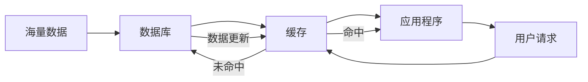

# AI系统缓存设计原理与代码实战案例讲解

关键词：AI系统、缓存设计、LRU算法、缓存淘汰策略、Redis、Memcached、缓存穿透、缓存雪崩、缓存击穿、数据一致性

## 1. 背景介绍
### 1.1 问题的由来
在当前大数据和人工智能飞速发展的时代,海量数据的高效处理和存储成为AI系统面临的重大挑战。传统的数据处理方式难以满足实时性和并发性的要求,因此缓存技术应运而生。合理的缓存设计可以显著提升系统性能,降低后端存储和数据库的压力。然而,如何设计一个高效、可靠、易于维护的AI系统缓存架构,是每个技术人员都必须思考的问题。

### 1.2 研究现状
目前,缓存技术已经在各种AI系统中得到广泛应用。常见的缓存解决方案包括Redis、Memcached等,它们各有特点和适用场景。同时,一些新的缓存架构和算法也不断涌现,如分布式缓存、多级缓存等。学术界和工业界都在缓存领域进行了深入的研究和实践,取得了丰硕的成果。

### 1.3 研究意义
缓存设计是AI系统性能优化的关键一环。科学的缓存架构不仅可以提升用户体验,还能节约计算和存储资源,降低系统运营成本。对缓存原理和实现的深入理解,有助于技术人员应对日益复杂的AI系统挑战,提升系统的可扩展性和容错性。因此,系统研究AI系统缓存设计具有重要的理论和实践意义。

### 1.4 本文结构
本文将从以下几个方面对AI系统缓存设计展开深入讨论：
- 第二部分介绍缓存的核心概念和相关技术之间的联系
- 第三部分重点剖析缓存的核心算法原理,并给出具体的操作步骤
- 第四部分建立缓存设计的数学模型,推导相关公式,并给出案例说明
- 第五部分通过代码实例,讲解如何实现一个完整的缓存方案
- 第六部分总结缓存技术在实际AI系统中的应用场景和未来展望
- 第七部分推荐缓存领域的学习资源、开发工具和相关论文
- 第八部分对全文进行总结,分析缓存技术的发展趋势和面临的挑战
- 第九部分的附录,解答了一些常见的缓存相关问题

## 2. 核心概念与联系
在讨论AI系统缓存设计之前,我们先来了解一下缓存的核心概念：

- 缓存(Cache):是一种介于内存和硬盘之间的高速数据存储层,通过将热点数据保存在内存中,可以显著减少IO次数,加快数据访问速度。
- 缓存命中(Cache Hit):当请求的数据在缓存中存在时,称为缓存命中。命中率越高,缓存的效果就越好。
- 缓存丢失(Cache Miss):当请求的数据不在缓存中时,称为缓存丢失,此时需要从后端存储中获取数据。
- 缓存淘汰(Cache Eviction):由于缓存的容量有限,当缓存满时,需要淘汰一部分数据以腾出空间。常见的淘汰算法有LRU、LFU、FIFO等。
- 缓存穿透(Cache Penetration):指查询一个不存在的数据,由于缓存无法命中,导致请求直接落到数据库上,对数据库造成压力。
- 缓存雪崩(Cache Avalanche):指缓存在同一时间大面积失效,导致大量请求直接打到后端存储,引起系统崩溃。
- 缓存击穿(Cache Breakdown):指一个热点key在某个时间点过期,导致大量并发请求落到数据库上,引起数据库压力骤增。

了解了这些概念后,我们再来看看它们之间的联系：



从上图可以看出,缓存处于数据库和应用程序之间,起到了加速数据访问的作用。当用户请求到来时,应用程序首先查询缓存,如果命中则直接返回;如果未命中,则需要从数据库中获取数据,并写入缓存,再返回给用户。同时,当数据库中的数据发生更新时,需要同步更新缓存,保证数据的一致性。

因此,缓存的关键在于提高命中率,降低丢失率。这就需要我们在缓存的粒度、过期策略、更新机制等方面做好设计和权衡。

## 3. 核心算法原理 & 具体操作步骤
### 3.1 算法原理概述
缓存系统的核心是缓存淘汰算法,它决定了缓存的效率和命中率。常见的缓存淘汰算法有:
- LRU(Least Recently Used):最近最少使用算法,淘汰最长时间未被使用的数据。
- LFU(Least Frequently Used):最不经常使用算法,淘汰访问频次最低的数据。
- FIFO(First In First Out):先进先出算法,淘汰最先进入缓存的数据。
- Random:随机淘汰算法,随机选择一个数据淘汰。

其中,LRU是最常用的缓存淘汰算法。它的基本思想是,如果一个数据在最近一段时间没有被访问到,那么在将来它被访问的可能性也很小,因此可以优先淘汰它。

### 3.2 算法步骤详解
下面我们以LRU算法为例,详细讲解其实现步骤。

LRU算法通常用一个双向链表和一个哈希表来实现。链表中的节点表示缓存中的数据,越靠近链表头部,表示数据被访问的时间越近;越靠近链表尾部,表示数据被访问的时间越远。哈希表用来记录数据在链表中的位置,以支持O(1)的查找效率。

具体步骤如下:

1. 初始化一个空的双向链表和哈希表。

2. 当要缓存一个数据时:
   - 如果数据已经在缓存中,将其从链表中移到头部。
   - 如果数据不在缓存中,判断缓存是否已满:
     - 如果缓存未满,将数据插入链表头部,并在哈希表中记录其位置。
     - 如果缓存已满,将链表尾部的数据删除,再将新数据插入链表头部,并更新哈希表。

3. 当要访问一个数据时:
   - 如果数据在缓存中,将其从链表中移到头部,并返回数据。
   - 如果数据不在缓存中,返回null,并根据需要从数据源获取数据,执行步骤2的缓存操作。

用伪代码表示如下:

```
// 初始化
let cache = new DoubleLinkedList()
let map = new HashMap()

function get(key):
  if key in map:
    node = map[key]
    cache.moveToHead(node)
    return node.value
  else:
    return null

function put(key, value): 
  if key in map:
    node = map[key]
    node.value = value
    cache.moveToHead(node)
  else:
    if cache.size >= capacity:
      node = cache.removeTail()
      map.remove(node.key)
    node = new Node(key, value) 
    cache.addToHead(node)
    map[key] = node
```

### 3.3 算法优缺点
LRU算法的优点是:
- 实现简单,易于理解。
- 时间复杂度为O(1),效率较高。
- 能够很好地反映数据的局部性原理,命中率较高。

LRU算法的缺点是:  
- 没有考虑数据的访问频率,可能会淘汰一些访问频率很高但刚刚访问过的数据。
- 缓存污染问题,即一些无用的数据可能会长期占据缓存。
- 单机缓存容量受内存限制,扩展性不强。

### 3.4 算法应用领域
LRU算法在各种缓存系统中得到了广泛应用,如:
- CPU缓存:硬件实现的LRU算法,提高CPU访问内存的速度。
- 操作系统页面置换:虚拟内存管理中常用LRU算法选择换出页面。  
- 数据库缓存:如MySQL的InnoDB buffer pool采用LRU算法管理缓存页面。
- Web服务缓存:如Memcached、Redis等分布式缓存系统采用LRU算法淘汰数据。

此外,LRU算法还被用于解决各种具有时间局部性的问题,如图像处理、推荐系统等。

## 4. 数学模型和公式 & 详细讲解 & 举例说明
### 4.1 数学模型构建
为了更好地理解LRU算法,我们可以建立一个简单的数学模型。假设缓存的容量为N,数据的总数为M,每个数据的访问概率为p~i~(i=1,2,...,M)。我们的目标是最小化缓存的丢失率,即:

$$
\min \limits_{S \subset \{1,2,...,M\}, |S|=N} \sum_{i \notin S} p_i
$$

其中,S表示缓存的数据集合。这个问题可以看作是一个0-1背包问题,即从M个数据中选择N个放入缓存,使得未被选中的数据的访问概率之和最小。

### 4.2 公式推导过程
根据LRU算法的原理,我们可以推导出其数学表达式。假设第i个数据的上次访问时间为t~i~,当前时间为T,则LRU算法相当于选择满足以下条件的N个数据放入缓存:

$$
\{i_1, i_2, ..., i_N\} = \arg \max \limits_{S \subset \{1,2,...,M\}, |S|=N} \min_{i \in S} (T - t_i)
$$

即选择上次访问时间离当前时间最近的N个数据。这个公式可以用动态规划的方法求解,时间复杂度为O(MN)。

### 4.3 案例分析与讲解
下面我们用一个具体的例子来说明LRU算法的工作过程。假设缓存的容量为3,依次访问以下数据:

A, B, C, A, D, B, E

按照LRU算法,每次访问后缓存的状态如下:

```
A
A B 
A B C
B C A
C A D
A D B
D B E
```

可以看出,缓存始终保持最近访问的3个数据。当需要淘汰数据时,选择上次访问时间最远的数据进行替换。

假设这7个数据的访问概率分别为:

A: 0.3, B: 0.2, C: 0.2, D: 0.1, E: 0.2

则根据我们的数学模型,选择A、B、E放入缓存可以使丢失率最小,为0.1+0.2=0.3。而LRU算法选择的是D、B、E,丢失率为0.3+0.2=0.5,并不是最优解。这说明LRU算法是一种近似算法,在实际应用中已经可以取得比较好的效果。

### 4.4 常见问题解答
问:LRU算法如何处理缓存同步的问题?
答:在分布式缓存系统中,不同节点的缓存数据可能不一致。为了解决这个问题,可以采用以下方法:
- 数据写入时,同步更新所有节点的缓存。
- 数据读取时,如果缓存未命中,先从其他节点获取数据,再更新本地缓存。
- 采用一致性哈希等分布式算法,保证每个数据都有唯一的归属节点,写入时只更新该节点的缓存即可。

问:LRU算法能否支持并发访问?  
答:传统的LRU算法采用互斥锁来支持并发,但会导致锁竞争严重,性能下降。为了解决这个问题,可以采用以下优化方法:
- 将互斥锁改为读写锁,允许多个读操作同时进行。 
- 将链表改为跳表,提高查找和插入的效率。
- 将哈希表改为并发哈希