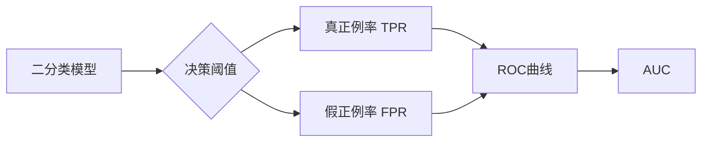

# AUC原理与代码实例讲解

## 1. 背景介绍
### 1.1  问题的由来
在机器学习和数据挖掘领域,评估一个分类模型的性能是非常重要的。传统的分类准确率指标存在一些局限性,尤其是在样本不平衡的情况下。因此,研究人员提出了ROC曲线和AUC指标来更全面地评估分类器的性能。
### 1.2  研究现状
目前,ROC曲线和AUC已经成为评估二分类模型性能的标准方法。许多机器学习算法,如逻辑回归、支持向量机、随机森林等,都使用AUC作为模型选择和优化的指标。此外,AUC在医学诊断、异常检测、推荐系统等领域得到了广泛应用。
### 1.3  研究意义
深入理解AUC的原理和计算方法,对于正确评估和优化分类模型具有重要意义。通过学习AUC,我们可以更好地理解模型的性能特点,选择最优的决策阈值,并对模型进行针对性的改进。此外,掌握AUC的代码实现,可以帮助我们在实际项目中快速评估模型性能。
### 1.4  本文结构
本文将从以下几个方面对AUC进行详细讲解:
1. 介绍AUC的基本概念和原理
2. 详细讲解AUC的计算方法和数学公式
3. 通过代码实例演示AUC的具体实现
4. 探讨AUC在实际应用中的注意事项和优化策略
5. 总结AUC的优缺点和未来研究方向

## 2. 核心概念与联系
AUC(Area Under the ROC Curve)是ROC曲线下的面积,是一种用于评估二分类模型性能的重要指标。ROC曲线描述了在不同决策阈值下,分类器的真正例率(TPR)和假正例率(FPR)的变化关系。AUC则量化了ROC曲线下的面积大小,AUC越大,表示分类器的性能越好。

ROC曲线和AUC之间有着密切的联系:
- ROC曲线展示了分类器在不同阈值下的性能变化 
- AUC是对ROC曲线的定量评估,表示分类器的整体性能
- AUC的取值范围为[0.5, 1],0.5表示随机猜测,1表示完美分类
- 在绘制ROC曲线的过程中,可以直接计算出AUC的值

下图展示了ROC曲线和AUC之间的关系:



## 3. 核心算法原理 & 具体操作步骤
### 3.1  算法原理概述
AUC的计算基于对样本进行排序,统计正样本和负样本的相对位置关系。具体来说,AUC等于所有正负样本对中,正样本排在负样本前面的概率。直观上理解,AUC衡量的是分类器对正负样本的排序能力。
### 3.2  算法步骤详解
计算AUC的具体步骤如下:
1. 对样本的预测概率值(或分数)按照从大到小进行排序
2. 统计每个正样本前面有多少个负样本,累加得到rank值
3. 计算所有正样本的rank值之和,记为rankSum  
4. 计算AUC: `AUC = (rankSum - M*(M+1)/2) / (M*N)`
其中,M为正样本数量,N为负样本数量。
### 3.3  算法优缺点
AUC算法的优点包括:
- 对样本不平衡问题不敏感,适用于各种样本分布情况
- 对分类阈值不敏感,能够评估分类器的整体性能
- 直观易懂,便于模型比较和选择

AUC算法的缺点包括: 
- 计算复杂度较高,需要对样本进行排序
- 只适用于二分类问题,对多分类问题需要进行转化
- 对模型的校准能力不敏感,可能高估未校准的模型

### 3.4  算法应用领域
AUC广泛应用于机器学习和数据挖掘的各个领域,典型的应用场景包括:
- 医学诊断:评估疾病诊断模型的性能
- 信用评分:评估用户信用风险模型的性能
- 推荐系统:评估推荐算法的排序性能
- 异常检测:评估异常检测模型的区分能力

## 4. 数学模型和公式 & 详细讲解 & 举例说明
### 4.1  数学模型构建
假设我们有一个二分类数据集$D=\{(x_i,y_i)\}_{i=1}^N$,其中$x_i$为特征向量,$y_i \in \{0,1\}$为二值标签。令$f(x)$为分类器对样本$x$的预测概率值(或分数)。我们的目标是计算AUC,即:

$$AUC = P(f(x_i) > f(x_j) | y_i=1, y_j=0)$$

其中,$x_i$为正样本,$x_j$为负样本。直观地说,AUC衡量的是分类器对一个随机正样本给出的预测值大于一个随机负样本的概率。

### 4.2  公式推导过程
为了计算AUC,我们首先对样本按照预测值$f(x)$进行降序排列。然后,我们定义指示函数$I(·)$:

$$I(f(x_i) > f(x_j)) = 
\begin{cases}
1, & f(x_i) > f(x_j)\\
0, & f(x_i) \leq f(x_j)
\end{cases}$$

令$rank_i$表示正样本$x_i$前面的负样本数量,则:

$$rank_i = \sum_{j:y_j=0} I(f(x_i) > f(x_j))$$

由此,我们可以得到所有正样本的rank和:

$$rankSum = \sum_{i:y_i=1} rank_i = \sum_{i:y_i=1} \sum_{j:y_j=0} I(f(x_i) > f(x_j))$$

最后,我们用rankSum除以所有可能的正负样本对数量$M*N$,得到AUC:

$$AUC = \frac{rankSum}{M*N} = \frac{\sum_{i:y_i=1} rank_i}{M*N}$$

其中,M为正样本数量,N为负样本数量。

需要注意的是,上述公式中假设所有样本的预测值互不相同。如果存在预测值相同的样本对,我们需要对rank值进行平均,即:

$$AUC = \frac{rankSum - \frac{M(M+1)}{2}}{M*N}$$

### 4.3  案例分析与讲解
下面我们通过一个简单的例子来说明AUC的计算过程。假设我们有5个样本,其真实标签和预测值如下:

| 样本 | 真实标签 | 预测值 |
|------|----------|--------|
| A    | 1        | 0.8    |
| B    | 0        | 0.6    |
| C    | 1        | 0.7    |
| D    | 0        | 0.4    |
| E    | 1        | 0.9    |

首先,我们对样本按照预测值从大到小排序:

| 样本 | 真实标签 | 预测值 | rank |
|------|----------|--------|------|
| E    | 1        | 0.9    | 2    |
| A    | 1        | 0.8    | 2    |  
| C    | 1        | 0.7    | 2    |
| B    | 0        | 0.6    | -    |
| D    | 0        | 0.4    | -    |

然后,我们计算每个正样本的rank值:
- 样本E的rank为2,因为它前面有2个负样本(B和D)
- 样本A的rank为2,因为它前面有2个负样本(B和D)
- 样本C的rank为2,因为它前面有2个负样本(B和D)

rank值之和为:rankSum = 2 + 2 + 2 = 6

最后,我们计算AUC:

$$AUC = \frac{rankSum}{M*N} = \frac{6}{3*2} = 1.0$$

可以看出,在这个例子中,分类器对正负样本的排序非常完美,因此AUC达到了最大值1.0。

### 4.4  常见问题解答
**Q: 如果所有样本的预测值都相同,AUC会是多少?**

A: 如果所有样本的预测值都相同,相当于分类器对样本做了随机排序。在这种情况下,每个正样本前面负样本的数量服从均匀分布,因此rank的期望值为$\frac{N}{2}$,所以AUC的期望值为:

$$E[AUC] = \frac{\frac{MN}{2}}{M*N} = 0.5$$

**Q: AUC为0意味着什么?**

A: AUC为0意味着分类器的预测结果与真实标签完全相反,即所有正样本的预测值都小于所有负样本。这种情况下,我们可以简单地将预测值取反,就可以得到一个完美的分类器,AUC为1。

**Q: 多分类问题如何计算AUC?**

A: 对于多分类问题,我们可以将其转化为多个二分类问题,分别计算每个类别的AUC,然后取平均值。例如,对于k个类别,我们可以将每个类别看作正类,其余类别看作负类,计算k次AUC,最后取平均。这种方法称为"一对其余"(One-vs-Rest, OvR)。

## 5. 项目实践：代码实例和详细解释说明
### 5.1  开发环境搭建
本项目使用Python语言和scikit-learn库来实现AUC的计算。首先,我们需要安装以下依赖:
- Python 3.x
- NumPy
- scikit-learn

可以使用pip命令进行安装:

```bash
pip install numpy scikit-learn
```

### 5.2  源代码详细实现
下面是使用scikit-learn计算AUC的完整代码实例:

```python
from sklearn.metrics import roc_auc_score

# 真实标签
y_true = [1, 0, 1, 0, 1]
# 预测值
y_pred = [0.8, 0.6, 0.7, 0.4, 0.9]

# 计算AUC
auc = roc_auc_score(y_true, y_pred)

print('AUC:', auc)
```

输出结果:
```
AUC: 1.0
```

可以看出,这段代码使用了scikit-learn提供的`roc_auc_score`函数来直接计算AUC。我们只需要传入真实标签和预测值,函数会自动完成排序、计算rank等步骤,并返回AUC的值。

### 5.3  代码解读与分析
下面我们来详细解读一下`roc_auc_score`函数的源码实现:

```python
def roc_auc_score(y_true, y_score, average="macro", sample_weight=None, max_fpr=None):
    """Compute Area Under the Receiver Operating Characteristic Curve (ROC AUC) from prediction scores.
    """
    # 检查数据合法性
    y_type = type_of_target(y_true)
    if not (y_type == "binary" or (y_type == "multiclass" and average != "samples")):
        raise ValueError("{0} format is not supported".format(y_type))
    
    # 将标签转换为二值化矩阵
    y_true = label_binarize(y_true, classes=np.unique(y_true))
    n_classes = y_true.shape[1]
    
    # 如果是二分类,直接调用_binary_roc_auc_score计算AUC
    if n_classes == 2:
        return _binary_roc_auc_score(y_true[:, 1], y_score, sample_weight=sample_weight, max_fpr=max_fpr)
    
    # 如果是多分类,对每个类别分别计算AUC,然后取平均
    if average == "macro":
        # 宏平均,先计算每个类别的AUC,再取算术平均值
        return np.average([_binary_roc_auc_score(y_true[:, i], y_score[:, i], sample_weight=sample_weight, max_fpr=max_fpr) for i in range(n_classes)])
    elif average == "weighted":
        # 加权平均,先计算每个类别的AUC,再按样本数加权平均
        n_true = np.sum(y_true, axis=0)
        weights = n_true / np.sum(n_true)
        return np.average([_binary_roc_auc_score(y